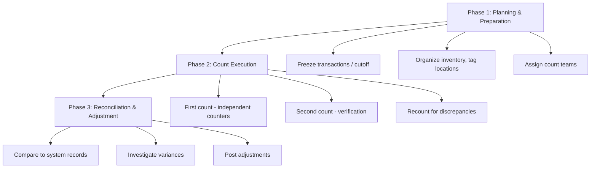
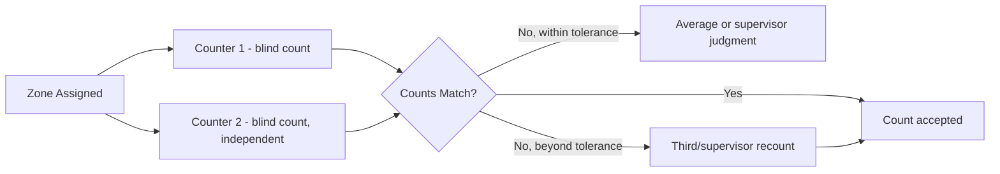

## Physical Inventory Count Procedures

### Overview

A physical inventory count is a comprehensive, point-in-time enumeration of all inventory on hand, conducted to establish or validate the system of record against physical reality. Where cycle counting (covered previously) is a rolling, ongoing discipline that audits a subset of inventory continuously, a physical inventory count is typically a **complete, wall-to-wall count of the entire inventory population**, conducted periodically — commonly annually for financial reporting purposes, though frequency varies by regulatory context and organizational policy. The two methodologies are complementary rather than competing: many organizations run continuous cycle counting as the primary accuracy-assurance mechanism while retaining a periodic full physical count for statutory audit, financial-statement certification, or as a comprehensive baseline reset.

### Why a Full Physical Count Is Still Required

**Key Points**

Even in organizations with a mature cycle-counting program, a full physical inventory count typically remains necessary for several reasons:

- **Financial audit and regulatory compliance:** External auditors and financial reporting standards frequently require or strongly prefer a documented full physical count to substantiate inventory value on the balance sheet, particularly for material misstatement risk assessment
- **Comprehensive baseline validation:** Cycle counting samples the population over a rolling cycle, meaning at any given moment some portion of SKUs may not have been counted recently — a full count provides a true, simultaneous, complete snapshot that a rolling program cannot
- **Detecting systemic issues cycle counting might miss:** Errors correlated across many SKUs simultaneously (e.g., a systemic receiving-system bug, a mislabeled storage zone) can sometimes be more visible in a full, simultaneous count than in a rolling sample

### The Three Phases of a Physical Count

### Phase 1 — Planning and Preparation

**Key Points**

- **Transaction cutoff (the "freeze"):** All inventory transactions — receipts, shipments, transfers, production consumption — must be halted or precisely time-stamped around the count period, so that the physical count corresponds to a well-defined system snapshot. A count taken while transactions continue to post produces an inherently unreconcilable result, since the system quantity being compared against is a moving target
- **Cutoff documentation:** Any transactions that must occur near the cutoff boundary (e.g., a truck arriving mid-count) need explicit procedural handling — typically either physically segregating and excluding that stock from the count, or precisely documenting which side of the cutoff it falls on
- **Physical organization ("count readiness"):** Inventory is organized, consolidated, and clearly labeled by location before counting begins — scattered, unlabeled, or commingled stock is the single largest driver of count error and count duration
- **Team assignment and zone division:** The facility is divided into count zones, each assigned to a specific team, with clear boundaries to prevent double-counting or gaps
- **Count sheet/tag preparation:** Pre-printed or system-generated count sheets (or barcode/RFID scanning device assignments) are prepared per zone, often deliberately **omitting the expected system quantity** — this is the same blind-counting principle introduced under cycle counting, applied here at full-count scale to prevent counters from anchoring to (and potentially just re-recording) the existing system figure rather than the true physical count

### Phase 2 — Count Execution

**Key Points**

- **Independent first count:** Each zone/location is counted once by an assigned counter, without visibility into the system-recorded quantity
- **Independent second count (verification):** A second, different counter recounts the same locations independently — comparing the two independent counts is the primary internal quality-control mechanism during execution, distinct from the later comparison against system records
- **Recount triggers:** If the first and second counts disagree beyond an acceptable tolerance, a third count (often by a supervisor or a more experienced counter) resolves the discrepancy before the count is finalized
- **Segregation of duties:** Best practice separates the roles of counting, recording, and reconciling — the same person should generally not both physically count an item and have authority to post the resulting system adjustment, reducing both error risk and fraud/misstatement risk
- **Auditor observation:** For counts tied to financial statement audits, external auditors frequently observe a sample of the count process directly (rather than relying solely on the count records after the fact) as part of their own audit evidence-gathering

### Phase 3 — Reconciliation and Adjustment

**Key Points**

- **Variance calculation:** Each counted quantity is compared against the corresponding system-of-record quantity (frozen at the cutoff point established in Phase 1); variances are typically flagged both in units and in dollar value, since a large-unit but low-value variance and a small-unit but high-value variance warrant different levels of investigation priority
- **Root-cause investigation for material variances:** Mirroring the cycle-count reconciliation discipline, significant discrepancies should be traced to a cause (receiving error, unrecorded transaction, misplacement, theft/shrinkage) rather than simply adjusted away — an uninvestigated adjustment corrects the number but leaves the underlying process failure unaddressed
- **Adjustment posting:** Once variances are confirmed (often after a recount for high-value or high-variance items), the system of record is formally adjusted to match the physical count — this adjustment is typically subject to its own approval/authorization control, separate from the counting activity itself
- **Documentation retention:** Count sheets, variance reports, investigation notes, and adjustment approvals are typically retained as formal audit documentation, particularly where the count supports financial statement certification

### Count Method Variants

| Method | Description | Typical Use Case |
| --- | --- | --- |
| **Wall-to-wall (full shutdown)** | Entire facility counted simultaneously; operations paused | Simpler reconciliation logic, but highest operational disruption |
| **Rolling/zone-based full count** | Facility divided into zones, each counted and frozen sequentially over several days, with zone-level cutoffs | Reduces disruption but requires careful transaction-boundary management per zone |
| **Statistical sampling count** | A statistically representative sample is fully counted, and results are extrapolated with a confidence interval to estimate total inventory accuracy, rather than counting 100% of SKUs | Used where full counting is impractical; typically requires auditor/regulatory acceptance of the sampling methodology |

[Inference] The choice between a full wall-to-wall shutdown count and a rolling zone-based count is generally driven by the operational cost of a full shutdown versus the reconciliation complexity of managing multiple sequential cutoff boundaries — larger, continuously-operating facilities (e.g., distribution centers supporting time-sensitive fulfillment) more often favor rolling zone-based counts despite the added reconciliation complexity, while smaller or seasonal-lull-timed operations may favor a simpler full shutdown.

### Technology in Physical Counting

**Key Points**

- **Barcode/RFID scanning** has largely replaced manual paper tally sheets in modern implementations, reducing transcription error and enabling near-real-time comparison against system records during the count itself rather than only afterward
- **Mobile count devices** integrated with the inventory/WMS system can flag a discrepancy at the moment of scanning (if the system is configured to reveal expected quantities post-count, or to flag anomalies like a scan at an unexpected location), accelerating the recount-trigger step in Phase 2
- **RFID-based counting** can, in suitable environments, count an entire pallet or shelf of tagged items near-instantaneously via a handheld or fixed reader, substantially reducing count duration compared to item-by-item barcode scanning — though RFID tag cost and read-reliability (line-of-sight, material interference) remain practical constraints affecting where it is cost-justified

[Inference] The specific technology mix (barcode vs. RFID vs. manual) an organization uses for physical counting is generally driven by a cost-benefit analysis weighing tag/scanning infrastructure investment against labor savings and error reduction — this is implementation-specific and not governed by a single standard approach across industries.

### Connection to Inventory Record Accuracy (IRA)

A full physical count produces the same **Inventory Record Accuracy** metric introduced under cycle counting, but computed comprehensively across the entire SKU population simultaneously rather than via a rolling sample:

$$IRA_{\text{full count}} = \frac{\text{Number of SKUs Counted Correctly}}{\text{Total SKUs in Inventory}} \times 100\%$$

This full-population IRA figure is often used as a **calibration check** against the ongoing cycle-count program's own reported accuracy — if the full count reveals materially lower accuracy than the cycle-count program had been reporting, this signals either a gap in the cycle-count sampling design (e.g., certain zones or item classes systematically under-sampled) or a process breakdown between count cycles that the rolling program failed to catch in time.

### Government/Public-Sector Considerations

[Inference] In government or public-sector contexts (such as an LGU managing physical supplies or assets), physical inventory count procedures often carry additional formal requirements beyond standard commercial practice — mandated count frequencies, prescribed segregation-of-duties rules, and specific documentation/reporting formats tied to public financial accountability and audit (e.g., national or local government auditing body standards) — the specific requirements vary by jurisdiction and are generally set by the relevant government auditing authority rather than following a single universal commercial-sector template.

**Related Topics**

- Cycle counting methodologies and their relationship to periodic full counts
- Inventory Record Accuracy (IRA) as a standalone KPI
- Segregation of duties and internal controls
- Root-cause analysis for inventory discrepancies
- Barcode and RFID technology in inventory management
- Financial audit procedures for inventory valuation
- Shrinkage, theft, and loss prevention