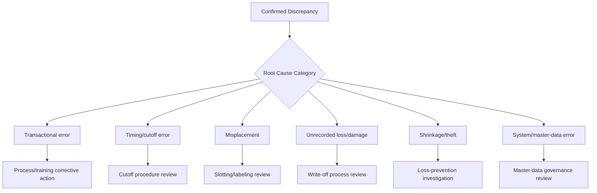
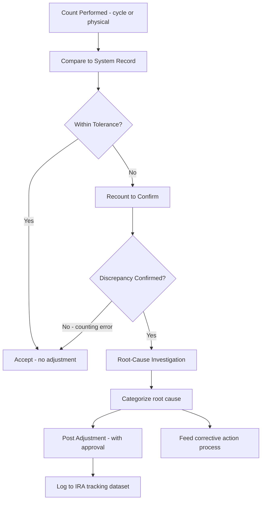

## Inventory Record Accuracy and Reconciliation

### Overview

Inventory Record Accuracy (IRA) is the formal KPI that quantifies how closely a system's recorded inventory quantities match physical reality, and reconciliation is the disciplined process of identifying, investigating, and correcting the gap between them. While cycle counting and physical inventory counts (covered previously) are the *mechanisms* that generate the raw count data, IRA and reconciliation are the *measurement and correction framework* that turns that raw data into a governed, trusted metric — and, as flagged repeatedly throughout this material, every other system covered (MRP/DRP time-phased records, kanban card-count design, DOS, fill rate) is only as reliable as the inventory-record accuracy underlying it. This topic formalizes that dependency into its own standalone discipline.

### Core IRA Formula

**Unit-count basis** (unweighted, per-SKU):

$$IRA = \frac{\text{Number of SKUs Counted Correctly}}{\text{Total Number of SKUs Counted}} \times 100\%$$

**Value-weighted basis** (reflecting financial materiality):

$$IRA_{\text{value-weighted}} = \left(1 - \frac{\sum |\text{System Qty} - \text{Counted Qty}| \times \text{Unit Cost}}{\sum \text{System Qty} \times \text{Unit Cost}}\right) \times 100\%$$

**Key Points**

- The **unweighted** version treats every SKU discrepancy equally regardless of value — simple to calculate and communicate, but can make a company "look" more accurate than it materially is if most errors cluster in low-value C-items while a few high-value A-item errors go proportionally under-weighted
- The **value-weighted** version corrects for this by scaling each discrepancy by its dollar impact — generally the more financially meaningful figure for audit and executive reporting, though it requires reliable unit-cost data to compute
- A well-governed cycle-count program (as covered previously) typically reports **both** figures, since a divergence between them is itself diagnostic: a low value-weighted IRA alongside a high unweighted IRA points to accuracy problems concentrated in high-value items specifically, a materially different corrective priority than the reverse pattern

### Worked Example

A cycle count of 200 SKUs finds 14 with a quantity discrepancy.

**Unweighted IRA:**

$$IRA = \frac{200 - 14}{200} \times 100\% = 93.0\%$$

Now suppose the total system-recorded value across those 200 SKUs is $500,000, and the sum of absolute-value discrepancies (each SKU's unit discrepancy × its unit cost) is $9,000:

**Value-weighted IRA:**

$$IRA_{\text{value-weighted}} = \left(1 - \frac{9{,}000}{500{,}000}\right) \times 100\% = 98.2\%$$

This gap — 93.0% unweighted vs. 98.2% value-weighted — indicates that while a meaningful *number* of SKUs had errors, those errors were concentrated in relatively low-value items, so the *financial* materiality of the inaccuracy is smaller than the raw error count alone would suggest. Interpreting only one figure would give an incomplete picture in either direction.

### Setting an Accuracy Tolerance Threshold

Most IRA programs define a **tolerance band** rather than requiring an exact match, since minor counting variance is expected, particularly for bulk or low-unit-value items:

$$\text{Match if: } |\text{System Qty} - \text{Counted Qty}| \leq \text{Tolerance} \times \text{System Qty}$$

| Item Class | Typical Tolerance Rationale |
| --- | --- |
| A-items (high value) | Tight tolerance (often near-zero) — errors carry high financial/service impact |
| B-items | Moderate tolerance |
| C-items (low value, high volume) | Looser tolerance — counting precision cost often exceeds the value of the variance itself |

[Inference] Tolerance thresholds are generally set as an organizational policy decision balancing counting-labor cost against the financial materiality of allowing small variances to pass unflagged — there is no single universal tolerance standard, and appropriate bands vary by item class, count method (manual vs. automated), and the organization's own risk tolerance.

### Sources of Inventory Inaccuracy

**Key Points**

Reconciliation's diagnostic value comes from tracing each confirmed discrepancy back to a specific root cause category, rather than treating every variance as an undifferentiated "counting error." Common categories:

- **Transactional errors:** Incorrect quantity entered at receiving, shipping, or production consumption — the most common category in many operations, and generally the most directly correctable through process or training fixes
- **Timing/cutoff errors:** A transaction posted to the system on a different date than the physical movement occurred, causing a temporary mismatch that resolves itself but distorts a count taken during the gap
- **Misplacement:** Stock physically present in the facility but in the wrong location — effectively "lost" to a location-specific system record even though total on-hand quantity may be technically correct
- **Unrecorded loss:** Damage, spoilage, or scrap that occurred but was never formally logged as a write-off transaction
- **Shrinkage/theft:** Loss without any corresponding transaction, internal or external
- **System/master-data errors:** Incorrect unit-of-measure conversions, incorrect BOM/kit component quantities causing a mismatch when a kit is built or broken down, or duplicate/incorrectly merged SKU records

### The Reconciliation Workflow

**Key Points**

- **Segregation of duties** applies here as it does in physical counting: the person confirming the discrepancy's root cause and the person authorizing the system adjustment are ideally distinct roles, reducing both unintentional error and fraud risk
- **Adjustment approval thresholds** are common — small-value adjustments may be auto-approved or approved by a supervisor, while large-value adjustments typically require higher-level authorization and more thorough documentation, mirroring standard internal-control practice for any financial-statement-impacting transaction
- Every logged adjustment should feed a **running IRA dataset**, not just correct the immediate discrepancy — this is what allows accuracy to be trended over time, by item class, by location, and by root-cause category, turning reconciliation from a purely corrective activity into a genuine diagnostic and process-improvement tool

### IRA as a Leading Indicator for Downstream Systems

Because IRA is a foundational input rather than an isolated metric, a declining IRA trend should be read as an early-warning signal propagating risk into every downstream system covered in this material:

| Downstream System | Impact of Poor IRA |
| --- | --- |
| MRP/DRP planning | Incorrect on-hand/scheduled-receipt data produces incorrect planned order releases — mistimed or wrongly-sized replenishment |
| Kanban card design | Physical quantity in circulation silently drifts from the $N \times C$ design assumption |
| Days of Supply | Reported coverage may overstate or understate true stockout risk |
| Fill rate | A system believing stock is available (when it is not, per an inaccurate record) generates a promised-but-unfulfillable order, degrading actual customer-facing service even if the system's own fill-rate calculation looks fine |
| GMROI/Turnover | Inventory valuation errors distort the capital-efficiency metrics computed from that valuation |

This table makes explicit why IRA is often treated as a **prerequisite gate** rather than a peer metric alongside the others in this curriculum — an organization with poor IRA cannot meaningfully trust its DOS, fill rate, or turnover figures, regardless of how sophisticated the planning system computing them is, since all of them consume the same underlying inventory-of-record data.

### Reconciliation Frequency and Governance

**Key Points**

- **Continuous reconciliation** (tied to ongoing cycle counting) catches and corrects discrepancies close to their occurrence, per the error-discovery-lag advantage discussed under cycle counting
- **Periodic formal reconciliation reviews** (e.g., monthly or quarterly) aggregate the accumulated adjustment and root-cause data into trend reports for management review — distinct from the individual, transaction-level reconciliation that happens after each count
- **Audit-period reconciliation** ties into the physical inventory count process, where a full reconciliation is typically required as formal documentation supporting financial statement certification

[Inference] The appropriate reconciliation governance cadence — how often formal trend reviews occur, what adjustment-value threshold triggers escalation, and what documentation retention period is required — is generally set by an organization's own internal-audit and financial-controls policies rather than a single universal standard, and in regulated or public-sector contexts may be additionally shaped by external audit or statutory requirements specific to that jurisdiction.

**Related Topics**

- Cycle counting methodologies and count-frequency design
- Physical inventory count procedures
- Root-cause analysis and corrective action processes
- Segregation of duties and internal controls
- ABC analysis and tolerance-threshold differentiation
- Master data governance (BOM, unit-of-measure, SKU records)
- Shrinkage, theft, and loss prevention programs