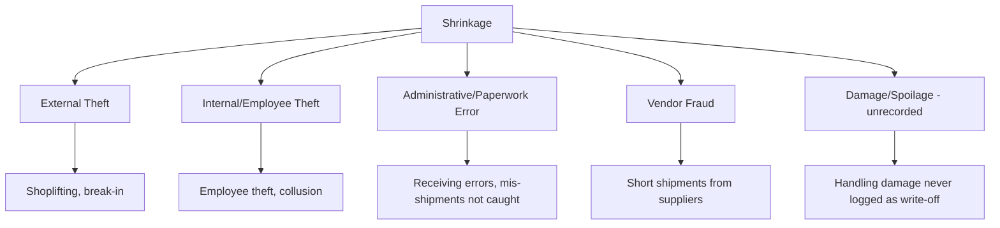
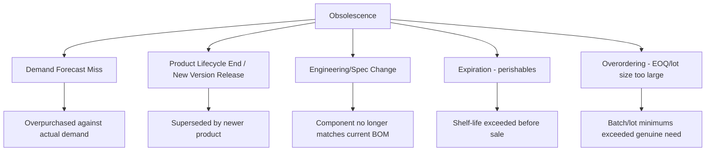

## Shrinkage and Obsolescence Management

### Overview

Shrinkage and obsolescence are the two primary categories of **inventory value loss that occur without a corresponding sale** — inventory that leaves the system of record's financial value not through revenue-generating transactions, but through loss, theft, damage, or loss of usability/sellability over time. Both concepts were introduced as components of the "risk cost" term in the carrying-cost-percentage breakdown covered earlier in this material; this topic treats them as a standalone management discipline, covering how each is measured, its root causes, and the control frameworks used to minimize it.

Though often discussed together, shrinkage and obsolescence are distinct phenomena with different causes and different management responses:

| Dimension | Shrinkage | Obsolescence |
| --- | --- | --- |
| Definition | Inventory physically missing relative to system records | Inventory physically present but unsellable/unusable at full value |
| Primary causes | Theft, damage, administrative/transactional error | Product lifecycle end, demand forecast miss, spec/design change |
| Discovery mechanism | Cycle counting, physical inventory count, IRA reconciliation | Aging analysis, sell-through tracking, engineering/product change notices |
| Typical financial treatment | Write-off against COGS or a shrinkage reserve | Inventory value write-down/reserve, often before physical disposal |

### Shrinkage: Definition and Measurement

**Shrinkage** is the discrepancy between recorded (book) inventory and actual physical inventory, expressed as a rate against sales or against total inventory value:

$$\text{Shrinkage Rate} = \frac{\text{Book Inventory Value} - \text{Physical Inventory Value}}{\text{Book Inventory Value}} \times 100\%$$

or, commonly benchmarked against sales (particularly in retail):

$$\text{Shrinkage Rate (of sales)} = \frac{\text{Inventory Loss (\$)}}{\text{Net Sales (\$)}} \times 100\%$$

**Key Points**

- Shrinkage is mechanically **identical in measurement approach** to the discrepancies surfaced through cycle counting and physical inventory reconciliation (covered previously) — shrinkage is not a separately-counted phenomenon, but rather the *specific subset* of confirmed count discrepancies attributable to loss/theft/damage root causes rather than transactional or timing errors
- [Inference] Retail shrinkage rates commonly cited in industry benchmarking discussions fall roughly in the 1–2% of sales range, though this varies substantially by retail category, loss-prevention maturity, and geography — these figures are illustrative industry benchmarks rather than a universal standard, and non-retail sectors (manufacturing, distribution, government/institutional inventories) may have meaningfully different typical rates and drivers

### Root Causes of Shrinkage

**Key Points**

- **Administrative/paperwork error** is frequently the largest single category in well-run organizations with reasonable physical security — meaning much of what gets colloquially labeled "shrinkage" is, on root-cause investigation, actually a transactional or process failure rather than theft, reinforcing the importance of the root-cause categorization step covered under reconciliation rather than defaulting to a theft assumption
- **Internal (employee) theft**, where it does occur, is frequently cited in loss-prevention literature as producing a disproportionately larger average loss per incident than external theft, though external theft is typically far more frequent in raw incident count — the two require different control responses (access control and segregation of duties for internal risk; physical security and surveillance for external risk)
- **Vendor/supplier-side shrinkage** (short shipments, where an invoiced quantity exceeds the quantity actually delivered) is a distinct category best caught at the **receiving** control point, tying back to the receiving-process root-cause category discussed under reconciliation

### Obsolescence: Definition and Measurement

**Obsolescence** refers to inventory that remains physically present and undamaged but has lost most or all of its sellable/usable value — due to product lifecycle end, technological or design supersession, expiration, or a permanent demand shift away from that item. Unlike shrinkage, obsolescence does not require a physical count discrepancy to detect; it is identified through **aging analysis** against expected sell-through patterns.

**Inventory Aging** is the standard diagnostic tool, bucketing on-hand inventory by how long it has been held without movement:

| Age Bucket | Typical Interpretation |
| --- | --- |
| 0–30 days | Fresh/normal stock |
| 31–90 days | Aging — monitor |
| 91–180 days | At-risk — investigate demand/forecast |
| 180+ days | Obsolescence risk — candidate for write-down/liquidation |

[Inference] These age-bucket boundaries are illustrative and commonly vary substantially by industry — a fashion/apparel category may treat 60-day-old stock as already obsolescence-risk, while an industrial spare-parts category might not flag risk until well beyond a year, reflecting fundamentally different product lifecycle and demand-pattern norms.

### The Obsolescence Reserve

Accounting practice typically requires establishing an **inventory obsolescence reserve** (sometimes called excess-and-obsolete, or E&O, reserve) — a value-reduction allowance recognized *before* physical disposal occurs, reflecting the expected loss in value once aging inventory is identified as at-risk:

$$\text{Obsolescence Reserve} = \sum_{i} (\text{Book Value}_i - \text{Estimated Net Realizable Value}_i)$$

summed across all SKUs flagged as excess or obsolete, where Net Realizable Value reflects what the inventory is genuinely expected to be sellable for (e.g., via markdown/clearance/liquidation channels) rather than its original cost.

**Key Points**

- Establishing the reserve **proactively**, once aging thresholds flag risk, rather than waiting until physical disposal or write-off actually occurs, is standard accounting practice specifically because financial statements should reflect expected losses as they become probable, not only once realized
- The reserve calculation directly connects back to the **carrying cost risk-cost component** covered earlier in this material — a category with historically high obsolescence-reserve activity should carry a correspondingly higher risk-cost percentage in EOQ and safety-stock calculations for that category, per the category-differentiated carrying-cost guidance discussed there

### Root Causes of Obsolescence

**Key Points**

- **Demand forecast miss** and **overordering relative to genuine need** are frequently the two largest structural drivers — connecting obsolescence management directly back to the demand forecasting quality and EOQ lot-sizing discipline covered earlier in this material; obsolescence is, in this sense, often a downstream symptom of upstream planning-parameter errors rather than a purely random occurrence
- **Engineering/spec changes** are a particular risk in manufacturing contexts with active product development — components rendered obsolete by a BOM revision require close coordination between engineering change management and inventory planning to avoid stranding stock that a purchasing system, unaware of the pending change, continued to replenish

### Prevention and Mitigation Strategies

**Key Points**

- **Tighter demand forecasting and smaller, more frequent order quantities** (echoing JIT/lean principles covered earlier) directly reduce obsolescence exposure by minimizing the volume of any single item held at risk at one time — this is a direct structural link between JIT philosophy and obsolescence risk reduction, beyond JIT's more commonly cited carrying-cost benefits
- **Engineering change notice (ECN) coordination:** Formal processes ensuring inventory planning is notified of upcoming spec/BOM changes before, not after, purchasing commits to further stock of a soon-to-be-superseded component
- **First-In-First-Out (FIFO) and First-Expired-First-Out (FEFO) inventory rotation:** Physical/system rotation disciplines that ensure older stock is consumed before newer stock, reducing the likelihood that any given unit ages into the obsolescence-risk bucket
- **Early markdown/liquidation triggers:** Acting on an item as soon as it crosses an aging threshold (rather than waiting for it to become fully unsellable) generally recovers more residual value than waiting — this is the same "act early" logic underlying the obsolescence reserve's proactive recognition
- **Physical security and access controls:** The primary shrinkage-side prevention lever — CCTV, access-controlled storage for high-value items, receiving-dock controls, and segregation of duties in the receiving/put-away process

### Financial Reporting Treatment

Both shrinkage and obsolescence ultimately reduce recognized inventory asset value, but through different accounting mechanisms:

- **Shrinkage** is typically recognized as a **direct write-off** once confirmed via cycle count or physical count reconciliation (as covered previously) — it flows through as an inventory adjustment, usually increasing COGS or a dedicated shrinkage expense line
- **Obsolescence** is typically recognized via a **reserve/allowance**, building up over time as aging risk is identified, with the reserve later drawn down as items are actually disposed of, liquidated, or written off — this two-step recognition (reserve, then disposal) is the standard accounting treatment distinguishing obsolescence from the more immediate shrinkage write-off

Both categories directly erode the metrics covered in the prior chapter: unaddressed shrinkage and obsolescence inflate carrying cost (as already noted), depress GMROI and turnover (since average inventory includes value that will never convert to a genuine sale), and — if not proactively reserved — can cause a company's reported inventory value to materially overstate its true economic worth.

**Related Topics**

- Carrying cost as a percentage of inventory value (risk-cost component)
- Cycle counting and physical inventory count as shrinkage-detection mechanisms
- Inventory record accuracy and root-cause reconciliation
- ABC analysis and differentiated loss-prevention prioritization
- Demand forecasting accuracy and its link to overordering
- FIFO/FEFO inventory rotation
- GMROI and turnover as metrics affected by unmanaged shrinkage/obsolescence