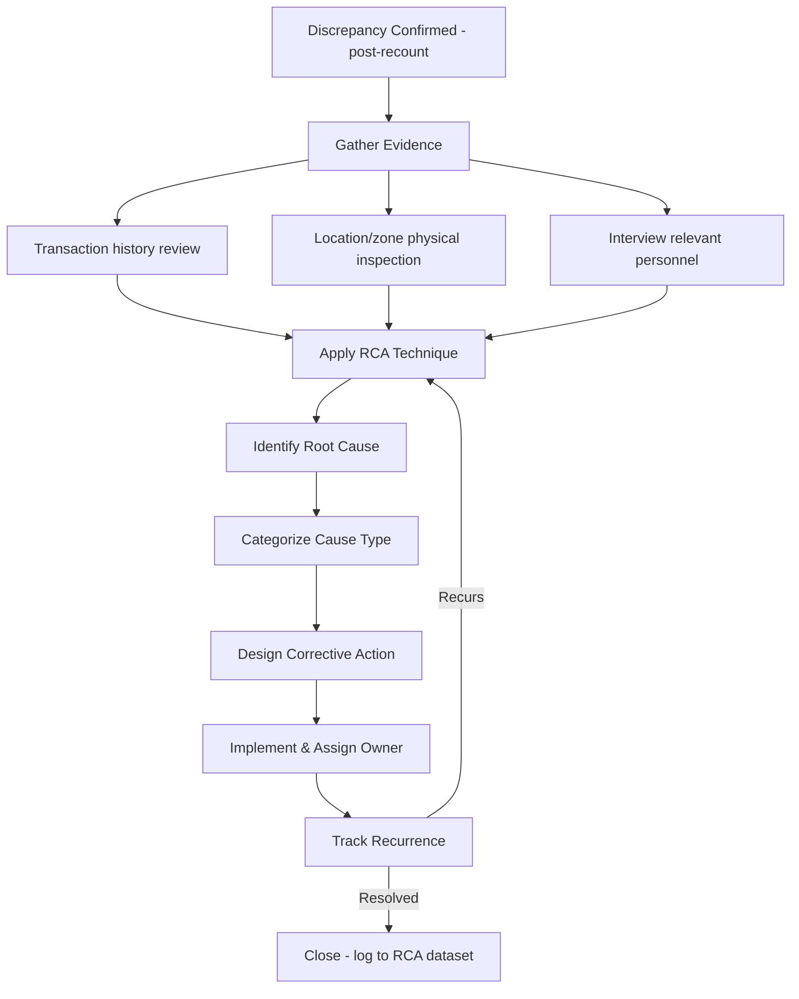
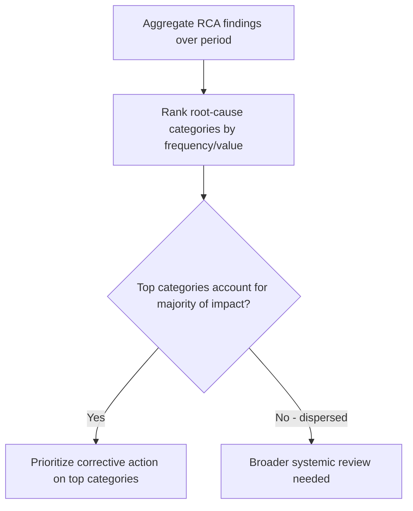
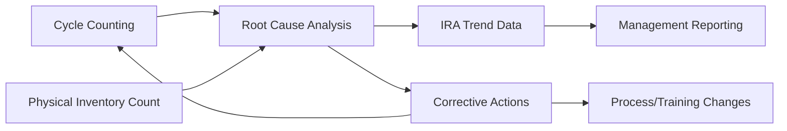

## Root Cause Analysis of Inventory Discrepancies

### Overview

Root cause analysis (RCA) is the structured investigative discipline applied to a confirmed inventory discrepancy — surfaced through cycle counting, a full physical count, or ongoing IRA reconciliation (all covered previously) — to identify the underlying process failure that caused it, rather than stopping at merely correcting the system record. This topic formalizes the "root-cause investigation" step that has appeared throughout this chapter's prior material into its own standalone methodology: the specific frameworks, categorization schemes, and analytical techniques used to move from "the count doesn't match" to "here is why, and here is what prevents recurrence."

The distinction matters because, as emphasized under reconciliation, an uninvestigated adjustment corrects the *number* but leaves the *process failure* intact — meaning the same discrepancy, or its underlying cause, will very likely recur. RCA is what converts a reactive count-and-adjust cycle into a genuine continuous-improvement mechanism for inventory control.

### Why RCA Is Necessary Beyond Simple Adjustment

**Key Points**

- A system record adjustment alone treats the **symptom**; RCA treats the **cause** — without it, an organization is perpetually re-discovering and re-correcting the same class of error, consuming reconciliation labor indefinitely rather than reducing the error rate over time
- RCA data, aggregated across many discrepancies, becomes a **diagnostic dataset in its own right** — revealing which processes, locations, item classes, or personnel patterns disproportionately generate discrepancies, informing targeted corrective investment rather than uniform, undifferentiated process tightening
- Without RCA, shrinkage, obsolescence, and administrative error (the three broad discrepancy categories covered previously) cannot be reliably distinguished from one another — and, as noted under shrinkage, a large share of what is colloquially attributed to theft often resolves, upon investigation, to administrative/transactional error instead. Skipping RCA risks misallocating corrective resources toward loss-prevention/security measures when the actual driver is a process or training gap

### The RCA Investigation Workflow



### Evidence-Gathering: The Transaction Trail

**Key Points**

Before applying a formal RCA technique, investigators reconstruct the relevant transaction history for the affected SKU/location — this evidence-gathering step is what makes root-cause investigation tractable at all, and is precisely the capability that cycle counting's short error-discovery lag (versus an annual count) preserves:

- **Transaction log review:** All receipts, shipments, transfers, adjustments, and production consumption postings for the affected SKU over the relevant window, checked for sequencing anomalies (e.g., a shipment posted before its corresponding pick was recorded)
- **Location/bin history:** Whether the SKU has recently been relocated, whether a nearby bin holds a similar or easily-confused SKU (a common driver of picking/put-away misplacement)
- **Batch/lot and serial tracking:** For serialized or lot-tracked inventory, whether the specific units in question can be traced to a specific receipt or production batch, narrowing the investigation window considerably
- **Personnel/shift correlation:** Whether the discrepancy correlates with a specific shift, team, or individual — approached carefully and typically through a process lens (training gap, workload/rushing) rather than an accusatory one, since most discrepancies trace to error rather than intent, per the shrinkage discussion

### RCA Techniques

**The Five Whys**

A simple, iterative technique of asking "why" repeatedly (conventionally five times, though the actual number varies) until the investigation reaches a true process-level root cause rather than stopping at a superficial symptom.

*Worked example:*

| Step | Question | Answer |
| --- | --- | --- |
| 1 | Why is the system quantity 20 units higher than the physical count? | The units were shipped but not deducted from inventory |
| 2 | Why weren't they deducted? | The shipment was processed outside the normal WMS workflow |
| 3 | Why was it processed outside the normal workflow? | The WMS was down during a rush order, so it was handled manually |
| 4 | Why wasn't the manual transaction later reconciled into the WMS? | No standard procedure exists for post-outage manual-transaction reconciliation |
| 5 | Why does no such procedure exist? | The WMS outage contingency plan was never extended to cover inventory transaction backfill |

The true root cause here is a **gap in the outage contingency procedure**, not "an employee forgot to update the system" — a materially different, and more durably correctable, finding than stopping the investigation at step 1 or 2.

**Fishbone (Ishikawa) Diagram**

A categorization framework that organizes potential causes into standard buckets, commonly adapted for inventory contexts as: People, Process, Systems/Technology, Materials, Environment, and Measurement.

```mermaid
flowchart LR
    subgraph Fishbone [Inventory Discrepancy - Fishbone Analysis (svg_diagram)]
    P[People] --> D[Discrepancy]
    PR[Process] --> D
    S[Systems/Tech] --> D
    M[Materials] --> D
    E[Environment] --> D
    ME[Measurement] --> D
    end
```

| Category | Example Contributing Factors |
| --- | --- |
| People | Insufficient training, high turnover, rushed/understaffed shifts |
| Process | Missing or unclear SOP, inconsistent cutoff procedures, no segregation of duties |
| Systems/Technology | WMS bugs, barcode scanner miscalibration, integration failure between systems |
| Materials | Similar-looking SKUs prone to confusion, poor packaging/labeling |
| Environment | Poor lighting, cluttered/disorganized storage, inadequate signage |
| Measurement | Inaccurate unit-of-measure conversions, miscalibrated scales for weight-counted items |

The fishbone framework is particularly useful when a discrepancy pattern (rather than a single isolated event) is under investigation, since it prompts systematic consideration across categories rather than anchoring on the first plausible explanation.

**Pareto Analysis of Discrepancy Causes**

Once a sufficient volume of RCA findings has accumulated (typically from the ongoing cycle-count program), categorizing and ranking root causes by frequency and/or value impact applies the same 80/20 logic underlying ABC classification — directing corrective-action investment toward the small number of root-cause categories responsible for the majority of discrepancy value.



### Worked Example — Pareto-Style RCA Aggregation

A quarterly review of 60 confirmed discrepancies from the cycle-count program categorizes root causes as follows:

| Root Cause Category | Count | % of Total | Cumulative % |
| --- | --- | --- | --- |
| Receiving transaction error | 24 | 40% | 40% |
| Misplacement (wrong bin) | 15 | 25% | 65% |
| Picking error | 9 | 15% | 80% |
| Unrecorded damage/scrap | 6 | 10% | 90% |
| System/master-data error | 4 | 7% | 97% |
| Suspected theft | 2 | 3% | 100% |

This distribution shows the top three categories (receiving error, misplacement, picking error) account for 80% of discrepancies — directing corrective-action priority toward receiving-process controls and bin/slotting discipline, rather than toward loss-prevention/security measures, which the raw discrepancy count might have superficially suggested was the primary concern before categorization.

### Distinguishing Isolated Incidents from Systemic Patterns

**Key Points**

- A **single discrepancy** typically warrants an individual RCA investigation (Five Whys, targeted evidence review) sized to the item's financial materiality — a high-tolerance-threshold C-item discrepancy may not justify the same investigative depth as an A-item discrepancy, echoing the class-differentiated approach used throughout this chapter
- A **recurring pattern** across multiple discrepancies (same location, same SKU family, same shift, same root-cause category) signals a systemic issue requiring the broader fishbone/Pareto-style aggregate analysis rather than repeated one-off investigations — treating each recurrence as an isolated incident, rather than recognizing the pattern, is a common RCA maturity gap
- Recurrence tracking (the feedback loop in the workflow diagram above) is what distinguishes a mature RCA program from a one-time investigative exercise — a corrective action that fails to prevent recurrence indicates either an incomplete root-cause finding or an inadequately implemented fix, and should trigger a return to the investigation step rather than being closed prematurely

### Corrective Action Design and Ownership

**Key Points**

- Corrective actions should map directly to the identified root-cause category — a receiving-error-driven pattern warrants receiving-process/training correction; a misplacement-driven pattern warrants slotting, labeling, or bin-management correction; a systems-driven pattern warrants IT/WMS configuration or integration review
- Each corrective action should have a **named owner** and a **defined verification point** (e.g., re-check discrepancy rate for that category after a defined interval) — corrective actions without ownership or a verification mechanism are a common reason RCA programs fail to reduce recurrence despite generating accurate findings
- Corrective action findings should feed back into the broader control frameworks covered earlier — informing cycle-count frequency adjustments (an item class showing elevated discrepancy rates may warrant increased count frequency), carrying-cost risk-percentage revisions (per the category-specific carrying cost guidance), and obsolescence-reserve policy where the root cause relates to aging/demand-planning failures rather than physical loss

### RCA's Position in the Broader Inventory Control Framework



RCA is the analytical link connecting the count-generation mechanisms (cycle counting, physical counts) to the governance and reporting layer (IRA trending, management review) covered under reconciliation — without RCA, discrepancy data remains a static log of corrections rather than an active input to process improvement, and the count programs themselves risk becoming a permanent, unreducing labor cost rather than a discipline that drives measurably improving accuracy over time.

**Related Topics**

- Cycle counting methodologies and error-discovery lag
- Physical inventory count procedures
- Inventory record accuracy and reconciliation
- Shrinkage and obsolescence management
- ABC analysis and Pareto-based prioritization
- Segregation of duties and internal controls
- Continuous improvement (kaizen) methodology