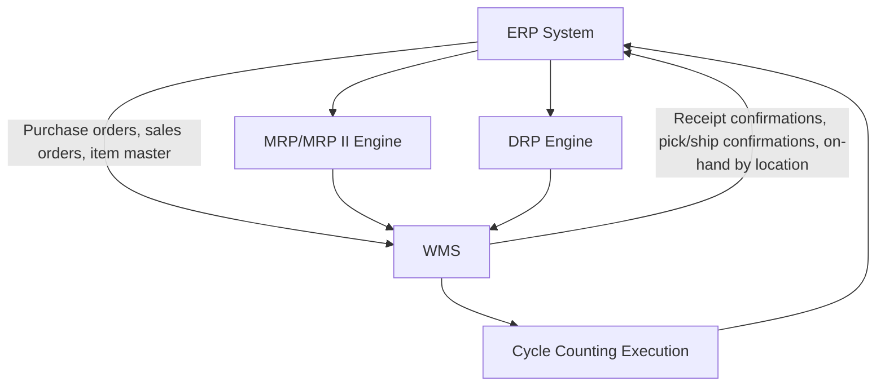
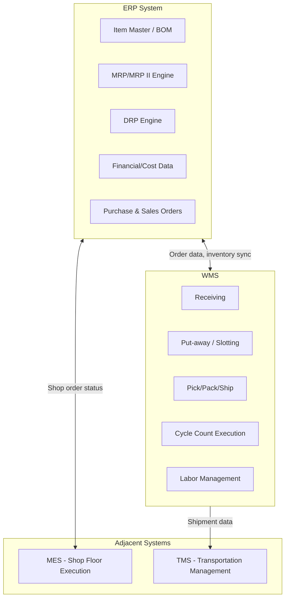

## Role of ERP and Warehouse Management Systems

### Overview

Enterprise Resource Planning (ERP) and Warehouse Management Systems (WMS) are the two primary software system categories that operationalize the inventory-planning, control, and accuracy disciplines covered throughout this material — MRP/DRP planning logic, kanban and JIT execution, safety stock and KPI calculation, and cycle counting/reconciliation workflows all ultimately run *inside* or *across* these systems rather than existing as abstract methodologies alone. This topic covers what each system category is responsible for, where their functional boundaries lie, and how they integrate with each other and with the broader systems landscape (MES, DRP, TMS) referenced in earlier chapters.

### ERP vs. WMS: Functional Scope

**Key Points**

- **ERP** is the enterprise-wide system of record spanning finance, procurement, sales, manufacturing planning (MRP/MRP II), and — at a summary/location level — inventory. ERP typically holds the **financial and planning truth**: item master data, standard costs, purchase orders, sales orders, and the MRP/DRP planning engines covered earlier in this material
- **WMS** is a specialized, operationally-focused system governing the **physical execution** of receiving, put-away, picking, packing, and shipping within a specific warehouse or distribution center — WMS holds the **operational and physical truth**: exact bin/location-level inventory, pick paths, labor management, and the barcode/RFID-driven transaction capture that feeds cycle counting and physical inventory processes

| Dimension | ERP | WMS |
| --- | --- | --- |
| Primary scope | Enterprise-wide (finance, planning, procurement) | Single facility / warehouse operations |
| Inventory granularity | Item, often at location-summary level | Item at exact bin/slot/location level |
| Core planning logic | MRP, MRP II, DRP (as covered earlier) | Wave planning, pick-path optimization, labor management |
| Transaction focus | Purchase orders, sales orders, financial postings | Receiving, put-away, picking, packing, shipping confirmations |
| Update frequency | Often batch/periodic for planning runs | Real-time/near-real-time transactional |

### Where MRP/DRP Logic Actually Lives

Consistent with the closed-loop MRP II architecture covered earlier, the planning engines (MPS, MRP, CRP, DRP) are typically ERP-resident functions, since they depend on enterprise-wide data — BOMs, routings, financial cost data, and multi-location demand aggregation — that sits naturally within ERP's scope rather than a single warehouse's operational system. WMS, by contrast, generally does **not** run MRP-style time-phased explosion logic; instead, it receives already-planned orders (planned order releases, purchase orders, shop orders) from ERP and focuses on executing the physical movement those orders require.

**Key Points**

- This division means a kanban pull signal, for example, is often triggered at the WMS/shop-floor execution layer (a physical or electronic card, a bin-empty sensor) while the **broader capacity and material planning** that determines how many kanban cards exist in the first place (per the sizing formula covered earlier) is typically informed by ERP-resident demand and lead-time data
- Some modern WMS platforms have absorbed limited planning capability (e.g., basic replenishment triggering between zones within a single facility), blurring this boundary somewhat, but the core time-phased, multi-echelon planning logic covered under MRP/DRP remains predominantly an ERP-layer function in most implementations

### How WMS Supports Inventory Accuracy and Control

**Key Points**

WMS is the primary operational system enabling the accuracy and auditing disciplines covered in the prior chapter:

- **Barcode/RFID scanning at every transaction point** (receiving, put-away, pick, pack, ship) is what generates the granular transaction trail that root-cause analysis depends on for evidence-gathering
- **Directed put-away and slotting logic** reduces the misplacement root-cause category identified as a common discrepancy driver, by systematically guiding (rather than leaving to operator judgment) where inventory is stored
- **Cycle count task generation and execution** is frequently managed directly within WMS, which can automatically schedule counts per the ABC-based frequency policy covered earlier, generate blind count tasks for mobile scanning devices, and flag discrepancies for the reconciliation workflow in near-real-time rather than requiring a separate manual process
- **Location-level, real-time on-hand visibility** is what makes WMS the natural system of record for the granular inventory position feeding Days of Supply and fill-rate calculations at the operational level, even though the aggregated, multi-location KPI reporting (turnover, GMROI, inventory-to-sales) typically draws from ERP-consolidated data

### Integration Architecture

**Key Points**

- Integration between ERP and WMS is typically real-time or near-real-time in modern implementations (API-based or middleware-mediated), since operational decisions (can this order be picked now?) depend on current WMS-resident inventory position, while financial and planning decisions depend on that same position being synchronized back to ERP
- Where integration latency exists (batch syncs rather than real-time), a **temporary divergence** between ERP's summary inventory figure and WMS's granular figure is possible — this is itself a source of the timing/cutoff discrepancy category covered under root-cause analysis, and is a common practical reason organizations invest in tighter, more frequent ERP-WMS synchronization
- For organizations without a dedicated standalone WMS, ERP systems increasingly offer built-in, lighter-weight warehouse management modules — appropriate for simpler, single-facility operations, while dedicated best-of-breed WMS platforms are more common where pick-path optimization, complex slotting, or high transaction volume justify the additional system

### Relationship to DRP and Multi-Location Networks

In a multi-echelon distribution network (as covered under DRP), each physical location (DC, regional warehouse) typically runs its own WMS instance (or a WMS module serving that facility), while the **DRP planning logic that determines what should move between locations and when** runs centrally, typically within ERP or a dedicated supply chain planning system layered on top of ERP. The planned order releases DRP generates for a given node become inbound/outbound transaction instructions the receiving and shipping WMS instances at each end of that transfer execute against.

### Relationship to MES (Manufacturing Execution Systems)

For manufacturing-inventory contexts, WMS and MES serve adjacent but distinct roles: **MES** governs shop-floor production execution (work order dispatch, machine/operator data capture, quality checkpoints) as introduced under MRP II integration, while **WMS** governs the material movement supporting that production (staging raw materials to the line, receiving finished goods from production into storage). In some implementations these are separate systems with defined integration points; in others, particularly simpler operations, a single system handles both scopes.

### Selecting and Scoping a WMS Implementation

[Inference] The decision to implement a dedicated WMS versus relying on ERP's built-in inventory/warehouse functionality is generally driven by transaction volume, facility complexity (number of locations, SKU count, pick-path complexity), and the sophistication of accuracy/control processes an organization needs to support — smaller or lower-complexity operations may find ERP's native capability sufficient, while high-volume, multi-zone distribution operations more often justify a dedicated best-of-breed WMS; this is an implementation-specific sizing decision rather than governed by a universal threshold.

### Application to Government/Public-Sector Document and Records Systems

[Inference] For a government LGU context managing physical assets or supplies alongside document/records management, the ERP/WMS distinction covered here is directly analogous even where formal commercial ERP/WMS products aren't in use: a central asset/supply registry (playing the ERP role — item master, procurement records, budget/financial tracking) and location-specific physical tracking (playing the WMS role — which department or barangay office currently holds what, in what condition) are conceptually separable concerns, and the same integration and accuracy-reconciliation principles covered in this chapter (transaction-level tracking, cycle-count-style periodic verification, root-cause investigation of discrepancies) would apply even in a lighter-weight, purpose-built system rather than a full commercial WMS deployment.

**Related Topics**

- MRP II integration and the closed-loop planning architecture
- Distribution Requirements Planning (DRP) and multi-echelon networks
- Cycle counting methodologies and WMS-driven count task generation
- Root cause analysis and the transaction-trail evidence base
- Manufacturing Execution Systems (MES) integration
- Barcode and RFID technology in inventory operations
- Master data governance (item master, BOM, unit-of-measure)