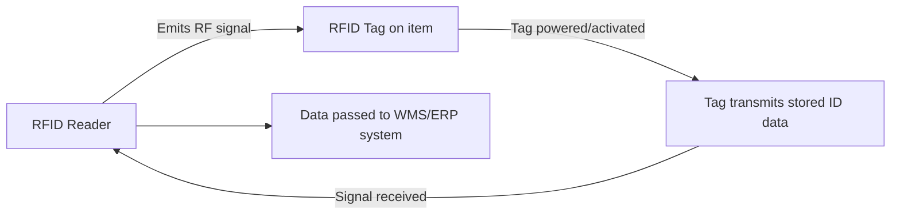
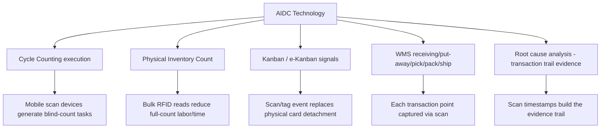

## Barcode and RFID Tracking Technologies

### Overview

Barcode and RFID (Radio-Frequency Identification) are the two dominant automatic identification and data capture (AIDC) technologies underlying the transaction-level tracking referenced throughout this material — every WMS transaction point, every cycle count, every physical inventory count, and every kanban card's electronic equivalent ultimately depends on one of these two technologies (or a combination) to capture identity and movement data without manual data entry. This topic covers how each works, their comparative trade-offs, and where each is best applied across the systems and processes covered in this curriculum.

### How Barcode Technology Works

A barcode encodes data as a pattern of parallel lines (1D/linear barcodes) or a two-dimensional matrix of cells (2D barcodes, e.g., QR codes, Data Matrix) that a scanner reads optically, decoding the pattern into a string of characters representing a SKU, lot number, location, or other identifier.

**Key Points**

- **1D barcodes** (UPC, EAN, Code 128, Code 39) encode a linear string of data — typically a SKU or item identifier — and require direct line-of-sight scanning of each individual code
- **2D barcodes** (QR, Data Matrix, PDF417) encode substantially more data per unit area, including structured fields (item, lot, expiration date, serial number) in a single scannable symbol, and are more tolerant of partial damage due to built-in error correction
- Barcode scanning is inherently a **one-at-a-time, line-of-sight operation** — each individual barcode must be presented to and read by the scanner sequentially, which is the primary throughput constraint compared to RFID

### How RFID Technology Works

RFID uses radio-frequency signals to transmit data between a **tag** (attached to the item, containing a microchip and antenna) and a **reader**, without requiring direct line-of-sight or one-at-a-time scanning.

**Key Points**

- **Passive RFID tags** have no internal power source; they are powered by the reader's own RF signal (backscatter), making them low-cost and suitable for high-volume item-level tagging, but with shorter read range (typically a few meters at most, environment-dependent)
- **Active RFID tags** contain their own battery and can transmit continuously or on a longer interval, achieving substantially longer read range (tens to hundreds of meters), but at meaningfully higher per-tag cost — typically reserved for high-value asset tracking (e.g., a container, a vehicle, a large equipment asset) rather than individual SKU-level item tagging
- RFID's defining operational advantage is **bulk, non-line-of-sight reading** — an entire pallet or shelf of tagged items can, in suitable conditions, be read essentially simultaneously by a fixed or handheld reader, without individually orienting each item toward a scanner

### Comparative Trade-Offs

| Dimension | Barcode | RFID (Passive) |
| --- | --- | --- |
| Per-unit cost | Very low (printed label) | Higher (chip + antenna + encoding) |
| Read method | Line-of-sight, one at a time | Non-line-of-sight, bulk/simultaneous |
| Read range | Contact to ~1m (scanner-dependent) | Typically 1–10m (environment-dependent) |
| Read speed for bulk items | Slow — sequential | Fast — near-simultaneous for a batch |
| Environmental sensitivity | Sensitive to physical damage, dirt obscuring code | Sensitive to metal/liquid interference, tag orientation |
| Data capacity | Limited (especially 1D); 2D codes moderate | Higher, and can be updated (read/write tags) |
| Typical use case | General SKU-level identification, low-cost, high-volume | Bulk pallet/case reads, asset tracking, high-value item tracking |

**Key Points**

- RFID's read-rate advantage is most valuable precisely in the physical inventory counting context covered earlier — an entire tagged storage area can, in principle, be counted in a fraction of the time a barcode-by-barcode count would require, directly reducing the labor cost that constrains full physical count frequency and scope
- **Metal and liquid interference** is RFID's most commonly cited practical limitation — RF signals can be absorbed or reflected by these materials, causing missed reads or false negatives, which is why RFID adoption has been comparatively slower in categories with substantial metal or liquid content (e.g., canned goods, certain industrial parts) relative to categories like apparel, where RFID adoption has been comparatively extensive
- Barcode's cost advantage generally makes it the default choice for high-volume, low-unit-value items, while RFID's cost is more easily justified for higher-value items or contexts where bulk-read throughput materially changes operational economics (e.g., large-scale physical counts, high-volume receiving docks)

### Application Across the Systems Covered in This Curriculum

**Key Points**

- In **cycle counting**, barcode/RFID scanning is what enables the blind-count protocol and mobile-device task generation covered earlier — a scan-based count avoids the transcription errors inherent to paper tally sheets and can flag discrepancies against system records in near-real-time
- In **physical inventory counts**, technology choice directly affects count duration — the barcode-vs-RFID trade-off table above is the concrete basis for the count-method decision discussed under physical inventory procedures, particularly for large facilities where minimizing shutdown/disruption time is a priority
- In **e-kanban systems**, a barcode or RFID scan at the point of consumption is the mechanism that replaces the physical card-detachment event described under kanban pull mechanics — the scan event transmits the withdrawal signal electronically rather than through a physical card moving between posts
- In **root cause analysis**, the timestamped scan record at each transaction point (receiving, put-away, pick, ship) is precisely the evidence trail investigators reconstruct during the "gather evidence" phase of RCA — richer, more granular scan data generally supports faster and more precise root-cause identification

### RFID Tag Types and Frequency Bands

[Inference] RFID implementations vary by frequency band, each with different range and material-penetration characteristics, and the appropriate choice is generally application-specific rather than governed by a single standard:

| Frequency Band | Typical Range | Common Use Case |
| --- | --- | --- |
| Low Frequency (LF, ~125–134 kHz) | Very short (cm) | Animal tracking, access control |
| High Frequency (HF, 13.56 MHz) | Short (up to ~1m) | Item-level retail tagging, library systems, NFC-adjacent applications |
| Ultra-High Frequency (UHF, 860–960 MHz) | Longer (several meters) | Pallet/case-level supply chain tracking, most warehouse/logistics applications |

UHF RFID is the band most commonly associated with warehouse and supply-chain applications specifically because its longer range and faster read rate suit the bulk-read use case (pallet/dock-door reads, wide-area shelf scanning) that provides RFID's primary advantage over barcode in this context.

### Hybrid Implementations

**Key Points**

- Many organizations run **hybrid barcode/RFID environments** rather than choosing one exclusively — for example, RFID at the pallet/case level for bulk receiving and shipping dock reads, combined with barcode at the individual-item level for point-of-sale or unit-level picking, balancing RFID's bulk-read cost-effectiveness against barcode's low per-unit cost for high-volume individual items
- **RFID adoption curves have historically been driven by large retailers/mandate programs** requiring supplier-side tagging compliance, which has meaningfully influenced adoption patterns across supply chains — smaller or non-mandated operations have adopted RFID more selectively, typically where a clear internal ROI case (count-labor reduction, high-value asset tracking, reduced out-of-stock rates) justifies the incremental tag cost independent of any external mandate

### Technology Selection Considerations

[Inference] The decision between barcode, RFID, or a hybrid approach for a given inventory operation is generally driven by: per-unit item value (justifying RFID's higher tag cost), transaction/count volume (where RFID's bulk-read speed materially reduces labor cost), physical environment (metal/liquid content affecting RFID reliability), and existing systems infrastructure (WMS/ERP RFID-reader integration capability) — this is an implementation-specific cost-benefit decision rather than one governed by a single universal best practice, and many operations reasonably continue to rely primarily on barcode technology where transaction volume or item value does not clearly justify RFID's additional infrastructure investment.

**Related Topics**

- Role of ERP and Warehouse Management Systems
- Cycle counting methodologies and blind-count protocols
- Physical inventory count procedures and count-method selection
- Kanban pull system mechanics and electronic kanban (e-kanban)
- Root cause analysis and transaction-trail evidence
- Master data governance and SKU/item identification standards
- Supply chain visibility and track-and-trace systems