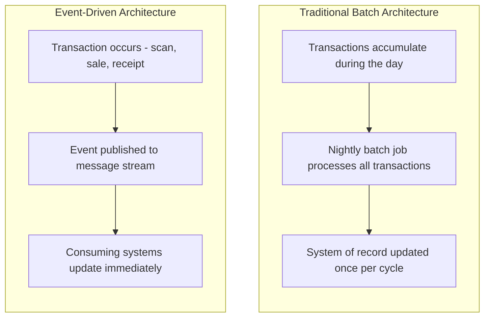
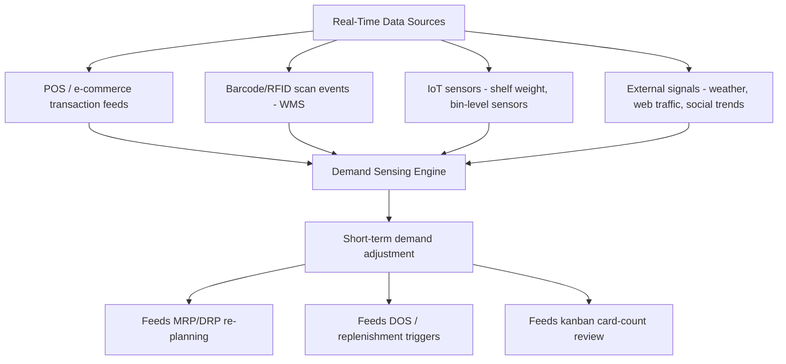

## Real-Time Inventory Visibility and Demand Sensing

### Overview

Real-time inventory visibility and demand sensing represent the modern evolution of the planning and control disciplines covered throughout this material — moving from periodic, batch-oriented data (nightly MRP regeneration, monthly IRA reporting, historical average-demand calculations) toward continuous, event-driven data streams that let planning systems react to actual conditions as they occur rather than as of the last planning cycle. This topic covers what "real-time" means concretely in an inventory context, how demand sensing differs from traditional forecasting, and how these capabilities integrate with the ERP/WMS architecture and AIDC technologies (barcode/RFID) covered previously.

### Defining Real-Time Inventory Visibility

**Key Points**

- **Real-time visibility** means inventory position — on-hand, in-transit, allocated/committed, and in-process — is available as a continuously current figure, updated as each transaction occurs, rather than as a periodic snapshot refreshed on a batch schedule (nightly, weekly)
- This directly addresses the **integration latency** risk flagged under ERP/WMS integration — where batch synchronization between systems can produce a temporary divergence between the operational (WMS) and enterprise (ERP) view of inventory, real-time architectures aim to eliminate or minimize that gap
- "Real-time" in practice usually means **near-real-time** — event-driven updates propagating within seconds to a few minutes, rather than literal zero-latency — and the acceptable latency threshold is generally use-case dependent (a fill-rate-critical e-commerce allocation decision needs tighter latency than a strategic network-level DOS trend review)

### Architectural Shift: Batch vs. Event-Driven

This mirrors the **net change vs. regenerative** distinction introduced under MRP II integration: just as net-change MRP recalculates only affected items rather than re-exploding the entire plan on a schedule, real-time inventory visibility architectures propagate only the specific transaction that occurred, to every system that needs to know about it, rather than waiting for a scheduled full-system sync.

**Key Points**

- **Message queue/event-streaming platforms** (e.g., Kafka, or cloud-native equivalents) are the typical underlying technology enabling this — each scan, sale, receipt, or shipment transaction is published as a discrete event that any subscribed system (ERP, WMS, e-commerce platform, DRP engine) can consume and act on independently, rather than requiring point-to-point batch integration between every pair of systems
- This architecture directly supports the **feedback loop latency** concern raised under MRP II integration — shop floor actuals and inventory transactions reaching the planning layer faster keeps the "closed loop" genuinely closed, rather than drifting back toward open-loop behavior between batch cycles

### Demand Sensing vs. Traditional Forecasting

**Demand sensing** refers to short-horizon demand estimation that incorporates near-real-time signals — recent POS data, current inventory depletion rates, web traffic/search trends, weather data, or other leading indicators — to produce a more responsive, short-term demand estimate than a traditional statistical forecast built primarily on historical demand patterns.

| Dimension | Traditional Statistical Forecasting | Demand Sensing |
| --- | --- | --- |
| Primary data input | Historical demand time series | Recent/real-time signals (POS, web, weather, current depletion) |
| Typical horizon | Medium-to-long term (weeks to months) | Short-term (days to a few weeks) |
| Update frequency | Periodic (weekly/monthly re-forecast) | Continuous/daily, reacting to incoming signals |
| Responsiveness to sudden shifts | Slower — lags behind a trend until enough history accumulates | Faster — designed to detect and react to near-term shifts |
| Typical technique | Time-series methods (moving average, exponential smoothing, ARIMA) | Machine learning models incorporating multiple real-time data streams |

**Key Points**

- Demand sensing is generally positioned as a **complement to, not a replacement for**, traditional statistical forecasting — it refines and adjusts the near-term portion of a longer-horizon forecast based on emerging signals, rather than replacing the underlying statistical model entirely
- The connection to this material's core formulas is direct: demand sensing's purpose is to reduce the **effective $\sigma_{LT}$** (demand variability over lead time) feeding the safety stock formula, and to improve the accuracy of the **$D$ term** feeding Days of Supply and kanban card-count calculations — a more accurate, more current demand estimate allows either tighter safety stock for the same service level, or better service level for the same safety stock investment

### Where Real-Time Data Originates

**Key Points**

- **IoT sensors** — shelf-weight sensors, bin-level fill sensors, smart-shelf systems — extend real-time visibility beyond standard transactional scanning by directly measuring physical stock levels continuously, rather than only at discrete transaction events (a receipt, a pick). This is particularly relevant for the opportunity-based/event-triggered cycle counting approach covered earlier, where a sensor-detected empty-bin condition can trigger an immediate count or replenishment signal without waiting for the next scheduled cycle-count pass
- **External signal integration** (weather, local events, social media trend data) is most commonly applied to categories with demonstrated correlation to those signals — seasonal or weather-sensitive product categories being the most commonly cited example — rather than uniformly across an entire catalog

[Inference] The specific mix of external signals worth integrating into a demand-sensing model is highly category- and business-specific; a general-merchandise retailer's relevant external signal set will differ substantially from, for example, a pharmaceutical distributor's, and building a demand-sensing capability generally requires identifying which signals actually carry predictive value for the specific product categories involved, rather than assuming a universal signal set applies broadly.

### Impact on Downstream Planning Systems

**Key Points**

Real-time visibility and demand sensing feed back into nearly every system covered in this material, generally tightening the gap between plan and reality:

- **MRP/DRP:** Net-change (rather than purely regenerative) explosion cycles, triggered by real-time transaction events, allow planned order releases to reflect current conditions more closely than a fixed nightly-batch regeneration would
- **Kanban card counts:** A demand-sensing-informed, more current $D$ estimate supports more timely card-count recalibration (per the sizing formula covered earlier), rather than relying on a static or infrequently-reviewed average demand figure
- **Days of Supply:** Real-time on-hand data combined with a demand-sensing-adjusted usage rate produces a more accurate, more actionable DOS figure than one computed from a simple trailing average against a batch-updated inventory snapshot
- **Fill rate / stockout prevention:** Real-time visibility into inventory allocation and commitment status (not just raw on-hand quantity) is what prevents the specific fill-rate failure mode noted earlier — a system promising availability based on a stale on-hand figure that has since been committed to another order

### Practical Implementation Considerations

**Key Points**

- **Data quality remains foundational** — real-time architecture accelerates the *propagation* of data, but does not itself improve data *accuracy*; an inaccurate scan or an unrecorded transaction still produces bad data, just propagated faster. Real-time visibility should be understood as amplifying the importance of the IRA and reconciliation disciplines covered earlier, not substituting for them
- **Integration complexity and cost** generally scale with the number of systems and data sources being connected in real time — a full event-driven architecture spanning ERP, WMS, e-commerce, and external signal sources represents a substantially larger systems investment than a simpler batch-integrated environment, and the appropriate level of investment depends on how much operational value the reduced latency actually provides for a given business's demand volatility and service-level requirements
- **Alert fatigue** is a practical risk when real-time systems generate exception messages or replenishment triggers at high frequency — analogous to the exception-message management challenge noted under MRP II's CRP overload flagging, a real-time system generating excessive low-priority alerts can cause genuinely important signals to be missed or ignored

[Inference] Determining the appropriate scope and investment level for real-time visibility and demand-sensing capability is generally a cost-benefit decision weighing integration/infrastructure investment against the value of tighter safety stock, improved fill rate, or reduced obsolescence risk for a given business's specific demand volatility profile — smaller or lower-complexity operations may find traditional batch-oriented systems adequate, while high-volume, high-volatility, or service-level-critical operations more often justify the additional investment; this is implementation-specific rather than governed by a universal adoption threshold.

**Related Topics**

- Role of ERP and Warehouse Management Systems
- Barcode and RFID tracking technologies
- Safety stock calculus and demand variability reduction
- Days of Supply and replenishment triggering
- MRP II integration and net-change vs. regenerative planning cycles
- Kanban card sizing calculations and dynamic recalibration
- Fill rate and backorder rate tracking