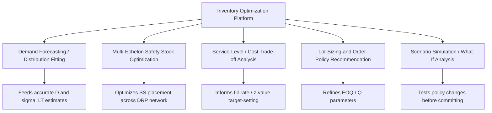
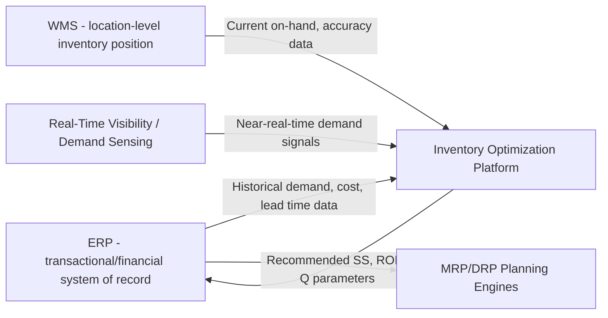

## Inventory Optimization Software Platforms

### Overview

Inventory optimization software platforms are purpose-built analytical systems that sit above ERP and WMS (covered previously) to computationally solve the parameter-setting problems referenced throughout this material — safety stock levels, reorder points, EOQ/lot sizes, and multi-echelon stocking policy — at a scale and statistical sophistication that manual calculation or ERP's native planning modules typically cannot match. Where ERP holds the transactional and planning system of record, and WMS executes physical operations, inventory optimization platforms typically function as a **decision-support layer**: consuming data from both, running statistical and often stochastic optimization models, and recommending (or in some architectures, directly writing back) parameter values — safety stock, min/max levels, reorder points — that ERP's planning engines then execute against.

### Why a Separate Optimization Layer Exists

**Key Points**

- Native ERP planning modules typically implement the **deterministic** formulas covered throughout this material — the standard safety stock formula, EOQ, standard MRP/DRP time-phased logic — computed per SKU/location using relatively simple, often manually-maintained parameters (a fixed $z$-value, a single demand-variability estimate)
- Dedicated optimization platforms typically extend this with **stochastic, multi-echelon, and statistically-fitted** approaches: modeling actual demand distributions (rather than assuming normality), jointly optimizing safety stock placement across an entire distribution network (rather than each node independently), and continuously recalibrating parameters as new data arrives — capabilities that go meaningfully beyond what most ERP planning modules compute natively
- This mirrors the earlier discussion under DRP of **variability pooling** ($\sigma_{agg} = \sqrt{\sum \sigma_i^2}$) — a genuinely multi-echelon-optimized safety stock policy requires solving for stock placement *jointly* across the network, which is a fundamentally more complex optimization problem than the node-by-node calculation most basic planning systems perform

### Core Functional Capabilities

**Key Points**

- **Demand distribution fitting:** Rather than assuming demand is normally distributed (an assumption embedded in the standard $SS = z \times \sigma_{LT} \times \sqrt{L}$ formula), optimization platforms often fit demand to distributions that better match observed patterns — particularly important for intermittent or lumpy demand items, where a normal-distribution assumption can meaningfully misstate true stockout risk
- **Multi-echelon inventory optimization (MEIO):** Jointly determines safety stock levels across every node in a distribution network simultaneously, accounting for the variability-pooling effect and each node's role (buffer-holding vs. pass-through), rather than calculating each location's safety stock in isolation — directly extending the DRP and safety-stock-positioning concepts covered earlier
- **Service-level/cost trade-off (efficient frontier) analysis:** Rather than a single fixed target service level, these platforms typically model the full cost curve across a range of possible service levels, letting planners see explicitly how much additional inventory investment each incremental point of fill-rate improvement requires — directly operationalizing the diminishing-returns relationship between fill rate and safety stock noted earlier
- **Scenario simulation:** Monte Carlo or similar simulation approaches test proposed policy changes (a new safety stock target, a changed lead time, a demand shock scenario) against historical or synthetic demand patterns before committing the change to live operations

### Where Optimization Platforms Fit in the Systems Architecture

**Key Points**

- Optimization platforms consume data **from** ERP, WMS, and real-time/demand-sensing sources (all covered previously) as inputs, and typically write recommended parameters **back into** ERP, which then executes the actual planning runs (MRP, DRP) using those optimized parameters — the optimization platform generally does not replace the planning engine itself, but calibrates the parameters that engine uses
- This is analogous to the CRP/RCCP capacity-feedback relationship covered under MRP II integration: a specialized analytical layer informs and adjusts the parameters or feasibility of a core planning process, in a closed loop, rather than operating as a fully separate, disconnected system

### Worked Illustration: Why Joint (MEIO) Optimization Differs from Node-by-Node Calculation

Consider a simplified two-node network (a central DC and one downstream regional warehouse), each independently targeting a 95% cycle service level using the standard formula. If each node calculates its own safety stock in isolation against its own local demand variability, the **total network-wide safety stock** is generally higher than what a jointly-optimized MEIO approach would recommend — because independent, node-by-node calculation does not account for the possibility of **shifting some of the buffer role upstream**, where the variability-pooling effect (introduced under DRP) makes a given unit of safety stock more efficient at absorbing risk across multiple downstream demand streams simultaneously.

This is the core value proposition MEIO software is built to capture computationally: for even a modest network, manually solving the joint optimization problem across many SKUs and locations is impractical, which is precisely the gap dedicated optimization software fills.

### Categories of Commercial Platforms

[Inference] Because the commercial inventory-optimization software landscape changes over time (vendor consolidation, new entrants, evolving product scope), this material describes the standard architectural categories these platforms fall into rather than naming and assessing specific current products, which should be verified against up-to-date vendor documentation and market analysis at the time of any actual selection decision:

- **Standalone/best-of-breed inventory optimization suites:** Dedicated platforms focused specifically on demand forecasting, safety stock, and multi-echelon optimization, typically integrating with a company's existing ERP/WMS rather than replacing them
- **ERP-embedded advanced planning modules:** Major ERP vendors increasingly offer add-on or embedded advanced planning/optimization modules extending their native MRP/DRP capability toward the statistical and multi-echelon sophistication described above
- **Supply chain planning (SCP) / Advanced Planning and Scheduling (APS) suites:** Broader platforms that bundle inventory optimization alongside demand planning, S&OP, and production scheduling capability, positioned as a comprehensive planning layer rather than a narrowly-scoped inventory-only tool

### Implementation Considerations

**Key Points**

- **Data quality prerequisite:** Consistent with the IRA discussion covered earlier, optimization platforms are highly sensitive to the accuracy of the historical demand, lead-time, and inventory-position data they consume — a platform fed inaccurate inventory records or uncaptured true-demand data (per the backorder/lost-sale distinction covered under fill rate) will produce statistically sophisticated but substantively wrong recommendations, reinforcing why the accuracy disciplines covered in the prior chapter are a genuine prerequisite for optimization software to add real value rather than layering false precision onto bad data
- **Change management and trust:** Because these platforms often recommend parameter changes that diverge from planners' existing intuition or historical practice (e.g., recommending lower safety stock at a downstream node in favor of higher centralized buffer, per the MEIO logic above), successful adoption typically requires building planner trust through transparent scenario/what-if capability rather than a pure "black box" recommendation
- **Integration effort:** As shown in the architecture diagram, a functioning optimization platform requires reliable, ideally automated data feeds from ERP, WMS, and (where available) real-time visibility sources — integration project scope is frequently a significant portion of overall implementation effort and cost

[Inference] Whether the incremental sophistication of a dedicated optimization platform is justified over a well-tuned native ERP planning module generally depends on network complexity (number of echelons and locations), demand volatility, SKU count, and the financial materiality of the carrying-cost and service-level trade-offs involved — organizations with simple, single-echelon operations and stable demand may find native ERP capability sufficient, while complex multi-echelon networks with high demand variability more often show a clear return on dedicated optimization software; this is a context-specific evaluation rather than a universal recommendation.

**Related Topics**

- Distribution Requirements Planning (DRP) and multi-echelon networks
- Safety stock calculus and service-level trade-offs
- Real-time inventory visibility and demand sensing
- Role of ERP and Warehouse Management Systems
- MRP II integration and closed-loop planning architecture
- Demand forecasting methods and distribution fitting
- Fill rate, backorder rate, and true-demand capture