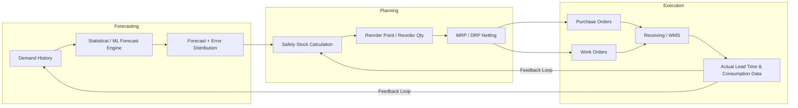

## Systems integration across forecasting, planning, and execution


### Overview

Inventory management systems are rarely monolithic. In practice, three functional layers must exchange data continuously: **forecasting** (demand prediction), **planning** (translating demand into supply decisions — safety stock, reorder points, replenishment plans), and **execution** (the transactional systems that actually move inventory — warehouse management, procurement, point-of-sale). Systems integration is the architecture, data contracts, and orchestration logic that keeps these layers synchronized so that a forecast revision propagates into planning parameters, and planning decisions propagate into executable work orders/purchase orders, without manual re-entry or drift between systems.

### Why Integration Matters for Safety Stock Calculus

Safety stock formulas (e.g., $SS = z \cdot \sigma_{LT} \cdot \sqrt{L}$ or more complex service-level-driven variants) are only as good as their inputs. Those inputs — demand variability $\sigma_D$, lead time $L$ and its variability $\sigma_L$, service level $z$ — originate in different systems:

- **Forecasting system**: produces $\hat{D}$ and forecast error distributions (source of $\sigma_D$)
- **Planning system (MRP/DRP)**: computes safety stock, reorder points, and net requirements
- **Execution system (WMS/ERP transactions)**: reports actual lead times, receipts, and consumption — the ground truth that recalibrates $\sigma_L$

If these systems are not integrated, safety stock is calculated on stale or inconsistent data, which directly inflates or deflates buffer levels incorrectly.

### The Three-Layer Reference Architecture



The critical architectural feature is the **feedback loop**: execution data (actual receipts, actual consumption, actual lead times) must flow back upstream to recalibrate both the forecast model and the safety stock parameters. Without this loop, the system operates open-loop and degrades over time.

### Integration Patterns

**1. Batch/ETL Integration**

Periodic (nightly, weekly) extraction of transactional data from execution systems into a data warehouse, which forecasting and planning tools then query.

- **Pros**: Simple, decoupled, well-suited to systems with high-latency tolerance (most safety stock recalculation doesn't need sub-hour freshness)
- **Cons**: Introduces latency; a stockout event today won't influence planning until the next batch window

**2. Event-Driven / Message-Bus Integration**

Execution systems emit events (e.g., `GoodsReceived`, `OrderShipped`, `StockCountAdjusted`) onto a message bus (Kafka, RabbitMQ, AWS EventBridge). Planning and forecasting subscribe to relevant events and update incrementally.

- **Pros**: Near-real-time propagation; supports reactive replenishment triggers
- **Cons**: Higher architectural complexity; requires idempotent consumers and careful schema versioning

**3. API-Based Synchronous Integration**

Direct request/response calls, typically for on-demand lookups (e.g., planning system calls execution system's API to fetch current on-hand quantity before computing a reorder point).

- **Pros**: Strong consistency for point-in-time queries
- **Cons**: Tight coupling; execution system downtime blocks planning operations if not designed with fallback/caching

**4. Master Data Hub / Golden Record**

A central system of record (often the ERP or a dedicated MDM platform) that owns canonical item master, location, and supplier data, which both forecasting and execution reference — preventing SKU or location mismatches across systems.

Most production architectures are **hybrid**: master data via a hub, high-frequency transactional facts via events, and bulk historical reconciliation via batch ETL.

### Data Contracts Between Layers

A common integration failure mode is implicit schema coupling. Explicit contracts should define at minimum:

| Interface | Key Fields | Update Frequency |
| --- | --- | --- |
| Forecasting → Planning | SKU, location, period, point forecast, forecast std. dev., confidence interval | Daily/weekly |
| Planning → Execution | SKU, location, reorder point, order-up-to level, suggested PO quantity, required-by date | Real-time or daily |
| Execution → Forecasting | SKU, location, actual demand (net of stockouts), timestamp, promotion/event flags | Daily/real-time |
| Execution → Planning | SKU, location, actual lead time per PO, receipt quantity, quality rejects | Per transaction |

A frequently overlooked detail: **demand history fed back to forecasting must be corrected for stockouts** (censored demand). Raw sales data during a stockout period understates true demand, which — if fed uncorrected into the forecast — causes the forecast (and downstream safety stock) to systematically underestimate variability.

### Middleware and Integration Platforms

- **ERP-native middleware**: SAP PI/PO, SAP Integration Suite, Oracle Integration Cloud — used when forecasting/planning modules are bundled within the same ERP suite (e.g., SAP IBP, Oracle Demantra)
- **iPaaS (Integration Platform as a Service)**: MuleSoft, Boomi, Workato — used for connecting best-of-breed point solutions (e.g., a specialized forecasting SaaS talking to an on-prem WMS)
- **Custom API layers**: REST/GraphQL services built in-house when off-the-shelf connectors don't exist, common in mid-market or bespoke system landscapes

### Example: Reorder Point Recalculation Triggered by Execution Event

```python
# Simplified event consumer illustrating planning-layer reaction
# to an execution-layer event (goods receipt with longer-than-expected lead time)

def on_goods_received_event(event):
    sku = event["sku"]
    location = event["location"]
    actual_lead_time = event["actual_lead_time_days"]

    # 1. Update rolling lead time statistics (execution -> planning feedback)
    lead_time_stats.update(sku, location, actual_lead_time)

    # 2. Pull latest demand variability from forecasting layer
    demand_std = forecasting_service.get_demand_std(sku, location)

    # 3. Recompute safety stock using updated lead time variance
    z = service_level_table[sku]["z_score"]
    mean_lt = lead_time_stats.mean(sku, location)
    std_lt = lead_time_stats.std(sku, location)

    safety_stock = z * ((mean_lt * demand_std**2) +
                         (demand_std_avg**2 * std_lt**2)) ** 0.5

    # 4. Push updated safety stock / reorder point to planning system
    planning_service.update_reorder_point(sku, location, safety_stock)
```

This illustrates the pattern rather than a production-ready implementation: real systems require idempotency keys, retry logic, and transactional guarantees around step 4 to avoid partial updates. [Inference: exact reconciliation strategy varies by platform and is not standardized across vendors.]

### Common Failure Modes

- **SKU/location mismatch**: forecasting operates at a coarser hierarchy (e.g., product family) than execution (SKU-location), causing disaggregation errors when planning tries to join the two
- **Timing misalignment**: forecast periods (weekly buckets) not aligned with planning review cycles (daily), causing safety stock to be recalculated against stale forecast windows
- **Silent schema drift**: a field renamed or reformatted upstream (e.g., lead time units changing from days to hours) breaking downstream calculations without an explicit error, since numeric fields fail silently rather than throwing type errors
- **Uncorrected censored demand**: as noted above, stockout periods not flagged, corrupting the standard deviation used in safety stock math
- **Bullwhip amplification**: without shared, synchronized forecast data, each layer (retailer, distributor, manufacturer) independently smooths/adjusts, amplifying demand variance upstream — a classic argument for **CPFR (Collaborative Planning, Forecasting, and Replenishment)** integration models

### Integration Maturity Model

1. **Manual/spreadsheet bridge** — data manually exported/imported between systems; highest latency and error risk
2. **Batch ETL** — scheduled jobs synchronize systems nightly/weekly
3. **API-connected** — systems query each other on demand, still largely decoupled logic
4. **Event-driven closed loop** — real-time propagation with automated feedback correction (the architecture diagrammed above)
5. **Predictive/prescriptive integration** — planning system doesn't just react to execution events but uses ML to anticipate execution-layer disruptions (e.g., supplier delay risk scoring) before they occur

**Related Topics**

- CPFR (Collaborative Planning, Forecasting, and Replenishment) frameworks
- Master Data Management (MDM) for SKU/location hierarchies
- Demand sensing vs. traditional statistical forecasting
- Multi-echelon inventory optimization (MEIO) across integrated networks
- Event sourcing and idempotent consumer design for supply chain event buses
- Censored demand estimation techniques for stockout-corrected forecasting