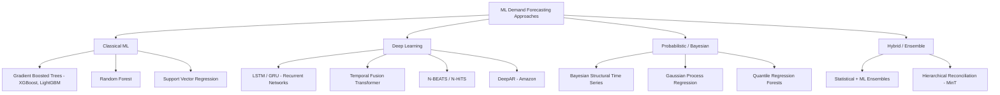

## Machine learning approaches to demand forecasting


### Overview

Machine learning (ML) approaches to demand forecasting extend beyond classical statistical methods (moving averages, exponential smoothing, ARIMA) by learning complex, non-linear relationships between demand and a wider feature set — promotions, weather, pricing, macroeconomic indicators, cross-SKU cannibalization, and hierarchical/spatial dependencies. For safety stock calculus specifically, ML forecasts matter not just for their point-forecast accuracy but for producing **calibrated uncertainty estimates**, since $\sigma_D$ (demand variability) feeds directly into the safety stock formula.

### Why ML Over Classical Statistical Methods

Classical methods (e.g., Holt-Winters, ARIMA) assume relatively stable, linear, and often single-variable time structures. ML approaches are preferred when:

- Demand is influenced by many exogenous variables (price, promotions, competitor actions, weather)
- Strong cross-item or cross-location interactions exist (substitution, cannibalization)
- Data volume is high enough to support model complexity (thousands of SKUs, long histories)
- Intermittent or lumpy demand patterns break classical smoothing assumptions

Classical methods remain preferable for low-volume, stable-demand SKUs where ML offers no meaningful accuracy gain and adds unnecessary operational complexity — a key judgment call in production forecasting systems.

### Taxonomy of ML Approaches



### Classical ML Methods

**Gradient Boosted Trees (XGBoost, LightGBM, CatBoost)**

The dominant approach in industry forecasting competitions (e.g., M5 competition winners were predominantly LightGBM-based). Demand forecasting is reframed as a supervised regression problem using engineered features:

- Lag features: $D_{t-1}, D_{t-7}, D_{t-28}$
- Rolling statistics: rolling mean/std over 7, 14, 28-day windows
- Calendar features: day-of-week, holiday flags, month
- Price and promotion flags
- Categorical embeddings for SKU/store/category

**Key Points**

- Handles tabular, mixed-type features natively (no need to force everything into a sequence)
- Fast to train and interpret via feature importance / SHAP values
- Requires manual feature engineering — does not learn temporal structure automatically
- Quantile loss objectives (`pinball loss`) can be used directly to produce prediction intervals for safety stock $\sigma_D$ estimation

```python
import lightgbm as lgb

# Quantile regression for demand uncertainty (feeds safety stock calc)
params = {
    "objective": "quantile",
    "alpha": 0.95,  # upper quantile for high service level target
    "metric": "quantile",
}

model_upper = lgb.train(params, train_set, num_boost_round=500)
model_median = lgb.train({**params, "alpha": 0.5}, train_set, num_boost_round=500)

# Forecast interval width approximates demand uncertainty for SS calculation
upper_forecast = model_upper.predict(X_test)
median_forecast = model_median.predict(X_test)
implied_sigma = (upper_forecast - median_forecast) / 1.645  # z for 95th percentile
```

### Deep Learning Methods

**LSTM / GRU (Recurrent Neural Networks)**

Learn temporal dependencies directly from sequences without manual lag feature engineering. Effective for long historical sequences with complex seasonality, but require substantially more data and tuning than tree-based methods to outperform them.

**Temporal Fusion Transformer (TFT)**

A transformer-based architecture (Lim et al., 2019) purpose-built for multi-horizon forecasting with mixed static, known-future (e.g., planned promotions), and observed-past inputs. Natively outputs quantile forecasts, making it well-suited to safety stock applications requiring full predictive distributions rather than point estimates.

**DeepAR (Amazon)**

An autoregressive RNN that produces probabilistic forecasts by learning a parametric distribution (e.g., negative binomial for count data, appropriate for unit-sales demand) rather than a single point estimate. Particularly effective for forecasting many related time series jointly (global model across thousands of SKUs), which lets it borrow statistical strength from high-volume SKUs to improve forecasts for low-volume/intermittent SKUs — a known weakness of per-SKU classical models.

**N-BEATS / N-HiTS**

Pure deep learning architectures (no recurrence, feed-forward + basis expansion) designed specifically for univariate time series forecasting, competitive with or exceeding statistical methods in benchmark competitions (M3, M4) without hand-crafted features.

### Probabilistic Forecasting for Safety Stock

Since safety stock requires the *distribution* of demand (not just the mean), probabilistic forecasting methods are directly relevant:

$$SS = z \cdot \sigma_{D,LT}$$

Where $\sigma_{D,LT}$ should ideally come from a model's predictive distribution rather than a historical standard deviation assumption of normality. Methods that natively output distributions:

- **Quantile regression** (LightGBM, TFT): outputs $P_{10}, P_{50}, P_{90}$, etc. directly
- **DeepAR**: parametric distribution output (negative binomial, Student-t, etc.)
- **Bayesian Structural Time Series**: full posterior distribution over forecasts via MCMC or variational inference
- **Conformal prediction**: a model-agnostic wrapper that calibrates prediction intervals to guarantee coverage, regardless of underlying model choice

Using distributional forecasts instead of a fixed normality assumption is particularly important for **intermittent demand** SKUs (many zero-demand periods), where the normal distribution assumption underlying the classical safety stock formula breaks down badly. Methods like the **Croston's method**, **TSB (Teunter-Syntetos-Babai)**, or ML-based zero-inflated models (e.g., zero-inflated Poisson regression) are more appropriate.

### Hierarchical Reconciliation

Demand forecasts are often needed at multiple aggregation levels simultaneously (SKU-store, SKU-region, category-total) for different planning purposes. Independently forecasting each level produces inconsistent totals. **MinT (Minimum Trace) reconciliation** and related methods adjust base forecasts across the hierarchy to be coherent (child-level forecasts sum to parent-level forecasts) while minimizing total forecast variance — directly relevant when safety stock is computed at SKU-location level but reviewed at aggregate levels by planners.

### Feature Engineering Considerations

| Feature Category | Examples | Notes |
| --- | --- | --- |
| Temporal | day-of-week, month, holiday proximity | Cyclical encoding (sin/cos) often outperforms raw integers |
| Lag/rolling | lag-1, lag-7, rolling mean/std | Risk of data leakage if computed incorrectly across train/test split |
| Price/promo | discount %, promo flag, promo type | Often the strongest predictors for retail demand spikes |
| Exogenous | weather, local events, macroeconomic indices | Requires external data pipelines/integration |
| Hierarchical | category, store cluster, region | Enables partial pooling / hierarchical models |
| Censoring flag | stockout indicator | Critical — prevents learning from artificially suppressed demand |

### Model Evaluation Metrics

Standard point-forecast accuracy metrics are necessary but insufficient for safety stock applications:

- **MAPE / WAPE**: point accuracy, but unstable for intermittent/low-volume demand
- **RMSE**: penalizes large errors, sensitive to outliers
- **Pinball loss (quantile loss)**: evaluates the *quantile* forecasts directly relevant to safety stock
- **Coverage probability**: does the 95% prediction interval actually contain the true value ~95% of the time? Critical for validating whether $\sigma_D$ estimates are trustworthy for safety stock sizing
- **CRPS (Continuous Ranked Probability Score)**: evaluates the full predictive distribution, not just a point or single quantile

### Practical Implementation Pattern


**Backtesting with rolling-origin evaluation** (retraining/re-evaluating across multiple historical cutoff points) is essential — a single train/test split understates real-world variance and can produce an overconfident $\sigma_D$ estimate, which in turn understates required safety stock.

### Common Pitfalls

- **Data leakage**: using future information (e.g., a rolling feature computed over a window that includes the target period) inflates apparent accuracy but fails in production
- **Ignoring intermittency**: applying standard regression loss (MSE) to sparse, intermittent demand tends to bias forecasts toward zero; specialized loss functions or Croston-family methods are more appropriate
- **Treating point forecasts as sufficient for safety stock**: safety stock needs the *spread*, not just the central estimate — a highly accurate point forecast from an ML model doesn't eliminate the need for proper uncertainty quantification
- **Not correcting for censored demand**: as with classical methods, historical stockouts must be flagged/corrected before training, or the model will learn suppressed demand as if it were true demand
- **Over-engineering for low-value SKUs**: deep learning models applied uniformly across an entire catalog often underperform simpler segmented approaches (ML for high-volume/complex SKUs, classical methods for stable/low-volume ones) [Inference: optimal segmentation thresholds are dataset-dependent and require empirical validation].

**Related Topics**

- Croston's method and intermittent demand forecasting
- Conformal prediction for model-agnostic uncertainty quantification
- Hierarchical time series reconciliation (MinT)
- Feature store architecture for forecasting pipelines
- MLOps for forecast model retraining and drift detection
- Integrating ML forecast uncertainty directly into dynamic safety stock formulas