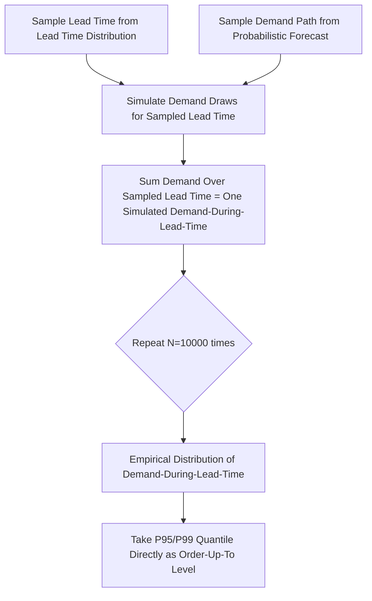

## Probabilistic and quantile-based forecasting for safety stock

### Overview

Probabilistic and quantile-based forecasting produces a full predictive distribution (or a set of quantiles) for future demand, rather than a single point estimate. This directly addresses the core input requirement of safety stock calculus: safety stock exists to buffer against *demand and lead time uncertainty*, so the quality of that buffer is bounded by how well the underlying uncertainty is estimated. Point forecasts paired with an assumed normal distribution and a historical standard deviation are a special case of this broader family — probabilistic methods generalize and often improve on that assumption.

### The Core Problem With Point Forecasts + Assumed Normality

The classical safety stock formula:

$$SS = z \cdot \sigma_{D,LT}$$

implicitly assumes demand-during-lead-time is normally distributed and that $\sigma_{D,LT}$ is a stable, correctly-estimated parameter. This breaks down when:

- Demand is **intermittent** (many zero periods) — the normal distribution assigns non-trivial probability to negative demand, which is nonsensical
- Demand is **right-skewed** (occasional large orders) — a symmetric normal distribution underestimates the upper tail, understating required safety stock
- $\sigma_{D,LT}$ is estimated from limited historical data and is itself uncertain
- Lead time variability and demand variability are correlated (e.g., supplier delays correlate with demand surges during shortages)

Probabilistic forecasting replaces the point-estimate-plus-assumed-distribution approach with a **directly estimated distribution**, sidestepping these assumptions.

### Quantile-Based Forecasting

Rather than predicting the mean, quantile forecasting predicts specific percentiles of the demand distribution directly — e.g., $P_{50}$ (median), $P_{90}$, $P_{95}$, $P_{99}$.

**Direct link to safety stock via service level**: A target **cycle service level** (probability of not stocking out during lead time) of 95% corresponds directly to using the $P_{95}$ quantile forecast of demand-during-lead-time as the **order-up-to level**, with safety stock as:

$$SS = P_{95}(\text{Demand}_{LT}) - \hat{D}_{LT}$$

This is a *distribution-free* formulation — no normality assumption required — and is generally preferred when the demand distribution is known or suspected to be non-normal.

**Pinball Loss (Quantile Loss)**

Quantile regression models are trained using pinball loss, which asymmetrically penalizes over- and under-prediction depending on the target quantile $\tau$:

$$L_\tau(y, \hat{y}) = \begin{cases} \tau (y - \hat{y}) & \text{if } y \geq \hat{y} \\ (1-\tau)(\hat{y} - y) & \text{if } y < \hat{y} \end{cases}$$

For $\tau = 0.95$, under-predicting is penalized 19x more heavily than over-predicting — directly encoding the asymmetric cost structure of stockouts vs. overstock that safety stock is designed to manage.

```python
import lightgbm as lgb
import numpy as np

quantiles = [0.5, 0.90, 0.95, 0.99]
models = {}

for q in quantiles:
    params = {
        "objective": "quantile",
        "alpha": q,
        "metric": "quantile",
        "learning_rate": 0.05,
    }
    models[q] = lgb.train(params, train_set, num_boost_round=500)

forecasts = {q: models[q].predict(X_test) for q in quantiles}

# Safety stock at 95% service level, distribution-free
safety_stock_95 = forecasts[0.95] - forecasts[0.5]
```

**Key Points**

- Quantile crossing (e.g., predicted $P_{90}$ < predicted $P_{50}$ for some observations) is a known artifact of training independent quantile models; monotonicity can be enforced post-hoc (isotonic sorting) or via joint quantile architectures
- Quantile forecasts are inherently distribution-free — no assumption about the shape of demand is needed
- Multiple quantiles can be produced from a single model architecture (e.g., TFT, DeepAR) rather than training separate models per quantile

### Probabilistic (Distributional) Forecasting

Rather than predicting discrete quantiles, distributional forecasting predicts the **parameters of a full probability distribution** for each forecast, from which any quantile, the full CDF, or simulated demand-during-lead-time can be derived.

**Common distributions used for demand:**

| Distribution | Use Case | Notes |
| --- | --- | --- |
| Normal | High-volume, smooth demand | Classical assumption; often poor fit for retail SKUs |
| Negative Binomial | Count/unit-sales demand, overdispersed | Used by DeepAR by default for retail demand |
| Poisson | Low-volume, non-overdispersed count demand | Mean = variance assumption often violated in practice |
| Tweedie | Demand with a probability mass at zero plus continuous positive tail | Common in insurance/claims, applicable to intermittent demand |
| Student-t | Demand with heavier tails than normal | Robust to outlier demand spikes |

**DeepAR** (Amazon, via GluonTS) is a widely used implementation: an autoregressive RNN trained to output the parameters (e.g., mean and dispersion) of a chosen distribution at each time step, trained via maximum likelihood across many related time series jointly.

```python
# Conceptual DeepAR-style probabilistic forecast usage (GluonTS)
from gluonts.torch.model.deepar import DeepAREstimator
from gluonts.mx.distribution import NegativeBinomialOutput

estimator = DeepAREstimator(
    freq="D",
    prediction_length=14,  # matches lead time
    distr_output=NegativeBinomialOutput(),
    trainer_kwargs={"max_epochs": 50},
)

predictor = estimator.train(training_data=train_dataset)
forecasts = list(predictor.predict(test_dataset))

# Each forecast object contains full sample paths
sample_paths = forecasts[0].samples  # shape: (num_samples, prediction_length)
demand_during_lead_time = sample_paths.sum(axis=1)  # sum over lead time horizon

safety_stock = np.percentile(demand_during_lead_time, 95) - np.mean(demand_during_lead_time)
```

**Advantage of sample-path outputs**: Summing sample paths over the lead time window (rather than using a closed-form aggregation of per-period distributions) correctly captures autocorrelation in demand across the lead time — a detail that simple $\sigma_{LT} = \sigma_D \sqrt{L}$ scaling assumes away (that scaling assumes independent, identically distributed daily demand, which is frequently violated in practice, e.g., under weekly seasonality).

### Joint Demand-Lead-Time Uncertainty

A more complete probabilistic approach models demand and lead time uncertainty jointly rather than combining separately-estimated point/variance estimates via the standard formula:

$$\sigma_{D,LT} = \sqrt{L \cdot \sigma_D^2 + \hat{D}^2 \cdot \sigma_L^2}$$

Monte Carlo simulation is a common practical technique:



This avoids the independence and normality assumptions baked into the closed-form formula and correctly propagates correlation between demand and lead time when historical data suggests it exists (e.g., supplier lead times lengthening during high-demand periods).

### Conformal Prediction

**Conformal prediction** is a model-agnostic framework for producing prediction intervals with a formal coverage guarantee, regardless of the underlying point-forecast model's error distribution. Given any base forecaster, conformal methods calibrate intervals using a held-out calibration set so that, e.g., a 95% interval empirically contains the true value ~95% of the time — without assuming normality or any particular error distribution.

**Key Points**

- Particularly valuable when the base model (e.g., a gradient-boosted point forecaster) has no native uncertainty output
- **Adaptive Conformal Inference (ACI)** extends this to non-stationary time series by adjusting interval width online as forecast errors are observed, relevant for demand patterns that shift over time
- Provides a practical bridge for organizations with existing point-forecast infrastructure to obtain calibrated safety-stock-ready uncertainty estimates without retraining a fully probabilistic model

### Evaluating Probabilistic Forecast Quality

Point-forecast metrics (MAPE, RMSE) do not evaluate distributional calibration. Relevant metrics:

- **Pinball loss**: evaluates individual quantile forecasts
- **CRPS (Continuous Ranked Probability Score)**: evaluates the entire predictive distribution against the observed outcome; generalizes MAE to distributional forecasts
- **Coverage probability**: for a nominal 95% interval, what fraction of actual observations fall within it empirically? Systematic under-coverage means safety stock computed from that interval will be too low
- **PIT (Probability Integral Transform) histogram**: if forecasts are well-calibrated, the PIT values should be uniformly distributed; a skewed PIT histogram reveals systematic over/under-confidence

**Example**

A model reporting a $P_{95}$ demand-during-lead-time forecast should, when backtested over many periods, show actual demand exceeding that forecast in approximately 5% of periods. If actual exceedance occurs in 15% of periods, the model's tails are too thin, and safety stock derived from it will be systematically insufficient — this is a critical validation step before deploying any probabilistic forecast into a safety stock formula.

### Practical Considerations for Deployment

- **Sample size sensitivity**: probabilistic models, especially deep learning variants, require substantially more historical data to estimate distributional parameters reliably than point-forecast models; for sparse-history SKUs, hierarchical/global models (pooling across many SKUs) are preferable to per-SKU distributional fits
- **Computational cost**: sample-path-based methods (Monte Carlo, DeepAR sampling) are more expensive at inference time than closed-form point forecasts — relevant when recalculating safety stock across tens of thousands of SKU-location combinations on a daily cadence
- **Interpretability for planners**: presenting a full distribution or 10,000 Monte Carlo samples is less immediately actionable for a human planner than a single safety stock number; production systems typically surface the derived safety stock/reorder point while retaining the full distribution for auditability and diagnostics
- **Recalibration cadence**: predictive distributions, like point forecasts, drift as underlying demand patterns change; coverage should be monitored on a rolling basis and models/conformal calibration sets refreshed accordingly [Inference: optimal recalibration frequency depends on demand volatility and is not standardized across implementations]

**Related Topics**

- Monte Carlo simulation for joint demand/lead-time risk pooling
- Multi-echelon safety stock optimization under correlated uncertainty
- Newsvendor model as the theoretical foundation for quantile-based stocking decisions
- Conformal prediction and Adaptive Conformal Inference for non-stationary demand
- Service-level-driven vs. cost-driven safety stock optimization
- Calibration monitoring and drift detection for probabilistic forecast pipelines