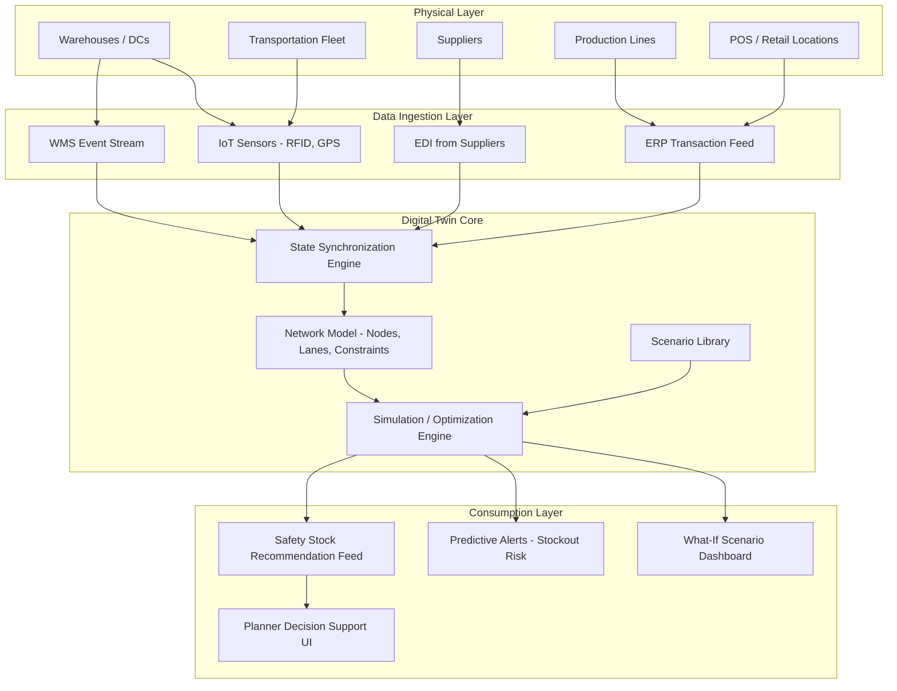

## Digital twins for supply chain simulation


### Overview

A digital twin, in the supply chain context, is a live, data-synchronized virtual model of a physical supply chain network — warehouses, transportation lanes, suppliers, production facilities, and inventory positions — that mirrors the real system's current state and can be used to simulate future scenarios before committing to them in the physical world. Unlike a static simulation model built once and run periodically, a digital twin is continuously updated from real operational data (ERP transactions, IoT sensor feeds, WMS events), making its simulations reflect actual current conditions rather than a stale snapshot.

### Digital Twin vs. Traditional Simulation

| Dimension | Traditional Simulation | Digital Twin |
| --- | --- | --- |
| Data source | Historical/assumed inputs, run periodically | Continuous live feed from operational systems |
| State | Static snapshot at time of model build | Synchronized with real-time or near-real-time actual state |
| Purpose | What-if analysis, network design | What-if analysis + live monitoring + predictive alerts |
| Update cadence | Manual rebuild | Automated, event-driven or scheduled sync |
| Typical use | Strategic network design (annual/quarterly) | Both strategic and operational/tactical (daily/real-time) |

The distinguishing feature relevant to inventory management is that a digital twin can answer "if I place this order today, given current actual inventory, in-transit shipments, and supplier lead time performance, what happens to my safety stock coverage over the next N weeks?" — a question requiring live data that a periodically-rebuilt simulation cannot answer accurately.

### Architecture



### Core Components

**1. State Synchronization Engine**

Ingests events from physical/transactional systems and updates the twin's internal representation of current inventory positions, in-transit quantities, supplier status, and demand signals. Typically built on the same event-driven integration patterns used elsewhere in inventory systems (message buses, CDC — change data capture — from ERP databases).

**2. Network Model**

A structured representation of the physical network topology: nodes (DCs, stores, suppliers, plants), edges (transportation lanes with lead time and cost attributes), and constraints (capacity limits, MOQs, transportation mode availability). This is the "twin" itself — a graph/network abstraction of the real system.

**3. Simulation / Optimization Engine**

Executes scenarios against the current (or hypothetical future) state. Common engine types:

- **Discrete-event simulation (DES)**: models the system as a sequence of discrete events (order placed, shipment arrives, stockout occurs) — well-suited to capturing queueing, batching, and stochastic lead time effects
- **Agent-based modeling (ABM)**: models individual entities (a store, a supplier, a truck) as autonomous agents with local decision rules, useful for capturing emergent network behavior (e.g., bullwhip effect propagation)
- **Monte Carlo simulation**: runs many stochastic realizations of demand/lead time to build a distribution of outcomes (directly relevant to safety stock sizing under uncertainty, as discussed in probabilistic forecasting)
- **Optimization solvers** (linear/mixed-integer programming): embedded to answer "what is the optimal reallocation given current constraints," not just "what happens if."

**4. Scenario Library**

Reusable, parameterized scenario definitions planners can invoke against the live twin state — e.g., "supplier X lead time +10 days," "demand spike +30% in region Y," "DC Z capacity reduced by 20%."

### Relevance to Safety Stock and Inventory Decisions

Digital twins allow safety stock policies to be **stress-tested against live conditions** rather than validated only against historical averages:

**Example scenario workflow:**

1. Current state: SKU A has safety stock of 500 units at DC-3, computed from historical $\sigma_{D,LT}$
2. Live twin ingests a supplier delay alert: actual lead time for the next PO has increased from 14 to 21 days
3. Planner runs a what-if simulation: "recompute stockout probability over the next 21 days given current on-hand, in-transit, and updated lead time distribution"
4. Twin's simulation engine (using Monte Carlo demand sampling, as in probabilistic forecasting approaches) outputs an updated stockout probability and a **revised safety stock recommendation** reflecting the new lead time reality
5. Planner accepts or overrides the recommendation, which flows back into the execution-layer reorder point

This is functionally the closed-loop integration architecture (forecasting → planning → execution → feedback) described earlier, but the digital twin adds an explicit **simulation/what-if layer** on top of that loop rather than only reactive recalculation.

### Network-Level Use Cases Beyond Single-SKU Safety Stock

- **Multi-echelon inventory optimization (MEIO)**: simulating how safety stock at one echelon (e.g., regional DC) interacts with safety stock at another (store level) under shared risk pooling
- **Disruption response planning**: simulating the network-wide impact of a supplier outage, port closure, or transportation disruption before it happens, to pre-position safety stock or identify alternate sourcing
- **Network design**: evaluating whether adding/relocating a DC changes optimal safety stock distribution across the network
- **Capacity constraint modeling**: simulating whether current safety stock policies are physically achievable given warehouse storage capacity constraints

### Implementation Approaches

**Commercial platforms**: Supply chain-specific digital twin platforms (e.g., o9 Solutions, Blue Yonder Luminate, Kinaxis RapidResponse, SAP Integrated Business Planning) provide pre-built network modeling and simulation engines with ERP connectors, reducing custom integration work at the cost of vendor lock-in and licensing cost.

**Custom-built approach**: For organizations with specific network topology or algorithmic requirements not well-served by commercial platforms:

- Network modeling: graph libraries (NetworkX, or graph databases like Neo4j for larger networks)
- Simulation engine: SimPy (discrete-event simulation in Python) or Mesa (agent-based modeling in Python) for custom logic
- State sync: event-driven architecture as described in the systems integration material — CDC tools (Debezium) reading from ERP databases, feeding a message bus (Kafka)
- Optimization: OR-Tools, Gurobi, or CPLEX for embedded network optimization scenarios

```python
# Simplified conceptual sketch: SimPy-based digital twin stockout simulation
import simpy
import numpy as np

def dc_process(env, inventory, demand_dist, lead_time_dist, reorder_point, order_qty):
    while True:
        # Simulate daily demand draw
        daily_demand = demand_dist()
        inventory['on_hand'] -= daily_demand
        if inventory['on_hand'] < 0:
            inventory['stockout_days'] += 1
            inventory['on_hand'] = 0

        # Reorder trigger
        if inventory['on_hand'] <= reorder_point and not inventory['on_order']:
            inventory['on_order'] = True
            lead_time = lead_time_dist()  # live-calibrated from twin's synced data
            env.process(receive_order(env, inventory, lead_time, order_qty))

        yield env.timeout(1)  # advance one day

def receive_order(env, inventory, lead_time, order_qty):
    yield env.timeout(lead_time)
    inventory['on_hand'] += order_qty
    inventory['on_order'] = False

# Run many replications to build stockout probability distribution
# under CURRENT twin-synced lead time distribution (e.g., updated to reflect
# a live supplier delay signal rather than a stale historical average)
```

This illustrates the underlying simulation logic pattern; a production digital twin wraps this kind of engine with live state synchronization, a scenario management UI, and integration back into planning systems. [Inference: specific engine choice and architecture vary significantly by organization scale and existing tooling — no single reference architecture is standard across the industry.]

### Common Pitfalls

- **Stale twin state**: if data synchronization lags significantly behind the physical system, the "digital twin" degenerates into a traditional periodic simulation while still carrying the operational cost/complexity of a live system
- **Over-scoped initial build**: attempting to model an entire multi-echelon global network in the first implementation, rather than starting with a bounded scope (single DC, single product category) and expanding incrementally
- **Model-reality drift**: network model parameters (lead times, capacity, cost) not being kept current as the physical network changes (new suppliers, new lanes), causing simulation outputs to diverge from achievable reality
- **Treating simulation output as certain**: stockout probabilities and safety stock recommendations from Monte Carlo-based twins are themselves estimates with sampling uncertainty; presenting them without confidence bounds can create false precision in planner decision-making
- **Underestimating integration effort**: the simulation/optimization engine is often the smaller engineering effort compared to building and maintaining reliable real-time data synchronization across heterogeneous source systems

**Related Topics**

- Discrete-event simulation (DES) fundamentals for supply chain modeling
- Multi-echelon inventory optimization (MEIO) under network risk pooling
- Change data capture (CDC) architectures for real-time ERP synchronization
- Agent-based modeling for bullwhip effect and disruption propagation analysis
- Scenario planning and stress-testing frameworks for supply chain resilience
- Integrating digital twin outputs back into dynamic safety stock policy engines