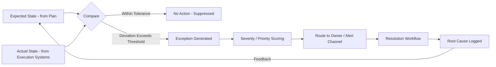
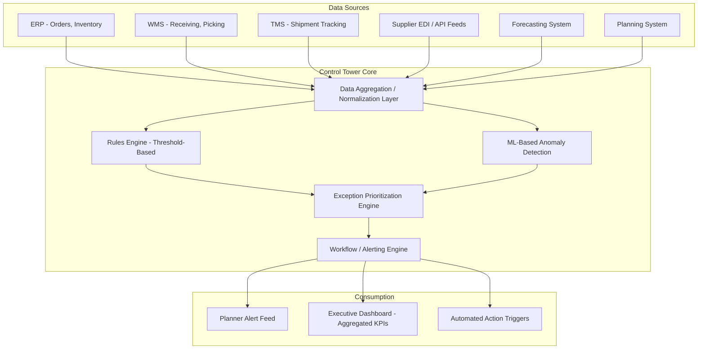
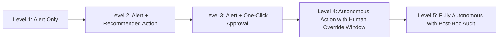
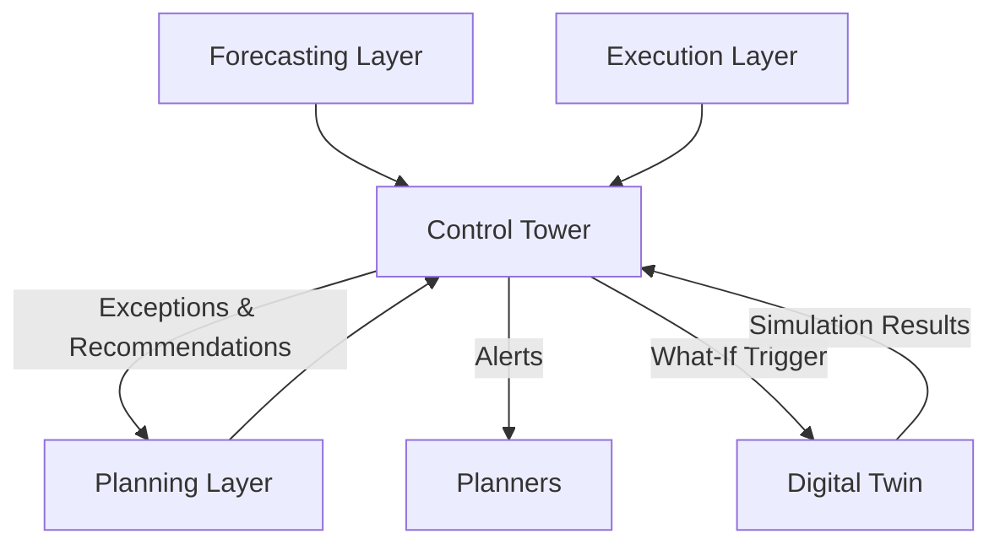

## Control towers and real-time exception management

### Overview

A supply chain **control tower** is a centralized (logically, not necessarily physically) monitoring and decision-support layer that aggregates real-time data across forecasting, planning, and execution systems to provide end-to-end visibility, and — critically — to detect and surface **exceptions**: deviations from plan that require human or automated intervention. Where a digital twin answers "what would happen if," a control tower answers "what is happening right now, and what deviates from what should be happening." The two are complementary: a control tower's exception detection often triggers the what-if scenarios run inside a digital twin.

### Core Function: Exception Management, Not Just Dashboards

A common misconception is that a control tower is simply a reporting dashboard. Its defining architectural feature is **exception-based management**: rather than requiring planners to continuously monitor every SKU-location combination, the system computes expected states, compares them against actual states, and surfaces only the deviations that exceed a materiality threshold — inverting the planner's workload from "scan everything" to "review what's flagged."



### Relevance to Safety Stock and Inventory Decisions

Control towers surface the specific conditions under which safety stock assumptions are being violated in real time:

- **Lead time exception**: a PO's actual transit time is tracking beyond the historical distribution used to compute $\sigma_L$, flagged before the shipment even arrives late
- **Demand exception**: actual sell-through is deviating from forecast beyond the confidence interval used to compute $\sigma_D$
- **Inventory position exception**: on-hand + in-transit has fallen below the reorder point without a corresponding replenishment order having been triggered (a process failure, not a demand/supply failure)
- **Supplier exception**: a supplier's fill rate or on-time-in-full (OTIF) performance has degraded, which should feed back into that supplier's lead time variability estimate used in safety stock calculations

**Example**

If safety stock for SKU A was computed assuming a 14-day lead time with $\sigma_L = 2$ days, and the control tower detects the current in-transit shipment is on day 19 with no delivery confirmation, this is a live signal that the lead time distribution feeding safety stock is stale or that a stockout risk has materialized *before* it shows up as an actual stockout — enabling proactive action (expedite shipping, temporary reorder point increase, allocate from another DC) rather than reactive stockout response.

### Architecture



### Exception Detection Approaches

**1. Rules-Based / Threshold Detection**

Static or parameterized thresholds define exception conditions:

```python
# Simplified rules-based exception detection
def check_inventory_exceptions(sku_location_state, thresholds):
    exceptions = []

    if sku_location_state['on_hand'] < sku_location_state['safety_stock']:
        exceptions.append({
            "type": "BELOW_SAFETY_STOCK",
            "severity": "high",
            "sku": sku_location_state['sku'],
            "location": sku_location_state['location']
        })

    lead_time_zscore = (
        (sku_location_state['current_transit_days'] - sku_location_state['mean_lead_time'])
        / sku_location_state['std_lead_time']
    )
    if lead_time_zscore > thresholds['lead_time_zscore_threshold']:
        exceptions.append({
            "type": "LEAD_TIME_ANOMALY",
            "severity": "medium",
            "zscore": lead_time_zscore,
            "sku": sku_location_state['sku']
        })

    demand_error = abs(
        sku_location_state['actual_demand'] - sku_location_state['forecast_demand']
    ) / sku_location_state['forecast_std']
    if demand_error > thresholds['demand_deviation_threshold']:
        exceptions.append({
            "type": "FORECAST_DEVIATION",
            "severity": "medium",
            "sku": sku_location_state['sku']
        })

    return exceptions
```

**Key Points**

- Simple to implement and explain to business stakeholders
- Threshold tuning is a persistent operational burden — too sensitive generates alert fatigue, too loose misses genuine issues
- Does not adapt automatically to changing demand/supply patterns

**2. ML-Based Anomaly Detection**

Statistical or ML models learn "normal" behavior patterns and flag statistically significant deviations without requiring manually-set thresholds for every metric:

- **Time series anomaly detection**: methods like STL decomposition residual analysis, Prophet's anomaly detection extensions, or isolation forests applied to residuals between expected and actual values
- **Multivariate anomaly detection**: autoencoders or clustering-based methods (e.g., isolation forest, one-class SVM) that flag unusual combinations of features (e.g., normal demand but abnormal combination of demand + price + weather)

**3. Predictive Exception Detection**

The most advanced pattern: rather than detecting an exception after a threshold is crossed, predicting the *probability* that a threshold will be crossed in the near future, enabling earlier intervention. This is where control towers and probabilistic forecasting/digital twin simulation converge — e.g., running a Monte Carlo projection of current inventory trajectory to estimate stockout probability over the next 7 days, and alerting when that probability crosses a materiality threshold, rather than waiting for on-hand to actually fall below the reorder point.

### Exception Prioritization

Not all exceptions warrant equal attention. A prioritization layer typically scores exceptions on:

| Factor | Example |
| --- | --- |
| Financial impact | Revenue at risk from potential stockout (SKU velocity × price) |
| Customer impact | Service-critical SKU vs. long-tail item |
| Time sensitivity | Days until projected stockout vs. weeks |
| Confidence | Statistical confidence that the deviation is real vs. noise |
| Actionability | Whether an intervention is actually available (e.g., alternate supplier exists) |

This produces a ranked queue rather than an undifferentiated alert stream — essential for control towers to remain usable at scale (thousands of SKU-location combinations generating potential exceptions daily).

### Resolution Workflows and Automation

Control towers range along a spectrum from purely informational to increasingly autonomous:



- **Level 1-2**: planner receives alert and recommendation (e.g., "expedite this PO" or "increase reorder point temporarily"), decides manually
- **Level 3**: planner reviews a pre-computed recommended action and approves/rejects with minimal friction
- **Level 4-5**: system executes routine, low-risk actions automatically (e.g., auto-expediting a shipment already flagged as a control-tower exception, within pre-approved cost/policy bounds), reserving human review for high-impact or ambiguous cases

Most production control tower implementations operate at Level 2-3 for high-impact decisions (safety stock policy changes, supplier switches) while allowing Level 4-5 automation for narrowly-scoped, low-risk, high-frequency actions.

### Integration With the Broader Inventory System Stack

The control tower sits logically alongside, not beneath, the forecasting/planning/execution integration architecture — it is a cross-cutting observability and alerting layer that consumes from all three:



### Implementation Approaches

**Commercial platforms**: Purpose-built control tower solutions (e.g., project44, FourKites for transportation visibility; Kinaxis, o9, Blue Yonder for broader supply chain control towers) provide pre-built connectors to common ERP/TMS/WMS systems and pre-configured exception libraries.

**Custom-built approach**: For organizations building in-house:

- Stream processing for real-time comparison logic: Apache Flink, Kafka Streams, or Spark Structured Streaming
- Anomaly detection: scikit-learn (isolation forest, one-class SVM) or Prophet/statsmodels for time-series-specific detection
- Alerting/workflow: integration with existing tools (Slack, PagerDuty-style routing, or a custom workflow engine) rather than building alerting infrastructure from scratch
- Dashboard layer: Grafana, custom React dashboards, or BI tools (Looker, Tableau) with drill-down into exception detail

### Common Pitfalls

- **Alert fatigue from poorly tuned thresholds**: if exception rates are too high, planners begin ignoring alerts entirely, defeating the purpose of exception-based management — threshold/model tuning is an ongoing operational responsibility, not a one-time setup task
- **No feedback loop on resolution outcomes**: if resolved exceptions and their root causes aren't logged and fed back into forecasting/planning parameters (e.g., a recurring lead time exception for a specific supplier should eventually update that supplier's lead time distribution), the control tower remains purely reactive rather than improving the underlying plan quality over time
- **Siloed control towers**: building separate exception systems for transportation, inventory, and supplier management independently, rather than a unified view — this recreates the fragmentation the control tower is meant to solve
- **Treating recommendations as decisions**: particularly at automation levels 4-5, insufficiently tested automated actions can compound problems (e.g., auto-expediting shipments during a systemic disruption faster than can be validated, driving up cost without addressing root cause)
- **Underinvesting in data quality at the source**: a control tower's exception detection is only as reliable as the underlying data feeds — inconsistent timestamps, delayed EDI updates, or unreliable IoT sensor data produce false exceptions that erode trust in the system faster than missing true exceptions does [Inference: relative severity of false positives vs. false negatives on user trust is organization-dependent and not universally quantified].

**Related Topics**

- Anomaly detection algorithms for multivariate operational time series (isolation forest, autoencoders)
- Stream processing architectures (Kafka Streams, Flink) for real-time exception detection
- Root cause analysis and feedback loops from exceptions into forecast/planning parameter updates
- Automation maturity models and human-in-the-loop decision governance
- Supplier performance scorecarding (OTIF, fill rate) as a control tower data source
- Integrating control tower exceptions with digital twin what-if simulation triggers