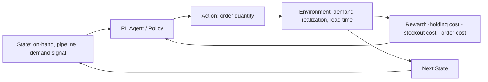

## Reinforcement learning for dynamic inventory policies

### Overview

Reinforcement learning (RL) frames inventory management as a sequential decision-making problem: an agent observes the current state of the system (inventory position, demand signals, pipeline orders) and chooses actions (how much to order) to maximize a long-run reward (e.g., negative total cost, comprising holding cost, stockout cost, and ordering cost). Unlike classical safety stock formulas or ML forecasting methods, which compute a *policy parameter* (a reorder point, a safety stock level) from estimated distributions, RL learns the **policy itself** — a function mapping states directly to ordering decisions — through trial-and-error interaction with an environment (real or simulated), optimizing for long-term cumulative reward rather than single-period forecast accuracy.

### Why RL for Inventory, and When It's Justified

Classical and ML-forecast-driven approaches decompose the problem: forecast demand → estimate uncertainty → apply a formula (safety stock, $(s,S)$ policy) to derive ordering decisions. This decomposition is optimal only under specific assumptions (e.g., stationary demand, no significant nonlinear cost structures, no complex multi-period dependencies). RL is relevant when those assumptions break down:

- **Non-stationary, complex demand-supply dynamics** that resist clean closed-form policy derivation
- **Multi-echelon, multi-product systems** with complex interactions (shared capacity, substitution effects, joint replenishment) where deriving an optimal policy analytically is computationally or mathematically intractable
- **Nonlinear or asymmetric cost structures** (e.g., stockout cost that scales nonlinearly with duration, or capacity-constrained ordering with quantity discounts) that don't fit cleanly into the classical newsvendor/safety-stock formula family
- **Sequential, path-dependent effects** where a decision now affects the optimal decision several periods later in ways a single-period formula can't capture (e.g., inventory pooling decisions with downstream cascading effects)

**Key Points**

- RL is *not* a universal replacement for classical safety stock methods — for stable, well-behaved single-SKU demand, a properly calibrated $(s,S)$ or $(R,Q)$ policy derived from probabilistic forecasting is often equally or more effective, more interpretable, and dramatically cheaper to develop and validate
- RL's comparative advantage grows with problem complexity: multi-echelon networks, joint replenishment across correlated SKUs, and dynamic environments with regime shifts are the domains where RL's flexibility pays off relative to its cost and opacity

### Formulating Inventory Management as an MDP

RL problems are formalized as a **Markov Decision Process (MDP)**: a tuple $(S, A, P, R, \gamma)$.

| MDP Component | Inventory Management Mapping |
| --- | --- |
| State $S$ | On-hand inventory, in-transit/pipeline orders, recent demand history, forecast signal, day-of-week/season, current lead time estimate |
| Action $A$ | Order quantity (continuous or discretized), or a policy parameter adjustment (e.g., "increase safety stock by X") |
| Transition $P$ | Stochastic — governed by the (unknown to the agent) demand and lead time distributions |
| Reward $R$ | Typically negative cost: $-(\text{holding cost} + \text{stockout cost} + \text{ordering cost})$ per period |
| Discount $\gamma$ | Weights future cost/reward relative to immediate cost, reflecting the multi-period nature of the problem |



### RL Algorithm Families Applied to Inventory

**1. Value-Based Methods (Q-Learning, DQN)**

Learn a value function $Q(s,a)$ estimating expected long-run reward for taking action $a$ in state $s$. Deep Q-Networks (DQN) extend this with a neural network approximator for large/continuous state spaces (e.g., encoding demand history and multiple SKU states).

**Key Points**

- Well-suited to discretized action spaces (e.g., order in fixed lot sizes)
- Less natural fit for continuous order quantities without discretization or extensions (e.g., DDPG, discussed below)

**2. Policy Gradient Methods (REINFORCE, PPO, A2C/A3C)**

Directly parameterize and optimize the ordering policy $\pi_\theta(a|s)$ via gradient ascent on expected reward. **Proximal Policy Optimization (PPO)** is the most commonly used in recent inventory RL research and industry pilots due to its training stability relative to earlier policy gradient methods.

**3. Actor-Critic and Continuous Control (DDPG, SAC, TD3)**

Combine a policy network (actor) with a value estimator (critic), well-suited to continuous action spaces — directly outputting a continuous order quantity rather than requiring discretization. **Soft Actor-Critic (SAC)** additionally incorporates an entropy bonus that encourages exploration, useful when the demand/supply environment has significant unmodeled uncertainty.

**4. Model-Based RL**

Learns an explicit model of the environment's dynamics (demand and lead time transition probabilities) and plans against that learned model, rather than being purely model-free (learning only from trial-and-error reward signal). More sample-efficient than model-free methods — relevant given that real-world inventory environments provide limited real interaction data (you cannot run millions of live ordering trials against a real supply chain).

### Training Environment: Simulation-First Approach

Because RL agents typically require large volumes of interaction (thousands to millions of episodes) to converge, training directly against a live physical supply chain is generally infeasible — the sample cost of "trying a bad ordering policy" in reality is a real stockout or real excess inventory cost. Production RL implementations train primarily in **simulation** (often the same simulation engine underlying a digital twin), then validate cautiously against live data before deployment.

```python
# Simplified custom Gym-style inventory environment
import gymnasium as gym
import numpy as np

class InventoryEnv(gym.Env):
    def __init__(self, demand_dist, lead_time_dist, holding_cost, stockout_cost, order_cost):
        self.demand_dist = demand_dist
        self.lead_time_dist = lead_time_dist
        self.holding_cost = holding_cost
        self.stockout_cost = stockout_cost
        self.order_cost = order_cost
        self.action_space = gym.spaces.Box(low=0, high=1000, shape=(1,))
        self.observation_space = gym.spaces.Box(low=0, high=np.inf, shape=(4,))
        self.reset()

    def reset(self, seed=None):
        self.on_hand = 100
        self.pipeline = []  # list of (arrival_day, quantity)
        self.day = 0
        return self._get_state(), {}

    def _get_state(self):
        pipeline_qty = sum(q for _, q in self.pipeline)
        return np.array([self.on_hand, pipeline_qty, self.day % 7, self.day % 365])

    def step(self, action):
        order_qty = max(0, action[0])
        if order_qty > 0:
            lead_time = self.lead_time_dist()
            self.pipeline.append((self.day + lead_time, order_qty))

        # Receive any arrivals due today
        arrivals = [q for (arrival, q) in self.pipeline if arrival == self.day]
        self.on_hand += sum(arrivals)
        self.pipeline = [(a, q) for (a, q) in self.pipeline if a != self.day]

        # Demand realization
        demand = self.demand_dist()
        stockout_qty = max(0, demand - self.on_hand)
        self.on_hand = max(0, self.on_hand - demand)

        # Reward: negative total cost
        cost = (self.holding_cost * self.on_hand
                + self.stockout_cost * stockout_qty
                + self.order_cost * (1 if order_qty > 0 else 0))
        reward = -cost

        self.day += 1
        terminated = self.day >= 365
        return self._get_state(), reward, terminated, False, {}
```

This environment can then be trained against using a standard RL library (Stable-Baselines3, RLlib):

```python
from stable_baselines3 import PPO

env = InventoryEnv(demand_dist, lead_time_dist,
                    holding_cost=1.0, stockout_cost=10.0, order_cost=50.0)
model = PPO("MlpPolicy", env, verbose=1)
model.learn(total_timesteps=500_000)
```

### The Sim-to-Real Gap

A central risk in RL for inventory: a policy trained in simulation is only as good as the simulation's fidelity to reality. If the simulated demand distribution, lead time distribution, or cost structure diverges from the real system, the learned policy can perform well in training but poorly in deployment — the **sim-to-real gap**, a well-documented challenge across RL applications generally, not specific to inventory.

**Mitigations:**

- **Domain randomization**: training across a wide range of simulated demand/lead time parameter values (rather than a single point estimate) so the learned policy generalizes better to real-world variation
- **Hybrid deployment**: initially deploying the RL policy in "shadow mode" (computing recommendations without executing them) alongside the existing policy, comparing outcomes before full cutover
- **Offline RL**: training directly on historical logged data (actual past states, actions, and outcomes) rather than a simulated environment, avoiding simulation fidelity issues entirely, at the cost of being limited to the range of actions actually explored historically (distributional shift risk when the learned policy recommends actions outside the historical data's coverage)
- **Continuous retraining/fine-tuning**: treating the deployed policy as a living system that is periodically retrained or fine-tuned against accumulating real deployment data

### Multi-Echelon and Multi-Product Extensions

RL's comparative advantage is most pronounced in settings that are difficult to solve analytically:

- **Multi-agent RL (MARL)**: each echelon (DC, regional warehouse, store) modeled as a separate agent, potentially with separate or shared reward structures, capturing decentralized decision-making with network-level interactions — directly relevant to multi-echelon safety stock problems where echelon-level policies interact
- **Joint replenishment**: a single RL policy managing ordering decisions across multiple correlated SKUs simultaneously (e.g., substitutable products, or products sharing a supplier with joint ordering cost efficiencies), which is difficult to formulate in closed form but natural as a multi-dimensional action space in RL

### Evaluation and Validation

Standard supervised learning validation (holdout accuracy) doesn't directly apply — RL policies must be evaluated on **cumulative reward/cost over simulated or held-out trajectories**, and ideally compared directly against the baseline policy (existing safety-stock-driven $(s,S)$ policy) on the same evaluation scenarios:

| Metric | What It Measures |
| --- | --- |
| Total cost over evaluation period | Direct comparison to baseline policy cost |
| Service level achieved | Whether the RL policy meets the same service level target as the baseline, not just lower average cost |
| Cost variance across episodes | Stability/robustness — a policy with lower average cost but higher variance may be undesirable from a risk perspective |
| Policy interpretability / auditability | Whether stakeholders can understand *why* the policy orders what it orders — often lower for RL than for a transparent $(s,S)$ formula, a real operational cost |

### Common Pitfalls

- **Reward function misspecification**: if holding cost, stockout cost, and ordering cost are not accurately reflected in the reward function, the learned policy optimizes for the wrong objective — this is frequently the dominant source of RL underperformance, more so than algorithm choice
- **Insufficient simulation fidelity**: as above, sim-to-real gap can cause a policy that appears excellent in training to underperform or fail in production
- **Treating RL as a black-box replacement without baseline comparison**: deploying an RL policy without a rigorous head-to-head comparison against the existing (often well-understood, cheap-to-maintain) safety-stock-based policy risks replacing an interpretable, auditable system with an opaque one for marginal or uncertain gains
- **Underestimating engineering/maintenance cost**: RL systems require ongoing simulation environment maintenance, retraining pipelines, and monitoring infrastructure substantially beyond what a classical formula-based system requires — this operational cost should be weighed against the complexity of the problem being solved [Inference: the complexity threshold at which RL becomes cost-justified is context-dependent and not established by a general industry consensus].
- **Non-stationarity during deployment**: a policy trained on historical dynamics may not adapt automatically to structural shifts (new product launch, changed supplier base) without explicit retraining triggers — RL does not inherently solve non-stationarity any more than other data-driven methods do.

**Related Topics**

- Multi-agent reinforcement learning (MARL) for multi-echelon network policies
- Offline RL and distributional shift in logged historical data
- Digital twin simulation environments as RL training grounds
- $(s,S)$ and $(R,Q)$ classical inventory policies as RL baselines
- Domain randomization techniques for sim-to-real transfer
- Reward shaping and cost function design for operational RL systems