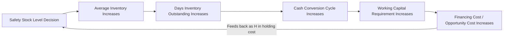

## Inventory on the balance sheet and cost of capital

### Overview

Inventory is a current asset on the balance sheet, but from a safety stock and inventory policy perspective, its financial treatment is not a passive accounting fact — it directly determines the true economic cost of holding safety stock, which in turn determines the correct trade-off point between stockout risk and holding cost in every safety stock formula. Understanding how inventory is valued, financed, and reflected in financial statements is a prerequisite for correctly parameterizing the holding cost term used throughout inventory optimization.

### Inventory on the Balance Sheet

Inventory appears as a current asset, typically broken into three sub-categories reflecting its position in the production/distribution pipeline:

| Category | Description |
| --- | --- |
| Raw materials | Inputs not yet entered production |
| Work-in-process (WIP) | Partially completed goods |
| Finished goods | Completed goods ready for sale |

For a distribution or retail operation (rather than a manufacturer), inventory is typically recorded as a single finished-goods-equivalent line, since raw materials/WIP categories don't apply.

**Valuation methods** determine the dollar value assigned to inventory on the balance sheet, and materially affect both the balance sheet and the cost of goods sold (COGS) on the income statement:

- **FIFO (First-In, First-Out)**: assumes oldest inventory is sold first; in inflationary periods, this understates COGS and overstates ending inventory value (and reported profit) relative to current replacement cost
- **LIFO (Last-In, First-Out)**: assumes newest inventory is sold first; in inflationary periods, this better matches COGS to current costs but understates balance sheet inventory value relative to replacement cost (permitted under US GAAP but disallowed under IFRS)
- **Weighted Average Cost**: smooths cost fluctuations across all units
- **Specific Identification**: tracks actual cost of each specific unit (common for high-value, low-volume items — e.g., vehicles, unique equipment)

**Lower of Cost or Market (LCM) / Net Realizable Value (NRV)**: Inventory must be written down if its market value falls below its recorded cost — directly relevant to obsolescence and excess inventory, since safety stock held far beyond its useful demand life becomes a write-down risk, not just a holding-cost expense.

### Why Balance Sheet Treatment Matters for Safety Stock Calculus

The standard safety stock formula treats holding cost as a per-unit, per-period parameter ($H$), but that parameter is not a single obvious number — it must be derived from the financial structure of how inventory is valued and financed:

$$\text{Total Annual Holding Cost} = H \cdot \bar{I}$$

where $\bar{I}$ is average inventory (safety stock plus cycle stock) and $H$ is the holding cost rate, typically expressed as a percentage of unit value per year. **Getting $H$ wrong is one of the most common practical errors in safety stock implementations** — organizations frequently use an arbitrary round number (e.g., "20% holding cost") without decomposing what that rate should actually represent.

### Components of the Holding Cost Rate

$$H = i_{capital} + i_{storage} + i_{obsolescence} + i_{insurance/tax} + i_{shrinkage}$$

| Component | Description |
| --- | --- |
| Cost of capital | Opportunity cost of capital tied up in inventory — see below |
| Storage/warehousing | Physical space, handling, utilities allocated per unit held |
| Obsolescence/spoilage | Expected value loss from inventory becoming unsellable (perishables, tech products, seasonal goods) |
| Insurance and taxes | Property tax and insurance premiums scaled to inventory value |
| Shrinkage | Theft, damage, and inventory record inaccuracy losses |

The **cost of capital component is typically the largest single driver** of total holding cost for most businesses, which is why it warrants specific attention in inventory financial modeling.

### Cost of Capital and Inventory Financing

Capital tied up in inventory is capital that cannot be deployed elsewhere (debt repayment, other investments, returned to shareholders). The relevant cost of capital concept is the **Weighted Average Cost of Capital (WACC)**:

$$WACC = \frac{E}{V} \cdot r_e + \frac{D}{V} \cdot r_d \cdot (1 - T)$$

Where $E$ = market value of equity, $D$ = market value of debt, $V = E + D$, $r_e$ = cost of equity, $r_d$ = cost of debt, and $T$ = corporate tax rate (debt's tax-deductibility of interest is reflected in the $(1-T)$ term).

**Key Points**

- Using WACC as the capital cost component of holding cost reflects the true opportunity cost: capital held in inventory earns nothing directly, but could otherwise fund activities expected to return at least WACC
- Some organizations use a simpler proxy (e.g., the firm's borrowing rate, or a hurdle rate set by finance) rather than full WACC — the important discipline is using a deliberate, finance-aligned rate rather than an arbitrary round number
- The capital cost component should be applied to the **fully landed cost** of inventory (purchase price + inbound freight + duties), not just the base unit purchase price, since that is the actual capital outlay being financed

### Working Capital and the Cash Conversion Cycle

Inventory is a central driver of the **Cash Conversion Cycle (CCC)**, a key working capital metric:

$$CCC = DIO + DSO - DPO$$

Where $DIO$ (Days Inventory Outstanding) measures how long inventory sits before sale, $DSO$ (Days Sales Outstanding) measures receivables collection time, and $DPO$ (Days Payables Outstanding) measures how long the company takes to pay suppliers.

$$DIO = \frac{\text{Average Inventory}}{\text{COGS}} \times 365$$

Higher safety stock directly increases $DIO$, which increases $CCC$ — meaning more cash is tied up in operations for longer, requiring more working capital financing (or reducing cash available for other uses). This creates a direct, quantifiable link between a safety stock policy decision and a company-level financial metric that finance and treasury teams monitor closely — a connection often invisible to operational planners setting safety stock parameters in isolation.

### Inventory Turnover and Its Relationship to Safety Stock

$$\text{Inventory Turnover} = \frac{\text{COGS}}{\text{Average Inventory}}$$

Inventory turnover is a commonly tracked efficiency metric, and there is frequently organizational pressure to maximize it. This creates a direct tension with safety stock policy: **higher safety stock lowers inventory turnover** (all else equal), even when that safety stock is economically justified by service-level requirements. A key analytical contribution of properly parameterized safety stock calculus is being able to show, quantitatively, the cost of trading off turnover against service level — rather than treating "increase turnover" and "maintain safety stock" as an unexamined conflict.

**Example**

If average inventory increases by $1M to raise a cycle service level from 95% to 98%, and $H = 22\%$ (decomposed as: 12% cost of capital via WACC, 5% storage, 3% obsolescence, 2% insurance/tax), the annual holding cost of that decision is $220,000. This is directly comparable to the expected stockout cost reduction from the improved service level — the standard safety stock economic trade-off — but now grounded in an actual, finance-validated capital cost rather than an assumed round number.

### EOQ and the Cost of Capital

The Economic Order Quantity model — determining optimal order size distinct from safety stock but co-determined with it — also depends directly on the holding cost rate $H$:

$$EOQ = \sqrt{\frac{2DS}{H}}$$

Where $D$ = annual demand, $S$ = fixed cost per order. Since $H$ appears in the denominator under a square root, errors in the cost-of-capital component of $H$ have a dampened but still material effect on the computed optimal order quantity — an underestimated $H$ (e.g., ignoring the capital cost component entirely, a common error) leads to order quantities and average inventory levels larger than economically optimal.

### Financial Reporting Implications for Inventory Policy Changes

Changes in inventory policy (e.g., a company-wide safety stock reduction initiative) have visible financial statement effects that finance stakeholders will scrutinize:

- **Balance sheet**: reduced inventory asset value, reduced total assets
- **Cash flow statement**: inventory reduction is a source of cash in the operating activities section (a decrease in a current asset)
- **Income statement**: potential COGS timing effects depending on valuation method (FIFO/LIFO) as inventory mix changes
- **Financial ratios**: improved current ratio composition (inventory is the least liquid current asset, so shifting the asset mix toward cash/receivables generally improves liquidity ratio quality, though the current ratio's raw value may or may not change materially)

### Common Pitfalls

- **Using an arbitrary holding cost rate** (a commonly cited "20-25% rule of thumb" figure) without decomposing it into components specific to the business — capital cost, storage, obsolescence, and shrinkage vary substantially by industry, product category, and balance sheet structure, and a generic rate can significantly misstate the true economic trade-off
- **Omitting the cost of capital component entirely**, using only observable out-of-pocket costs (storage, insurance) — this systematically understates true holding cost and biases safety stock and order quantity calculations toward holding too much inventory
- **Applying WACC uniformly across product categories with very different risk/obsolescence profiles** — a high-turnover staple item and a high-obsolescence-risk technology product should not necessarily share the same effective holding cost rate, even if they share the same corporate WACC
- **Failing to connect operational safety stock KPIs (service level, fill rate) to financial KPIs (DIO, CCC, inventory turnover) in reporting**, leading to disconnected conversations between operations and finance teams evaluating the same underlying decisions from incompatible metric sets
- **Ignoring valuation method effects when comparing holding cost across time periods or business units** — FIFO vs. LIFO differences in reported inventory value can distort holding cost calculations if not normalized to a consistent basis (e.g., replacement cost) [Inference: the materiality of this distortion depends on inflation rate and inventory turnover velocity, and varies significantly by company and period].

**Related Topics**

- Weighted Average Cost of Capital (WACC) estimation methodology
- Cash Conversion Cycle optimization and working capital management
- Economic Order Quantity (EOQ) and joint order-quantity/safety-stock optimization
- Inventory valuation methods (FIFO, LIFO, weighted average) under GAAP vs. IFRS
- Activity-based costing for warehousing and storage cost allocation
- Obsolescence risk modeling and inventory write-down forecasting