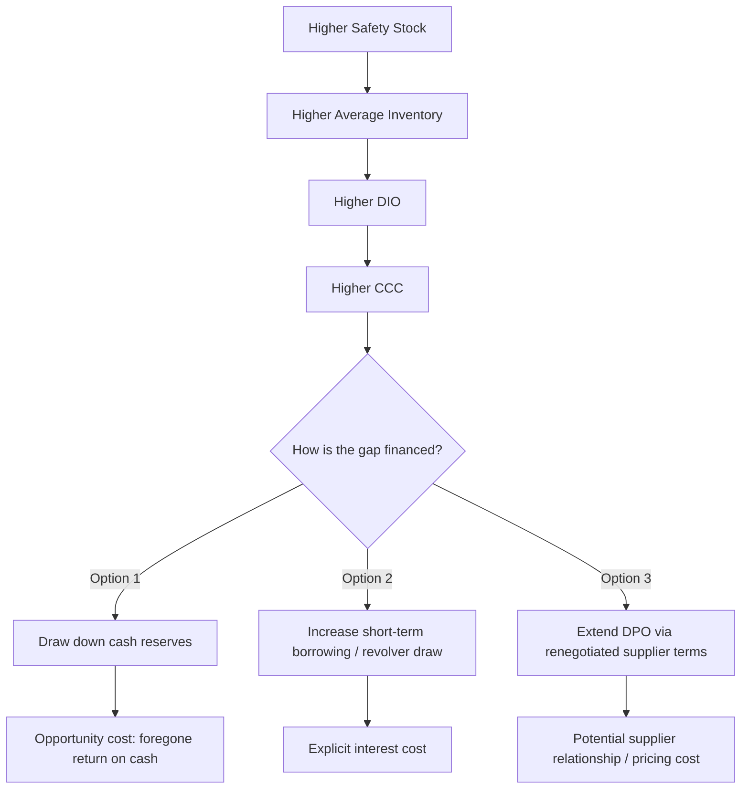

## Cash conversion cycle and working capital impact

### Overview

The Cash Conversion Cycle (CCC) measures the time span between a company outlaying cash for inputs and collecting cash from the resulting sale — a direct measure of how long capital is tied up in operations. Because safety stock and inventory policy decisions directly move the inventory component of this metric, the CCC provides the quantitative bridge between operational inventory decisions (safety stock levels, reorder points) and enterprise-level working capital and liquidity outcomes. This builds directly on the cost-of-capital and holding-cost concepts covered previously, extending them into a full working-capital framework.

### The CCC Formula

$$CCC = DIO + DSO - DPO$$

| Component | Formula | Meaning |
| --- | --- | --- |
| DIO (Days Inventory Outstanding) | $\dfrac{\text{Average Inventory}}{\text{COGS}} \times 365$ | Days inventory sits before being sold |
| DSO (Days Sales Outstanding) | $\dfrac{\text{Average Accounts Receivable}}{\text{Revenue}} \times 365$ | Days to collect cash after a sale |
| DPO (Days Payables Outstanding) | $\dfrac{\text{Average Accounts Payable}}{\text{COGS}} \times 365$ | Days before the company pays its own suppliers |

A **shorter CCC is generally favorable**: it means less cash is trapped in the operating cycle, freeing capital for other uses. A **negative CCC** (achievable by some retailers with fast inventory turnover and favorable supplier payment terms — the classic example being large grocery/retail chains that sell inventory before their supplier payment is due) means the business is effectively financed by its suppliers rather than by its own working capital.

### Why DIO Is the Inventory-Controllable Lever

Of the three CCC components, DIO is the one most directly and immediately controllable by inventory/supply chain policy decisions (DSO is largely a credit/collections function; DPO is largely a procurement/vendor negotiation function). This makes DIO — and by extension, safety stock policy — the primary lever operations teams have over the CCC.

$$DIO = \frac{\text{Average Inventory}}{\text{COGS}} \times 365 = \frac{365}{\text{Inventory Turnover}}$$

Since average inventory is the sum of cycle stock and safety stock, any change in safety stock policy flows directly and mechanically into DIO:

$$\text{Average Inventory} \approx \frac{Q}{2} + SS$$

Where $Q$ is the order quantity (cycle stock averages half the order quantity under standard $(Q,R)$ policy assumptions) and $SS$ is safety stock. An increase in $SS$ — whether from a higher target service level, higher demand variability, or higher lead time variability — increases average inventory, increases DIO, and increases CCC, holding everything else constant.

### Quantifying the Working Capital Impact of a Safety Stock Decision

**Example**

A company with $50M annual COGS currently holds $8M average inventory (DIO ≈ 58 days). A proposed safety stock increase — raising cycle service level from 95% to 99% across the SKU portfolio — is projected to raise average inventory to $9.5M.

$$\Delta DIO = \frac{9.5M}{50M} \times 365 - \frac{8M}{50M} \times 365 \approx 10.95 \text{ days}$$

This $1.5M increase in average inventory is not merely a balance sheet change — it represents $1.5M of additional capital that must be financed, either from cash reserves (opportunity cost = foregone return elsewhere) or from additional borrowing (explicit interest cost). At a holding cost capital rate of, say, 12% (WACC-derived, as in the balance-sheet discussion), this is $180,000 in additional annual capital cost — directly comparable to the expected reduction in stockout cost from the improved service level, which is the correct basis for evaluating whether the service level increase is economically justified.

### CCC and Liquidity Ratios

The CCC connects to standard liquidity metrics that finance stakeholders monitor:

$$\text{Current Ratio} = \frac{\text{Current Assets}}{\text{Current Liabilities}}$$

$$\text{Quick Ratio} = \frac{\text{Current Assets} - \text{Inventory}}{\text{Current Liabilities}}$$

The **quick ratio deliberately excludes inventory** from current assets, reflecting that inventory is the least liquid current asset — it cannot reliably be converted to cash quickly at full value in a liquidity crunch (unlike receivables or marketable securities). A business holding excessive safety stock may show an acceptable current ratio while having a materially weaker quick ratio, a divergence that signals over-investment in inventory relative to more liquid working capital forms — a useful diagnostic when evaluating whether safety stock policy has drifted from optimal.

### Working Capital Financing Trade-offs

This is a useful framework for inventory/finance conversations: a safety stock increase is not a cost-free operational decision — it necessarily draws on one of these financing sources, each with its own real cost, and quantifying which financing path applies clarifies the true all-in cost of the policy change.

### Multi-Echelon and Network CCC Effects

In multi-echelon networks, safety stock decisions at different echelons affect DIO differently depending on where in the network the inventory sits and how COGS is recognized at each stage:

- Safety stock held at a **manufacturing plant** as raw materials/WIP affects DIO calculated against production COGS
- Safety stock held at a **regional DC** as finished goods affects DIO calculated against distribution COGS
- Safety stock held at **retail/store level** affects DIO calculated against retail COGS (typically the largest base, since it includes the full markup chain)

A network-level safety stock reallocation decision (e.g., centralizing safety stock at a DC via risk pooling rather than holding it redundantly at each store) can materially shift where CCC impact is recognized across the network's legal/accounting entities, particularly relevant for multi-entity or multi-subsidiary corporate structures.

### Seasonal and Cyclical CCC Effects

Businesses with seasonal demand patterns experience CCC that fluctuates predictably across the year — safety stock built ahead of a peak season (to protect service levels against forecast uncertainty during the ramp) temporarily inflates DIO and CCC in the pre-season period, unwinding as the season's sales draw the inventory down.

**Key Points**

- Finance and treasury teams typically model **seasonal working capital facilities** (e.g., a revolving credit line sized for the pre-season inventory build) specifically to finance this predictable CCC expansion
- Safety stock planning for seasonal categories should be communicated to finance/treasury on a forward-looking basis (not just reported after the fact), since the financing need is foreseeable and can be arranged proactively rather than reactively

### Benchmarking and Industry Context

DIO and CCC benchmarks vary enormously by industry, driven by fundamentally different inventory holding requirements (perishability, product complexity, demand predictability) and typical supplier payment term norms:

| Industry Pattern | Typical DIO Characteristic |
| --- | --- |
| Grocery/fast-moving consumer goods | Very low DIO, often achieving negative CCC |
| Fashion/apparel | Moderate-to-high DIO, seasonal volatility |
| Industrial equipment/machinery | High DIO, driven by complex BOMs and long lead times |
| Semiconductor/electronics | High DIO historically, though volatile with demand cycles |
| Pharmaceuticals | Moderate-to-high DIO, driven by regulatory/quality holding requirements |

Comparing a company's DIO only against its own historical trend, without industry context, risks over- or under-crediting safety stock policy changes for CCC movements that are actually driven by industry-wide demand or supply conditions. [Inference: appropriate benchmark peer groups and the materiality of industry-wide effects vary by sector and are not captured by a single general rule.]

### Common Pitfalls

- **Treating CCC purely as a finance metric disconnected from operational safety stock decisions**, missing the direct mechanical link through DIO — this leads to safety stock policy being set without visibility into its working capital consequences, and finance targets (e.g., "reduce CCC by 5 days") being set without operational input on what service level trade-off that implies
- **Optimizing DIO/inventory turnover as an isolated KPI** without reference to the service-level cost of the resulting safety stock reduction — a CCC-driven inventory reduction initiative can inadvertently increase stockout frequency if pursued without the underlying safety stock economics being explicitly modeled
- **Ignoring where in a multi-echelon network inventory sits** when attributing CCC impact, particularly in organizations with separate legal entities or reporting segments across the supply chain
- **Failing to distinguish planned seasonal CCC expansion from unplanned/structural CCC deterioration** — a pre-season inventory build is a foreseeable and financeable event; steadily rising DIO with no seasonal explanation is a different signal (potential demand forecast degradation, excess/obsolete inventory accumulation, or safety stock parameters not being recalibrated) requiring different investigation
- **Comparing DPO extension (delaying supplier payment) and DIO reduction (lowering safety stock) as equivalent CCC levers without considering their different second-order costs** — extended DPO can strain supplier relationships and risk less favorable pricing/terms over time, while DIO reduction carries direct stockout risk; the two are not interchangeable simply because they affect the same formula symmetrically.

**Related Topics**

- Days Inventory Outstanding (DIO) benchmarking by industry vertical
- Seasonal working capital facility structuring and forecasting
- Multi-echelon inventory positioning and its balance sheet attribution across entities
- Quick ratio vs. current ratio as liquidity diagnostics for inventory-heavy businesses
- Supplier payment terms negotiation and its interaction with inventory policy
- Linking service-level/safety-stock economics directly to CCC and treasury forecasting