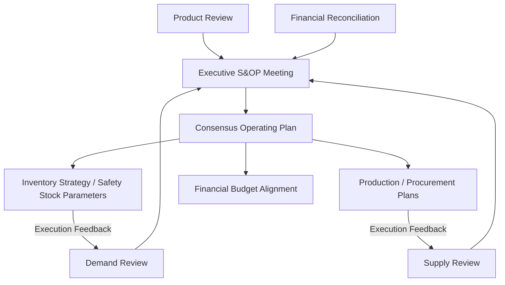

## Aligning inventory strategy with sales and operations planning

### Overview

Sales and Operations Planning (S&OP) is the cross-functional management process that reconciles demand plans, supply plans, and financial plans into a single, agreed operating plan — typically on a monthly cadence, spanning a rolling 12-24 month horizon. Inventory strategy, and safety stock policy specifically, sits at the operational intersection of S&OP: it is the mechanism through which the demand/supply balance decided in S&OP actually gets executed at the SKU-location level. Misalignment between S&OP-level decisions and inventory policy parameters is one of the most common sources of systematic over- or under-stocking in mature organizations — not from bad forecasting or bad formulas, but from the two processes operating on inconsistent assumptions.

### The S&OP Process Structure

- **Demand Review**: consensus demand forecast, reconciling statistical forecasts (as in ML/probabilistic forecasting) with sales/marketing input on promotions, new product launches, and market intelligence
- **Supply Review**: capacity, supplier constraints, lead time assumptions, and production/procurement feasibility against the demand plan
- **Financial Reconciliation**: translating the volume plan into revenue, cost, and working capital implications — this is where inventory's balance sheet and cash conversion cycle impact (as covered earlier) gets surfaced at the executive level
- **Executive S&OP**: leadership reconciles trade-offs (service level targets vs. working capital targets vs. margin targets) and approves a single operating plan

### Why Safety Stock Policy Must Be an S&OP Output, Not a Standalone Decision

A common organizational failure mode: safety stock parameters are set and maintained by an operational planning team using statistical methods (as in earlier chapters — probabilistic forecasting, service-level-driven formulas), while target service levels, working capital constraints, and demand assumptions are set independently in the S&OP process, often on different cadences and by different stakeholders. This creates **parameter drift**: the safety stock formula's inputs (target service level $z$, demand variability, lead time) become inconsistent with the S&OP-approved plan's underlying assumptions.

**Example**

S&OP approves a plan assuming a 95% target service level company-wide for working capital planning purposes (i.e., finance has sized working capital facilities assuming average inventory consistent with 95% service level). If the operational planning team, working from category-level service history, has actually configured safety stock formulas targeting 98% service level for a subset of SKUs (a reasonable operational decision made independently), average inventory — and therefore working capital consumption — will exceed what was planned and financed at the S&OP level, without this being visible until it shows up as an unplanned CCC/DIO deviation.

### Aligning Service Level Targets Across the S&OP Hierarchy

Service level targets should flow **top-down** from S&OP strategic segmentation decisions into safety stock formula parameters, not be set independently at the SKU level by planners using only local historical data:

Typical segmentation dimensions used to differentiate service level targets within S&OP:

| Segmentation Basis | Example |
| --- | --- |
| Strategic importance | Core/flagship SKUs get higher service level targets than long-tail items |
| Customer segment | Key account commitments may justify differentiated service levels |
| Margin contribution | Higher-margin products can economically justify higher safety stock investment |
| Product lifecycle stage | New product launches often carry different (often higher, to protect launch reputation) service targets than mature, well-forecasted SKUs |
| Substitutability | SKUs with close substitutes can tolerate lower service levels with less revenue risk than sole-source items |

This segmentation — an ABC/XYZ-style classification combining value (ABC) and demand variability/predictability (XYZ) — is a standard S&OP-level strategic input that should directly parameterize the $z$-value (and thus the resulting safety stock) used in the downstream statistical formula, rather than every SKU defaulting to a single organization-wide service level assumption.

### The Demand-Supply-Inventory Reconciliation Loop

S&OP's core function is reconciling three plans that, left independent, will diverge:

1. **Demand plan**: what sales/marketing expects to sell (informs $\hat{D}$ and, via forecast error tracking, $\sigma_D$)
2. **Supply plan**: what can actually be produced/procured, including supplier lead time commitments (informs $L$ and $\sigma_L$)
3. **Inventory plan**: what safety stock and cycle stock levels are required to bridge demand-supply uncertainty at the agreed service level, and what working capital that requires

When these three are reconciled *before* being locked into execution systems, safety stock parameters entering the planning system (as in the systems integration architecture discussed earlier) are consistent with the actual capacity, lead time, and demand assumptions the business has committed to — rather than being computed from assumptions that supply or finance haven't actually agreed to support.

### Rough-Cut Capacity and Inventory Feasibility

A frequently underweighted S&OP discipline: verifying that the safety stock and cycle stock implied by the demand/service-level plan is actually **feasible** given physical and financial constraints — before the plan is approved, not after execution reveals infeasibility.

- **Warehouse capacity check**: does aggregate required inventory (cycle + safety stock, summed across the portfolio) fit within available storage capacity? A statistically optimal safety stock level per SKU is not actionable if the aggregate exceeds physical space
- **Working capital feasibility check**: does the aggregate capital requirement (as quantified via the CCC/DIO framework) fit within the working capital facilities and cash position the business has available or is willing to commit?
- **Supplier capacity check**: can suppliers actually deliver the cycle stock replenishment volumes implied by the plan within the lead time assumptions the safety stock calculation depends on?

This feasibility reconciliation is why S&OP is typically structured as an iterative process (multiple review cycles) rather than a single linear pass — initial demand/service-level aspirations frequently exceed what supply, warehouse, or financial constraints can support, requiring the plan to be adjusted before executive approval.

### Cadence Mismatch as a Structural Risk

S&OP typically operates monthly; safety stock recalculation in a well-integrated system (per the systems integration and control tower material) can operate daily or in near-real-time. This cadence mismatch is not itself a problem — daily operational recalculation *within* the boundaries set by the monthly S&OP-approved plan is expected and desirable — but it becomes a risk when:

- Operational safety stock recalculation systematically drifts outside the parameters implicitly approved in the last S&OP cycle (e.g., service level segmentation being overridden ad hoc by individual planners) without that drift being flagged for the next S&OP review
- A significant S&OP plan change (e.g., a major promotion, a new product launch, a planned service level shift) is not propagated into the safety stock calculation systems in a timely way, leaving execution running on stale parameters until the next monthly cycle

**Key Points**

- A well-designed control tower (as discussed earlier) can serve as the operational bridge here: flagging when live safety stock/inventory metrics are deviating materially from S&OP-approved plan assumptions, surfacing this as an exception for the next S&OP cycle rather than letting it silently accumulate
- Some organizations run a lighter-weight, higher-frequency "S&OP execution" or "IBP (Integrated Business Planning) weekly cadence" specifically to reduce this mismatch for fast-moving categories, without replacing the full monthly strategic S&OP cycle

### Integrated Business Planning (IBP) as an Extension

**Integrated Business Planning (IBP)** is often used to describe a maturity evolution of S&OP that more tightly integrates financial planning and scenario-based decision-making into the same process — directly relevant to inventory strategy because it formalizes the connection between safety stock/service-level decisions and their financial statement consequences (as in the balance sheet and CCC material) as a standard, recurring part of the planning cycle rather than a periodic special analysis.

### Common Pitfalls

- **Safety stock formulas parameterized independently of S&OP-approved service level segmentation**, causing systematic misalignment between planned and actual working capital consumption
- **No feasibility check on aggregate inventory implications of the demand/service-level plan** before approval, leading to plans that are statistically sound at the SKU level but physically or financially infeasible in aggregate
- **One-way communication from S&OP down to execution**, with no structured feedback path for execution-level inventory metrics (actual service level achieved, actual working capital consumed) to inform the next S&OP cycle — turning S&OP into a planning ritual disconnected from operational reality
- **Treating S&OP as a volume-and-capacity exercise only**, without explicitly translating volume decisions into their safety stock and working capital implications during the financial reconciliation step — this is the specific gap that leads to CCC/DIO surprises discussed in the previous topic
- **Applying a single, undifferentiated service level target across an entire SKU portfolio** rather than using S&OP-level strategic segmentation to differentiate targets, which both overinvests in low-priority SKUs and potentially underinvests in strategically critical ones [Inference: the specific segmentation scheme and its financial impact are organization-specific and not governed by a single universal framework].

**Related Topics**

- ABC/XYZ inventory segmentation methodology for service level differentiation
- Integrated Business Planning (IBP) as an S&OP maturity evolution
- Rough-cut capacity planning and inventory feasibility checks
- Demand review reconciliation between statistical forecasts and commercial input
- Control tower exception flagging for S&OP plan-vs-actual inventory drift
- Financial reconciliation of volume plans into working capital and CCC impact