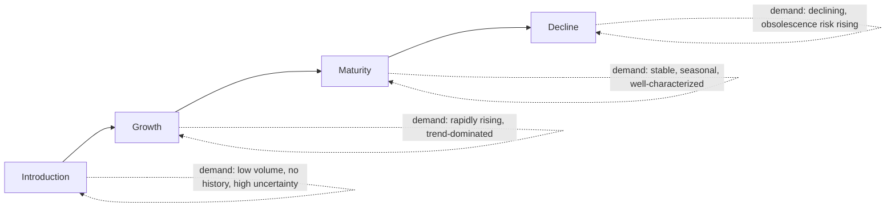
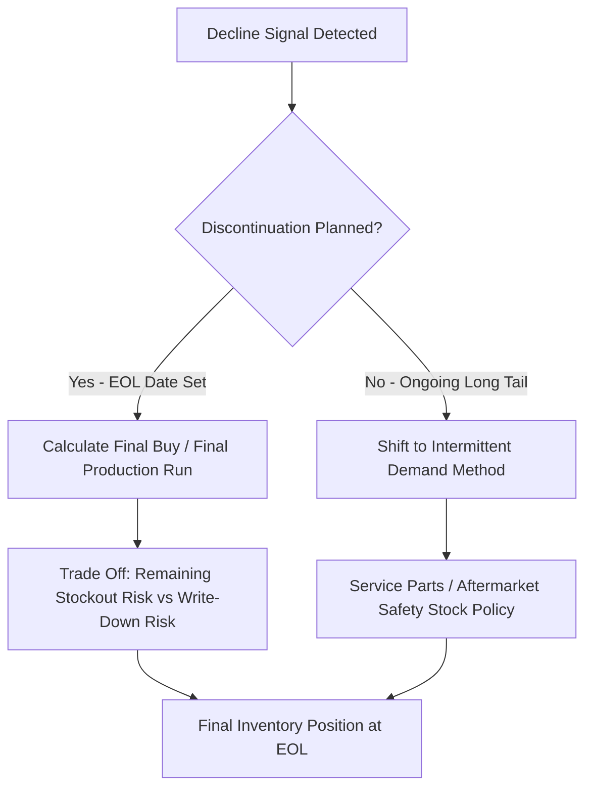

## Inventory strategy across the product lifecycle

### Overview

The Product Lifecycle (PLC) model — introduction, growth, maturity, and decline — describes how demand volume and predictability evolve over a product's commercial life. Safety stock and broader inventory policy cannot use a single static formula across this lifecycle: the statistical assumptions underlying standard safety stock calculus (stable demand distribution, reliable historical variance estimates) are most valid in maturity and systematically break down at the introduction and decline stages. Inventory strategy must therefore be lifecycle-aware, shifting both the *method* used to estimate uncertainty and the *service level policy* applied as a product moves through its life.

### The Product Lifecycle and Its Inventory Implications

| Stage | Demand Characteristics | Dominant Inventory Risk | Safety Stock Method Fit |
| --- | --- | --- | --- |
| Introduction | Low volume, no/limited history, high forecast error | Stockout risk from under-forecasting a hit product | Classical variance-based formulas poorly suited — no history to estimate $\sigma_D$ |
| Growth | Rapidly increasing, trend-dominated, still volatile | Stockout risk from underestimating trend | Time-series/ML methods capturing trend; static safety stock formulas lag a moving target |
| Maturity | Stable, seasonal, well-characterized | Balanced — this is where standard safety stock formulas perform best | Classical and ML statistical methods most reliable here |
| Decline | Falling, increasingly sparse/intermittent | Obsolescence/excess risk dominates over stockout risk | Intermittent demand methods (Croston, TSB); safety stock policy should actively shrink |

### Introduction Stage: No-History Forecasting and Safety Stock

At launch, there is little or no internal sales history to compute $\sigma_D$ from — the core statistical input to every safety stock formula covered earlier is simply unavailable in the conventional sense.

**Common approaches to bridge this gap:**

- **Analogous forecasting**: using the demand pattern of a comparable prior product launch (similar category, price point, target segment) as a proxy distribution for both the demand level and its variability, adjusted for known differences (marketing spend, distribution breadth, market size changes)
- **Judgmental/consensus forecasting**: combining sales, marketing, and category management input (as gathered in the S&OP demand review) to establish an initial demand estimate and confidence range, since statistical methods have no data to work from
- **Attribute-based/hierarchical models**: for organizations with enough historical launches, models that predict new-product demand curves from product attributes (price, category, marketing spend) learned across many past launches — a machine learning application distinct from the SKU-specific ML forecasting methods covered earlier, since it must generalize *across* products rather than learn from a single product's own history
- **Wider uncertainty bands as a matter of policy**: given the inherent unreliability of any introduction-stage demand estimate, safety stock policy commonly applies a deliberately elevated service level target or a wider judgmental buffer than the formula alone would produce from limited data, explicitly acknowledging estimation uncertainty on top of demand uncertainty

**Key Points**

- The stockout risk during introduction is often asymmetric in business impact: under-stocking a launch that turns out to be a hit has reputational and competitive costs (lost shelf space, retailer confidence, customer first-impression) beyond the immediate lost sale — this often justifies a higher target service level during introduction than the product's eventual steady-state category would warrant
- Introduction-stage inventory decisions should be explicitly flagged for early reforecasting once initial sell-through data arrives — the safety stock policy should have a predetermined trigger (e.g., after N weeks or N units sold) to transition from judgmental/analogous methods to statistical methods as real data accumulates

### Growth Stage: Trend-Dominated Demand

As a product moves into growth, demand is rising, often rapidly, and the dominant forecasting/safety-stock challenge shifts from "no data" to "the data is a moving target" — static safety stock formulas calibrated on a fixed historical mean and variance will systematically lag behind a demand curve that is trending upward.

- **Trend-aware forecasting methods** (e.g., Holt's linear trend exponential smoothing, or ML methods with explicit trend features) are more appropriate than flat-mean-based classical safety stock inputs during this stage
- **Frequent recalibration cadence**: growth-stage products benefit from more frequent safety stock parameter updates than mature products, since the underlying demand distribution is shifting meaningfully period-to-period rather than being approximately stationary
- **Capacity and supply-side risk becomes prominent**: growth-stage stockout risk is frequently supply-constrained (can production/procurement scale fast enough) rather than purely a forecasting problem — this connects directly to the S&OP feasibility-check discipline (rough-cut capacity planning) covered in the previous topic, since a demand forecast implying continued rapid growth is only actionable if supply can actually be scaled to match

### Maturity Stage: The Domain of Standard Safety Stock Calculus

Maturity is where the assumptions underlying classical and ML-based safety stock formulas covered throughout this material are best satisfied: demand is relatively stable (possibly with well-characterized seasonality), sufficient history exists to estimate $\sigma_D$ reliably, and lead time performance is typically well-characterized from repeated supplier cycles.

**Key Points**

- This is the stage where the full toolkit — probabilistic/quantile forecasting, ML demand models, systems integration between forecasting/planning/execution, control tower exception management — delivers the most value relative to its implementation cost, since the underlying statistical assumptions hold most reliably here
- Mature-stage products are also the best candidates for more sophisticated multi-echelon and network-level optimization (risk pooling, joint replenishment), since the stable demand base makes network-level statistical relationships (correlation between locations, substitution effects) themselves stable enough to model reliably
- A common but avoidable failure: treating a mature product's safety stock parameters as "set and forget" — even stable, well-characterized demand drifts over multi-year periods (market share shifts, competitive entry, channel mix changes), and periodic recalibration discipline remains necessary even in maturity

### Decline Stage: Obsolescence Risk Displaces Stockout Risk

As a product enters decline, the fundamental risk asymmetry that safety stock is designed to manage **inverts**. Throughout introduction, growth, and maturity, safety stock policy is primarily balancing stockout cost against holding cost, with stockout typically the more expensive tail risk. In decline, **obsolescence and excess inventory risk increasingly dominate**: capital tied up in slow-moving, soon-to-be-discontinued inventory faces write-down risk (as discussed in the balance sheet material) that often exceeds the cost of an occasional stockout on a declining-demand item.

**Practical implications:**

- **Actively shrinking safety stock policy**: rather than passively letting a static formula compute a lower safety stock as historical variance data updates, decline-stage inventory strategy typically applies an explicit, accelerated safety stock reduction policy, often ahead of what the trailing statistical formula alone would produce, anticipating the demand decline rather than only reacting to it after it's fully reflected in recent history
- **Intermittent demand methods become relevant**: as unit volume falls, demand often becomes intermittent (many zero-demand periods) even for a product that was continuously, smoothly demanded during maturity — this is the same intermittent-demand pattern problem noted in the ML forecasting material, and methods like Croston's method or TSB become more appropriate than a continuous-demand safety stock formula
- **End-of-life (EOL) inventory planning**: a distinct, deliberate final-order/final-buy decision process — calculating a last production/purchase run intended to cover remaining demand through the planned discontinuation date, explicitly trading off a final stockout-risk buffer against the certain write-down cost of any inventory remaining unsold at EOL
- **Service parts/aftermarket exception**: for durable goods with a service/repair-parts tail (automotive, industrial equipment, electronics), the "decline" stage for the primary product does not necessarily mean declining need for spare parts, which can persist on a long, thin intermittent-demand tail for years after primary product sales end — this tail typically requires its own distinct forecasting and safety stock treatment, separate from the primary product's declining-demand pattern

### Lifecycle Stage Detection

A practical prerequisite to lifecycle-aware inventory strategy is systematically **detecting which stage a SKU is currently in**, rather than relying solely on a product's calendar age or a manually maintained lifecycle tag that can lag actual demand behavior:

- **Trend and growth rate signals**: statistically significant, sustained positive or negative trend in a demand time series (e.g., via STL decomposition trend component, or a rolling regression slope) as a growth/decline indicator
- **Demand variability shifts**: a marked increase in coefficient of variation can signal the transition into decline-stage intermittency before volume decline alone becomes obvious
- **Sell-through velocity relative to category norms**: comparing a SKU's velocity trajectory against typical lifecycle curves for its category (using the analogous-forecasting comparison approach from the introduction-stage discussion) to flag stage transitions earlier than waiting for several periods of confirmed trend

### Common Pitfalls

- **Applying a single, uniform safety stock methodology across the entire portfolio regardless of lifecycle stage** — this is the single most common structural cause of a portfolio simultaneously containing stockouts on growth-stage products and excess/obsolete inventory on decline-stage products, since a "one formula fits all SKUs" approach optimizes for the maturity-stage assumptions that best fit the average SKU but poorly fits SKUs at the lifecycle extremes
- **Not establishing a predetermined trigger to transition an introduction-stage SKU from judgmental to statistical forecasting**, leaving new products on wide, judgmentally-set buffers long after sufficient real sell-through data exists to tighten them
- **Failing to detect decline stage early enough**, continuing to apply maturity-stage safety stock targets on a product with emerging intermittency, generating write-down exposure that a timely lifecycle-aware policy shift would have limited
- **Treating final-buy/EOL decisions as a purely operational planning task disengaged from the financial trade-off** — an EOL buy quantity decision is fundamentally a stockout-cost-versus-write-down-cost trade-off and should be evaluated with the same financial rigor (holding cost rate, obsolescence cost estimate) as ongoing safety stock decisions, not treated as a separate ad hoc calculation
- **Underinvesting in service-parts/aftermarket demand modeling** by treating it as an afterthought to the primary product's lifecycle, when its long intermittent tail often requires distinctly different forecasting and safety stock methods than the primary product ever needed [Inference: the appropriate organizational ownership and methodology for service-parts inventory varies significantly by industry and is not governed by a single standard practice].

**Related Topics**

- Analogous and attribute-based forecasting for new product introductions
- Croston's method and TSB for intermittent decline-stage and service-parts demand
- End-of-life (EOL) final-buy optimization and write-down cost trade-offs
- Lifecycle stage detection via trend decomposition and variability monitoring
- Service parts / aftermarket inventory management as a distinct discipline
- ABC/XYZ segmentation interaction with lifecycle stage in service level policy design