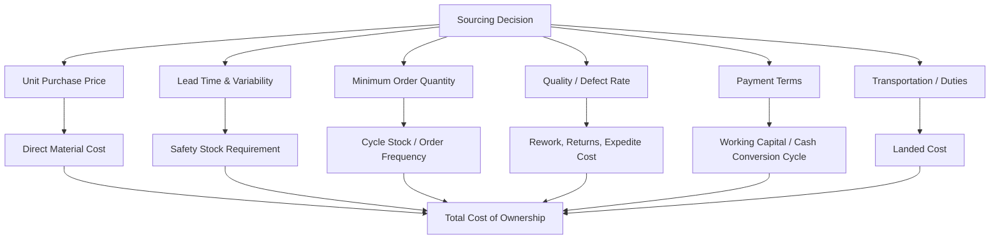

## Total cost of ownership versus unit cost optimization

### Overview

Total Cost of Ownership (TCO) is a procurement and inventory decision framework that evaluates the full economic cost of a sourcing or inventory decision across its entire lifecycle, rather than optimizing only for the visible unit purchase price. In the context of safety stock and inventory calculus, TCO analysis is what reveals that a lower unit cost sourcing decision can produce a *higher* total cost outcome once its downstream effects on lead time variability, minimum order quantities, and quality are correctly reflected in the safety stock formula — a connection frequently missed when procurement and inventory planning operate as separate optimization problems.

### The Core Tension: Unit Cost Optimization vs. TCO

Unit cost optimization asks: "which supplier/sourcing option has the lowest price per unit?" TCO asks: "which supplier/sourcing option minimizes total cost, inclusive of all downstream effects that price interacts with?"



**Key Points**

- A lower unit price from an offshore or alternative supplier is frequently accompanied by longer, more variable lead times, higher minimum order quantities, and/or higher quality variability — each of these directly increases the safety stock (and associated holding cost) required to maintain the same service level, per the standard $SS = z \cdot \sigma_{D,LT}$ relationship
- TCO analysis is the discipline of quantifying these downstream effects in the same currency as the unit price savings, so the sourcing decision reflects the actual net economic outcome rather than only the most visible line item

### TCO Formula Structure

$$TCO = P \cdot D + H \cdot \bar{I}(L, \sigma_L, \sigma_D) + C_{ordering} + C_{quality} + C_{transport} + C_{admin}$$

Where:

- $P \cdot D$ = unit price times annual demand (the direct material cost most commonly optimized in isolation)
- $H \cdot \bar{I}(L, \sigma_L, \sigma_D)$ = holding cost applied to average inventory, which is itself a function of lead time, lead time variability, and demand variability — this is the term that connects sourcing decisions to the safety stock formula
- $C_{ordering}$ = fixed cost per order times order frequency (driven by MOQ and order size decisions)
- $C_{quality}$ = cost of defects, returns, rework, and expedited replacement orders
- $C_{transport}$ = freight, duties, and customs costs, which vary substantially by sourcing geography
- $C_{admin}$ = supplier management, quality audit, and relationship management overhead

### How Sourcing Decisions Propagate Into Safety Stock

**Lead time and lead time variability effects**

Recall the standard combined-uncertainty safety stock formula:

$$\sigma_{D,LT} = \sqrt{L \cdot \sigma_D^2 + \hat{D}^2 \cdot \sigma_L^2}$$

A sourcing option with longer mean lead time $L$ increases required safety stock even if $\sigma_L$ (variability) is unchanged, simply because more periods of demand uncertainty must be covered. A sourcing option with *higher lead time variability* $\sigma_L$ — common with distant, less-integrated, or historically less-reliable suppliers — increases required safety stock through the second term, often the larger driver of the two in practice for suppliers with inconsistent performance.

**Example**

Two suppliers offer the same component. Supplier A: unit price $10, mean lead time 45 days, $\sigma_L = 10$ days. Supplier B: unit price $11, mean lead time 20 days, $\sigma_L = 3$ days. For a SKU with $\hat{D} = 50$ units/day and $\sigma_D = 8$:

$$\sigma_{D,LT}^{A} = \sqrt{45 \cdot 8^2 + 50^2 \cdot 10^2} \approx \sqrt{2880 + 250000} \approx 503$$


$$\sigma_{D,LT}^{B} = \sqrt{20 \cdot 8^2 + 50^2 \cdot 3^2} \approx \sqrt{1280 + 22500} \approx 154$$

At $z = 1.65$ (95% service level): $SS_A \approx 830$ units, $SS_B \approx 254$ units — a difference of roughly 576 units. At a holding cost rate of 22% (capital + storage + obsolescence, as in the balance sheet material) and $10 unit cost, that's roughly $1,270/year in additional holding cost for Supplier A — before accounting for the $1/unit price disadvantage of Supplier B on annual volume. Depending on annual demand, the safety-stock-driven holding cost differential alone can meaningfully offset or exceed the unit price gap, which is invisible to a unit-cost-only sourcing comparison.

**Minimum Order Quantity (MOQ) effects**

Larger MOQs increase average cycle stock ($\bar{Q}/2$) independent of safety stock, directly increasing $\bar{I}$ in the TCO formula and increasing holding cost — a supplier offering a lower unit price contingent on a large MOQ may impose a cycle-stock holding cost that a smaller-MOQ, higher-unit-price alternative avoids.

**Quality/defect rate effects**

Higher defect rates effectively reduce usable received quantity below the ordered quantity, which — if not explicitly modeled — creates a hidden additional source of supply uncertainty functioning similarly to lead time variability: unreliable *effective* delivered quantity, not just unreliable *timing*, increases the uncertainty safety stock must buffer against. Some TCO-integrated inventory models incorporate an explicit "yield uncertainty" term alongside lead time and demand uncertainty for this reason.

### TCO in Supplier Selection Frameworks

Formal supplier scorecards commonly weight TCO-relevant factors explicitly rather than defaulting to price-only comparison:

| Factor Category | Example Metrics |
| --- | --- |
| Price | Unit price, payment terms, volume discount structure |
| Delivery performance | On-time-in-full (OTIF) rate, mean lead time, lead time variability |
| Quality | Defect rate (PPM), return rate, corrective action responsiveness |
| Financial stability | Supplier credit rating, dependency/concentration risk |
| Capacity/scalability | Ability to flex volume during demand growth stages |
| Total landed cost | Freight, duties, currency risk, customs complexity |

A weighted TCO scorecard translates these into a comparable composite score, explicitly surfacing the safety-stock-driving factors (lead time, variability, quality) alongside price rather than treating them as secondary qualitative considerations.

### TCO and Dual/Multi-Sourcing Decisions

TCO analysis also informs whether **single-sourcing** (lowest unit cost, typically via volume concentration) or **dual/multi-sourcing** (paying a price premium to reduce supply risk) is economically justified:

- Single-sourcing typically achieves better unit pricing through volume leverage but concentrates lead-time and disruption risk in one supplier relationship, increasing $\sigma_L$ at the portfolio level if that supplier experiences disruption
- Dual-sourcing can reduce effective $\sigma_L$ through risk diversification (assuming supplier disruptions are not perfectly correlated), potentially allowing a *lower* safety stock for the same service level despite a higher blended unit price — a direct, quantifiable TCO trade-off rather than a purely qualitative risk-management argument

This connects to the digital twin and control tower material covered earlier: simulating disruption scenarios (a key digital twin use case) provides the quantitative basis for estimating how much dual-sourcing actually reduces effective $\sigma_L$, rather than relying on an unquantified risk-mitigation rationale.

### Organizational Barriers to TCO Adoption

**Key Points**

- Procurement teams are frequently measured and incentivized on unit price reduction (Purchase Price Variance, PPV) as a primary KPI, which structurally biases sourcing decisions toward unit-cost optimization even when TCO analysis would recommend otherwise — a classic incentive misalignment between procurement and inventory/operations functions
- Effective TCO adoption typically requires the sourcing decision process to explicitly incorporate a projected safety stock and holding cost impact (calculated using the same probabilistic/statistical methods covered in the forecasting chapters) as a formal input to supplier selection, not an informal afterthought
- This is functionally an extension of the S&OP alignment discipline covered previously: sourcing/procurement decisions should be reconciled against the same service-level and working-capital assumptions used in inventory strategy, rather than being optimized independently by a separate procurement process with its own disconnected objective function

### Practical TCO Modeling Approach

```python
def tco_comparison(suppliers, annual_demand, demand_std, holding_cost_rate, target_service_level):
    from scipy.stats import norm
    z = norm.ppf(target_service_level)
    results = {}

    for name, s in suppliers.items():
        # Combined demand-lead-time uncertainty
        sigma_dlt = ((s['lead_time'] * demand_std**2) +
                     (annual_demand/365)**2 * s['lead_time_std']**2) ** 0.5
        safety_stock = z * sigma_dlt

        cycle_stock = s['moq'] / 2
        avg_inventory = safety_stock + cycle_stock

        holding_cost = holding_cost_rate * s['unit_price'] * avg_inventory
        material_cost = s['unit_price'] * annual_demand
        quality_cost = s['defect_rate'] * annual_demand * s['unit_price'] * s['rework_multiplier']

        results[name] = {
            'safety_stock_units': round(safety_stock),
            'material_cost': round(material_cost),
            'holding_cost': round(holding_cost),
            'quality_cost': round(quality_cost),
            'total_cost': round(material_cost + holding_cost + quality_cost)
        }
    return results
```

This illustrates the structural pattern — annual demand, holding cost rate, and target service level are common inputs (typically already maintained by the planning system) applied consistently across sourcing options for a like-for-like comparison, rather than each option being evaluated on inconsistent or implicit assumptions.

### Common Pitfalls

- **Comparing sourcing options purely on unit price** without translating lead time, MOQ, and quality differences into their safety stock and holding cost implications, systematically biasing decisions toward suppliers that look cheaper on the surface but are more expensive once carrying cost is correctly attributed
- **Procurement KPIs (PPV) misaligned with total cost objectives**, creating an organizational incentive structure that rewards unit-cost optimization even where TCO analysis would recommend a different sourcing choice — this is a governance/incentive problem, not merely an analytical one
- **Treating quality/defect rate as a separate quality-function metric disconnected from inventory calculus**, missing that defect rate functions as an effective yield-uncertainty input that should feed into the same statistical safety stock framework as lead time and demand uncertainty
- **Ignoring currency and duty volatility in landed cost** when comparing domestic versus international sourcing options, understating the effective TCO of international suppliers whose favorable unit price can be partially or fully offset by exchange rate and tariff exposure over the contract period
- **Applying TCO analysis once at initial sourcing decision but not revisiting it as supplier performance data accumulates** — actual lead time variability and defect rates observed post-selection (the same execution-layer feedback data discussed in the systems integration material) should periodically update the TCO comparison, since actual supplier performance frequently diverges from initial contractual/quoted assumptions [Inference: the appropriate review cadence for TCO reassessment is context-dependent and not standardized across industries].

**Related Topics**

- Supplier scorecarding and weighted TCO evaluation frameworks
- Dual/multi-sourcing risk diversification and its quantifiable effect on lead time variability
- Purchase Price Variance (PPV) as a procurement KPI and its incentive effects
- Yield/quality uncertainty as an input to combined demand-lead-time safety stock formulas
- Landed cost modeling including duties, freight, and currency risk
- Linking supplier performance feedback data to periodic TCO reassessment