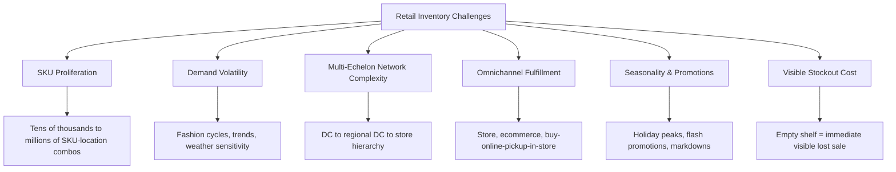
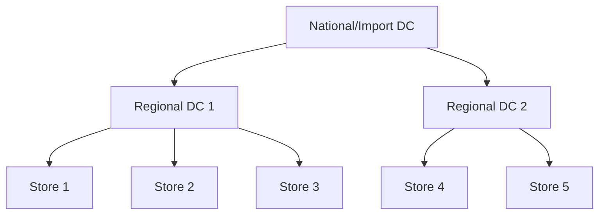

## Retail inventory management challenges

### Overview

Retail inventory management operates under a distinct set of structural conditions relative to manufacturing or industrial distribution: extremely high SKU counts, short and highly variable demand windows (seasonal, promotional, fashion cycles), direct consumer-facing stockout visibility, and a multi-echelon network (DC → store, and increasingly, fulfillment-for-ecommerce) with complex allocation decisions layered on top of standard replenishment. This chapter applies the forecasting, safety stock, systems integration, and financial frameworks covered earlier to the specific structural challenges that make retail inventory management a distinct discipline within inventory management broadly.

### Structural Characteristics That Shape Retail Inventory Problems

### Challenge 1: SKU Proliferation and the Long Tail

Retailers, particularly in fashion, grocery, and general merchandise, commonly manage tens of thousands to millions of SKU-location combinations. This creates specific challenges for the statistical methods covered in earlier chapters:

- **Long-tail SKUs have insufficient history** for reliable classical or ML demand variability estimation — the same no-history/low-history problem discussed in the product lifecycle material, but at retail scale affecting a large fraction of the total SKU count simultaneously, not just new product launches
- **Manual, SKU-by-SKU safety stock review is infeasible at this scale** — this is precisely why automated systems integration (forecasting → planning → execution, as covered earlier) and exception-based control tower management are structurally necessary in retail rather than optional sophistication
- **ABC/XYZ segmentation becomes essential rather than optional**: applying differentiated service levels and forecasting method sophistication by segment (as discussed in the S&OP alignment material) is the standard mechanism for managing statistical rigor proportionate to SKU importance, since uniform treatment of the full long tail is neither statistically sound nor operationally affordable

### Challenge 2: Demand Volatility and Trend Sensitivity

Retail demand, especially in fashion, seasonal goods, and trend-sensitive categories, violates the stationarity assumptions that make classical safety stock formulas most reliable (as noted in the product lifecycle discussion of maturity-stage demand):

- **Fashion/apparel**: short selling seasons, trend-driven demand with limited or no repeat-purchase history within a season, requiring analogous forecasting and judgmental input similar to introduction-stage products in every selling cycle, not just at initial product launch
- **Weather sensitivity**: categories like outdoor apparel, seasonal goods, and even grocery (e.g., ice cream, soup) show demand elasticity to weather conditions that a standard time-series model without weather features will systematically miss — this is a direct application of the exogenous-feature ML forecasting approaches covered earlier
- **Promotional demand spikes**: promotions create short-term demand surges that, if not explicitly flagged in historical training data, corrupt the baseline demand variability estimate used for safety stock in non-promotional periods — promotional and baseline demand should generally be modeled as separate signal components rather than blended into a single variability estimate

### Challenge 3: Multi-Echelon Network Complexity

Retail networks typically involve at least two, often three, tiers: central/national DC, regional DC, and store — each requiring its own inventory positioning decision, with safety stock at one echelon interacting with safety stock requirements at others through risk pooling effects.

**Key Points**

- **Risk pooling**: holding safety stock centrally (at DC level) rather than distributed across many stores reduces total network safety stock requirement for a given service level, since aggregate demand variability across pooled locations is proportionally lower than the sum of each location's individual variability (a direct consequence of the square-root relationship in combined variance) — but this comes at the cost of longer store-replenishment lead time, which itself increases the *store-level* safety stock or requires more frequent replenishment cycles
- **Echelon-appropriate service levels**: DC-level stockouts cascade into store-level stockouts across every store served by that DC, generally justifying higher DC-level service level targets than any single store would need in isolation
- **Store-level space constraints**: unlike a DC, store backroom and shelf capacity is often a binding physical constraint independent of the statistically optimal safety stock calculation — store-level inventory policy frequently must incorporate an explicit capacity cap on top of (or instead of) the pure statistical formula output

### Challenge 4: Omnichannel Fulfillment

Modern retail inventory must serve multiple fulfillment channels from overlapping or shared inventory pools — physical store sales, e-commerce shipped from DC, e-commerce shipped from store, buy-online-pickup-in-store (BOPIS), and ship-from-store — each with different effective demand patterns and service expectations against the same underlying inventory.

- **Inventory visibility and allocation logic**: a single unit of inventory can potentially satisfy demand from multiple channels, requiring real-time inventory visibility across the network (directly connecting to the systems integration and control tower architectures covered earlier) and allocation rules determining which channel's demand a given unit is reserved for
- **Channel-specific service level expectations**: e-commerce customers often have different stockout tolerance and substitution behavior than in-store shoppers (an in-store customer facing a stockout may substitute to an adjacent product on the shelf; an e-commerce customer facing a stockout typically sees "out of stock" and may abandon the purchase or switch retailers entirely) — this asymmetry in stockout cost by channel is a relevant input to channel-differentiated safety stock or allocation policy
- **Ship-from-store complexity**: using store inventory to fulfill e-commerce orders effectively adds e-commerce demand as an additional draw on store-level inventory that traditional store safety stock calculations (designed around in-store foot traffic demand alone) were not originally built to account for

### Challenge 5: Seasonality, Promotions, and Markdown Management

**Seasonal peaks** (holiday season, back-to-school) require inventory build-up well ahead of the demand peak, directly connecting to the seasonal working capital planning discussed in the CCC material — retail seasonal inventory builds are a primary driver of the seasonal CCC expansion pattern noted there.

**Promotional lift forecasting** requires explicitly modeling the incremental demand a promotion generates (and any pre/post-promotion demand distortion — pantry-loading pull-forward effects, post-promotion demand trough) as a distinct forecasting problem from baseline demand forecasting, typically using promotion-specific features (discount depth, promotion type, historical lift for similar promotions) as inputs to the ML forecasting methods covered earlier.

**Markdown management** is the retail-specific decision problem of when and how much to discount inventory that is not selling through as planned, to clear it before it becomes obsolete/unsellable (directly connecting to the obsolescence cost component of holding cost, and the decline-stage inventory strategy discussed in the product lifecycle material) — markdown optimization is a related but distinct discipline from safety stock calculus, focused on liquidating excess rather than preventing shortage.

### Challenge 6: The Asymmetric, Highly Visible Cost of Retail Stockouts

**Key Points**

- A retail stockout is immediately and directly visible to the end consumer (an empty shelf, an "out of stock" website message) in a way that is often less visible in B2B or industrial supply chains where a delayed shipment may be less immediately apparent to the end customer
- This visibility amplifies the reputational and customer-loyalty cost component of stockout cost beyond the immediate lost-sale revenue — a customer experiencing repeated stockouts on a preferred product may shift loyalty to a competitor retailer entirely, a cost that is difficult to quantify precisely but is frequently cited as justification for retail service level targets exceeding what a narrow lost-margin-only stockout cost calculation would produce
- Some retail categories exhibit strong **substitution behavior** (a stockout on one flavor/size/color redirects demand to a similar in-stock item, retaining the sale for the retailer even if not for that specific SKU), while others exhibit strong **switching behavior** (the customer leaves without purchasing, or purchases from a competitor) — this substitution/switching distinction should inform SKU-level stockout cost assumptions and is a meaningfully different input than the intra-catalog substitution modeling sometimes used in demand forecasting for related SKUs

### Retail-Specific Technology Patterns

- **Perpetual inventory / real-time POS integration**: retail inventory systems require real-time or near-real-time point-of-sale integration (rather than periodic batch updates) given the volume and velocity of individual transactions, directly connecting to the event-driven integration patterns discussed in the systems integration material
- **RFID and computer-vision-based inventory accuracy**: retail's specific shrinkage and inventory record inaccuracy challenges (a chronic issue given high transaction volume, theft exposure, and manual handling) have driven adoption of RFID tagging and computer-vision shelf-monitoring technology specifically to improve the reliability of the on-hand inventory data that safety stock and replenishment systems depend on — inaccurate on-hand data undermines even a perfectly calibrated safety stock formula, since the formula's output is only as good as the inventory position data it's applied against
- **Allocation and replenishment engines**: retail-specific software categories (distinct from generic ERP/MRP) purpose-built for the store-replenishment problem at retail SKU-location scale, typically incorporating the multi-echelon risk pooling and channel allocation logic discussed above as core functionality rather than an extension

### Common Pitfalls

- **Applying a uniform safety stock methodology across a full retail SKU catalog** without the ABC/XYZ segmentation and lifecycle-awareness discussed earlier, given how large a fraction of a typical retail catalog sits in the long tail, new-launch, or decline stages simultaneously
- **Modeling promotional and baseline demand as a single blended signal**, corrupting the demand variability estimate used for non-promotional-period safety stock
- **Treating store-level safety stock purely as a statistical optimization problem** without incorporating physical shelf/backroom capacity constraints, producing formula outputs that are not physically executable at the store
- **Underestimating the effect of poor inventory record accuracy on safety stock effectiveness** — a statistically well-calibrated safety stock policy cannot compensate for systematic on-hand inventory data errors, and inventory accuracy investment (RFID, cycle counting discipline) is frequently a higher-leverage intervention than further refining the forecasting model itself
- **Failing to differentiate channel-specific stockout cost and service level targets** in an omnichannel network, applying a single service level target uniformly across in-store and e-commerce demand despite their differing stockout cost and substitution/switching behavior [Inference: the magnitude of the channel-specific stockout cost differential is retailer- and category-specific and not established by a general industry consensus].

**Related Topics**

- Multi-echelon risk pooling and DC-versus-store safety stock positioning
- Promotional lift modeling and pre/post-promotion demand distortion
- Markdown optimization and its interaction with decline-stage inventory strategy
- RFID and computer-vision inventory accuracy technology
- Omnichannel allocation logic and ship-from-store inventory sharing
- ABC/XYZ segmentation applied at retail catalog scale