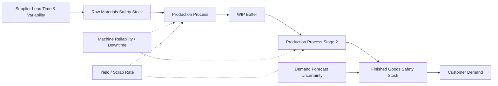

## Manufacturing and production inventory challenges

### Overview

Manufacturing inventory management differs structurally from retail and pure distribution in one fundamental respect: inventory is not held purely to buffer demand uncertainty against a purchased good, but must also buffer **production system uncertainty** — machine downtime, yield loss, changeover time, and multi-level bill-of-materials (BOM) dependencies — while simultaneously serving as a direct input to a value-adding transformation process rather than only being resold as-is. This creates safety stock and inventory challenges at multiple tiers (raw materials, WIP, finished goods) with interdependencies that pure single-echelon retail or distribution safety stock formulas do not directly address.

### The Three-Tier Manufacturing Inventory Problem

Each tier's safety stock requirement is driven by different uncertainty sources, and — critically — uncertainty at one tier propagates into requirements at adjacent tiers, unlike a retail network where store-level safety stock is driven primarily by demand uncertainty alone.

### Challenge 1: Bill of Materials (BOM) Dependency and Multi-Level Safety Stock

Manufactured products typically consist of multiple components, sub-assemblies, and raw materials, each following its own supply lead time and variability profile. Finished goods availability depends on the *simultaneous* availability of every required component — a single stocked-out component can halt production regardless of how well every other component's safety stock is managed.

**Key Points**

- **MRP (Material Requirements Planning)** logic explodes a finished-goods production plan (from the demand forecast) down through the BOM to derive component-level gross requirements, net against on-hand and on-order component inventory, and time-phase component orders against component lead times — this is the core mechanism by which finished-goods demand forecasting connects to component-level safety stock and reorder decisions
- **Safety stock at each BOM level should reflect that level's own supply uncertainty**, not simply inherit the finished-goods service level target uniformly — a component with a highly reliable, short-lead-time domestic supplier may need minimal safety stock even for a finished good targeting a high service level, while a component with a long-lead-time, single-source international supplier may need substantial safety stock even for a lower-priority finished good, if that component's unreliability would otherwise become the binding constraint on production
- **Bottleneck component identification**: production planning should identify which components have the longest lead time and highest variability (frequently, but not always, the most expensive or most specialized components) and prioritize safety stock and multi-sourcing investment there, since these are disproportionately likely to constrain finished-goods availability

### Challenge 2: Yield and Scrap Rate Uncertainty

Manufacturing processes rarely convert 100% of input materials into usable output — yield loss (scrap, rework, quality rejects) introduces a distinct uncertainty source not present in pure distribution/retail inventory problems, where a unit received is generally a unit available for sale.

$$\text{Required Input Quantity} = \frac{\text{Target Output Quantity}}{\text{Expected Yield Rate}}$$

When yield rate itself is variable (not a fixed constant), this variability functions similarly to the supply-quantity uncertainty discussed in the TCO material's treatment of supplier defect rates — it should be incorporated as an additional variance component feeding into the combined uncertainty used to size raw material and WIP safety stock, alongside demand and lead time uncertainty:

$$\sigma_{effective}^2 = \sigma_{D,LT}^2 + (\text{Output Quantity})^2 \cdot \sigma_{yield}^2$$

**Example**

A process with expected 95% yield but yield rate variability ($\sigma_{yield} = 3\%$) requires raw material safety stock buffering not just against demand and lead time uncertainty, but against the possibility that a given production run yields materially below the expected 95%, which could otherwise cause a finished-goods shortfall even with adequate raw material *ordered*.

### Challenge 3: Machine Reliability and Capacity-Driven Stockout Risk

Unlike a distribution stockout (driven by insufficient inventory arriving in time), a manufacturing "stockout" of finished goods can occur even with adequate raw material inventory, if production capacity itself is disrupted — unplanned machine downtime, changeover delays, or capacity constraints during demand peaks.

- **WIP buffers between production stages** serve a role analogous to safety stock, but sized against machine reliability/uptime statistics (Mean Time Between Failures, Mean Time To Repair) rather than purely demand uncertainty — a stage with unreliable upstream equipment requires a larger WIP buffer to keep downstream stages running through upstream downtime
- **Overall Equipment Effectiveness (OEE)**, a standard manufacturing metric combining availability, performance, and quality rate, is a relevant input to sizing WIP buffers: lower OEE processes justify larger buffers to absorb their higher effective output variability
- **Changeover time and batch sizing interaction**: processes with long changeover times between different products favor larger batch sizes (to amortize changeover cost across more units), which increases cycle stock — directly connecting to the EOQ and holding cost trade-off discussed in the financial dimensions material, but with changeover time functioning similarly to the fixed ordering cost $S$ in the EOQ formula

### Challenge 4: Push-Pull Boundary and Postponement Strategy

A central manufacturing inventory design decision is **where in the production process to hold safety stock** relative to the point of product differentiation — commonly framed as the push-pull boundary or decoupling point.

**Key Points**

- **Make-to-stock (MTS)**: finished goods safety stock held complete and ready to ship, appropriate when demand is predictable enough and lead time tolerance is short enough that waiting for a build-to-order cycle isn't viable
- **Make-to-order (MTO)**: no finished goods safety stock; production begins only upon customer order, appropriate for highly customized, low-volume, or very high-value products where holding finished-goods safety stock is prohibitively expensive or impractical (e.g., configured industrial equipment)
- **Assemble-to-order / Postponement**: safety stock held at a semi-finished, generic stage (before product-specific differentiation — e.g., paint color, final configuration), with final differentiation deferred until actual demand is known. This is a specific and powerful application of the risk-pooling concept from the retail multi-echelon discussion: pooling safety stock across what would otherwise be many differentiated finished-good SKUs into fewer, more predictable generic/semi-finished SKUs, then postponing the variability-inducing differentiation step as late as possible
- Choosing the decoupling point is a direct trade-off between the holding-cost/risk-pooling benefit of postponement and the responsiveness cost of a longer post-order lead time — the same demand-lead-time trade-off structure underlying every safety stock formula in this material, applied to a strategic process-design decision rather than a parameter-tuning decision

### Challenge 5: Batch and Lot Size Constraints

Manufacturing processes frequently impose minimum batch/lot sizes driven by equipment or process chemistry constraints (e.g., a reactor vessel with a fixed minimum charge size, a furnace run with a minimum economical load) — distinct from the MOQ concept in procurement (a supplier-imposed constraint) but functionally similar in its effect on cycle stock: production lot sizes larger than immediate net requirements increase average inventory independent of the safety stock calculation, similarly to the MOQ effect discussed in the TCO material.

### Challenge 6: Engineering Changes and Component Obsolescence

Manufacturing inventory carries a distinct obsolescence risk source not present in most retail/distribution contexts: **engineering change orders (ECOs)** that modify a product's BOM, potentially rendering existing raw material or component inventory obsolete mid-production-run, independent of end-customer demand changes.

- **Phase-in/phase-out planning**: coordinating the depletion of old-component inventory against the ramp-up of new-component inventory during an engineering change, analogous to the end-of-life final-buy planning discussed in the product lifecycle material, but triggered by internal design changes rather than external demand decline
- **Engineering change lead time visibility**: safety stock and procurement systems should ideally receive advance notice of planned engineering changes (from product engineering/PLM systems) far enough ahead of the change to avoid over-ordering soon-to-be-obsolete components — a systems integration requirement extending the forecasting/planning/execution integration architecture to include product engineering data as an additional upstream input

### Manufacturing-Specific Technology Patterns

- **MRP/ERP systems** (SAP, Oracle, Infor) remain the dominant system-of-record for BOM explosion, component netting, and time-phased procurement/production scheduling in manufacturing, distinct from the retail-specific allocation/replenishment engines discussed in the retail chapter
- **Advanced Planning and Scheduling (APS) systems** layer finite-capacity scheduling on top of MRP's infinite-capacity assumption, explicitly modeling machine capacity constraints — relevant because standard MRP logic does not inherently account for the machine-reliability-driven stockout risk discussed above
- **Manufacturing Execution Systems (MES)** provide the shop-floor execution-layer data (actual yield, actual cycle time, actual downtime) that should feed back into the safety stock and buffer-sizing calculations at each tier, functioning as the manufacturing-specific instance of the execution-layer feedback loop discussed in the systems integration material

### Common Pitfalls

- **Applying a single, uniform safety stock service level target across all BOM levels** rather than differentiating by each component's own lead time, variability, and criticality to production continuity — this both overinvests in reliable, low-risk components and underinvests in the bottleneck components that actually constrain output
- **Treating yield/scrap rate as a fixed planning constant** rather than a variable input with its own uncertainty distribution, understating the effective input material safety stock needed to reliably hit output targets
- **Sizing WIP buffers using demand-uncertainty-based safety stock formulas** rather than methods appropriately reflecting machine reliability statistics (MTBF/MTTR, OEE) — a WIP buffer problem is fundamentally a different statistical problem than a demand-uncertainty problem, even though both are colloquially called "safety stock"
- **Not coordinating engineering change timing with inventory depletion planning**, resulting in obsolete component write-offs when design changes are implemented without adequate advance notice to procurement and inventory planning systems
- **Choosing a push-pull decoupling point based on historical convention rather than an explicit trade-off analysis** between postponement's risk-pooling/holding-cost benefit and its responsiveness cost — this is a strategic inventory design decision warranting the same rigor as the safety stock formula parameterization discussed throughout this material, not a fixed characteristic of a product category [Inference: the optimal decoupling point is product- and market-specific and shifts over a product's lifecycle, and is not governed by a single general rule].

**Related Topics**

- MRP/BOM explosion logic and multi-level component netting
- Postponement and the push-pull decoupling point as a strategic inventory design decision
- Overall Equipment Effectiveness (OEE) and its relationship to WIP buffer sizing
- Engineering change order (ECO) coordination with inventory depletion planning
- Advanced Planning and Scheduling (APS) and finite-capacity production scheduling
- Yield/scrap rate uncertainty modeling as a supply-side variance component