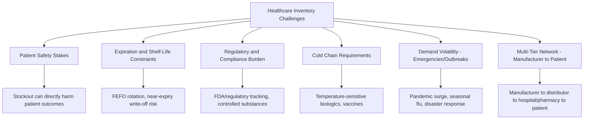

## Healthcare and pharmaceutical inventory management

### Overview

Healthcare and pharmaceutical inventory management operates under constraints fundamentally different from commercial retail or manufacturing: stockouts carry direct patient-safety consequences rather than purely financial ones, products are subject to strict regulatory control and expiration dating, and demand can shift from stable and predictable to extreme and unpredictable during public health emergencies. These characteristics mean the standard safety stock trade-off — balancing holding cost against stockout cost — must incorporate patient-safety and regulatory cost dimensions that are difficult to monetize using the frameworks developed for commercial inventory, while still requiring the same underlying statistical and financial discipline.

### Structural Characteristics of Healthcare Inventory

### Challenge 1: Stockout Cost Is a Patient Safety Question, Not Only a Financial One

The stockout cost term in the standard safety stock trade-off ($SS = z \cdot \sigma_{D,LT}$, where $z$ is chosen to reflect the relative cost of stockout vs. holding) is conventionally derived from lost margin or customer goodwill. In healthcare, a stockout of a critical medication or supply can directly translate into delayed or foregone treatment, with consequences that resist standard financial quantification.

**Key Points**

- This typically manifests as **service level targets set substantially higher than a pure cost-minimization calculation would produce** for life-critical items (emergency medications, blood products, critical care supplies) — the target service level itself becomes a clinical/regulatory policy decision rather than purely an economic optimization output
- **Criticality-based segmentation** (an extension of the ABC/XYZ framework discussed in the S&OP alignment material) is standard practice: classifying items by clinical criticality (e.g., life-saving/emergency vs. elective/non-critical) as the primary segmentation axis, with service level and safety stock policy set accordingly — often independent of, or only loosely coupled to, the item's dollar value or demand volume, which are the more typical ABC segmentation drivers in commercial contexts
- **Therapeutic substitutability** matters analogously to the retail substitution/switching distinction discussed earlier: a stockout on a drug with clinically acceptable therapeutic alternatives carries lower patient-safety risk than a stockout on a drug with no substitute, and this should differentiate safety stock policy even within the same nominal criticality tier

### Challenge 2: Expiration Dating and Shelf-Life-Constrained Safety Stock

Pharmaceuticals, biologics, and many medical supplies carry fixed expiration dates, introducing a hard constraint absent from most non-perishable inventory problems: safety stock cannot simply be held indefinitely as a buffer — it must be rotated and consumed within its shelf life or written off.

- **First-Expired-First-Out (FEFO)** inventory rotation, rather than the FIFO/LIFO valuation conventions discussed in the balance sheet material, is the standard operational discipline — inventory must be picked/dispensed in expiration-date order, not receipt order, requiring lot/expiration-date tracking at a granularity beyond typical non-perishable inventory systems
- **Shelf-life-adjusted safety stock**: for short-shelf-life products, the standard safety stock formula must be constrained against the product's shelf life — a statistically "optimal" safety stock quantity is not viable if it cannot realistically be consumed before expiration given the item's demand velocity, requiring an explicit shelf-life feasibility check analogous to the warehouse-capacity feasibility check discussed in the S&OP material
- **Expiration-driven obsolescence cost** is a direct, highly visible instance of the obsolescence cost component of the holding cost rate $H$ (as decomposed in the balance sheet material) — for short-shelf-life items, this component can dominate the holding cost rate, more so than in most commercial inventory contexts, materially lowering the economically optimal safety stock quantity relative to what a formula using a generic holding cost rate would suggest

### Challenge 3: Cold Chain and Storage-Constrained Inventory

Biologics, vaccines, and many specialty pharmaceuticals require continuous temperature-controlled storage and transport (cold chain), introducing both a cost dimension (specialized storage capacity is expensive and often capacity-constrained, similar to the store-level shelf-space constraint discussed in retail) and a risk dimension (a cold chain excursion — temperature deviation — can render inventory unusable regardless of remaining shelf life, functioning as an additional stochastic loss/yield-uncertainty source analogous to the manufacturing yield-uncertainty discussion).

**Key Points**

- Cold chain capacity constraints frequently impose a harder physical ceiling on safety stock than the financial/statistical optimum, similar in structure to the retail store-capacity constraint, requiring safety stock policy to be reconciled against available cold storage capacity as a feasibility check
- Temperature-monitoring IoT sensors (connecting to the broader IoT/real-time data integration patterns discussed in the digital twin and control tower material) are increasingly used to provide continuous cold chain integrity visibility, feeding exception-based alerting when a storage or transport excursion risks compromising inventory — a healthcare-specific application of the control tower exception management pattern

### Challenge 4: Regulatory and Compliance Requirements

Healthcare inventory is subject to substantially heavier regulatory oversight than most commercial inventory categories:

- **Controlled substance tracking**: medications subject to controlled substance regulation require detailed chain-of-custody tracking (who ordered, received, dispensed each unit) beyond standard inventory transaction logging, with regulatory reporting obligations that inventory systems must support as a compliance requirement, not merely an operational convenience
- **Track-and-trace / serialization requirements**: many jurisdictions mandate serialized, lot-level tracking of pharmaceutical products through the supply chain (e.g., the US Drug Supply Chain Security Act, DSCSA) specifically to prevent counterfeit product entry and enable rapid recall response — this materially increases the data granularity inventory systems must capture and maintain relative to typical commercial inventory tracking
- **Recall management**: the ability to rapidly identify and quarantine/remove affected lots across the entire distribution network in response to a manufacturer recall is a healthcare-specific inventory system capability with direct patient-safety stakes, requiring the lot-level traceability noted above to be operationally usable, not just regulatory theater
- **Documentation and audit trail requirements**: regulatory audits of inventory handling practices (proper storage conditions maintained, proper disposal of expired product, proper chain of custody for controlled substances) impose system and process requirements beyond what inventory accuracy alone would require

### Challenge 5: Demand Volatility During Public Health Emergencies

Outbreak, pandemic, and disaster-response scenarios can produce demand shifts orders of magnitude beyond the historical variability that standard statistical safety stock formulas are calibrated to handle — this is a more extreme version of the non-stationarity problem discussed in the product lifecycle and ML forecasting material, but with substantially higher stakes and shorter reaction windows.

- **Standard statistical safety stock formulas are poorly suited to genuine emergency demand spikes** by design — a formula calibrated on historical $\sigma_D$ from normal operating conditions will systematically and severely underestimate the safety stock needed to buffer a pandemic-scale demand surge, since such an event falls far outside the historical distribution the formula was calibrated against
- **Scenario-based emergency stockpile planning**, distinct from statistical safety stock calculus, is the standard complementary approach: maintaining strategic reserve stock sized against explicit emergency scenarios (e.g., a defined pandemic response plan) rather than a probabilistic formula, recognizing that historical demand data provides limited guidance for genuinely novel emergency conditions
- **Surge capacity and rapid reallocation** (national/regional stockpile systems, emergency manufacturing capacity agreements, cross-network reallocation protocols) function as an alternative or complementary risk mitigation strategy to holding very large routine safety stock, similar in spirit to the dual-sourcing risk-diversification trade-off discussed in the TCO material, but implemented through emergency response infrastructure rather than routine dual-sourcing arrangements
- Digital twin simulation (as discussed earlier) has direct applicability to healthcare emergency preparedness planning — simulating network-wide impact of a demand surge scenario before it occurs, to identify where strategic reserve positioning would be most effective

### Challenge 6: Multi-Tier Network From Manufacturer to Patient

The healthcare supply chain typically involves more intermediary tiers than commercial retail: manufacturer → wholesale distributor → hospital/pharmacy central supply → point-of-care/dispensing unit → patient, each with its own inventory holding and safety stock decision, echoing the multi-echelon complexity discussed in the retail chapter but with additional regulatory handoffs at each tier.

- **Hospital-level point-of-care inventory** (e.g., automated dispensing cabinets on hospital units) functions similarly to retail store-level inventory — subject to physical capacity constraints and requiring real-time integration with central pharmacy inventory systems for accurate replenishment triggering, directly paralleling the omnichannel/store-level challenges discussed in the retail chapter
- **Group Purchasing Organizations (GPOs)** aggregate procurement volume across many healthcare providers, a structural feature with TCO implications similar to the sourcing consolidation trade-offs discussed in the TCO material — better unit pricing through volume aggregation, potentially traded off against reduced sourcing flexibility for individual member organizations

### Common Pitfalls

- **Applying a uniform, dollar-value-driven ABC segmentation** (as commonly used in commercial inventory) without an overlaying clinical-criticality segmentation, resulting in service level policy that is statistically optimal by cost but misaligned with actual patient-safety priorities
- **Sizing safety stock for short-shelf-life products using a formula that ignores the shelf-life feasibility constraint**, producing quantities that cannot realistically be consumed before expiration and driving avoidable write-off cost
- **Relying solely on statistical safety stock formulas for emergency preparedness**, rather than maintaining a distinct, scenario-based strategic stockpile planning process — historical demand-variability-based formulas are structurally unsuited to genuinely novel emergency conditions, and treating them as sufficient for emergency preparedness is a common and consequential planning gap
- **Underinvesting in lot-level traceability infrastructure** until a regulatory audit or recall event exposes the gap, rather than treating serialization/track-and-trace capability as a foundational system requirement from the outset
- **Treating cold chain and storage capacity as a soft constraint** in safety stock calculations rather than a hard feasibility check, risking either infeasible safety stock recommendations or unplanned cold chain capacity investment [Inference: the appropriate balance between statistical safety stock and strategic emergency stockpiling is a policy decision shaped by public health governance considerations beyond pure inventory economics, and varies significantly by jurisdiction and institution type].

**Related Topics**

- Criticality-based (clinical) segmentation as an alternative to dollar-value ABC classification
- FEFO rotation and shelf-life-constrained safety stock feasibility
- Track-and-trace/serialization systems (e.g., DSCSA) and recall management capability
- Cold chain integrity monitoring via IoT temperature sensors
- Scenario-based strategic stockpile planning versus statistical safety stock formulas
- Group Purchasing Organizations (GPOs) and their TCO implications for healthcare procurement