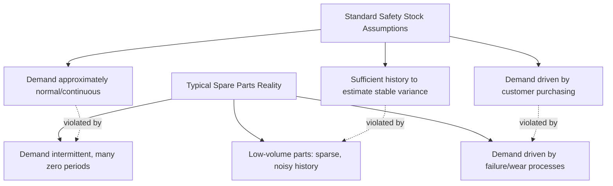
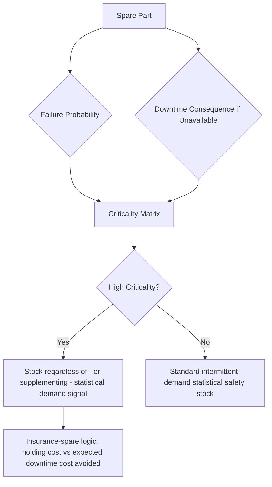

## Spare parts and MRO inventory management


### Overview

Spare parts and Maintenance, Repair, and Operations (MRO) inventory presents a distinct set of statistical and economic challenges relative to every inventory category covered so far: demand is overwhelmingly **intermittent** (long stretches of zero demand punctuated by occasional, often unpredictable, requirements), the cost of a stockout is frequently driven by asset downtime rather than lost sales margin, and the demand-generating process itself is fundamentally different — component failure — rather than customer purchasing behavior. This combination means the standard safety stock formulas developed around normally-distributed, continuous demand (covered throughout earlier chapters) are frequently the *wrong tool* for a large share of a typical spare parts catalog, and intermittent-demand-specific methods become the primary rather than exceptional approach.

### Why Spare Parts Demand Breaks Standard Safety Stock Assumptions



**Key Points**

- Applying a normal-distribution-based safety stock formula ($SS = z \cdot \sigma_D \sqrt{L}$) to intermittent demand data tends to produce either wildly inflated safety stock (if the sporadic large-demand periods drive up the calculated $\sigma_D$) or an unreliable, noisy estimate that shifts significantly with each new data point — neither outcome reflects the true underlying risk well
- Spare parts catalogs typically contain an extreme long tail: a small number of high-usage consumable/wear parts that behave more like conventional continuous-demand inventory, alongside a large number of low-usage, critical, often expensive parts (e.g., major component spares) that are genuinely intermittent and require fundamentally different treatment — segmentation by demand pattern type, not just value, is a foundational step

### Demand Classification Framework

Before applying any forecasting or safety stock method, spare parts should be classified by their demand pattern, most commonly using the **Syntetos-Boylan classification**, which segments demand based on two statistics computed from historical demand history:

- **Average demand interval (ADI)**: average number of periods between non-zero demand occurrences
- **Coefficient of variation squared (CV²)** of demand size, computed only over non-zero-demand periods

| Category | ADI | CV² | Characteristics | Recommended Method |
| --- | --- | --- | --- | --- |
| Smooth | Low | Low | Regular, low-variability demand | Standard methods (exponential smoothing, classical safety stock) |
| Erratic | Low | High | Frequent but highly variable demand size | Standard interval methods, but with variance-robust safety stock |
| Intermittent | High | Low | Sporadic but consistent demand size when it occurs | Croston's method or SBA |
| Lumpy | High | High | Sporadic AND highly variable demand size | Most difficult category — TSB, bootstrapping, or specialized lumpy-demand methods |

This classification directly determines which forecasting method from the toolkit developed earlier is appropriate — it is the diagnostic step that should precede any safety stock calculation for a spare parts catalog, rather than defaulting uniformly to the continuous-demand methods appropriate for retail or manufacturing finished goods.

### Croston's Method and Extensions

**Croston's method** is the foundational intermittent-demand forecasting approach, forecasting demand *size* and demand *interval* (time between non-zero demand events) as two separate exponentially-smoothed series, rather than forecasting demand directly period-by-period as classical methods do:

$$\hat{z}_t = \alpha z_t + (1-\alpha)\hat{z}_{t-1} \quad \text{(demand size, updated only at non-zero periods)}$$


$$\hat{p}_t = \alpha p_t + (1-\alpha)\hat{p}_{t-1} \quad \text{(inter-demand interval)}$$


$$\hat{D}_t = \frac{\hat{z}_t}{\hat{p}_t}$$

**Known limitation and correction**: Croston's method has a documented positive bias in its demand rate estimate. The **Syntetos-Boylan Approximation (SBA)** corrects this with a bias-adjustment factor:

$$\hat{D}_t^{SBA} = \left(1 - \frac{\alpha}{2}\right) \frac{\hat{z}_t}{\hat{p}_t}$$

**TSB (Teunter-Syntetos-Babai) method** further refines this by updating the demand probability (rather than interval) at every period, not just at non-zero demand occurrences — this makes TSB more responsive to a part transitioning toward obsolescence (declining demand probability), directly relevant to the decline-stage and end-of-life dynamics discussed in the product lifecycle material, where a spare part's demand probability genuinely shifts over time as the parent equipment population ages or is retired.

```python
def croston_sba(demand_history, alpha=0.1):
    """Simplified Croston's method with SBA bias correction."""
    z, p = None, None
    interval = 0
    forecasts = []

    for d in demand_history:
        interval += 1
        if d > 0:
            if z is None:
                z, p = d, interval
            else:
                z = alpha * d + (1 - alpha) * z
                p = alpha * interval + (1 - alpha) * p
            interval = 0
        forecast = (1 - alpha / 2) * (z / p) if z else 0
        forecasts.append(forecast)

    return forecasts
```

### Safety Stock for Intermittent Demand

The classical $SS = z \cdot \sigma_D \sqrt{L}$ formula assumes normally distributed demand — a poor fit for intermittent demand, which is frequently better modeled with distributions that can represent a probability mass at zero combined with a skewed positive tail:

- **Negative binomial or Poisson-based safety stock formulas**: more appropriate distributional assumptions for count-based, intermittent spare parts demand than the normal distribution, directly connecting to the distributional forecasting approaches (DeepAR's negative binomial output, for instance) discussed in the probabilistic forecasting material
- **Bootstrapping / empirical simulation methods**: rather than assuming a parametric distribution, resampling directly from historical demand-during-lead-time observations (or simulating many demand-during-lead-time realizations from the fitted Croston/TSB demand-size and interval parameters) to build an empirical distribution, then reading off the desired service-level quantile directly — a direct application of the Monte Carlo approach discussed in the probabilistic forecasting and digital twin material, particularly valuable here given how poorly a normal-distribution closed-form approximation fits intermittent demand
- **Service level definition matters more here than in continuous-demand contexts**: for very low-volume, intermittent parts, a "95% cycle service level" can imply near-zero stockout tolerance across dozens of replenishment cycles, which may translate into an economically disproportionate safety stock relative to the part's low usage — practitioners frequently use **fill rate** (percentage of demand met from stock, rather than percentage of cycles without any stockout) as a more appropriate and interpretable service metric for intermittent, low-volume parts

### Criticality-Driven Stocking, Not Just Statistical Stocking

**Key Points**

- For MRO/spare parts specifically, a purely statistical, demand-driven safety stock approach is frequently insufficient or inappropriate on its own — many critical spares are stocked not because statistical demand history justifies it, but because the **cost of asset downtime** if the part is unavailable vastly exceeds any reasonable holding cost, even for a part that may never actually be needed during the planning horizon
- This is conceptually similar to the healthcare criticality-segmentation approach discussed in the previous chapter: a **criticality/risk matrix** combining (a) probability of failure/demand and (b) consequence of stockout (downtime cost, safety risk, regulatory risk) is the standard framework for spare parts stocking decisions, with statistical demand forecasting informing but not solely determining the stocking decision for high-criticality items
- **Insurance-spare logic**: for a single, highly critical, expensive, long-lead-time component with essentially unpredictable failure timing (e.g., a major piece of production equipment with no substitute and a multi-month replacement lead time), the stocking decision more closely resembles an insurance/risk-management decision — comparing the holding cost of stocking one unit against the expected value of downtime cost avoided — than a conventional service-level-driven safety stock calculation



### Condition-Based and Predictive Maintenance Integration

A meaningful trend in MRO inventory is shifting from purely reactive/statistical failure-based demand estimation toward **predictive maintenance** signals that provide advance warning of an impending part requirement, directly improving on Croston-family methods' fundamentally backward-looking nature.

- **IoT sensor-based condition monitoring** (vibration analysis, thermal imaging, oil analysis, similar to the cold-chain and real-time monitoring patterns discussed elsewhere) can provide leading indicators of impending component failure, allowing a spare part reorder to be triggered by an actual degradation signal rather than only a statistical demand rate — functionally shifting the demand-generating signal from a lagging historical average to a live, asset-specific leading indicator
- **Remaining Useful Life (RUL) models**, a machine learning application distinct from but related to the demand forecasting ML methods discussed earlier, predict time-to-failure for specific monitored assets, which can be aggregated across an asset population to produce a probabilistic forecast of aggregate spare part demand — directly analogous in structure to the probabilistic/quantile demand forecasting methods covered earlier, but built from asset-condition data rather than historical sales/consumption data
- This connects to the digital twin concept discussed earlier: a digital twin of a physical asset fleet, continuously updated from condition-monitoring data, can simulate fleet-wide spare part demand scenarios under different maintenance and replacement policies, a direct MRO-specific application of that broader architecture

### Multi-Site Pooling for Spare Parts

Given how sparse individual-site demand typically is for critical spares, **inventory pooling across multiple sites/plants** (holding a shared safety stock at a central location serving multiple facilities, rather than each site holding its own) is a particularly high-leverage application of the risk-pooling principle discussed in the retail multi-echelon material — the effect is proportionally larger here than in retail, precisely because individual-site spare parts demand is so low and sporadic that pooling produces a much larger relative reduction in aggregate safety stock requirement for a given network-wide service level.

**Key Points**

- The trade-off is the same structural one as in retail risk pooling: centralizing spares reduces total network holding cost/inventory but increases the effective lead time to any single site (transportation time from the pooled location), which matters more for spare parts than for retail given how directly spare-part lead time translates into asset downtime duration
- **Expedited/emergency logistics arrangements** (helicopter delivery, dedicated courier) for pooled critical spares are a common complementary strategy, effectively purchasing faster expected delivery to offset the lead-time cost of centralization, directly analogous to how dual-sourcing purchases risk reduction at a price premium in the TCO framework

### Common Pitfalls

- **Applying standard continuous-demand safety stock formulas uniformly across an MRO catalog** without first classifying demand patterns via ADI/CV² segmentation, producing either wildly inflated stock on erratic/lumpy items or unreliable, noisy safety stock recommendations
- **Using service-level metrics (cycle service level) that don't translate meaningfully at very low demand volumes**, obscuring the actual economic and operational trade-off being made — fill rate or explicit downtime-cost-based analysis is frequently more appropriate and interpretable for low-volume critical spares
- **Relying purely on statistical demand forecasting for high-criticality, low-probability, high-consequence parts**, when the stocking decision should be explicitly grounded in a criticality/downtime-cost framework rather than treated as a conventional demand-forecasting problem
- **Not leveraging multi-site pooling for shared critical spares**, leaving redundant safety stock scattered across facilities when a centralized, appropriately-expedited pooled inventory would achieve the same service level at materially lower total holding cost
- **Treating predictive maintenance/condition-monitoring investment and spare parts inventory optimization as separate initiatives** rather than an integrated system, missing the opportunity to shift from purely lagging, statistical demand signals to leading, asset-condition-based demand signals that can materially improve both service level and inventory efficiency simultaneously [Inference: the magnitude of improvement from integrating predictive maintenance with spares inventory is asset- and industry-specific, and is not established by a single general benchmark].

**Related Topics**

- Syntetos-Boylan demand classification (ADI/CV²) as a segmentation prerequisite
- Croston's method, SBA, and TSB for intermittent and lumpy demand forecasting
- Bootstrapping and Monte Carlo approaches to intermittent-demand safety stock
- Criticality/risk matrices and insurance-spare stocking logic
- Predictive maintenance, condition monitoring, and Remaining Useful Life (RUL) modeling
- Multi-site spare parts pooling and expedited logistics trade-offs