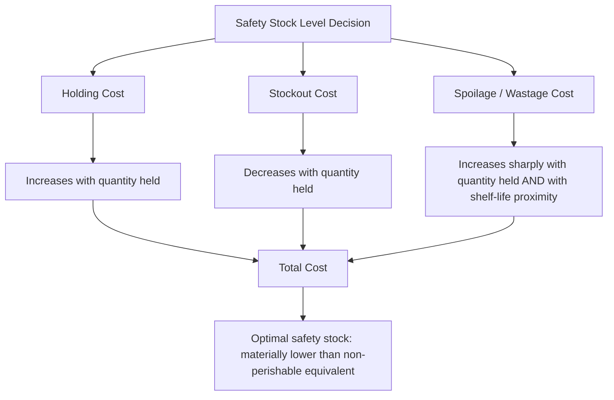

## Perishable and short-shelf-life inventory management


### Overview

Perishable inventory management extends the shelf-life-constrained safety stock problem introduced in the healthcare chapter to its most general and often most extreme form: products (fresh food, flowers, certain pharmaceuticals, blood products, some chemicals) where the usable window is measured in days rather than months or years, and where quality degradation is frequently continuous and graded rather than a hard binary expiration cutoff. This fundamentally changes the safety stock optimization problem: the standard trade-off between holding cost and stockout cost must be reformulated to include a **third, often dominant cost term — spoilage/wastage cost** — that grows directly with how much safety stock is held and how long it sits.

### The Three-Way Trade-off

Where conventional safety stock calculus (covered throughout earlier chapters) balances holding cost against stockout cost, perishable inventory management balances three costs simultaneously:



**Key Points**

- Because spoilage cost rises sharply as held inventory approaches its shelf-life limit — and because that cost applies specifically to inventory that goes *unsold*, not merely inventory that is held — the economically optimal safety stock for a perishable item is systematically **lower** than what the standard $SS = z \cdot \sigma_{D,LT}$ formula alone would recommend, once spoilage cost is properly incorporated
- This is the same structural insight as the shelf-life feasibility constraint discussed in the healthcare chapter, generalized: for perishables, shelf-life-driven cost isn't just a feasibility check on an otherwise-standard calculation, it fundamentally reshapes the optimization itself

### The Newsvendor Model as the Foundational Framework

The **newsvendor model**, a classical single-period inventory optimization framework, is the standard theoretical foundation for perishable inventory decisions, precisely because it was originally developed for exactly this problem: a newspaper vendor must decide how many papers to stock for a single day, facing both stockout cost (lost sales if demand exceeds stock) and complete write-off cost (unsold papers have zero salvage value the next day) — structurally identical to a single-day fresh-food ordering decision.

The newsvendor **critical ratio** determines the optimal order-up-to quantile of the demand distribution:

$$CR = \frac{C_u}{C_u + C_o}$$

Where $C_u$ = cost of understocking (stockout cost per unit — lost margin, and for healthcare-adjacent perishables, patient impact) and $C_o$ = cost of overstocking (spoilage/write-off cost per unit, net of any salvage value). The optimal stocking quantity is the $CR$-th quantile of the demand distribution:

$$Q^* = F^{-1}(CR)$$

**Key Points**

- This directly generalizes the quantile-based safety stock approach discussed in the probabilistic forecasting material ($SS = P_z(\text{Demand}_{LT}) - \hat{D}_{LT}$), but replaces the conventional service-level-derived $z$ with a $CR$ explicitly derived from the *relative economics* of understocking versus overstocking — for perishables, this ratio is frequently much closer to 0.5 (balanced) or even below it (overstocking more costly than understocking) than the high service-level-driven ratios (0.90–0.99) typical of non-perishable safety stock targets
- **Salvage value** matters materially here: a perishable item with some secondary market or markdown-recovery value (e.g., near-expiry food sold at discount, as in the retail markdown management discussed earlier) has a lower effective $C_o$ than one with zero salvage value (e.g., an expired pharmaceutical requiring costly regulated disposal), directly shifting the optimal $CR$ and thus the optimal stocking quantity upward or downward

### Extending Newsvendor to Multi-Period Perishable Inventory

Most real perishable inventory decisions are not truly single-period — inventory carries over from one period to the next (multi-day shelf life, not strictly one-day), requiring extensions beyond the base single-period newsvendor model:

- **Age-structured inventory models**: explicitly tracking inventory by remaining shelf-life age cohort (e.g., days-until-expiry buckets) rather than a single aggregate on-hand quantity, since a unit with 1 day of remaining shelf life has fundamentally different economic value and stockout-risk-reduction contribution than a freshly-received unit with a full shelf life remaining
- **FEFO-driven depletion modeling**: as discussed in the healthcare chapter, First-Expired-First-Out issuing policy should be explicitly modeled in any multi-period perishable simulation or optimization, since the *order* in which inventory is consumed materially affects realized spoilage — a system that models only aggregate on-hand quantity without FEFO sequencing will misestimate spoilage risk
- **Dynamic/rolling reorder decisions**: rather than a single newsvendor decision, most perishable inventory management is an ongoing daily or near-daily replenishment decision, requiring dynamic programming or simulation-based approaches (directly connecting to the Monte Carlo/simulation methods discussed in the probabilistic forecasting and digital twin material) to properly account for the interaction between today's order, existing aged inventory, and future demand/spoilage uncertainty

```python
# Simplified age-structured perishable inventory simulation
import numpy as np

def simulate_perishable_inventory(shelf_life_days, demand_dist, order_policy, n_days=90):
    inventory_by_age = np.zeros(shelf_life_days)  # index 0 = freshest
    total_spoilage = 0
    total_stockout = 0
    history = []

    for day in range(n_days):
        # Age inventory by one day; oldest bucket (about to expire) is at the end
        expiring_today = inventory_by_age[-1]
        total_spoilage += expiring_today
        inventory_by_age = np.roll(inventory_by_age, 1)
        inventory_by_age[-1] = 0
        inventory_by_age[0] = 0  # freshest slot cleared before today's receipt

        # Receive today's order (from prior decision, simplified as same-day here)
        order_qty = order_policy(inventory_by_age, day)
        inventory_by_age[0] = order_qty

        # Demand fulfilled FEFO: consume from oldest (highest index with stock) first
        demand = demand_dist()
        for age in range(shelf_life_days - 1, -1, -1):
            if demand <= 0:
                break
            consumed = min(demand, inventory_by_age[age])
            inventory_by_age[age] -= consumed
            demand -= consumed
        total_stockout += max(0, demand)

        history.append({
            'day': day,
            'on_hand': inventory_by_age.sum(),
            'spoiled_today': expiring_today,
        })

    return {'total_spoilage': total_spoilage, 'total_stockout': total_stockout, 'history': history}
```

This illustrates the core structural pattern (age-tracked inventory, FEFO consumption, per-period spoilage measurement) that underlies more sophisticated production perishable-inventory optimization systems; real implementations typically couple this simulation core with an optimization layer searching over ordering policies to minimize total cost. [Inference: specific age-bucket granularity and optimization method vary by product category and are not standardized across implementations.]

### Demand Forecasting Considerations Specific to Perishables

- **Very short forecast horizons dominate**: because inventory cannot be held to smooth over forecast error the way non-perishable safety stock can, forecast accuracy for the immediate 1-3 day horizon matters disproportionately more for perishables than the longer-horizon accuracy that matters for less time-constrained categories — this shifts emphasis toward short-horizon, high-frequency forecast updates rather than longer-horizon strategic forecasting
- **Weather and day-of-week effects are frequently first-order drivers**, not secondary refinements, for fresh food categories specifically — the exogenous-feature ML forecasting approaches discussed earlier (incorporating weather, local events, day-of-week) are less optional and more foundational for perishables than for many other categories
- **Promotional and markdown timing interact directly with spoilage risk**: a markdown decision (as discussed in the retail chapter) for near-expiry perishable inventory is simultaneously a demand-shaping and a spoilage-avoidance decision, requiring closer coordination between pricing/promotion and inventory functions than in non-perishable retail categories, where markdown is more purely a demand/inventory-clearing lever without an imminent hard deadline

### Cold Chain and Handling as a Direct Determinant of Effective Shelf Life

**Key Points**

- Unlike a fixed printed expiration date, many perishables' *effective* remaining shelf life depends materially on how well cold chain and handling conditions have been maintained throughout the upstream supply chain — a temperature excursion during transport can materially shorten actual usable shelf life below the nominal labeled date, directly connecting to the cold chain monitoring discussion in the healthcare chapter
- This introduces an additional source of effective-shelf-life uncertainty that a naive perishable inventory model (assuming every unit has exactly its full nominal shelf life upon receipt) will not capture — more sophisticated systems incorporate received-condition or cold-chain-monitoring data (IoT temperature logging) to adjust the effective remaining shelf life of received inventory downward when handling conditions indicate degradation, rather than relying solely on the printed date

### Supplier and Sourcing Considerations Specific to Perishables

- **Lead time variability matters disproportionately**: because there is no ability to build a large buffer against lead time uncertainty (unlike non-perishable safety stock, where a longer safety stock buffer can absorb lead time variability), perishable sourcing decisions place a premium on supplier lead time *reliability* specifically, over and above the general lead-time-variability considerations discussed in the TCO framework — the same absolute $\sigma_L$ that would be manageable for a non-perishable item can be operationally severe for a perishable one
- **Local/regional sourcing trade-offs**: shorter, more reliable local supply chains are frequently favored for highly perishable categories specifically to minimize both lead time and lead time variability, even at a unit cost premium relative to more distant sourcing options — a direct application of the TCO framework's lead-time-variability-versus-price trade-off, but with the balance point shifted further toward reliability given perishables' reduced tolerance for buffering uncertainty through inventory

### Common Pitfalls

- **Applying standard service-level-driven safety stock formulas without incorporating spoilage cost**, systematically over-stocking perishables relative to the true cost-minimizing quantity once wastage is properly accounted for
- **Modeling aggregate on-hand inventory without age/shelf-life-cohort tracking**, understating spoilage risk by treating all on-hand units as equally fresh and failing to capture the FEFO-driven dynamics that materially affect realized wastage
- **Treating the printed expiration date as a fixed, certain constraint** rather than accounting for cold-chain/handling-driven effective shelf-life variability, particularly for temperature-sensitive categories
- **Underweighting short-horizon forecast accuracy relative to longer-horizon strategic forecasting investment**, when perishable categories specifically benefit most from short-horizon forecasting precision given their inability to buffer forecast error through extended holding
- **Treating markdown/promotional pricing and inventory replenishment as separate, uncoordinated decisions** for near-expiry perishable inventory, missing the joint optimization opportunity between demand-shaping (markdown) and spoilage-avoidance that is specific to the perishable inventory problem [Inference: the magnitude of benefit from joint markdown-replenishment optimization is category- and demand-pattern-specific and not established by a single general benchmark].

**Related Topics**

- Newsvendor model critical ratio and its application to single- and multi-period perishable decisions
- Age-structured (cohort-based) inventory modeling and FEFO-driven depletion simulation
- Cold-chain-adjusted effective shelf-life estimation
- Joint markdown and replenishment optimization for near-expiry inventory
- Short-horizon, high-frequency demand forecasting for fresh food categories
- Local/regional sourcing trade-offs under perishability-driven lead-time-reliability premiums