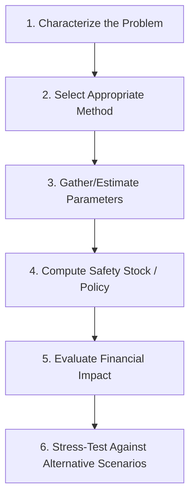

## End-to-end applied case problems

### Overview

This closing chapter synthesizes every framework developed across the preceding material — probabilistic and ML forecasting, systems integration, digital twins and control towers, financial dimensions (holding cost, CCC, TCO), and the industry-specific dynamics of retail, manufacturing, healthcare, and spare parts — into complete, worked case problems. Each case walks through the full analytical sequence a practitioner would actually follow: diagnosing the demand/supply characteristics of the situation, selecting the appropriate forecasting and safety stock methodology, running the calculation, and evaluating the financial and operational consequences of the decision.

### Case Structure and Methodology

Each case below follows this sequence explicitly, referencing the specific frameworks from earlier chapters that apply at each step.

---

### Case 1: Retail — Setting Safety Stock for a Seasonal Fashion Item Under Network Risk Pooling

**Situation**: A retailer sells a fashion item across 40 stores, replenished from one regional DC. The item has a 12-week selling season with limited historical data (a similar item last year, used as an analog). Lead time from DC to store is 3 days, highly reliable ($\sigma_L \approx 0.5$ days). DC replenishment lead time from the supplier is 21 days with $\sigma_L = 5$ days.

**1. Characterize the problem**: New/limited-history item → introduction-stage demand forecasting challenge (product lifecycle chapter). Multi-echelon network (DC → 40 stores) → risk pooling applies (retail chapter). Short selling season → some newsvendor-like character to the overall seasonal buy, layered on top of ongoing in-season replenishment.

**2. Select method**: Analogous forecasting (scale last year's comparable item's weekly sell-through curve by an adjustment factor for known differences — price point, marketing spend) to establish $\hat{D}$ and an initial $\sigma_D$ estimate, since no statistical history exists for this specific item.

**3. Parameters**:

- Store-level: $\hat{D}_{store} = 8$ units/week, $\sigma_{D,store} = 4$ units/week (high relative variability typical of fashion/limited-history items)
- DC-to-store lead time: $L = 3/7$ weeks, $\sigma_L = 0.5/7$ weeks
- Target cycle service level: 95% ($z = 1.65$)

**4. Compute — naive (unpooled) approach**: If each store holds independent safety stock:

$$\sigma_{D,LT,store} = \sqrt{(3/7) \cdot 4^2 + 8^2 \cdot (0.5/7)^2} \approx \sqrt{6.86 + 0.33} \approx 2.68$$

$$SS_{store} = 1.65 \times 2.68 \approx 4.4 \text{ units/store} \Rightarrow 40 \times 4.4 = 176 \text{ units network-wide}$$

**Compute — pooled (DC-held) approach**: Holding safety stock at the DC instead, covering aggregate network demand with a shorter effective coverage requirement per store (assuming DC can rapidly replenish stores):

$$\sigma_{D,LT,network} = \sqrt{40} \times \sigma_{D,LT,store} \approx 6.32 \times 2.68 \approx 16.9 \text{ (aggregate, not simple sum)}$$

$$SS_{DC} = 1.65 \times 16.9 \approx 28 \text{ units at DC, versus 176 distributed across stores}$$

**5. Financial impact**: At $25/unit and $H = 22\%$, unpooled network safety stock costs $176 \times 25 \times 0.22 \approx \$968$/year; DC-pooled costs $28 \times 25 \times 0.22 \approx \$154$/year — an 84% reduction in safety stock holding cost, consistent with the risk-pooling principle from the retail chapter, at the cost of DC-to-store replenishment lead time being the binding constraint on store-level responsiveness.

**6. Stress-test**: Run the analogous-forecast demand assumption through a probabilistic sensitivity check — if actual sell-through in week 1-2 deviates materially from the scaled-analog forecast (a live signal a control tower would flag per the control tower chapter), the analog-based $\sigma_D$ estimate should be replaced with an updated, actuals-informed estimate before the bulk of the season's replenishment decisions are made.

---

### Case 2: Manufacturing — Multi-Level BOM Safety Stock With a Bottleneck Component

**Situation**: A finished product requires two components: Component A (domestic supplier, $L=5$ days, $\sigma_L=1$ day, low cost) and Component B (overseas supplier, $L=45$ days, $\sigma_L=12$ days, single-sourced, moderate cost). Finished-goods demand: $\hat{D}=100$/day, $\sigma_D=15$.

**1. Characterize**: Multi-level BOM dependency (manufacturing chapter) — finished goods availability is gated by whichever component's effective safety stock coverage is weakest, not by an average across components.

**2. Select method**: Standard combined demand-lead-time safety stock formula, applied independently per component, since each component's supply uncertainty is distinct.

**3-4. Compute**:

Component A: $\sigma_{D,LT,A} = \sqrt{5 \cdot 15^2 + 100^2 \cdot 1^2} \approx \sqrt{1125 + 10000} \approx 105.5$; $SS_A = 1.65 \times 105.5 \approx 174$ units

Component B: $\sigma_{D,LT,B} = \sqrt{45 \cdot 15^2 + 100^2 \cdot 12^2} \approx \sqrt{10125 + 1440000} \approx 1204$; $SS_B = 1.65 \times 1204 \approx 1987$ units

**5. Financial impact and bottleneck identification**: Component B, despite potentially lower unit cost than a premium domestic alternative, requires roughly 11x the safety stock coverage of Component A due to its longer, more variable lead time — directly illustrating the TCO principle that unit price alone materially understates Component B's true economic cost once its safety stock burden is included. This also identifies Component B as the clear bottleneck-risk component (manufacturing chapter) warranting priority investment in dual-sourcing or buffer stock relative to Component A.

**6. Stress-test**: Evaluate a dual-sourcing scenario for Component B — a second, higher-cost but shorter-lead-time regional supplier reducing effective $\sigma_L$ to, say, 6 days (via the risk-diversification logic from the TCO chapter), and recompute $SS_B$ to quantify whether the holding-cost savings justify the dual-sourcing price premium.

---

### Case 3: Healthcare — Balancing Statistical Safety Stock Against Shelf-Life and Criticality Constraints

**Situation**: A hospital pharmacy stocks a critical, short-shelf-life injectable medication (21-day shelf life). Demand: $\hat{D} = 3$ units/day, $\sigma_D = 2$ (moderate intermittency). Supplier lead time: $L = 5$ days, $\sigma_L = 1$ day. This medication has no clinically acceptable substitute.

**1. Characterize**: Overlapping constraints — patient-safety-driven high criticality (healthcare chapter) pushes toward a high service level target, while short shelf life (perishable chapter) caps how much safety stock can be usefully held before expiration-driven spoilage becomes the binding cost.

**2. Select method**: Compute the statistically-indicated safety stock at a high service level, then apply a shelf-life feasibility check, then reconcile using newsvendor-style spoilage cost reasoning if the statistical quantity is infeasible given shelf life.

**3-4. Compute**: At $z = 2.33$ (99% service level, reflecting no-substitute criticality):

$$\sigma_{D,LT} = \sqrt{5 \cdot 2^2 + 3^2 \cdot 1^2} \approx \sqrt{20 + 9} \approx 5.39$$

$$SS = 2.33 \times 5.39 \approx 12.6 \text{ units}$$

Combined with average cycle stock ($\hat{D} \times L /2 \approx 7.5$ units reorder-cycle-equivalent), total average on-hand might approach 20 units. At $\hat{D}=3$/day, 20 units represents roughly 6.7 days of average supply — comfortably within the 21-day shelf life, so **no shelf-life infeasibility arises here**; the statistical safety stock is directly usable.

**5. Financial impact**: The holding cost of 12.6 safety stock units is modest in isolation, but the relevant comparison (per the healthcare chapter) is not purely financial — it is against the patient-safety cost of a stockout on a no-substitute critical medication, which justifies the elevated $z=2.33$ target that a pure cost-minimization newsvendor calculation would likely not produce on its own.

**6. Stress-test**: If demand were higher (e.g., $\hat{D}=15$/day, as might occur during a localized outbreak scenario), the same 20-unit-equivalent on-hand quantity would represent only 1.3 days of coverage — well within shelf life, but now demand volatility (not shelf life) would be the binding constraint, and the standard statistical formula would need reassessment against the scenario-based emergency stockpiling approach discussed in the healthcare chapter, since a demand shift of that magnitude likely falls outside the historical distribution the routine formula was calibrated against.

---

### Case 4: Spare Parts — Intermittent Demand Classification and Multi-Site Pooling Decision

**Situation**: A critical pump seal is used across 5 manufacturing plants. Combined historical demand: 18 units over the past 3 years, highly sporadic. Each plant currently holds its own safety stock (2 units each = 10 units network-wide). Unit cost: $4,000. Lead time: 60 days.

**1. Characterize**: Classic intermittent/lumpy demand pattern (spare parts chapter) — very low volume, sporadic timing. High unit cost and long lead time make this a strong candidate for criticality-driven stocking and multi-site pooling evaluation.

**2. Select method**: Syntetos-Boylan classification first (ADI/CV² on the 18-unit, 3-year history) — with this little data and high sporadicity, this likely classifies as "lumpy," pointing toward TSB or bootstrapped/simulation-based safety stock rather than a normal-distribution formula, combined with explicit pooling analysis.

**3-4. Compute (conceptual)**: Given extreme sparsity, a full parametric calculation is less reliable than direct comparison of pooled versus unpooled holding cost against a bootstrapped stockout-risk estimate. Unpooled: 5 plants × 2 units = 10 units network-wide, holding cost $= 10 \times 4000 \times 0.22 \approx \$8,800$/year. A pooled central-stock analysis (holding, say, 3-4 units centrally with expedited delivery to any plant) can plausibly maintain comparable network-wide stockout risk at roughly 60-70% of the unpooled unit count — directly the risk-pooling logic amplified for spares (spare parts chapter) — reducing holding cost to roughly $5,500-6,000/year.

**5. Financial impact**: The pooling reallocation trades approximately $2,800-3,300/year in reduced holding cost against increased effective lead time to any single plant (central warehouse to plant transportation time, versus immediate on-site availability) — the standard pooling trade-off, but here the stakes are shaped by this being a high-value, low-volume critical spare where downtime cost (not holding cost) is likely the dominant economic consideration.

**6. Stress-test**: Compare the pooled scenario's expected downtime-cost exposure (probability of a pooled-stock shortfall, times estimated downtime cost per day, times expedited-delivery lead time) against the unpooled scenario's exposure — if any single plant's downtime cost is severe enough, an insurance-spare logic override (spare parts chapter) may justify maintaining at least one unit locally at the highest-criticality plant regardless of the pooling analysis's aggregate cost conclusion.

---

### Synthesis: The Common Analytical Thread

Across all four cases, the same underlying pattern recurs: **the standard safety stock formula is a starting point, not an endpoint** — its correct application requires first diagnosing which structural characteristics of the specific situation (demand pattern type, network topology, shelf-life constraint, criticality profile) determine which variant of the framework applies, and then explicitly evaluating the financial consequences of the resulting policy against the relevant cost structure (holding cost, stockout/downtime cost, spoilage cost) for that specific context.

**Key Points**

- Every case required combining at least two chapters' frameworks (e.g., product lifecycle + retail pooling; manufacturing BOM + TCO; healthcare criticality + perishable shelf-life; spare parts classification + pooling) — real-world inventory problems are rarely served by a single technique in isolation
- In each case, the "stress-test" step — evaluating how the recommended policy holds up under a plausible alternative scenario — surfaced an important caveat or boundary condition that the base calculation alone would have missed, reinforcing the digital-twin/scenario-simulation discipline discussed earlier as a general practice, not just a tool for large-scale network problems

**Next Steps**

- Apply this six-step case methodology to a live inventory problem in your own environment, explicitly identifying which prior chapters' frameworks are relevant before computing
- Build a reusable calculation template (spreadsheet or script) implementing the combined demand-lead-time formula, newsvendor critical ratio, and basic risk-pooling comparison, parameterized for rapid reuse across similar future cases
- Extend Case 1's pooling analysis into a full digital-twin-style Monte Carlo simulation to validate the closed-form pooling approximation against a simulated distribution
- Practice classifying real historical demand series using the Syntetos-Boylan ADI/CV² framework to build intuition for when intermittent-demand methods are actually necessary versus when standard methods remain adequate