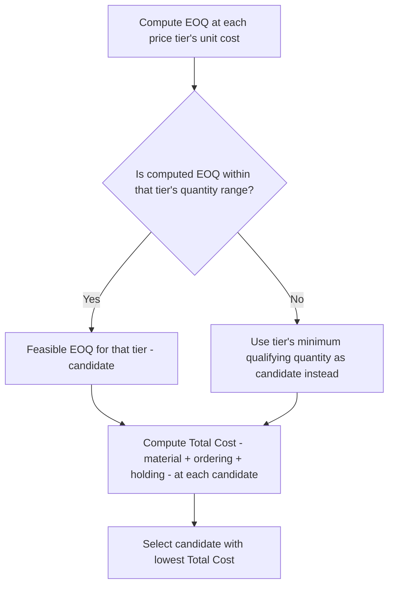
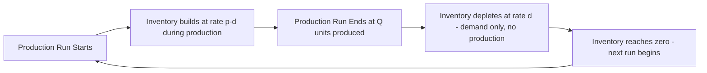

## EOQ and EPQ formula summary

### Economic Order Quantity (EOQ)

**Core Formula**

$$EOQ = \sqrt{\frac{2DS}{H}}$$

| Symbol | Meaning |
| --- | --- |
| $D$ | Annual demand (units/year) |
| $S$ | Fixed cost per order (ordering/setup cost, $/order) |
| $H$ | Annual holding cost per unit ($/unit/year), typically $H = i \times C$ where $i$ is the holding cost rate and $C$ is unit cost |

**Derivation logic**: EOQ minimizes the sum of annual ordering cost and annual holding cost, which move in opposite directions as order quantity $Q$ changes:

$$TC(Q) = \frac{D}{Q} \cdot S + \frac{Q}{2} \cdot H$$

Setting $\frac{d(TC)}{dQ} = 0$ and solving for $Q$ yields the EOQ formula. At $Q = EOQ$, annual ordering cost exactly equals annual holding cost — a useful sanity check when validating a computed EOQ.

**Key Points**

- EOQ assumes instantaneous replenishment (the full order quantity arrives at once), constant known demand, and no quantity discounts or capacity constraints — real-world deviations from these assumptions require the extensions covered below
- The formula's dependence on $H$ under a square root means EOQ is relatively insensitive to moderate errors in the holding cost rate (a 20% error in $H$ produces roughly a 10% error in EOQ) — useful context when the holding cost decomposition (capital cost, storage, obsolescence, as covered in the financial dimensions chapter) carries estimation uncertainty
- EOQ determines **cycle stock** (average $Q/2$), which is additive with, but conceptually distinct from, safety stock — total average inventory is $\frac{Q}{2} + SS$

**Related metrics derived from EOQ**:

$$\text{Number of orders per year} = \frac{D}{EOQ}$$

$$\text{Time between orders} = \frac{365}{D/EOQ} \text{ days}$$

$$\text{Total annual relevant cost at EOQ} = \sqrt{2DSH}$$

### EOQ With Quantity Discounts

When suppliers offer price breaks at higher order quantities, the standard EOQ formula must be evaluated at each price tier, since $H$ depends on unit cost $C$ (which changes at each discount tier):

**Total cost comparison** at each candidate quantity $Q$:

$$TC(Q) = D \cdot C + \frac{D}{Q} \cdot S + \frac{Q}{2} \cdot H$$

Note the addition of the $D \cdot C$ material cost term, which is necessary here (unlike base EOQ) because unit cost differs across the candidates being compared.

### EOQ With Planned Backorders (Shortage Allowed)

When stockouts are permitted and backordered (common in B2B/industrial contexts where customers will wait) rather than treated as lost sales, the EOQ model extends to explicitly balance holding cost against backorder cost:

$$EOQ_{backorder} = \sqrt{\frac{2DS}{H}} \times \sqrt{\frac{H+B}{B}}$$

$$\text{Maximum backorder level} = EOQ_{backorder} \times \frac{H}{H+B}$$

Where $B$ = annual backorder cost per unit. As $B \to \infty$ (backordering becomes prohibitively costly), this formula converges to the standard EOQ, correctly recovering the no-shortage case.

### Economic Production Quantity (EPQ)

EPQ extends EOQ to the manufacturing context (directly connecting to the manufacturing chapter's production-inventory discussion) where inventory is **produced internally at a finite rate**, rather than received all at once from an external supplier — inventory builds up gradually during production and is simultaneously being consumed by demand, rather than arriving instantaneously.

**Core Formula**

$$EPQ = \sqrt{\frac{2DS}{H\left(1 - \frac{d}{p}\right)}}$$

| Symbol | Meaning |
| --- | --- |
| $D$ | Annual demand rate |
| $S$ | Setup cost per production run (analogous to EOQ's ordering cost) |
| $H$ | Annual holding cost per unit |
| $d$ | Daily demand rate |
| $p$ | Daily production rate ($p > d$ required) |

**Key Points**

- The $\left(1 - \frac{d}{p}\right)$ factor reduces the effective holding cost relative to standard EOQ, because inventory never fully accumulates to $Q$ — since demand is being consumed simultaneously with production, the maximum inventory level reached is lower than the full production run quantity
- As $p \to \infty$ (production rate becomes instantaneous relative to demand), $\left(1-\frac{d}{p}\right) \to 1$ and EPQ converges exactly to the standard EOQ formula — instantaneous production is mathematically equivalent to the EOQ model's instantaneous-delivery assumption
- This directly connects to the manufacturing chapter's discussion of batch/lot size constraints and changeover time: $S$ in the EPQ formula functions analogously to changeover/setup cost, and EPQ determines the economically optimal production run (batch) size balancing setup cost against holding cost, exactly paralleling EOQ's ordering-cost-versus-holding-cost trade-off

**Maximum inventory level under EPQ**:

$$I_{max} = EPQ \times \left(1 - \frac{d}{p}\right)$$

$$\text{Average inventory} = \frac{I_{max}}{2} = \frac{EPQ}{2}\left(1-\frac{d}{p}\right)$$

**Total annual relevant cost at EPQ**:

$$TC(EPQ) = \frac{D}{EPQ} \cdot S + \frac{EPQ}{2}\left(1-\frac{d}{p}\right) \cdot H$$

### EOQ/EPQ and Safety Stock: How They Interact

**Key Points**

- EOQ/EPQ determine **cycle stock** (the order-quantity-driven average inventory); safety stock (covered extensively in earlier chapters) is an *additive* buffer against demand and lead time uncertainty layered on top of cycle stock — the two are computed via different logic (deterministic cost trade-off for EOQ/EPQ; probabilistic uncertainty buffering for safety stock) but jointly determine total average inventory and total holding cost
- **Reorder point** under a $(Q,R)$ continuous review policy combines both: $R = \hat{D}_{LT} + SS$, where $Q$ (the order/production quantity placed each cycle) comes from EOQ/EPQ and $SS$ comes from the safety stock formulas covered earlier — these are typically computed somewhat independently in practice (the holding cost rate $H$ is shared, but demand uncertainty parameters generally don't affect the EOQ/EPQ quantity itself under the classical deterministic-demand model), though more advanced joint $(Q,R)$ optimization models exist that solve for both simultaneously under stochastic demand
- A larger MOQ or minimum batch size (as discussed in the TCO and manufacturing chapters) effectively overrides EOQ/EPQ when the constraint-imposed quantity exceeds the economically calculated optimum — the formulas above assume no such external constraint

### Quick Reference Comparison

| Aspect | EOQ | EPQ |
| --- | --- | --- |
| Replenishment mode | Instantaneous (full batch arrives at once) | Gradual (produced at finite rate $p$) |
| Applicable context | Purchased/external supply | Internal production |
| Formula | $\sqrt{\dfrac{2DS}{H}}$ | $\sqrt{\dfrac{2DS}{H(1-d/p)}}$ |
| Max inventory reached | Equals $Q$ | Less than $Q$, equals $Q(1-d/p)$ |
| Special/limiting case | — | Reduces to EOQ as $p \to \infty$ |

**Example**

A component with $D = 12{,}000$ units/year, $S = \$150$/order, unit cost $C = \$8$, holding cost rate $i = 22\%$ (so $H = \$1.76$/unit/year):

$$EOQ = \sqrt{\frac{2 \times 12000 \times 150}{1.76}} = \sqrt{2{,}045{,}455} \approx 1430 \text{ units}$$

If instead internally produced at $p = 200$ units/day with $d = 12000/365 \approx 32.9$ units/day:

$$EPQ = \sqrt{\frac{2 \times 12000 \times 150}{1.76 \times (1 - 32.9/200)} } = \sqrt{\frac{3{,}600{,}000}{1.76 \times 0.835}} \approx \sqrt{2{,}448{,}000} \approx 1565 \text{ units}$$

The EPQ is larger than the EOQ for the same cost parameters — reflecting that gradual production accumulation reduces effective per-unit holding cost exposure, economically justifying a larger production run than an equivalent externally-purchased order quantity would warrant.

### Common Pitfalls

- **Using $H$ as a flat percentage without the full decomposition** discussed in the financial dimensions chapter (capital cost, storage, obsolescence, insurance/tax, shrinkage), producing an EOQ/EPQ that doesn't reflect the item's true holding cost structure
- **Applying standard EOQ to an internally produced item** without switching to EPQ, which systematically understates the economically optimal batch size since standard EOQ ignores the gradual-accumulation effect that lowers effective holding cost during production
- **Ignoring MOQ or minimum batch size constraints** that override the calculated EOQ/EPQ, treating the formula output as automatically actionable without a feasibility check against supplier- or process-imposed minimums
- **Treating EOQ/EPQ and safety stock as fully independent calculations with no shared parameters**, when in practice both depend on the same holding cost rate $H$ — inconsistent $H$ assumptions between the two calculations (e.g., using a generic rate for EOQ but a carefully decomposed rate for safety stock) understates the internal consistency of the resulting inventory policy
- **Applying the discount-tier EOQ comparison incorrectly** by computing total cost using only ordering and holding cost at each tier without including the material cost term $D \cdot C$, which is necessary specifically because unit cost varies across the tiers being compared — omitting it can favor a higher-holding-cost tier incorrectly when it shouldn't matter, or vice versa, depending on the specific cost structure [Inference: the materiality of this omission depends on how much unit cost varies across discount tiers relative to ordering and holding cost magnitudes].

**Related Topics**

- Joint $(Q,R)$ optimization under stochastic demand combining EOQ and safety stock simultaneously
- Quantity discount schedules and multi-tier total cost comparison
- Setup/changeover time reduction (SMED) as a lever to reduce EPQ's effective batch size requirement
- Backorder cost estimation for planned-shortage EOQ models
- Holding cost rate decomposition (capital, storage, obsolescence, insurance, shrinkage)
- MOQ and minimum batch size constraints as feasibility overrides on calculated EOQ/EPQ