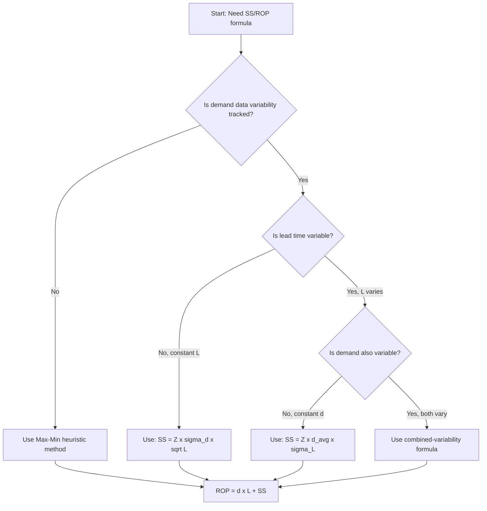

## Reorder Point and Safety Stock Formula Summary

### Overview

The reorder point (ROP) and safety stock (SS) calculations form the quantitative core of inventory replenishment systems. This reference consolidates the primary formulas used across deterministic and probabilistic inventory models, organized by use case and data availability.

### Core Formula Set

#### 1. Basic Reorder Point (No Safety Stock)

$$ROP = d \times L$$

Where:

- $d$ = average demand per unit time (e.g., units/day)
- $L$ = lead time (same time unit as $d$)

This formula assumes constant demand and constant lead time — a deterministic model with zero buffer.

#### 2. Reorder Point with Safety Stock

$$ROP = (d \times L) + SS$$

This is the general form used in virtually all practical inventory systems, since demand and lead time variability are the norm rather than the exception.

#### 3. Safety Stock — Basic (Fixed Percentage / Judgmental)

$$SS = d_{max} \times L_{max} - d_{avg} \times L_{avg}$$

Where:

- $d_{max}$ = maximum daily demand observed
- $L_{max}$ = maximum lead time observed
- $d_{avg}$ = average daily demand
- $L_{avg}$ = average lead time

This heuristic method (sometimes called the "greek method" or "max-min method") is commonly used when statistical demand/lead-time distributions are not tracked.

#### 4. Safety Stock — Statistical Method (Variable Demand, Constant Lead Time)

$$SS = Z \times \sigma_d \times \sqrt{L}$$

Where:

- $Z$ = z-score corresponding to the desired service level
- $\sigma_d$ = standard deviation of demand per period
- $L$ = lead time (constant, in same period units as $\sigma_d$)

#### 5. Safety Stock — Statistical Method (Constant Demand, Variable Lead Time)

$$SS = Z \times d_{avg} \times \sigma_L$$

Where:

- $\sigma_L$ = standard deviation of lead time
- $d_{avg}$ = average demand per period

#### 6. Safety Stock — Combined Variability (Demand AND Lead Time Vary)

$$SS = Z \times \sqrt{(L_{avg} \times \sigma_d^2) + (d_{avg}^2 \times \sigma_L^2)}$$

This is the most statistically robust and widely implemented formula in ERP/MRP systems, as it accounts for uncertainty from both sources simultaneously. Assumes demand and lead time are independent random variables.

### Z-Score Reference Table (Service Level → Z-Value)

| Service Level | Z-Score |
| --- | --- |
| 50% | 0.00 |
| 75% | 0.674 |
| 80% | 0.841 |
| 85% | 1.036 |
| 90% | 1.282 |
| 95% | 1.645 |
| 97.5% | 1.960 |
| 99% | 2.326 |
| 99.9% | 3.090 |

**Key Points**

- Service level here refers to the probability of *not* stocking out during a single replenishment cycle (cycle service level), not fill rate — these are distinct metrics and conflating them is a common error. [Inference: the distinction matters materially when service level targets are set from fill-rate KPIs but computed using cycle-service-level formulas — this is a well-documented pitfall in inventory theory, though its magnitude depends on order frequency and demand variability.]
- Higher Z-scores produce diminishing returns: moving from 95% to 99% service level increases required safety stock disproportionately relative to the service-level gain, due to the shape of the normal distribution's tail.

### Supporting Formulas

#### Average Inventory Level

$$\bar{I} = \frac{Q}{2} + SS$$

Where $Q$ = order quantity (typically EOQ).

#### Economic Order Quantity (EOQ) — for context, often paired with ROP

$$EOQ = \sqrt{\frac{2DS}{H}}$$

Where:

- $D$ = annual demand
- $S$ = ordering cost per order
- $H$ = holding cost per unit per year

#### Demand During Lead Time (DDLT) — Distribution Parameters

$$\mu_{DDLT} = d_{avg} \times L_{avg}$$

$$\sigma_{DDLT} = \sqrt{(L_{avg} \times \sigma_d^2) + (d_{avg}^2 \times \sigma_L^2)}$$

These feed directly into formula #6 above; $ROP = \mu_{DDLT} + Z \times \sigma_{DDLT}$.

### Worked Example

A distributor tracks the following for SKU-4471:

- Average daily demand ($d_{avg}$) = 120 units
- Standard deviation of daily demand ($\sigma_d$) = 18 units
- Average lead time ($L_{avg}$) = 7 days
- Standard deviation of lead time ($\sigma_L$) = 1.5 days
- Target service level = 95% → $Z = 1.645$

**Step 1 — Compute combined-variability safety stock:**

$$SS = 1.645 \times \sqrt{(7 \times 18^2) + (120^2 \times 1.5^2)}$$

$$SS = 1.645 \times \sqrt{(7 \times 324) + (14400 \times 2.25)}$$

$$SS = 1.645 \times \sqrt{2268 + 32400}$$

$$SS = 1.645 \times \sqrt{34668}$$

$$SS = 1.645 \times 186.19 \approx 306.3 \rightarrow 307 \text{ units}$$

**Step 2 — Compute Reorder Point:**

$$ROP = (120 \times 7) + 307 = 840 + 307 = 1147 \text{ units}$$

**Result:** Reorder at 1,147 units on hand to maintain a 95% cycle service level against combined demand and lead-time variability.

### Decision Flow for Formula Selection

### Quick Reference Diagram — ROP Components

<svg xmlns="http://www.w3.org/2000/svg" viewBox="0 0 700 260" font-family="Arial, sans-serif">
<text x="350" y="25" text-anchor="middle" font-size="16" font-weight="bold" fill="#1a1a1a">Reorder Point Components (svg_diagram)</text>
<rect x="20" y="60" width="200" height="80" rx="6" fill="#dbeafe" stroke="#2563eb" stroke-width="1.5" />
<text x="120" y="90" text-anchor="middle" font-size="13" font-weight="bold" fill="#1e3a8a">Lead Time Demand</text>
<text x="120" y="110" text-anchor="middle" font-size="12" fill="#1e3a8a">d_avg x L_avg</text>
<text x="120" y="128" text-anchor="middle" font-size="11" fill="#1e3a8a">(expected usage)</text>

<text x="250" y="105" text-anchor="middle" font-size="22" fill="`#1a1a1a`">+</text>

<rect x="280" y="60" width="200" height="80" rx="6" fill="#fee2e2" stroke="#dc2626" stroke-width="1.5" />
<text x="380" y="90" text-anchor="middle" font-size="13" font-weight="bold" fill="#7f1d1d">Safety Stock</text>
<text x="380" y="110" text-anchor="middle" font-size="12" fill="#7f1d1d">Z x sigma_DDLT</text>
<text x="380" y="128" text-anchor="middle" font-size="11" fill="#7f1d1d">(buffer for variability)</text>

<text x="510" y="105" text-anchor="middle" font-size="22" fill="`#1a1a1a`">=</text>

<rect x="540" y="60" width="140" height="80" rx="6" fill="#dcfce7" stroke="#16a34a" stroke-width="1.5" />
<text x="610" y="95" text-anchor="middle" font-size="13" font-weight="bold" fill="#14532d">Reorder</text>
<text x="610" y="113" text-anchor="middle" font-size="13" font-weight="bold" fill="#14532d">Point</text>
<line x1="20" y1="180" x2="680" y2="180" stroke="#9ca3af" stroke-width="1" stroke-dasharray="4,3" />
<text x="350" y="200" text-anchor="middle" font-size="11" fill="#4b5563">Trigger inventory level at which a new replenishment order is placed</text>
<text x="350" y="220" text-anchor="middle" font-size="11" fill="#4b5563">so stock does not deplete before the next order arrives</text>
</svg>

### Common Pitfalls

- **Mismatched time units**: Mixing daily demand with weekly lead time (or vice versa) without unit conversion is the most frequent source of ROP calculation errors.
- **Assuming normal distribution universally**: The statistical formulas above assume normally distributed demand and lead time. For highly intermittent or lumpy demand (many zero-demand periods), normal-distribution-based safety stock formulas tend to understate required buffer stock, and methods such as the Croston method or bootstrapping are more appropriate. [Inference: the degree of understatement is context-dependent and not something a single formula can quantify without empirical validation against the specific demand pattern.]
- **Ignoring correlation between demand and lead time**: Formula #6 assumes independence between demand and lead time variability; in supply chains where longer lead times correlate with demand surges (e.g., supplier constraints during high-demand periods), this formula may underestimate true risk.
- **Using population vs. sample standard deviation inconsistently**: $\sigma_d$ and $\sigma_L$ should be computed consistently (sample standard deviation, using $n-1$ denominator, is standard when working from historical samples rather than a full population).

**Next Steps**

- Demand distribution fitting for intermittent/lumpy demand (Croston's method, TSB method)
- Service level vs. fill rate: distinctions and conversion approaches
- Multi-echelon safety stock allocation
- Dynamic safety stock (time-phased/period-specific calculations)
- Lead time variability modeling and supplier reliability scoring
- ABC/XYZ classification for differentiated safety stock policies
- Continuous review (Q,R) vs. periodic review (s,S) system formula differences