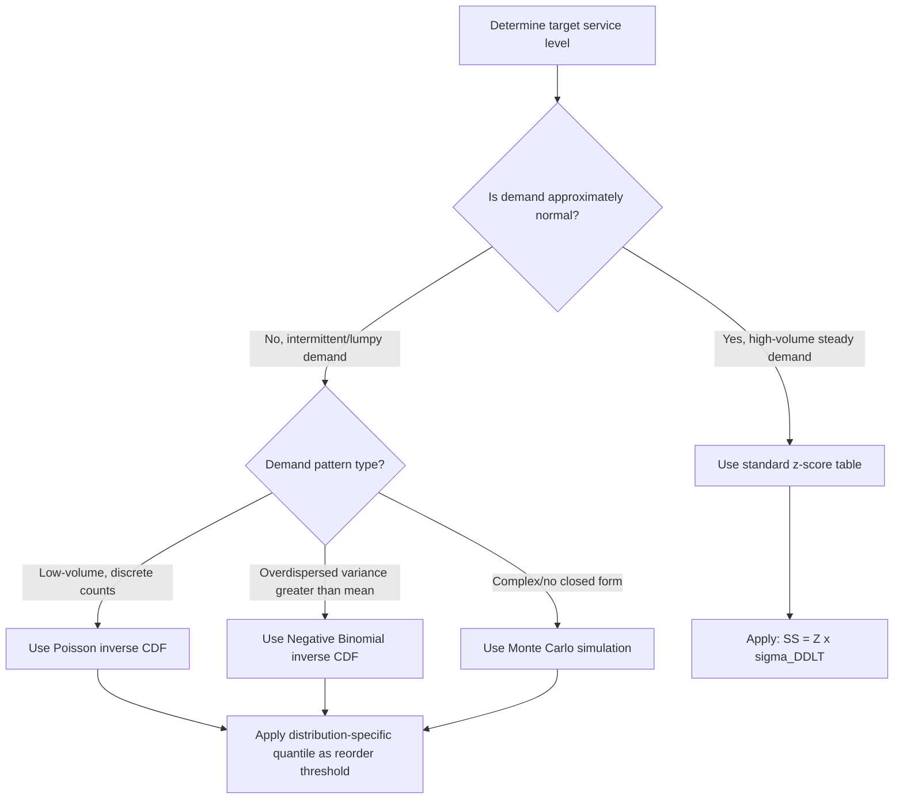

## Service Level and Z-Score Lookup Reference

### Overview

The z-score (standard normal deviate) translates a target service level into a multiplier applied to demand/lead-time variability when calculating safety stock. This reference covers the statistical basis, lookup tables for common service level types, and computation methods for deriving z-scores programmatically.

### Statistical Foundation

The z-score represents the number of standard deviations above the mean at which the cumulative area under the standard normal distribution curve equals the target service level probability.

$$P(Z \leq z) = SL$$

Where $SL$ is the target service level expressed as a decimal (e.g., 0.95 for 95%).

Formally, $z$ is the inverse of the standard normal cumulative distribution function (CDF):

$$z = \Phi^{-1}(SL)$$

Where $\Phi^{-1}$ is the inverse CDF (also called the quantile function or probit function) of the standard normal distribution $N(0,1)$.

### Cycle Service Level vs. Fill Rate — Critical Distinction

**Key Points**

- **Cycle Service Level (CSL)**: The probability that a stockout does *not* occur during a single replenishment cycle (i.e., between placing an order and receiving it). This is the metric that maps directly to the z-score tables below.
- **Fill Rate**: The percentage of total demand (units) satisfied directly from stock on hand, without backorder or lost sale. This is a *volume-based* metric, not a probability-based one.
- These two are frequently confused. A 95% cycle service level does **not** guarantee a 95% fill rate — fill rate is typically higher than CSL for a given safety stock level because a stockout event doesn't mean 100% of demand in that cycle is lost, only the portion exceeding available stock.
- Converting between fill rate and CSL requires the loss function (partial expectation) of the normal distribution and is not a simple linear mapping. [Inference: exact conversion requires numerical methods or lookup tables for the standard normal loss function $L(z)$; this is standard in inventory theory texts but not a trivial closed-form formula.]

### Primary Z-Score Lookup Table (One-Tailed, Cycle Service Level)

This is the table used for standard safety stock formulas ($SS = Z \times \sigma$).

| Service Level | Z-Score | Stockout Probability (1-SL) |
| --- | --- | --- |
| 50.0% | 0.000 | 50.0% |
| 55.0% | 0.126 | 45.0% |
| 60.0% | 0.253 | 40.0% |
| 65.0% | 0.385 | 35.0% |
| 70.0% | 0.524 | 30.0% |
| 75.0% | 0.674 | 25.0% |
| 80.0% | 0.841 | 20.0% |
| 82.0% | 0.915 | 18.0% |
| 84.0% | 0.994 | 16.0% |
| 85.0% | 1.036 | 15.0% |
| 86.0% | 1.080 | 14.0% |
| 88.0% | 1.175 | 12.0% |
| 90.0% | 1.282 | 10.0% |
| 91.0% | 1.341 | 9.0% |
| 92.0% | 1.405 | 8.0% |
| 93.0% | 1.476 | 7.0% |
| 94.0% | 1.555 | 6.0% |
| 95.0% | 1.645 | 5.0% |
| 96.0% | 1.751 | 4.0% |
| 97.0% | 1.881 | 3.0% |
| 97.5% | 1.960 | 2.5% |
| 98.0% | 2.054 | 2.0% |
| 99.0% | 2.326 | 1.0% |
| 99.5% | 2.576 | 0.5% |
| 99.9% | 3.090 | 0.1% |
| 99.99% | 3.719 | 0.01% |

### Visual Reference — Normal Distribution and Service Level

<svg xmlns="http://www.w3.org/2000/svg" viewBox="0 0 700 320" font-family="Arial, sans-serif">
<text x="350" y="25" text-anchor="middle" font-size="16" font-weight="bold" fill="#1a1a1a">Service Level as Area Under Normal Curve (svg_diagram)</text>

<path d="M 60 260 Q 200 260 260 150 Q 320 60 380 60 Q 440 60 500 150 Q 560 260 640 260" fill="none" stroke="`#374151`" stroke-width="2" />

<path d="M 60 260 Q 200 260 260 150 Q 320 60 380 60 L 460 60 Q 500 110 550 260 Z" fill="`#93c5fd`" fill-opacity="0.55" stroke="none" />

<line x1="460" y1="60" x2="460" y2="260" stroke="#dc2626" stroke-width="2" stroke-dasharray="5,3" />
<text x="460" y="280" text-anchor="middle" font-size="12" fill="#dc2626" font-weight="bold">z = 1.645</text>
<text x="460" y="296" text-anchor="middle" font-size="11" fill="#dc2626">(95% CSL)</text>

<text x="250" y="180" text-anchor="middle" font-size="13" fill="`#1e3a8a`" font-weight="bold">Shaded area = 95%</text>

<text x="250" y="198" text-anchor="middle" font-size="11" fill="`#1e3a8a`">(service level probability)</text>

<text x="590" y="180" text-anchor="middle" font-size="12" fill="`#4b5563`">Unshaded</text>

<text x="590" y="195" text-anchor="middle" font-size="12" fill="`#4b5563`">= 5% stockout risk</text>

<line x1="60" y1="260" x2="640" y2="260" stroke="#1a1a1a" stroke-width="1.5" />
<text x="60" y="278" text-anchor="middle" font-size="10" fill="#6b7280">-3σ</text>
<text x="200" y="278" text-anchor="middle" font-size="10" fill="#6b7280">-1σ</text>
<text x="380" y="278" text-anchor="middle" font-size="10" fill="#6b7280">μ (mean)</text>
<text x="640" y="278" text-anchor="middle" font-size="10" fill="#6b7280">+3σ</text>
</svg>

### Two-Tailed Z-Scores (For Confidence Interval / Forecast Error Contexts)

Used less frequently in ROP/SS work but relevant for demand forecast confidence intervals:

| Confidence Level | Two-Tailed Z-Score |
| --- | --- |
| 80% | 1.282 |
| 90% | 1.645 |
| 95% | 1.960 |
| 98% | 2.326 |
| 99% | 2.576 |

**Key Points**

- Note the two-tailed 95% confidence z-score (1.960) differs from the one-tailed 95% service level z-score (1.645) — this is a common source of formula errors when practitioners pull the wrong value from a general statistics table instead of an inventory-specific one.
- Safety stock calculations use **one-tailed** z-scores because the concern is only the risk of running short (one direction), not both directions of a symmetric interval.

### Computing Z-Scores Programmatically

Rather than relying on static lookup tables, most systems compute the z-score dynamically using the inverse normal CDF function available in standard statistical libraries.

**Example (Python, using `scipy.stats`):**

```python
from scipy.stats import norm

def z_score_for_service_level(service_level: float) -> float:
    """
    Returns the one-tailed z-score for a given cycle service level.
    service_level: decimal between 0 and 1, e.g., 0.95 for 95%
    """
    return norm.ppf(service_level)

# Example usage
print(z_score_for_service_level(0.95))   # 1.6448536269514722
print(z_score_for_service_level(0.99))   # 2.3263478740408408
```

**Example (Excel/Google Sheets):**



```
=NORM.S.INV(0.95)
```

Returns `1.6448536`.

**Example (SQL Server, using approximation since native inverse CDF is not standard):**

Most SQL dialects lack a built-in inverse normal function; the typical pattern is to store a lookup table or call out to an application layer/UDF that wraps a statistical library, since implementing an accurate rational approximation (e.g., Acklam's algorithm) directly in T-SQL is error-prone for edge-case precision. [Inference: this is a practical engineering convention rather than a documented standard, since SQL vendors do not agree on a native inverse-CDF function.]

### Service-Level-to-Safety-Factor Relationship (Non-Normal Demand)

For demand distributions that are not well-approximated by the normal distribution (e.g., Poisson for slow-moving/intermittent items, or negative binomial for overdispersed demand), the z-score approach is not directly applicable, and safety stock must instead be derived from the specific distribution's inverse CDF or via simulation.



### Quick Reference — Most-Used Service Levels

| Service Level | Z-Score | Typical Use Case |
| --- | --- | --- |
| 90% | 1.282 | Low-cost, low-criticality items (Class C) |
| 95% | 1.645 | Standard default for most retail/distribution items (Class B) |
| 97.5% | 1.960 | Higher-criticality items |
| 99% | 2.326 | Critical spare parts, medical/safety-critical inventory (Class A) |
| 99.9% | 3.090 | Life-critical or regulatory-mandated stock |

### Common Pitfalls

- **Confusing fill rate targets with CSL inputs**: Directly plugging a fill-rate target (e.g., "we want 98% fill rate") into the CSL z-score table without conversion will systematically understate required safety stock, since fill rate is typically achieved at a *lower* CSL for the same stock level.
- **Using two-tailed values in one-tailed contexts**: As noted above, this silently inflates safety stock by using a higher z-score than actually required.
- **Applying normal-distribution z-scores to non-normal demand**: For intermittent demand (many periods with zero demand), the normal distribution assumption breaks down, particularly for high service level targets, since the normal distribution allows negative demand values that are physically meaningless.
- **Rounding z-scores too aggressively**: Using $Z = 1.6$ instead of $1.645$ seems trivial but compounds across large SKU counts and high-variability items into materially different aggregate safety stock investment.

**Related Topics**

- Cycle service level to fill rate conversion (standard normal loss function)
- Poisson and negative binomial demand modeling for intermittent items
- Safety stock under non-normal demand distributions
- Monte Carlo simulation for reorder point optimization
- ABC/XYZ classification and differentiated service level targets
- Multi-echelon service level allocation