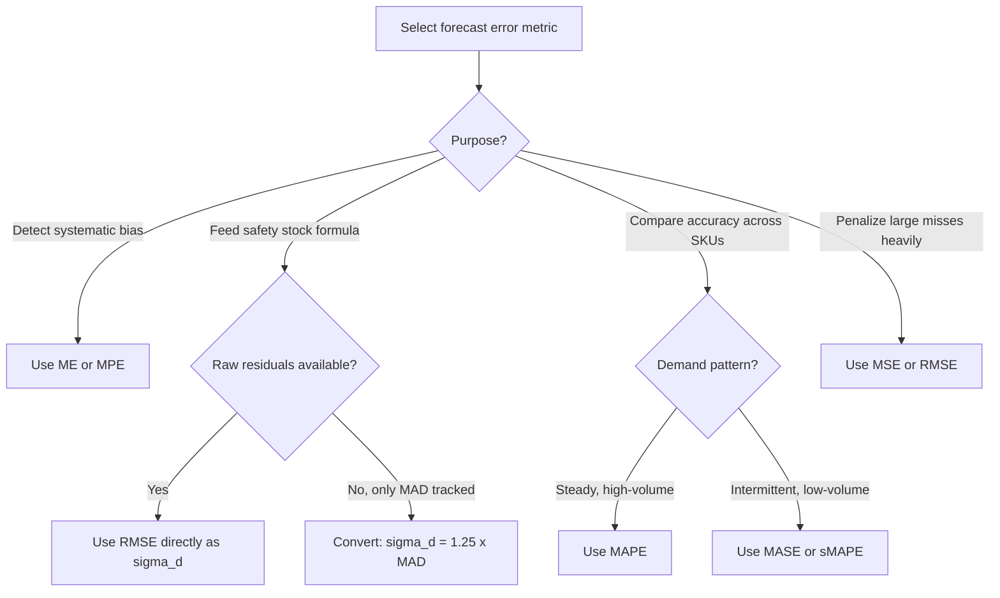

## Forecast Error Formula Summary

### Overview

Forecast error metrics quantify the deviation between predicted and actual demand, serving two purposes in inventory management: (1) evaluating forecasting model performance, and (2) feeding directly into safety stock calculations via the standard deviation of forecast error, which is often used as a proxy for $\sigma_d$ in reorder point formulas. This reference consolidates the primary error metrics, their formulas, and their appropriate use cases.

### Core Error Definitions

#### Forecast Error (Single Period)

$$e_t = A_t - F_t$$

Where:

- $A_t$ = actual demand in period $t$
- $F_t$ = forecasted demand for period $t$

Sign convention matters: a positive $e_t$ indicates under-forecasting (actual exceeded forecast), while negative indicates over-forecasting. Some practitioners reverse the sign ($F_t - A_t$); this reference uses $A_t - F_t$ as the convention, consistent with most forecasting literature.

### Bias Metrics (Directional Error)

#### Mean Error (ME) / Mean Forecast Error

$$ME = \frac{1}{n}\sum_{t=1}^{n} e_t = \frac{1}{n}\sum_{t=1}^{n}(A_t - F_t)$$

Indicates systematic bias. Positive ME suggests consistent under-forecasting; negative suggests consistent over-forecasting. A well-calibrated forecast should have ME close to zero.

#### Mean Percentage Error (MPE)

$$MPE = \frac{1}{n}\sum_{t=1}^{n} \frac{A_t - F_t}{A_t} \times 100\%$$

Same purpose as ME but normalized, allowing comparison across items with different volume scales. Undefined when $A_t = 0$.

### Accuracy Metrics (Magnitude of Error, Non-Directional)

#### Mean Absolute Error (MAE) / Mean Absolute Deviation (MAD)

$$MAE = \frac{1}{n}\sum_{t=1}^{n} |A_t - F_t|$$

MAD is the historically standard term in inventory contexts (often used interchangeably with MAE in this domain). This is one of the most commonly used inputs for approximating demand variability when full standard deviation data isn't tracked.

#### Mean Absolute Percentage Error (MAPE)

$$MAPE = \frac{1}{n}\sum_{t=1}^{n} \left|\frac{A_t - F_t}{A_t}\right| \times 100\%$$

The most widely reported forecast accuracy metric due to its scale-independence, allowing cross-SKU and cross-category comparison. Undefined when $A_t = 0$, and becomes unstable/misleading for low-volume or intermittent-demand items where actuals are frequently zero or very small.

#### Symmetric MAPE (sMAPE)

$$sMAPE = \frac{1}{n}\sum_{t=1}^{n} \frac{|A_t - F_t|}{(|A_t| + |F_t|)/2} \times 100\%$$

Addresses MAPE's asymmetry problem (MAPE penalizes over-forecasting less harshly than under-forecasting in percentage terms) and partially mitigates — but does not fully solve — the zero-actual undefined-value issue, since it is still undefined when both $A_t$ and $F_t$ equal zero.

#### Mean Squared Error (MSE)

$$MSE = \frac{1}{n}\sum_{t=1}^{n}(A_t - F_t)^2$$

Squaring penalizes large errors disproportionately more than small ones, making MSE sensitive to outliers. Rarely used directly for safety stock purposes but foundational to RMSE.

#### Root Mean Squared Error (RMSE)

$$RMSE = \sqrt{\frac{1}{n}\sum_{t=1}^{n}(A_t - F_t)^2}$$

Returns error to the original unit scale (unlike MSE). RMSE is the metric most directly analogous to standard deviation and is frequently used as a direct substitute for $\sigma_d$ in safety stock formulas when forecast residuals are the available data source.

#### Mean Absolute Scaled Error (MASE)

$$MASE = \frac{MAE}{\frac{1}{n-1}\sum_{t=2}^{n}|A_t - A_{t-1}|}$$

Scales MAE against the MAE of a naive one-period-lag forecast on the same historical data. A MASE below 1.0 indicates the forecast outperforms a naive forecast; above 1.0 indicates it underperforms. Well-suited for intermittent demand since it avoids division-by-zero issues inherent to percentage-based metrics.

### Comparison Table — When to Use Each Metric

| Metric | Directional? | Handles Zero Actuals? | Scale-Independent? | Primary Use Case |
| --- | --- | --- | --- | --- |
| ME | Yes | Yes | No | Detecting systematic bias |
| MPE | Yes | No | Yes | Bias detection across SKUs |
| MAE/MAD | No | Yes | No | Safety stock input, single-SKU tracking |
| MAPE | No | No | Yes | Cross-SKU accuracy comparison (high-volume items) |
| sMAPE | No | Partial | Yes | Cross-SKU comparison with some zero-actuals |
| MSE | No | Yes | No | Statistical/optimization contexts (outlier-sensitive) |
| RMSE | No | Yes | No | Safety stock input (direct $\sigma_d$ substitute) |
| MASE | No | Yes | Yes | Intermittent demand, cross-SKU comparison |

### From Forecast Error to Safety Stock — The Critical Link

**Key Points**

- MAD-to-sigma conversion: When only MAD is tracked (common in legacy systems), it can be converted to an approximate standard deviation assuming normally distributed forecast errors:

$$\sigma_d \approx 1.25 \times MAD$$

This constant derives from the mathematical relationship between mean absolute deviation and standard deviation under a normal distribution ($\sigma = \sqrt{\pi/2} \times MAD \approx 1.2533 \times MAD$).

- This conversion is only valid under the normality assumption for forecast errors; if residuals are skewed or heavy-tailed (common with promotional demand spikes or intermittent items), the 1.25 multiplier introduces systematic error. [Inference: the degree of resulting safety stock miscalculation depends on the actual error distribution shape and is not quantifiable as a fixed correction factor without further analysis.]
- RMSE is generally preferred over the MAD-conversion approach when raw period-by-period forecast residuals are available, since RMSE requires no distributional assumption to serve as a direct $\sigma_d$ estimate.

### Worked Example

Actual vs. forecasted demand over 6 periods for SKU-2290:

| Period | Actual ($A_t$) | Forecast ($F_t$) | Error ($e_t$) | Abs. Error | Squared Error |
| --- | --- | --- | --- | --- | --- |
| 1 | 102 | 100 | 2 | 2 | 4 |
| 2 | 95 | 100 | -5 | 5 | 25 |
| 3 | 110 | 105 | 5 | 5 | 25 |
| 4 | 98 | 102 | -4 | 4 | 16 |
| 5 | 115 | 108 | 7 | 7 | 49 |
| 6 | 90 | 100 | -10 | 10 | 100 |

**Mean Error:**

$$ME = \frac{2 - 5 + 5 - 4 + 7 - 10}{6} = \frac{-5}{6} \approx -0.83$$

Slight over-forecasting bias on average (small negative ME).

**MAE/MAD:**

$$MAD = \frac{2+5+5+4+7+10}{6} = \frac{33}{6} = 5.5$$

**RMSE:**

$$RMSE = \sqrt{\frac{4+25+25+16+49+100}{6}} = \sqrt{\frac{219}{6}} = \sqrt{36.5} \approx 6.04$$

**MAPE:**

$$MAPE = \frac{1}{6}\left(\frac{2}{102}+\frac{5}{95}+\frac{5}{110}+\frac{4}{98}+\frac{7}{115}+\frac{10}{90}\right) \times 100\%$$

$$\approx \frac{1}{6}(0.0196+0.0526+0.0455+0.0408+0.0609+0.1111) \times 100\% \approx 5.51\%$$

**Applying MAD-to-sigma conversion for safety stock use:**

$$\sigma_d \approx 1.25 \times 5.5 = 6.875$$

(Compare against directly-computed RMSE of 6.04 — the two estimates diverge here, illustrating why the conversion is an approximation rather than an exact substitute.)

### Decision Flow — Selecting a Forecast Error Metric

### Common Pitfalls

- **Using MAPE for intermittent/low-volume demand**: Division by small or zero actuals produces extreme or undefined MAPE values, making it unreliable for spare parts, slow-movers, or new products.
- **Treating MAD and standard deviation as interchangeable without conversion**: Plugging raw MAD directly into a formula expecting $\sigma_d$ (without the ~1.25 factor) systematically understates safety stock.
- **Ignoring bias when only tracking accuracy metrics**: A forecast can have excellent MAPE/RMSE while carrying a persistent directional bias (positive ME) that causes chronic understocking; bias and accuracy should be monitored together.
- **Comparing MAPE across items with very different volumes without weighting**: Aggregate MAPE across a portfolio can be skewed by low-volume items with extreme percentage errors unless weighted (e.g., weighted MAPE, WMAPE) by volume.
- **Applying the normal-distribution MAD conversion to skewed residuals**: Promotional/seasonal demand often produces asymmetric forecast errors, violating the assumption underlying the 1.25 constant.

**Related Topics**

- Weighted MAPE (WMAPE) and its advantages for portfolio-level reporting
- Forecast bias tracking and tracking signal (Trigg's tracking signal)
- Intermittent demand forecast error evaluation (Croston/SBA/TSB methods)
- Standard deviation of demand vs. standard deviation of forecast error — when they diverge
- Statistical process control for forecast error monitoring
- Rolling vs. static forecast error windows for dynamic safety stock updates