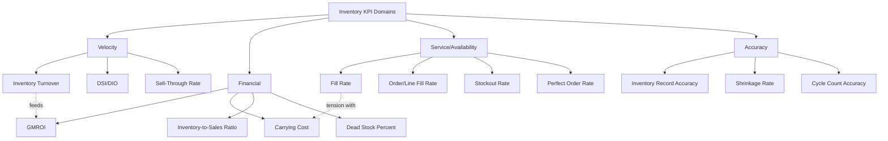

## Inventory KPI Formula Summary

### Overview

Inventory KPIs measure efficiency, accuracy, and financial health across the inventory lifecycle. This reference consolidates the primary formulas across five categories: turnover/velocity, financial, availability/service, accuracy, and carrying cost metrics.

### Turnover and Velocity Metrics

#### Inventory Turnover Ratio

$$\text{Inventory Turnover} = \frac{\text{COGS}}{\text{Average Inventory Value}}$$

Where Average Inventory Value is typically $(\text{Beginning Inventory} + \text{Ending Inventory}) / 2$. Measures how many times inventory is sold and replaced over a period (typically annual).

Alternative sales-based version (less precise, used when COGS is unavailable):

$$\text{Inventory Turnover} = \frac{\text{Net Sales}}{\text{Average Inventory Value}}$$

#### Days Sales of Inventory (DSI) / Days Inventory Outstanding (DIO)

$$DSI = \frac{365}{\text{Inventory Turnover}} = \frac{\text{Average Inventory Value} \times 365}{\text{COGS}}$$

Represents the average number of days inventory sits before being sold. Lower DSI generally indicates more efficient inventory utilization, though optimal values are highly industry-dependent.

#### Sell-Through Rate

$$\text{Sell-Through Rate} = \frac{\text{Units Sold}}{\text{Units Received (Beginning Inventory)}} \times 100\%$$

Commonly measured monthly in retail; indicates what percentage of received stock has sold within the period.

#### GMROI (Gross Margin Return on Investment)

$$GMROI = \frac{\text{Gross Margin \$}}{\text{Average Inventory Cost \$}}$$

Measures profitability generated per dollar of inventory investment. A GMROI greater than 1.0 (or 100%) indicates the inventory generated more gross margin than its cost.

### Financial / Carrying Cost Metrics

#### Carrying Cost of Inventory

$$\text{Carrying Cost} = \text{Average Inventory Value} \times \text{Carrying Cost Rate}$$

Where Carrying Cost Rate typically bundles capital cost, storage, insurance, taxes, obsolescence/shrinkage risk, and handling — commonly expressed as a percentage of inventory value (often 15%–30% annually across industries, though this varies significantly by sector). [Inference: the specific rate composition and percentage range are industry conventions rather than fixed constants, and actual rates depend heavily on the organization's cost structure.]

#### Total Cost of Inventory Ownership (component of EOQ context)

$$TC = \frac{D}{Q}S + \frac{Q}{2}H$$

Where $D$ = annual demand, $Q$ = order quantity, $S$ = ordering cost, $H$ = annual holding cost per unit. This is the total-cost function minimized by the EOQ formula.

#### Inventory-to-Sales Ratio

$$\text{Inventory-to-Sales Ratio} = \frac{\text{Average Inventory Value}}{\text{Net Sales}}$$

Lower ratios generally indicate leaner inventory relative to sales volume.

#### Dead Stock / Obsolete Inventory Percentage

$$\text{Dead Stock \%} = \frac{\text{Value of Non-Moving Inventory}}{\text{Total Inventory Value}} \times 100\%$$

"Non-moving" thresholds vary by organization (e.g., no sales in 90/180/365 days).

### Availability and Service Metrics

#### Fill Rate (Unit Fill Rate)

$$\text{Fill Rate} = \frac{\text{Units Shipped from Stock}}{\text{Total Units Ordered}} \times 100\%$$

Measures the percentage of demand satisfied immediately from available stock, without backorder or substitution.

#### Order Fill Rate / Line Fill Rate

$$\text{Order Fill Rate} = \frac{\text{Orders Shipped Complete}}{\text{Total Orders}} \times 100\%$$

$$\text{Line Fill Rate} = \frac{\text{Order Lines Shipped Complete}}{\text{Total Order Lines}} \times 100\%$$

These are stricter than unit fill rate since a single missing SKU on a multi-line order counts as a failure for the whole order/line, even if most units shipped.

#### Stockout Rate

$$\text{Stockout Rate} = \frac{\text{Number of Stockout Occurrences}}{\text{Total Demand Occasions}} \times 100\%$$

#### Perfect Order Rate

$$\text{Perfect Order Rate} = \frac{\text{Orders Delivered Complete, On-Time, Damage-Free, Correctly Documented}}{\text{Total Orders}} \times 100\%$$

Composite metric; often calculated as the product of individual component rates (on-time %, complete %, damage-free %, accurate documentation %) when assuming independence between failure modes.

### Accuracy Metrics

#### Inventory Record Accuracy (IRA)

$$IRA = \frac{\text{Number of SKUs with Matching System and Physical Count}}{\text{Total SKUs Counted}} \times 100\%$$

#### Inventory Accuracy by Value

$$\text{Value Accuracy} = \left(1 - \frac{|\text{System Value} - \text{Physical Count Value}|}{\text{System Value}}\right) \times 100\%$$

Weights discrepancies by dollar impact rather than treating all SKU-level mismatches equally.

#### Shrinkage Rate

$$\text{Shrinkage Rate} = \frac{\text{Expected Inventory Value} - \text{Actual Physical Inventory Value}}{\text{Expected Inventory Value}} \times 100\%$$

Captures loss from theft, damage, administrative error, and spoilage.

#### Cycle Count Accuracy

$$\text{Cycle Count Accuracy} = \frac{\text{Accurate Cycle Counts}}{\text{Total Cycle Counts Performed}} \times 100\%$$

### Comparison Table — KPI Category Reference

| KPI | Category | Formula Core | Higher = Better? |
| --- | --- | --- | --- |
| Inventory Turnover | Velocity | COGS / Avg Inventory | Yes (context-dependent ceiling) |
| DSI | Velocity | 365 / Turnover | No |
| GMROI | Financial | Gross Margin / Avg Inventory Cost | Yes |
| Carrying Cost | Financial | Avg Inventory × Rate | No |
| Fill Rate | Service | Units Shipped / Units Ordered | Yes |
| Perfect Order Rate | Service | Composite % | Yes |
| IRA | Accuracy | Matching SKUs / Total SKUs | Yes |
| Shrinkage Rate | Accuracy | Value Loss / Expected Value | No |

### KPI Relationship Map

### Worked Example — Turnover and DSI

A warehouse reports:

- COGS (annual) = $2,400,000
- Beginning Inventory Value = $380,000
- Ending Inventory Value = $420,000

**Step 1 — Average Inventory:**

$$\text{Avg Inventory} = \frac{380{,}000 + 420{,}000}{2} = 400{,}000$$

**Step 2 — Inventory Turnover:**

$$\text{Turnover} = \frac{2{,}400{,}000}{400{,}000} = 6.0$$

**Step 3 — DSI:**

$$DSI = \frac{365}{6.0} \approx 60.8 \text{ days}$$

**Interpretation:** Inventory cycles through approximately 6 times per year, with an average of roughly 61 days between receipt and sale.

### Key Trade-Off: Service Level vs. Carrying Cost

**Key Points**

- Fill rate and turnover metrics are frequently in tension: higher fill rate targets generally require more safety stock, which increases average inventory value and carrying cost, while simultaneously *lowering* inventory turnover for a given sales volume.
- GMROI is often used as a balancing metric precisely because it captures both sides — a business can have excellent fill rates that are actually destroying returns if carrying cost outweighs the margin captured from improved availability.
- There is no universally "correct" target for these KPIs; appropriate targets depend on product category, margin structure, and competitive positioning within a given industry. [Inference: this is a standard strategic framing in inventory management literature, not a claim about any specific organization's optimal targets.]

### Common Pitfalls

- **Using period-end inventory instead of average inventory for turnover**: This inflates or deflates turnover depending on seasonal timing of the snapshot, and average (or better, a rolling multi-point average) is the more standard practice.
- **Comparing turnover ratios across industries without adjustment**: Grocery/perishables turnover ratios (often 15–20+) are not comparable to industrial equipment turnover (often 2–4), since underlying business models differ fundamentally.
- **Conflating unit fill rate with order fill rate**: Reporting a high unit fill rate while order fill rate is materially lower can mask the customer-facing reality that many orders still ship incomplete.
- **Excluding shrinkage from shrinkage-rate calculations by scope**: Some organizations undercount shrinkage by excluding certain loss categories (e.g., administrative/paperwork errors), producing an artificially favorable rate that doesn't reflect true inventory record risk.
- **Treating GMROI as a standalone decision metric**: GMROI does not account for opportunity cost of shelf/warehouse space or cash flow timing, and is typically used alongside other financial metrics rather than in isolation.

**Related Topics**

- ABC/XYZ inventory classification and KPI target differentiation by class
- Days Payable/Receivable Outstanding and the cash conversion cycle
- Warehouse-specific KPIs (pick accuracy, dock-to-stock time, storage utilization)
- Demand planning KPI alignment (forecast bias, MAPE) with inventory KPIs
- Vendor/supplier scorecards and lead time reliability metrics
- Inventory health segmentation (fast/slow/dead stock thresholds)