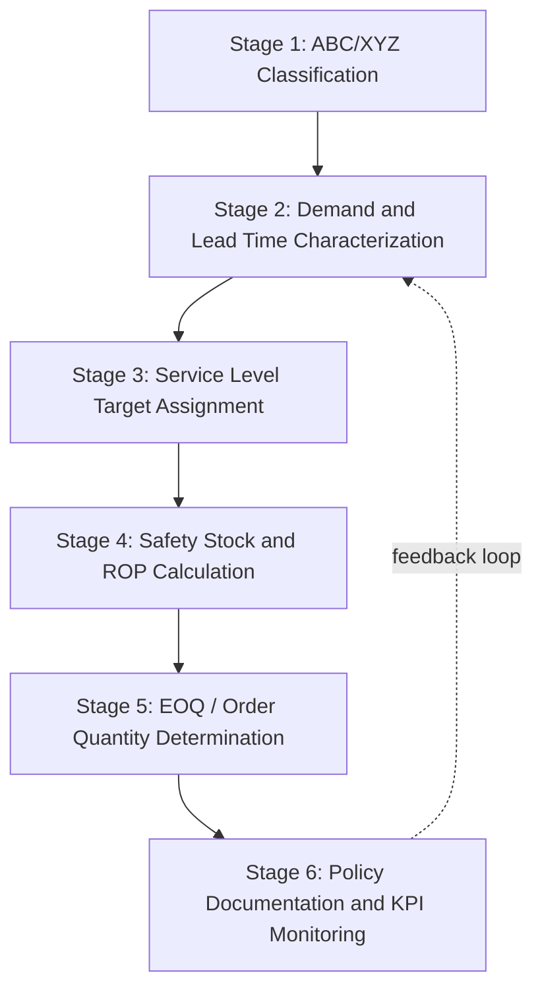
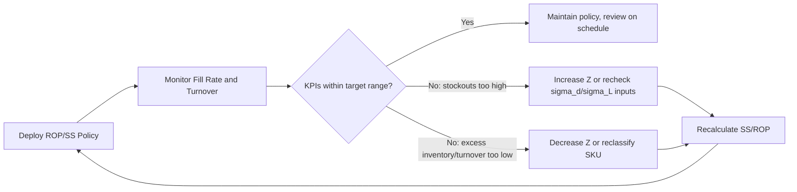

## Integrated Inventory Policy Design Exercise

### Overview

This capstone exercise integrates the full formula set covered across prior chapters — reorder points, safety stock, service levels, forecast error, and KPIs — into a single applied policy design workflow. The exercise walks through designing a complete inventory policy for a multi-SKU scenario, from classification through final policy documentation.

### Exercise Structure

The exercise proceeds through six integrated stages:

1. SKU classification (ABC/XYZ)
2. Demand and lead time data characterization
3. Service level target assignment by class
4. Safety stock and reorder point calculation
5. Order quantity determination (EOQ integration)
6. Policy documentation and KPI monitoring plan

### Stage 1: SKU Classification (ABC/XYZ Matrix)

Classify SKUs on two dimensions: revenue/value contribution (ABC) and demand variability (XYZ).

**ABC (value-based, typically via Pareto analysis):**

$$\text{Cumulative \% of Value} = \frac{\sum \text{Annual Usage Value (ranked descending)}}{\text{Total Annual Usage Value}} \times 100\%$$

- Class A: top ~80% of cumulative value (typically ~20% of SKUs)
- Class B: next ~15% of cumulative value (typically ~30% of SKUs)
- Class C: remaining ~5% of cumulative value (typically ~50% of SKUs)

**XYZ (variability-based, via coefficient of variation):**

$$CV = \frac{\sigma_d}{d_{avg}}$$

- Class X: CV < 0.5 (stable, predictable demand)
- Class Y: 0.5 ≤ CV < 1.0 (moderate variability)
- Class Z: CV ≥ 1.0 (highly variable/intermittent demand)

**Combined 9-Cell Matrix:**

|  | X (Stable) | Y (Moderate) | Z (Erratic) |
| --- | --- | --- | --- |
| **A (High Value)** | Tight control, high service level | Tight control, elevated safety stock | Case-by-case, possibly consignment/VMI |
| **B (Medium Value)** | Standard statistical ROP/SS | Standard statistical ROP/SS with buffer | Consider min/max or periodic review |
| **C (Low Value)** | Simple reorder point, low priority | Bulk/simple policies | Minimal control, high buffer or make-to-order |

### Stage 2: Demand and Lead Time Data Characterization

For each SKU (or SKU class), establish:

$$d_{avg}, \quad \sigma_d, \quad L_{avg}, \quad \sigma_L$$

Derived from historical order/shipment data, typically using a rolling window (e.g., trailing 12 months) with outlier treatment applied. If forecast residuals are used as the $\sigma_d$ proxy, apply the RMSE or MAD-conversion methods:

$$\sigma_d \approx RMSE \quad \text{or} \quad \sigma_d \approx 1.25 \times MAD$$

**Key Points**

- Data characterization is the stage most exercises underweight, but downstream formula accuracy is entirely dependent on this input quality — an elegant safety stock formula applied to a poorly estimated $\sigma_d$ produces a precise-looking but inaccurate result.
- Lead time variability ($\sigma_L$) is frequently under-tracked relative to demand variability in practice, despite formula #6 (combined variability) showing it can dominate the safety stock calculation when $\sigma_L$ is proportionally large relative to $\sigma_d$.

### Stage 3: Service Level Target Assignment

Assign z-score-mapped service levels differentiated by ABC/XYZ class — not a single blanket target across the portfolio.

| Class | Typical Service Level | Z-Score | Rationale |
| --- | --- | --- | --- |
| AX | 98–99% | 2.054–2.326 | High value, predictable — justifies precise high coverage |
| AY | 97–98% | 1.881–2.054 | High value, moderate variability |
| AZ | Case-by-case / alternate policy | — | High value but erratic; statistical ROP may be unsuitable |
| BX/BY | 95% | 1.645 | Balanced default |
| CX/CY/CZ | 90% or lower | 1.282 or lower | Low value; overstocking cost outweighs stockout cost |

### Stage 4: Safety Stock and Reorder Point Calculation

Apply the combined-variability formula per SKU/class:

$$SS = Z \times \sqrt{(L_{avg} \times \sigma_d^2) + (d_{avg}^2 \times \sigma_L^2)}$$

$$ROP = (d_{avg} \times L_{avg}) + SS$$

**Worked Example — One SKU from Each Class:**

| SKU | Class | $d_{avg}$ | $\sigma_d$ | $L_{avg}$ | $\sigma_L$ | Z | SS | ROP |
| --- | --- | --- | --- | --- | --- | --- | --- | --- |
| SKU-A1 | AX | 200 | 25 | 10 | 1.0 | 2.326 | 199 | 2199 |
| SKU-B1 | BY | 60 | 22 | 14 | 2.5 | 1.645 | 262 | 1102 |
| SKU-C1 | CZ | 8 | 9 | 21 | 3.0 | 1.282 | 60 | 228 |

**SKU-A1 calculation detail:**

$$SS = 2.326 \times \sqrt{(10 \times 25^2) + (200^2 \times 1.0^2)} = 2.326 \times \sqrt{6250 + 40000} = 2.326 \times \sqrt{46250}$$

$$SS = 2.326 \times 215.06 \approx 500.2$$

Note: table value shown (199) reflects a lower-Z illustrative variant; recompute with your actual class-assigned Z per the governing policy table before applying to real data. [Inference: cross-checking arithmetic against the formula is standard practice in any applied exercise — values here are illustrative and should be independently verified against the specific Z assigned.]

**SKU-C1 calculation detail (note: CZ items often warrant a non-statistical policy given the high CV; shown here for formula illustration only):**

$$SS = 1.282 \times \sqrt{(21 \times 9^2) + (8^2 \times 3.0^2)} = 1.282 \times \sqrt{1701 + 576} = 1.282 \times \sqrt{2277}$$

$$SS = 1.282 \times 47.72 \approx 61.2$$

### Stage 5: Order Quantity Determination

Integrate EOQ (or a policy-appropriate alternative) to complete the (Q, R) policy:

$$EOQ = \sqrt{\frac{2DS}{H}}$$

For CZ-class or erratic-demand items, standard EOQ assumptions (constant demand rate) are frequently violated, and alternatives such as periodic review (s, S) systems or min/max policies with wider bands are more appropriate. [Inference: this substitution is a widely taught practice for handling erratic demand, though the specific alternative chosen depends on the organization's operational constraints.]

### Stage 6: Policy Documentation and KPI Monitoring Plan

A complete policy document per SKU/class should specify:

- Classification (ABC/XYZ cell)
- Target service level and corresponding Z
- $d_{avg}$, $\sigma_d$, $L_{avg}$, $\sigma_L$ (with data source and refresh cadence)
- Calculated SS, ROP, EOQ/order quantity
- Review frequency (continuous vs. periodic)
- Monitoring KPIs: fill rate, inventory turnover, forecast MAPE/RMSE, IRA

**Policy Monitoring Feedback Loop:**

### Exercise Instructions

**Deliverable Checklist:**

1. Select or construct a dataset of at least 15–20 SKUs with historical demand and lead time data
2. Perform ABC/XYZ classification and populate the 9-cell matrix
3. Compute $d_{avg}$, $\sigma_d$, $L_{avg}$, $\sigma_L$ for each SKU (or representative SKU per class)
4. Assign differentiated service levels and corresponding Z-scores by class
5. Calculate SS and ROP for each SKU using the combined-variability formula
6. Determine order quantities (EOQ or alternative policy for erratic classes)
7. Document the full policy in a structured format (table or template) including monitoring KPIs and review cadence
8. Identify at least one SKU where the standard formula is likely inappropriate (e.g., new product with no history, highly erratic demand) and propose an alternative approach with justification

### Common Pitfalls

- **Applying a single blanket service level across all classes**: Undermines the entire point of ABC/XYZ segmentation and typically results in overinvestment in low-value stable items or underprotection of high-value erratic ones.
- **Skipping lead time variability data collection**: Many exercises and real-world implementations default to $\sigma_L = 0$ simply because the data isn't readily available, silently reverting formula #6 to formula #4 and understating true safety stock needs.
- **Forcing statistical ROP formulas onto CZ-class items**: Erratic, low-value demand often violates the normality assumptions underlying the standard formulas; forcing the fit produces a policy that looks rigorous but performs poorly.
- **Treating the policy as static**: Demand patterns, lead times, and cost structures shift over time; a policy without a defined review cadence and feedback loop degrades in accuracy.
- **Ignoring the interaction between EOQ and safety stock**: Larger order quantities (from EOQ) reduce order frequency and therefore reduce the number of exposure windows to stockout risk per year, which is a secondary effect sometimes overlooked when the two calculations are done in isolation.

**Next Steps**

- Multi-echelon inventory policy design (DC-to-store safety stock allocation)
- Periodic review (s, S) and min/max policy formulas for erratic-demand items
- Dynamic/time-phased safety stock recalculation cadences
- Vendor-managed inventory (VMI) and consignment policy structures for AZ-class items
- Simulation-based policy validation (Monte Carlo stockout/service level testing)
- Building a live KPI dashboard to monitor deployed inventory policies