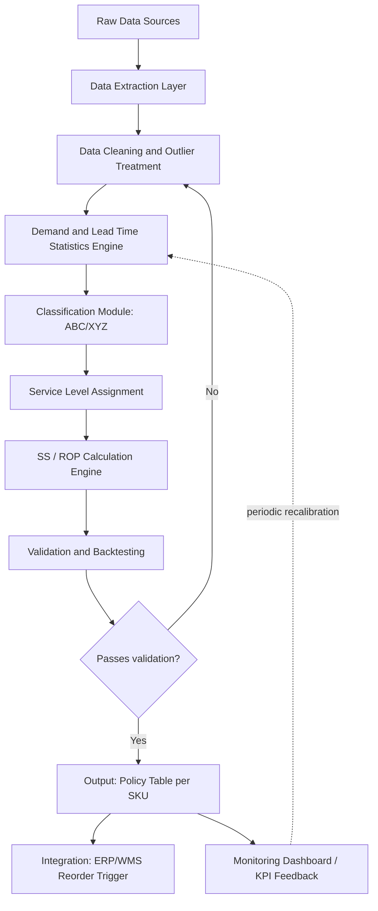
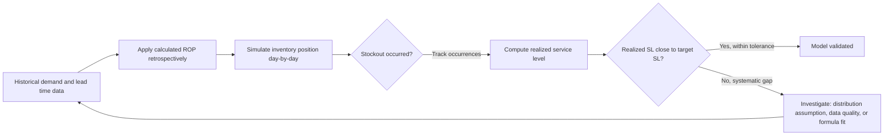

## Building a Complete Safety Stock and Reorder Point Model


### Overview

This capstone exercise walks through constructing an end-to-end, reproducible safety stock and reorder point model — from raw transactional data to a deployable calculation engine. Unlike the formula-summary references in earlier chapters, this exercise focuses on the *implementation architecture*: data pipeline, calculation logic, validation, and operational integration.

### Model Architecture Overview



### Stage 1: Data Sources and Extraction

**Required input data:**

| Data Element | Typical Source | Granularity |
| --- | --- | --- |
| Historical demand/sales | ERP, POS, order history | Daily or weekly, per SKU |
| Purchase order dates | Procurement/ERP | Order date, receipt date |
| Lead time (order-to-receipt) | Derived from PO data | Per PO line |
| Current on-hand inventory | WMS/ERP | Real-time or daily snapshot |
| Unit cost / holding cost inputs | Finance/Procurement | Per SKU or category |
| Ordering cost | Finance/Procurement | Per order or per supplier |

**Example extraction query pattern (SQL):**

```sql
SELECT
    sku_id,
    order_date,
    receipt_date,
    DATEDIFF(day, order_date, receipt_date) AS lead_time_days,
    quantity_received
FROM purchase_order_lines
WHERE receipt_date IS NOT NULL
  AND order_date >= DATEADD(month, -18, GETDATE())
ORDER BY sku_id, order_date;
```

### Stage 2: Data Cleaning and Outlier Treatment

**Key Points**

- Raw lead time and demand data frequently contain data-entry errors (e.g., a receipt date recorded before the order date, or a demand spike from a data duplication bug) that must be filtered before statistics are computed, since even a small number of extreme outliers can substantially distort $\sigma_d$ or $\sigma_L$.
- A common approach is to apply an interquartile range (IQR) filter or a z-score threshold (e.g., exclude points beyond 3 standard deviations) before computing final statistics, though the specific threshold should be validated against domain knowledge rather than applied blindly.
- Promotional or event-driven demand spikes present a judgment call: including them in $\sigma_d$ calculations inflates safety stock for *normal* periods, while excluding them risks understating safety stock during future promotional periods — many mature implementations model promotional and baseline demand separately for this reason. [Inference: this is a widely recognized modeling trade-off in demand planning practice, not a claim with a single universally correct resolution.]

**Example outlier filter (Python/pandas):**

```python
import pandas as pd
import numpy as np

def filter_outliers_iqr(series: pd.Series, k: float = 1.5) -> pd.Series:
    """Remove values outside k * IQR from Q1/Q3."""
    q1, q3 = series.quantile(0.25), series.quantile(0.75)
    iqr = q3 - q1
    lower_bound = q1 - k * iqr
    upper_bound = q3 + k * iqr
    return series[(series >= lower_bound) & (series <= upper_bound)]

# Example usage on lead time data
clean_lead_times = filter_outliers_iqr(df['lead_time_days'])
```

### Stage 3: Demand and Lead Time Statistics Engine

Core statistics computed per SKU (or per SKU-location for multi-location models):

```python
import pandas as pd
import numpy as np

def compute_sku_statistics(demand_series: pd.Series, lead_time_series: pd.Series) -> dict:
    """
    Compute core demand/lead-time statistics for a single SKU.
    demand_series: periodic demand values (e.g., daily units)
    lead_time_series: observed lead times in days
    """
    return {
        'd_avg': demand_series.mean(),
        'sigma_d': demand_series.std(ddof=1),   # sample std dev
        'L_avg': lead_time_series.mean(),
        'sigma_L': lead_time_series.std(ddof=1),
        'cv_demand': demand_series.std(ddof=1) / demand_series.mean() if demand_series.mean() > 0 else np.nan,
        'n_demand_obs': len(demand_series),
        'n_lead_time_obs': len(lead_time_series),
    }
```

**Minimum sample size consideration:** Statistics computed from fewer than ~12 demand observations or fewer than ~5 lead time observations should be flagged as low-confidence; the model should either fall back to a category-level average or apply a wider precautionary buffer for such SKUs. [Inference: specific minimum-sample thresholds vary by methodology and risk tolerance; the values given here are reasonable defaults rather than a fixed standard.]

### Stage 4: Classification Module (ABC/XYZ)

```python
def classify_abc(sku_values: pd.DataFrame, value_col: str = 'annual_usage_value') -> pd.DataFrame:
    """Assign ABC class based on cumulative value contribution (Pareto)."""
    df = sku_values.sort_values(value_col, ascending=False).copy()
    df['cum_value'] = df[value_col].cumsum()
    df['cum_pct'] = df['cum_value'] / df[value_col].sum()

    def assign_class(pct):
        if pct <= 0.80:
            return 'A'
        elif pct <= 0.95:
            return 'B'
        else:
            return 'C'

    df['abc_class'] = df['cum_pct'].apply(assign_class)
    return df

def classify_xyz(cv: float) -> str:
    """Assign XYZ class based on coefficient of variation."""
    if cv < 0.5:
        return 'X'
    elif cv < 1.0:
        return 'Y'
    else:
        return 'Z'
```

### Stage 5: Service Level Assignment and SS/ROP Calculation Engine

```python
from scipy.stats import norm

SERVICE_LEVEL_MAP = {
    'AX': 0.98, 'AY': 0.97, 'AZ': 0.95,
    'BX': 0.95, 'BY': 0.95, 'BZ': 0.92,
    'CX': 0.90, 'CY': 0.88, 'CZ': 0.85,
}

def calculate_ss_rop(d_avg: float, sigma_d: float, L_avg: float, sigma_L: float,
                      abc_xyz_class: str) -> dict:
    """
    Calculate safety stock and reorder point using the combined-variability formula.
    Assumes independence between demand and lead time variability.
    """
    service_level = SERVICE_LEVEL_MAP.get(abc_xyz_class, 0.95)
    z = norm.ppf(service_level)

    variance_term = (L_avg * sigma_d**2) + (d_avg**2 * sigma_L**2)
    safety_stock = z * np.sqrt(variance_term)
    reorder_point = (d_avg * L_avg) + safety_stock

    return {
        'service_level': service_level,
        'z_score': round(z, 4),
        'safety_stock': round(safety_stock, 1),
        'reorder_point': round(reorder_point, 1),
    }
```

### Stage 6: Validation and Backtesting

The model must be validated against historical data before deployment — computing what the ROP *would have* triggered historically and checking whether the resulting stockout frequency aligns with the target service level.



**Backtesting logic (simplified):**

```python
def backtest_service_level(demand_history: pd.Series, rop: float, initial_inventory: float,
                            order_qty: float, lead_time_days: int) -> float:
    """
    Simple single-echelon backtest simulating inventory position against
    historical daily demand to estimate realized cycle service level.
    Simplification: assumes fixed lead time and immediate reorder trigger at ROP.
    """
    inventory = initial_inventory
    pending_orders = []  # (arrival_day, quantity)
    stockout_cycles = 0
    total_cycles = 0
    on_order = False

    for day, demand in enumerate(demand_history):
        # Receive any arriving orders
        pending_orders = [(d, q) for d, q in pending_orders if d != day or (inventory := inventory + q)]

        inventory -= demand
        if inventory < 0:
            stockout_cycles += 1
            inventory = max(inventory, 0)  # no backorder modeled in this simplification

        if inventory <= rop and not on_order:
            pending_orders.append((day + lead_time_days, order_qty))
            on_order = True
            total_cycles += 1
        if any(d == day for d, _ in pending_orders):
            on_order = False

    realized_sl = 1 - (stockout_cycles / total_cycles) if total_cycles > 0 else None
    return realized_sl
```

**Note:** This backtest is intentionally simplified (no backorder modeling, single pending order at a time). Production-grade backtesting should model concurrent open orders, partial receipts, and backorder fulfillment explicitly. [Inference: the simplification is appropriate for exercise/illustrative purposes, but production deployment would require a more complete discrete-event simulation to avoid biased service-level estimates.]

### Stage 7: Output Structure and ERP/WMS Integration

**Standard output policy table schema:**

| Field | Type | Description |
| --- | --- | --- |
| sku_id | string | Unique SKU identifier |
| abc_xyz_class | string | e.g., "AX", "BZ" |
| d_avg | float | Average demand per period |
| sigma_d | float | Standard deviation of demand |
| L_avg | float | Average lead time (days) |
| sigma_L | float | Standard deviation of lead time |
| target_service_level | float | e.g., 0.95 |
| z_score | float | Corresponding z-value |
| safety_stock | float | Calculated SS |
| reorder_point | float | Calculated ROP |
| order_quantity | float | EOQ or policy-defined order qty |
| last_calculated | datetime | Timestamp for recalibration tracking |
| data_confidence_flag | string | e.g., "low_sample_size" |

This table becomes the direct input to ERP/WMS reorder trigger logic — typically consumed via scheduled batch update (e.g., nightly) or API push, depending on system architecture. [Unverified: specific integration mechanics vary substantially by ERP/WMS vendor and are not standardized across systems; consult the target system's integration documentation for exact implementation.]

### Recalibration Cadence

**Key Points**

- Static safety stock parameters degrade as demand patterns and supplier lead times drift; most mature implementations recalculate on a fixed cadence (e.g., monthly or quarterly) rather than treating the model as a one-time calculation.
- High-CV (Z-class) items generally warrant more frequent recalibration than stable (X-class) items, since their underlying statistics are more likely to shift meaningfully period-to-period.
- Recalibration should trigger a re-validation/backtest step, not just a silent parameter update, to catch cases where an underlying assumption (e.g., normality) has become a poor fit due to changing demand character.

### Common Pitfalls

- **Skipping the backtesting/validation stage**: A model that calculates ROP correctly by formula but has never been checked against historical outcomes may still perform poorly if a formula assumption (independence, normality) doesn't hold for the actual data.
- **Hardcoding a single service level across the calculation engine**: Defeats the purpose of ABC/XYZ differentiation; the engine should accept class-specific service level inputs, not a global constant.
- **Not flagging low-sample-size SKUs**: New products or very low-velocity items produce statistically unreliable $\sigma_d$/$\sigma_L$ estimates; the model should surface a confidence flag rather than silently outputting a precise-looking but unreliable number.
- **Ignoring lead time data entirely due to availability gaps**: Defaulting $\sigma_L = 0$ when true data is simply missing (rather than genuinely zero) silently understates safety stock; this should be an explicit, documented decision rather than an unexamined default.
- **Treating the model as "done" after initial deployment**: Without a recalibration cadence and monitoring feedback loop, model accuracy degrades over time as underlying demand and supply conditions shift.

**Next Steps**

- Discrete-event simulation for higher-fidelity backtesting (multiple open orders, backorders, partial receipts)
- Multi-echelon extension (DC and store-level safety stock interaction)
- Automated data-quality monitoring and alerting for the input pipeline
- API-based integration patterns for real-time ERP/WMS reorder triggers
- A/B testing framework for validating service-level policy changes in production
- Incorporating supplier reliability scoring into $\sigma_L$ estimation