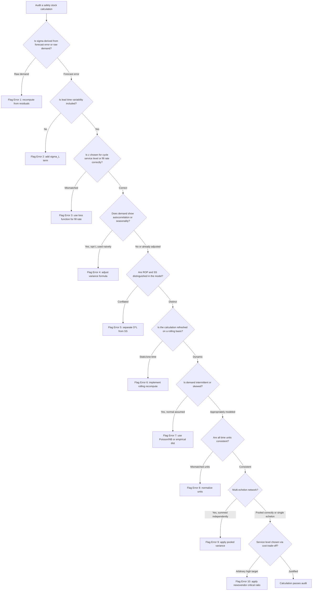

## Common Calculation Errors and Misconceptions

### Overview

Safety stock and inventory calculations are frequently miscalculated not because the formulas are unknown, but because of subtle misapplications: wrong statistical assumptions, unit mismatches, or conflating distinct concepts. This chapter catalogs the most consequential errors seen in practice, why they happen, and how to detect and correct them.

### Error 1: Using Standard Deviation of Demand Instead of Forecast Error

**Key Points**

- The classic safety stock formula $SS = z \cdot \sigma \cdot \sqrt{L}$ requires $\sigma$ to represent the standard deviation of *forecast error* (actual minus forecast), not the raw standard deviation of historical demand.
- Using raw demand variability overstates safety stock when a good forecast already explains most of the variation, and understates it when the forecasting model is poor and residuals are volatile.

**Example**

If monthly demand ranges from 80 to 120 units with $\sigma_{demand} = 12$, but a seasonally-adjusted forecast reduces the unexplained error to $\sigma_{error} = 5$, using 12 instead of 5 more than doubles the resulting safety stock unnecessarily.

$$SS_{correct} = z \cdot \sigma_{error} \cdot \sqrt{L}, \quad SS_{incorrect} = z \cdot \sigma_{demand} \cdot \sqrt{L}$$

**Correction**: Compute $\sigma$ from the residual series (forecast minus actual) over a representative historical window, not from raw demand.

### Error 2: Ignoring Lead Time Variability

**Key Points**

- Many practitioners apply $SS = z \cdot \sigma_D \cdot \sqrt{L}$, treating lead time $L$ as a fixed constant, when in reality lead time itself varies (supplier delays, customs, transit disruptions).
- The correct combined-variance formula accounts for both demand and lead time variability:

$$SS = z \cdot \sqrt{L \cdot \sigma_D^2 + D^2 \cdot \sigma_L^2}$$

where $D$ is average demand per period, $\sigma_D$ is demand standard deviation, $L$ is average lead time, and $\sigma_L$ is lead time standard deviation.

**Example**

For $D = 100$/week, $\sigma_D = 15$, $L = 4$ weeks, $\sigma_L = 1$ week, $z = 1.65$ (95% service level):

- Demand-only (wrong): $SS = 1.65 \cdot 15 \cdot \sqrt{4} = 49.5$
- Combined (correct): $SS = 1.65 \cdot \sqrt{4 \cdot 225 + 10000 \cdot 1} = 1.65 \cdot \sqrt{900 + 10000} = 1.65 \cdot 104.4 \approx 172.3$

[Inference] The gap here is typical when lead time variability is non-trivial relative to demand variability — omitting the $\sigma_L$ term can understate required safety stock by 3x or more in supply chains with unreliable logistics.

### Error 3: Misinterpreting the Service Level (z-score) Table

**Key Points**

- Confusing **cycle service level** (probability of not stocking out during a replenishment cycle) with **fill rate** (percentage of demand units satisfied from stock) leads to incorrect z-value selection.
- A 95% cycle service level does NOT mean 95% of units are fulfilled — fill rate is typically higher than cycle service level for the same z, because a single stockout event may only affect a small fraction of total units ordered that cycle.

| Metric | Definition | Common z at 95% target |
| --- | --- | --- |
| Cycle Service Level | P(no stockout in a cycle) | z ≈ 1.65 |
| Fill Rate | % of unit-demand met immediately | Requires loss-function conversion, not a direct z lookup |

**Correction**: When a fill-rate target is given, use the unit normal loss function $L(z)$ to solve for the required $z$, not the direct inverse-CDF z-score used for cycle service level.

### Error 4: Applying the Square Root of Time Rule Incorrectly

**Key Points**

- The $\sqrt{L}$ scaling assumes demand across periods is **independent and identically distributed (i.i.d.)**. Many practitioners apply it blindly to autocorrelated or trending demand.
- If demand has positive autocorrelation (e.g., promotional carryover, trending growth), actual variance over the lead time grows faster than $L \cdot \sigma^2$, so $\sqrt{L}$ underestimates true variability.
- If demand is seasonal or mean-reverting, $\sqrt{L}$ can overestimate variability.

**Example**

For AR(1) demand with autocorrelation $\rho$, the correct lead-time variance is:

$$\sigma_L^2 = \sigma_D^2 \left[ L + 2 \sum_{k=1}^{L-1}(L-k)\rho^k \right]$$

[Inference] This diverges meaningfully from $L \cdot \sigma_D^2$ once $|\rho| > 0.3$, which is common in categories with promotional or seasonal demand patterns.

### Error 5: Confusing Reorder Point with Safety Stock

**Key Points**

- Reorder Point (ROP) and Safety Stock (SS) are frequently used interchangeably, but ROP includes expected demand during lead time:

$$ROP = (D \times L) + SS$$

- Treating ROP as if it were only the buffer (i.e., reordering only when stock drops to $SS$ level, not $ROP$) causes chronic stockouts because it ignores expected consumption during the replenishment window entirely.

### Error 6: Static Safety Stock in a Dynamic Demand Environment

**Key Points**

- Calculating safety stock once and never recalculating ignores demand seasonality, product lifecycle stage, and shifting supplier reliability.
- New products, end-of-life products, and highly seasonal SKUs need dynamically recalculated $\sigma_D$ and $L$ — a single annual average masks periods of much higher or lower risk.

**Correction**: Recompute on a rolling window (e.g., trailing 8–13 periods) or segment safety stock calculations by season/demand regime.

### Error 7: Ignoring Demand Distribution Shape (Normality Assumption)

**Key Points**

- The standard z-score approach assumes demand during lead time is **normally distributed**. This breaks down for:
  - Slow-moving / intermittent demand (frequently zero, with occasional large orders) — better modeled with a **Poisson** or **negative binomial** distribution, or via **Croston's method**.
  - Highly right-skewed demand (occasional very large orders) — normal approximation underestimates tail risk.
- Applying the normal-distribution z-score formula to intermittent demand (common for spare parts, B2B/government orders) systematically underestimates required safety stock in the tail while sometimes overestimating it in the median case.

**Example**

For intermittent demand with mean 2 units/week but 70% of weeks at zero demand, the normal approximation's symmetric bell curve poorly represents the actual right-skewed, zero-inflated distribution. A negative binomial or bootstrapped empirical distribution gives a more defensible reorder point.

### Error 8: Unit and Period Mismatches

**Key Points**

- Mixing daily $\sigma_D$ with weekly lead time (or vice versa) without converting units is one of the most common spreadsheet errors.
- Rule: $\sigma_D$, $D$, and $L$ must all be expressed in the **same time unit** before applying the formula.

**Example**

If $\sigma_D = 5$ units/day but $L = 3$ weeks, converting to consistent daily units first: $L_{days} = 21$. Failing to convert (using $L=3$ as if in days) understates the lead-time window by a factor of 7.

### Error 9: Double-Counting Safety Stock Across Echelons

**Key Points**

- In multi-echelon supply chains (e.g., central warehouse → regional DC → store), independently calculating safety stock at each node using the same service-level target causes excessive redundant buffer inventory system-wide.
- Multi-echelon inventory optimization (MEIO) accounts for risk pooling: aggregated demand variability across downstream nodes is proportionally lower than the sum of individual node variabilities (by $\sqrt{n}$ under independence).

$$\sigma_{pooled} = \sqrt{\sum_i \sigma_i^2} \quad \text{(if demands are independent)}, \quad \text{vs.} \quad \sigma_{naive-sum} = \sum_i \sigma_i$$

[Inference] The naive sum overstates system-wide required buffer significantly whenever downstream demand streams are not perfectly correlated — this is the core justification for centralized/pooled inventory strategies.

### Error 10: Treating Service Level as Free — Ignoring the Cost Trade-off

**Key Points**

- A common conceptual misconception: chasing 99%+ service levels "because stockouts are bad," without recognizing that safety stock cost grows **non-linearly** with service level (since $z$ rises steeply near the tail of the normal distribution).

| Service Level | z-score | Relative SS multiplier |
| --- | --- | --- |
| 90% | 1.28 | 1.0x (baseline) |
| 95% | 1.65 | 1.29x |
| 99% | 2.33 | 1.82x |
| 99.9% | 3.09 | 2.41x |

- Moving from 95% to 99.9% service level nearly doubles required safety stock investment for the same demand/lead-time variability — this should be a deliberate cost-service trade-off (using critical ratio / newsvendor logic), not a default assumption.

### Diagram: Error Propagation in the Safety Stock Calculation Pipeline (svg_diagram)

<svg xmlns="http://www.w3.org/2000/svg" viewBox="0 0 900 420" font-family="Arial, sans-serif" font-size="13">
<text x="450" y="25" text-anchor="middle" font-size="16" font-weight="bold">Safety Stock Error Propagation Pipeline (svg_diagram)</text>
<rect x="20" y="60" width="150" height="60" rx="6" fill="#dbeafe" stroke="#2563eb" />
<text x="95" y="85" text-anchor="middle">Raw Demand</text>
<text x="95" y="102" text-anchor="middle" font-size="11">History</text>
<rect x="220" y="60" width="150" height="60" rx="6" fill="#fef3c7" stroke="#d97706" />
<text x="295" y="85" text-anchor="middle">Forecast Model</text>
<text x="295" y="102" text-anchor="middle" font-size="11">(Error 1 risk)</text>
<rect x="420" y="60" width="150" height="60" rx="6" fill="#fee2e2" stroke="#dc2626" />
<text x="495" y="85" text-anchor="middle">σ Estimation</text>
<text x="495" y="102" text-anchor="middle" font-size="11">(Errors 4, 7, 8)</text>
<rect x="620" y="60" width="150" height="60" rx="6" fill="#fee2e2" stroke="#dc2626" />
<text x="695" y="85" text-anchor="middle">Lead Time Model</text>
<text x="695" y="102" text-anchor="middle" font-size="11">(Error 2 risk)</text>
<rect x="320" y="180" width="260" height="60" rx="6" fill="#ede9fe" stroke="#7c3aed" />
<text x="450" y="205" text-anchor="middle">Safety Stock Formula</text>
<text x="450" y="222" text-anchor="middle" font-size="11">z · σ · √L (Error 9 at multi-echelon)</text>
<rect x="150" y="290" width="220" height="60" rx="6" fill="#dcfce7" stroke="#16a34a" />
<text x="260" y="312" text-anchor="middle">Service Level Target</text>
<text x="260" y="329" text-anchor="middle" font-size="11">(Errors 3, 10)</text>
<rect x="530" y="290" width="220" height="60" rx="6" fill="#fef9c3" stroke="#ca8a04" />
<text x="640" y="312" text-anchor="middle">Reorder Point</text>
<text x="640" y="329" text-anchor="middle" font-size="11">(Error 5 confusion)</text>
<rect x="320" y="370" width="260" height="40" rx="6" fill="#e2e8f0" stroke="#334155" />
<text x="450" y="395" text-anchor="middle">Final Inventory Policy (Error 6: must refresh)</text>
<line x1="170" y1="90" x2="220" y2="90" stroke="#334155" marker-end="url(#arrow)" />
<line x1="370" y1="90" x2="420" y2="90" stroke="#334155" marker-end="url(#arrow)" />
<line x1="495" y1="120" x2="470" y2="180" stroke="#334155" marker-end="url(#arrow)" />
<line x1="695" y1="120" x2="580" y2="180" stroke="#334155" marker-end="url(#arrow)" />
<line x1="380" y1="240" x2="290" y2="290" stroke="#334155" marker-end="url(#arrow)" />
<line x1="450" y1="240" x2="450" y2="290" stroke="#334155" marker-end="url(#arrow)" />
<line x1="450" y1="350" x2="450" y2="370" stroke="#334155" marker-end="url(#arrow)" />
</svg>

### Diagnostic Checklist for Auditing Existing Calculations

### Summary Table of Errors and Corrective Formulas

| # | Error | Corrective Approach |
| --- | --- | --- |
| 1 | Using raw demand σ instead of forecast error σ | Compute σ from forecast residuals |
| 2 | Ignoring lead time variability | $SS = z\sqrt{L\sigma_D^2 + D^2\sigma_L^2}$ |
| 3 | Confusing cycle service level with fill rate | Use unit normal loss function for fill-rate targets |
| 4 | Blind application of $\sqrt{L}$ under autocorrelation | Use AR-adjusted variance formula |
| 5 | Conflating ROP with SS | $ROP = D \times L + SS$ |
| 6 | Static safety stock | Recompute on rolling window |
| 7 | Normality assumption for intermittent demand | Use Poisson/negative binomial or Croston's method |
| 8 | Time-unit mismatch | Normalize all inputs to one time unit |
| 9 | Double-counting across echelons | Apply pooled variance / MEIO |
| 10 | Ignoring cost trade-off of service level | Apply newsvendor critical ratio logic |

**Related Topics**

- Newsvendor model and critical ratio derivation
- Croston's method and intermittent demand forecasting
- Multi-echelon inventory optimization (MEIO) techniques
- Unit normal loss function and fill-rate-to-z conversion
- Autocorrelated demand variance modeling (ARIMA-based lead time demand)
- Dynamic safety stock recalculation pipelines and rolling-window statistics