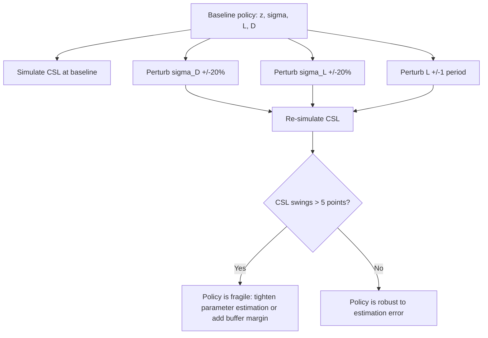
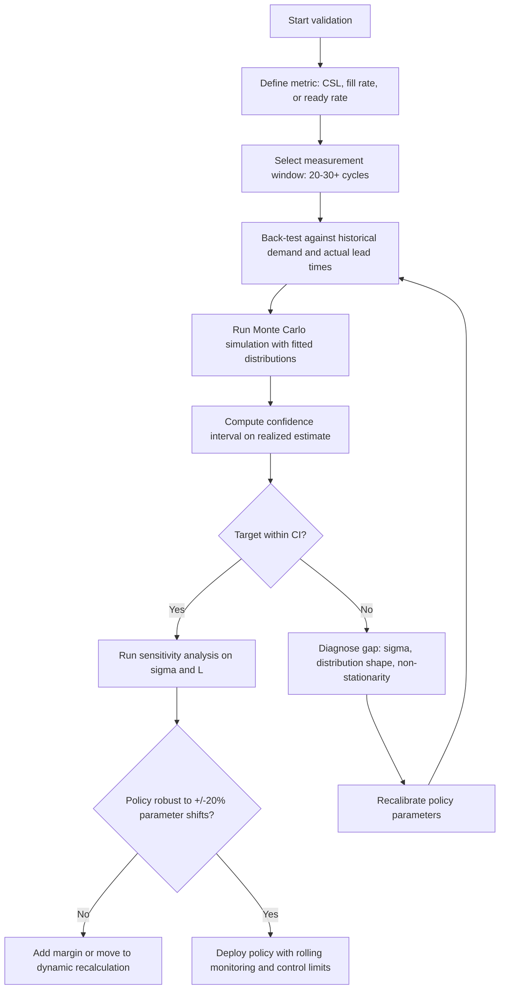

## Validating an Inventory Policy Against Service Level Targets

### Overview

Setting a service level target and computing safety stock is only half the job — validation confirms the policy actually *delivers* the intended service level once exposed to real demand and supply variability. This chapter covers the analytical and simulation-based methods for validating inventory policies, detecting drift, and closing the loop between theoretical design and observed performance.

### Why Validation Is Necessary

**Key Points**

- The safety stock formula $SS = z \cdot \sigma \cdot \sqrt{L}$ is derived under assumptions (normality, i.i.d. demand, stable lead time) that are rarely fully true in practice.
- A policy computed correctly on paper can still under- or over-deliver the target service level if:
  - The underlying demand distribution doesn't match the assumed distribution
  - Parameters ($\sigma$, $L$, $D$) were estimated from a non-representative historical window
  - The review policy (continuous vs. periodic) doesn't match how the formula was derived
- Validation closes the gap between **designed service level** (the target used to compute SS) and **realized service level** (what actually happens operationally).

### Step 1: Define the Measurement Window and Metric

**Key Points**

- Decide which service level metric the policy is validated against — these are not interchangeable:
  - **Cycle Service Level (CSL)**: fraction of replenishment cycles with zero stockouts
  - **Fill Rate ($\alpha$)**: fraction of demand units satisfied immediately from stock
  - **Ready Rate**: probability of being in-stock at a random point in time (used with continuous review)
- Choose a measurement window long enough to contain a statistically meaningful number of replenishment cycles — a common rule of thumb is at least 20–30 cycles for a reasonably tight confidence interval.

$$\hat{CSL} = 1 - \frac{\text{cycles with a stockout}}{\text{total cycles}}$$


$$\hat{\alpha} = 1 - \frac{\text{units short}}{\text{total demand}}$$

### Step 2: Back-Testing on Historical Data

**Key Points**

- Replay the inventory policy against historical demand and actual (not planned) lead times to see what would have happened.
- This is distinct from "did we stock out" in the raw historical record — it re-simulates inventory position under the *proposed* policy parameters, not the ones actually used historically.

**Example — Back-test procedure**

```plaintext
1. Set initial inventory position = ROP (steady state assumption)
2. For each historical period t:
   a. Apply actual demand D_t
   b. If inventory position <= ROP, place order of quantity Q
   c. Apply actual (historical) lead time L_t to determine arrival
   d. Record whether a stockout occurred, and units short if any
3. Aggregate stockout frequency (-> CSL) and units short (-> fill rate)
4. Compare realized metrics against target
```

**Output**

A realized CSL/fill rate estimate that can be directly compared to the target used to size SS. A persistent gap (e.g., target 95%, realized 88%) indicates a parameter or model misspecification (see Step 4).

### Step 3: Monte Carlo Simulation for Forward-Looking Validation

**Key Points**

- Back-testing validates against what *did* happen; simulation validates against what *could* happen, including scenarios not present in the historical sample (e.g., a longer lead-time excursion).
- Standard approach: draw demand and lead time from fitted distributions (not necessarily normal — see Error 7 in prior chapter) across thousands of simulated replenishment cycles, and measure the empirical service level achieved.

$$\hat{CSL}_{sim} = \frac{1}{N}\sum_{i=1}^{N} \mathbb{1}[\text{no stockout in simulated cycle } i]$$

**Example**

For $N = 10{,}000$ simulated cycles with demand drawn from a fitted negative binomial (appropriate for intermittent demand) and lead time drawn from a fitted lognormal (common for transit-time distributions, which are right-skewed and bounded below by zero), the simulated $\hat{CSL}$ converges to the *actual* achievable service level under those distributional assumptions — which may differ meaningfully from the normal-theory value if the true distributions are skewed.

[Inference] When demand or lead time is meaningfully non-normal, the simulated CSL commonly diverges from the theoretical target by several percentage points; the direction of the gap depends on the skew and kurtosis of the fitted distributions relative to the normal assumption.

### Step 4: Diagnosing a Service Level Gap

**Key Points**

When realized/simulated service level doesn't match the target, isolate the cause systematically:

| Symptom | Likely Cause | Diagnostic Check |
| --- | --- | --- |
| Realized CSL persistently below target | $\sigma$ underestimated (see Error 1/2 from prior chapter) | Recompute σ from forecast residuals AND lead time variance |
| Realized CSL below target only during specific periods | Non-stationary demand (trend/seasonality not captured) | Segment σ by season/regime |
| Realized CSL above target (overperforming) | Excess safety stock — conservative bias or stale σ from high-variance period | Recompute σ on rolling window |
| Fill rate low despite good CSL | Stockouts are infrequent but severe (large units-short per event) | Distinguish CSL vs. fill-rate targets; consider volatility of order sizes |
| Simulated CSL matches target but realized doesn't | Model-reality mismatch (demand distribution misspecified, non-i.i.d. structure) | Re-fit distribution; test for autocorrelation |

### Step 5: Confidence Intervals on the Realized Estimate

**Key Points**

- A single measured CSL is a point estimate from a finite sample of cycles — it needs a confidence interval before concluding the policy is "off target."
- For CSL (a binomial proportion, e.g., $k$ stockout-free cycles out of $n$ total), use the Wilson score interval (more reliable than the normal approximation at small $n$ or extreme proportions):

$$CI = \frac{\hat{p} + \frac{z^2}{2n} \pm z\sqrt{\frac{\hat{p}(1-\hat{p})}{n} + \frac{z^2}{4n^2}}}{1 + \frac{z^2}{n}}$$

**Example**

With 28 out of 30 cycles stockout-free ($\hat{p} = 0.933$), the 95% Wilson interval is roughly [0.78, 0.98] — wide enough that a "target of 95%" cannot be confidently rejected or confirmed from this sample alone. This illustrates why validation needs either a longer window or simulation-based augmentation rather than relying on a small historical sample.

### Step 6: Sensitivity Analysis

**Key Points**

- Test how robust the validated policy is to reasonable parameter estimation error — a policy that only hits its target under exact point estimates of $\sigma$ and $L$ is fragile.
- Vary $\sigma_D$, $\sigma_L$, and $D$ by ±10–20% and re-run the simulation to see how much the achieved service level moves.



### Step 7: Ongoing Monitoring (Closed-Loop Validation)

**Key Points**

- Validation is not a one-time exercise — set up a recurring monitoring cadence that tracks realized service level against target on a rolling basis (e.g., trailing 13 periods).
- Establish control limits (e.g., using a p-chart / control chart for the stockout-cycle proportion) to distinguish normal sampling noise from a genuine shift in underlying variability requiring policy recalibration.

$$UCL/LCL = \hat{p} \pm 3\sqrt{\frac{\hat{p}(1-\hat{p})}{n}}$$

**Example**

If the trailing CSL estimate crosses below the lower control limit for two consecutive monitoring periods, this is a statistically meaningful signal (not just noise) that the policy's underlying $\sigma$ or $L$ assumptions have shifted — triggering a recalculation rather than a reactive one-off stock top-up.

### Diagram: Validation Loop Architecture (svg_diagram)

<svg xmlns="http://www.w3.org/2000/svg" viewBox="0 0 900 380" font-family="Arial, sans-serif" font-size="13">
<text x="450" y="25" text-anchor="middle" font-size="16" font-weight="bold">Inventory Policy Validation Loop (svg_diagram)</text>
<rect x="30" y="60" width="170" height="60" rx="6" fill="#dbeafe" stroke="#2563eb" />
<text x="115" y="85" text-anchor="middle">Policy Design</text>
<text x="115" y="102" text-anchor="middle" font-size="11">z, σ, L, ROP, SS</text>
<rect x="260" y="60" width="170" height="60" rx="6" fill="#fef3c7" stroke="#d97706" />
<text x="345" y="85" text-anchor="middle">Back-Test</text>
<text x="345" y="102" text-anchor="middle" font-size="11">Historical replay</text>
<rect x="490" y="60" width="170" height="60" rx="6" fill="#fef3c7" stroke="#d97706" />
<text x="575" y="85" text-anchor="middle">Monte Carlo Sim</text>
<text x="575" y="102" text-anchor="middle" font-size="11">Forward-looking</text>
<rect x="720" y="60" width="150" height="60" rx="6" fill="#ede9fe" stroke="#7c3aed" />
<text x="795" y="85" text-anchor="middle">Confidence</text>
<text x="795" y="102" text-anchor="middle" font-size="11">Interval Check</text>
<rect x="260" y="180" width="400" height="60" rx="6" fill="#fee2e2" stroke="#dc2626" />
<text x="460" y="205" text-anchor="middle">Realized vs. Target Gap?</text>
<text x="460" y="222" text-anchor="middle" font-size="11">Diagnose: σ, distribution, non-stationarity</text>
<rect x="80" y="290" width="220" height="60" rx="6" fill="#dcfce7" stroke="#16a34a" />
<text x="190" y="312" text-anchor="middle">Recalibrate Policy</text>
<text x="190" y="329" text-anchor="middle" font-size="11">Adjust σ, L, z</text>
<rect x="560" y="290" width="240" height="60" rx="6" fill="#fef9c3" stroke="#ca8a04" />
<text x="680" y="312" text-anchor="middle">Ongoing Monitoring</text>
<text x="680" y="329" text-anchor="middle" font-size="11">Control chart, rolling CSL</text>
<line x1="200" y1="90" x2="260" y2="90" stroke="#334155" marker-end="url(#arrow2)" />
<line x1="430" y1="90" x2="490" y2="90" stroke="#334155" marker-end="url(#arrow2)" />
<line x1="660" y1="90" x2="720" y2="90" stroke="#334155" marker-end="url(#arrow2)" />
<line x1="460" y1="120" x2="460" y2="180" stroke="#334155" marker-end="url(#arrow2)" />
<line x1="380" y1="240" x2="220" y2="290" stroke="#334155" marker-end="url(#arrow2)" />
<line x1="540" y1="240" x2="650" y2="290" stroke="#334155" marker-end="url(#arrow2)" />
<line x1="190" y1="290" x2="115" y2="120" stroke="#334155" stroke-dasharray="4,3" marker-end="url(#arrow2)" />
<line x1="680" y1="290" x2="345" y2="120" stroke="#334155" stroke-dasharray="4,3" marker-end="url(#arrow2)" />
</svg>

### Validation Checklist



### Common Pitfalls in Validation Itself

**Key Points**

- **Too-short measurement window**: drawing conclusions from fewer than ~20 cycles produces confidence intervals too wide to be actionable.
- **Validating against the wrong metric**: confirming fill rate when the policy was designed for cycle service level (or vice versa) produces a false sense of mismatch.
- **Ignoring lead time realization**: back-testing with *planned* lead time instead of *actual* historical lead time hides the very lead-time variability the policy needs to be validated against.
- **Survivorship bias in the historical window**: if stockout periods triggered emergency interventions (expedited shipping, manual overrides) that aren't reflected in the "demand" data, the back-test will look artificially healthy.

**Related Topics**

- Newsvendor critical ratio and cost-based service level selection
- Control charts (p-charts) for ongoing supply chain KPI monitoring
- Fitting empirical demand distributions (negative binomial, lognormal lead time)
- Multi-echelon validation and risk-pooling effects on realized service level
- A/B testing inventory policies across comparable SKU cohorts