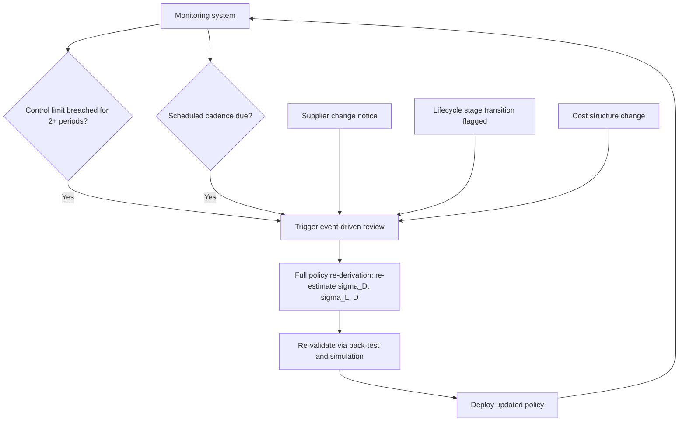
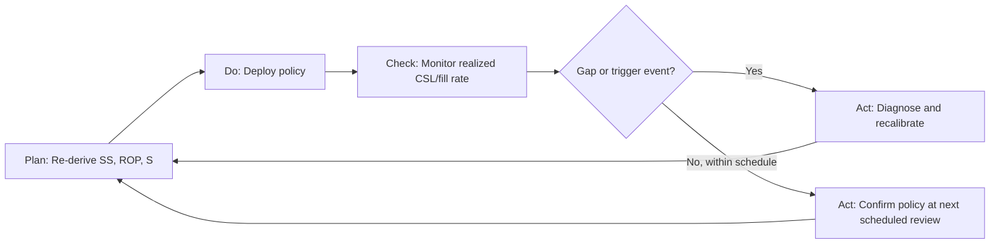

## Continuous Improvement and Periodic Policy Review

### Overview

An inventory policy that was correctly designed and validated will still degrade over time as demand patterns, supplier performance, and business priorities shift. This chapter covers the operational discipline of periodic review: how often to revisit policies, what triggers an off-cycle review, how to structure the review process, and how to institutionalize continuous improvement rather than treating inventory policy as a "set once" artifact.

### Why Policies Decay Over Time

**Key Points**

- Every input to the safety stock and reorder point formulas is a point-in-time estimate: $\sigma_D$, $\sigma_L$, $D$, and even the service level target itself reflect conditions at calculation time.
- Sources of decay include:
  - **Demand regime shifts**: new competitors, changing customer behavior, product lifecycle transitions (growth → maturity → decline)
  - **Supplier performance drift**: a supplier's lead time reliability can degrade (or improve) due to capacity changes, logistics disruptions, or new sourcing agreements
  - **Cost structure changes**: holding cost or stockout cost assumptions used in the original service-level target may no longer reflect current economics
  - **Assortment changes**: SKU rationalization, new product introductions, and bundling change the demand correlation structure assumed in any pooling or multi-echelon calculations
- [Inference] Because these drivers change independently and at different rates, a policy that was optimal at design time will, with high likelihood, drift away from optimality well before most organizations naturally revisit it — which is why *scheduled* review cadences outperform ad hoc reviews.

### Establishing a Review Cadence

**Key Points**

- Review frequency should be tiered by SKU criticality and volatility, not applied uniformly — a common segmentation approach layers ABC classification (value) with XYZ classification (demand variability):

| Segment | Characteristics | Suggested Review Cadence |
| --- | --- | --- |
| AX | High value, stable demand | Quarterly |
| AY / AZ | High value, variable/erratic demand | Monthly |
| BX | Medium value, stable demand | Semi-annual |
| BY / BZ | Medium value, variable demand | Quarterly |
| CX | Low value, stable demand | Annual |
| CY / CZ | Low value, variable/erratic demand | Semi-annual, or automate via dynamic recalculation |

- High-value, high-variability SKUs (AZ) carry the most cost risk from both overstock and stockout, justifying the tightest review loop.

### Trigger-Based (Event-Driven) Reviews

**Key Points**

- Beyond scheduled cadence, specific events should trigger an immediate off-cycle review regardless of where the SKU sits in its normal cycle:
  - A validated service-level gap detected via monitoring (see prior chapter's control-chart triggers)
  - A supplier change (new vendor, renegotiated contract, changed manufacturing location)
  - A demonstrated shift in demand pattern (e.g., a sustained control-chart signal, not a single anomalous period)
  - A product lifecycle stage transition (launch, growth inflection, decline, end-of-life)
  - A significant one-time event with lingering effects (e.g., a promotional campaign that permanently shifted the customer base, a regulatory change)
  - A cost-structure change materially altering the critical ratio (holding cost, stockout cost, or margin change)

### Structuring the Review Process

**Key Points**

A disciplined periodic review should follow a consistent structure to avoid becoming an unstructured, inconsistent ad hoc exercise:

1. **Data refresh**: Pull the latest demand, lead time, and forecast-error history for the review window (typically excluding known one-off anomalies unless the anomaly represents a new normal).
2. **Re-estimate parameters**: Recompute $\sigma_D$ (from forecast residuals, not raw demand — see prior chapter's Error 1), $\sigma_L$, and $D$ using the refreshed window.
3. **Re-validate the distributional assumption**: Re-check whether normal, Poisson, negative binomial, or empirical distribution remains the best fit — demand character can shift (e.g., a SKU moving from steady to intermittent as it approaches end-of-life).
4. **Recompute policy parameters**: New $SS$, $ROP$, and (if using periodic review) order-up-to level $S$.
5. **Back-test and simulate** the updated policy per the validation methodology from the prior chapter.
6. **Compare against current policy performance**: quantify the expected improvement (service level uplift, or inventory cost reduction at equivalent service level).
7. **Approve and deploy**, with a documented rationale for the change (critical for auditability, especially relevant in government/LGU procurement contexts where inventory decisions may be subject to audit).
8. **Log the review** in a change history for trend analysis across review cycles.

### Quantifying the Value of a Review (Before/After Comparison)

**Key Points**

- Every policy review should produce a quantified comparison, not just an updated number — this is what justifies the operational cost of the review cycle itself.
- Two primary axes to compare: same service level at lower cost, or higher service level at same cost.

$$\Delta Inventory\ Cost = (SS_{old} - SS_{new}) \times unit\ holding\ cost$$

$$\Delta Service\ Level = CSL_{new,simulated} - CSL_{old,simulated}$$

**Example**

If a review reduces $\sigma_D$ from 15 to 10 (due to an improved forecasting model reducing residual error) while holding $z$ and $L$ fixed, safety stock at $z=1.65$, $L=4$ weeks drops from $SS = 1.65 \times 15 \times 2 = 49.5$ to $SS = 1.65 \times 10 \times 2 = 33$, a reduction of 16.5 units — directly translating into a quantifiable annual holding-cost saving at the same targeted service level.

### Continuous Improvement Framework: PDCA Applied to Inventory Policy

**Key Points**

- The Plan-Do-Check-Act (PDCA) cycle maps directly onto the review process and provides a common vocabulary for embedding this into broader operational excellence programs:
  - **Plan**: Design or redesign the policy using current data and validated assumptions
  - **Do**: Deploy the policy operationally
  - **Check**: Monitor realized service level and cost against target (ties directly to the validation/monitoring chapter)
  - **Act**: Recalibrate based on findings, feeding back into the next Plan phase

### Governance and Documentation Considerations

**Key Points**

- For inventory systems tied to institutional or government procurement processes, review cycles should produce an auditable record: what changed, why, what data supported the change, and who approved it.
- A minimal review record should capture:
  - Review date and trigger (scheduled vs. event-driven)
  - Prior and new parameter values ($\sigma_D$, $\sigma_L$, $D$, $z$, $SS$, $ROP$)
  - Validation results (back-test and simulation outcomes)
  - Approving authority
- [Unverified] Specific documentation requirements will vary by jurisdiction and organizational policy — this should be confirmed against applicable procurement/audit regulations rather than assumed from general best practice.

### Common Pitfalls in Continuous Improvement Programs

**Key Points**

- **Review fatigue**: overly frequent reviews on low-criticality SKUs consume analyst time without proportional benefit — tiering (per the ABC/XYZ table above) mitigates this.
- **Anchoring on the previous policy**: treating the current SS/ROP as the default and only adjusting incrementally, rather than re-deriving from first principles, can perpetuate legacy errors indefinitely.
- **No feedback loop closure**: computing new parameters without re-validating (back-test/simulate) risks introducing the same errors documented in the prior "Common Calculation Errors" chapter — a review is incomplete without validation.
- **Optimizing without revisiting the service level target itself**: teams often re-tune $\sigma$ and $L$ estimates but never revisit whether the underlying service-level target still reflects current stockout costs and business priorities.

### Diagram: Continuous Improvement Governance Structure (svg_diagram)

<svg xmlns="http://www.w3.org/2000/svg" viewBox="0 0 900 400" font-family="Arial, sans-serif" font-size="13">
<text x="450" y="25" text-anchor="middle" font-size="16" font-weight="bold">Continuous Improvement Governance (svg_diagram)</text>
<rect x="350" y="55" width="200" height="55" rx="6" fill="#dbeafe" stroke="#2563eb" />
<text x="450" y="87" text-anchor="middle">SKU Tiering</text>
<text x="450" y="102" text-anchor="middle" font-size="11">ABC x XYZ segmentation</text>
<rect x="60" y="150" width="200" height="55" rx="6" fill="#fef3c7" stroke="#d97706" />
<text x="160" y="182" text-anchor="middle">Scheduled Review</text>
<text x="160" y="197" text-anchor="middle" font-size="11">Cadence by tier</text>
<rect x="640" y="150" width="200" height="55" rx="6" fill="#fee2e2" stroke="#dc2626" />
<text x="740" y="182" text-anchor="middle">Event-Driven Review</text>
<text x="740" y="197" text-anchor="middle" font-size="11">Control-limit, supplier, lifecycle</text>
<rect x="350" y="240" width="200" height="55" rx="6" fill="#ede9fe" stroke="#7c3aed" />
<text x="450" y="272" text-anchor="middle">Re-derive + Validate</text>
<text x="450" y="287" text-anchor="middle" font-size="11">Recompute, back-test, simulate</text>
<rect x="350" y="330" width="200" height="55" rx="6" fill="#dcfce7" stroke="#16a34a" />
<text x="450" y="362" text-anchor="middle">Approve + Log</text>
<text x="450" y="377" text-anchor="middle" font-size="11">Auditable change record</text>
<line x1="450" y1="110" x2="160" y2="150" stroke="#334155" marker-end="url(#arrow3)" />
<line x1="450" y1="110" x2="740" y2="150" stroke="#334155" marker-end="url(#arrow3)" />
<line x1="160" y1="205" x2="420" y2="240" stroke="#334155" marker-end="url(#arrow3)" />
<line x1="740" y1="205" x2="480" y2="240" stroke="#334155" marker-end="url(#arrow3)" />
<line x1="450" y1="295" x2="450" y2="330" stroke="#334155" marker-end="url(#arrow3)" />
</svg>

**Related Topics**

- ABC/XYZ SKU segmentation methodology
- Change management and audit trails for procurement-linked inventory systems
- PDCA and Kaizen frameworks applied to supply chain operations
- Dynamic/automated safety stock recalculation pipelines
- Product lifecycle-aware inventory policy design (launch, growth, maturity, decline)