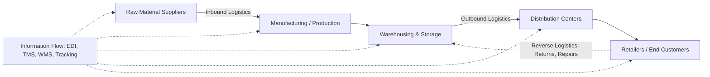

## Definition and Scope of Logistics

### Overview

Logistics is the process of planning, implementing, and controlling the efficient, effective flow and storage of goods, services, and related information from point of origin to point of consumption, in order to meet customer requirements. It is a subset of Supply Chain Management (SCM) — logistics manages the physical and informational movement within an organization's boundaries and its direct trading partners, while SCM encompasses the broader integration of all entities across a supply network (suppliers, manufacturers, distributors, retailers).

**Key Points**

- Logistics ≠ Supply Chain Management. Logistics is execution-focused (moving, storing, tracking); SCM is strategic and encompasses logistics plus procurement, production planning, demand forecasting, and cross-company relationship management.
- The discipline traces its formalization to military logistics (movement and supply of troops and materiel), later adapted to commercial contexts from the mid-20th century onward.
- Modern logistics is data- and technology-intensive, relying on Transportation Management Systems (TMS), Warehouse Management Systems (WMS), and increasingly IoT/telematics for real-time visibility.

### The Seven Rights of Logistics

A widely used definitional framework states that logistics exists to deliver:

1. The **right product**
2. In the **right quantity**
3. In the **right condition**
4. At the **right place**
5. At the **right time**
6. To the **right customer**
7. At the **right cost**

This framework is a practical heuristic rather than a formal theorem, but it is the standard pedagogical anchor for defining logistics performance.

### Scope: Functional Components

Logistics scope spans several interdependent functional areas:

- **Transportation** — physical movement of goods across modes (road, rail, air, ocean, pipeline, intermodal); mode selection, carrier management, routing, and freight consolidation.
- **Warehousing & Storage** — facility location, layout design, storage systems, and inventory holding.
- **Inventory Management** — balancing carrying cost against stockout risk; safety stock, reorder points, and cycle counting.
- **Materials Handling** — internal movement of goods within a facility (conveyors, forklifts, automated storage/retrieval systems).
- **Packaging** — protective and informational packaging for transit, including unitization (palletizing, containerization).
- **Order Processing & Fulfillment** — order capture, verification, and pick-pack-ship execution.
- **Demand Forecasting** — informing inventory and transportation capacity planning.
- **Reverse Logistics** — management of returns, repairs, recycling, and end-of-life product flows.
- **Information Flow & Documentation** — bills of lading, customs paperwork, EDI (Electronic Data Interchange), tracking data.

### Scope: Inbound vs. Outbound vs. Reverse

$$\text{Total Logistics Flow} = \text{Inbound Logistics} + \text{Outbound Logistics} + \text{Reverse Logistics}$$

- **Inbound logistics** — movement of raw materials, components, and supplies from suppliers into a firm's production or distribution facilities.
- **Outbound logistics** — movement of finished goods from the firm to distributors, retailers, or end customers.
- **Reverse logistics** — flow of goods backward through the chain for returns, warranty repair, remanufacturing, or disposal.

### Cost Structure

Logistics costs are typically decomposed as:

$$C_{total} = C_{transport} + C_{warehousing} + C_{inventory\ carrying} + C_{administration} + C_{other}$$

Where $C_{inventory\ carrying}$ commonly includes capital cost, storage cost, service cost (insurance, taxes), and risk cost (obsolescence, shrinkage, damage). Industry benchmarks often express total logistics cost as a percentage of revenue or as cost-per-unit shipped, though exact ratios vary substantially by sector [Inference — figures depend heavily on industry, geography, and reporting methodology, so no single benchmark applies universally].

### Diagram: Logistics as a Subset of Supply Chain Management

<svg xmlns="http://www.w3.org/2000/svg" viewBox="0 0 600 340" font-family="sans-serif">
<text x="300" y="30" text-anchor="middle" font-size="18" font-weight="bold">Logistics within Supply Chain Management (svg_diagram)</text>
<ellipse cx="300" cy="190" rx="280" ry="120" fill="none" stroke="#333" stroke-width="2" />
<text x="300" y="90" text-anchor="middle" font-size="14" font-weight="bold">Supply Chain Management</text>
<text x="300" y="108" text-anchor="middle" font-size="11">(Procurement, Production, Demand Planning,</text>
<text x="300" y="123" text-anchor="middle" font-size="11">Supplier/Customer Relationship Mgmt)</text>
<ellipse cx="300" cy="220" rx="170" ry="80" fill="none" stroke="#0066cc" stroke-width="2" />
<text x="300" y="200" text-anchor="middle" font-size="13" font-weight="bold" fill="#0066cc">Logistics</text>
<text x="300" y="220" text-anchor="middle" font-size="10">Transportation · Warehousing</text>
<text x="300" y="235" text-anchor="middle" font-size="10">Inventory · Materials Handling</text>
<text x="300" y="250" text-anchor="middle" font-size="10">Order Fulfillment · Reverse Logistics</text>
<text x="300" y="265" text-anchor="middle" font-size="10">Packaging · Information Flow</text>
</svg>

### Diagram: End-to-End Logistics Flow

### Example: Applying the Seven Rights

A retailer receives an order for 500 units of a seasonal product to be delivered to a regional distribution center within 48 hours.

- **Right product**: SKU-verified via barcode/RFID scan at pick.
- **Right quantity**: 500 units confirmed against order via warehouse management system.
- **Right condition**: Quality check and appropriate packaging (temperature control if perishable).
- **Right place**: Routed to the correct regional DC, not a default hub.
- **Right time**: Carrier and mode selected (e.g., expedited road freight) to meet the 48-hour window.
- **Right customer**: Shipping documentation matched to the correct account/order ID.
- **Right cost**: Mode and carrier chosen to balance speed against freight cost — expedited shipping may be justified if penalty costs for lateness exceed the freight premium.

### Distinguishing Logistics from Adjacent Disciplines

| Discipline | Primary Focus |
| --- | --- |
| Logistics | Physical/informational flow execution: transport, storage, fulfillment |
| Supply Chain Management | End-to-end network integration: suppliers → production → distribution → customer |
| Procurement | Sourcing and purchasing of goods/services from suppliers |
| Operations Management | Internal transformation processes (manufacturing, service delivery) |
| Distribution | Often used interchangeably with outbound logistics, though narrower in scope |

### Conclusion

Logistics is the operational backbone that physically and informationally connects supply with demand. Its scope extends across inbound, outbound, and reverse flows, and integrates transportation, warehousing, inventory, and information systems into a coordinated function. Understanding logistics as distinct from — but nested within — supply chain management is foundational before examining specific modes of transport (road, rail, air, ocean) and the international trade frameworks (such as Incoterms) that govern responsibility and risk transfer in cross-border logistics.

**Related Topics**

- Supply Chain Management vs. Logistics Management
- The Seven Modes of Transportation (Road, Rail, Air, Ocean, Pipeline, Intermodal, Multimodal)
- Introduction to Incoterms 2020 and Risk Transfer Points
- Warehousing Strategies: Centralized vs. Decentralized Networks
- Inventory Management Models (EOQ, Just-in-Time, Safety Stock)
- Reverse Logistics and Circular Supply Chains
- Freight Documentation: Bill of Lading, Commercial Invoice, Certificate of Origin