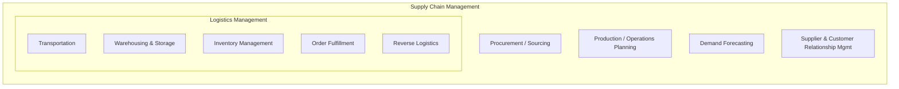

## Logistics Versus Supply Chain Management

### Overview

Logistics and Supply Chain Management (SCM) are frequently used interchangeably in casual usage, but they represent distinct — though nested — scopes of activity. Logistics is a functional, execution-oriented discipline concerned with the physical and informational movement of goods. SCM is a strategic, network-oriented discipline concerned with integrating and coordinating all parties involved in producing and delivering a product, from raw material extraction to end-customer consumption.

**Key Points**

- Logistics is a **subset** of SCM, not a synonym for it.
- SCM includes logistics plus procurement, supplier relationship management, production/operations planning, demand forecasting, and customer relationship management.
- The distinction matters organizationally: a "Logistics Manager" typically owns transportation and warehousing execution, while a "Supply Chain Manager" or "VP of Supply Chain" owns end-to-end network strategy, supplier relationships, and cross-functional coordination.

### Formal Definitions

The Council of Supply Chain Management Professionals (CSCMP) defines the two terms with a clear containment relationship:

- **Logistics Management**: the part of supply chain management that plans, implements, and controls the efficient, effective forward and reverse flow and storage of goods, services, and related information between the point of origin and the point of consumption in order to meet customers' requirements.
- **Supply Chain Management**: encompasses the planning and management of all activities involved in sourcing and procurement, conversion, and all logistics management activities. Importantly, it also includes coordination and collaboration with channel partners, which can be suppliers, intermediaries, third-party service providers, and customers.

This establishes logistics as one operational pillar within the broader SCM structure, alongside procurement and production/operations.

### Comparative Scope

| Dimension | Logistics | Supply Chain Management |
| --- | --- | --- |
| Primary orientation | Operational execution | Strategic integration |
| Organizational boundary | Often internal to one firm (or firm + direct carriers) | Spans multiple firms across the entire network |
| Core activities | Transportation, warehousing, inventory, fulfillment, materials handling | Procurement, production planning, logistics, demand forecasting, supplier/customer relationship management |
| Time horizon | Short- to medium-term (daily/weekly execution) | Medium- to long-term (network design, supplier strategy) |
| Success metrics | On-time delivery, cost per shipment, warehouse utilization | Total network cost, cycle time, resilience, customer service level across the chain |
| Relationship focus | Carrier and warehouse management | Supplier partnerships, multi-tier visibility, risk management |

### Diagram: Containment Relationship

### Diagram: Network Scope Comparison

<svg xmlns="http://www.w3.org/2000/svg" viewBox="0 0 620 300" font-family="sans-serif">
<text x="310" y="25" text-anchor="middle" font-size="16" font-weight="bold">Firm-Level vs. Network-Level Scope (svg_diagram)</text>

<text x="150" y="55" text-anchor="middle" font-size="13" font-weight="bold" fill="`#0066cc`">Logistics Scope</text>

<rect x="60" y="70" width="180" height="90" fill="none" stroke="`#0066cc`" stroke-width="2" rx="8" />

<text x="150" y="100" text-anchor="middle" font-size="11">Single Firm</text>

<text x="150" y="118" text-anchor="middle" font-size="11">Warehouses, Fleets,</text>

<text x="150" y="134" text-anchor="middle" font-size="11">Direct Carriers</text>

<text x="470" y="55" text-anchor="middle" font-size="13" font-weight="bold" fill="`#cc6600`">Supply Chain Scope</text>

<rect x="330" y="70" width="270" height="180" fill="none" stroke="`#cc6600`" stroke-width="2" rx="8" />

<rect x="345" y="90" width="80" height="40" fill="none" stroke="#333" />

<text x="385" y="114" text-anchor="middle" font-size="9">Tier-2 Supplier</text>

<rect x="440" y="90" width="80" height="40" fill="none" stroke="#333" />

<text x="480" y="114" text-anchor="middle" font-size="9">Tier-1 Supplier</text>

<rect x="345" y="150" width="80" height="40" fill="none" stroke="`#0066cc`" />

<text x="385" y="174" text-anchor="middle" font-size="9">Manufacturer</text>

<rect x="440" y="150" width="80" height="40" fill="none" stroke="#333" />

<text x="480" y="174" text-anchor="middle" font-size="9">Distributor</text>

<rect x="392" y="205" width="80" height="35" fill="none" stroke="#333" />

<text x="432" y="227" text-anchor="middle" font-size="9">End Customer</text>

</svg>

### Illustrative Example

Consider a smartphone manufacturer:

- **Logistics activities**: routing components from a contract manufacturer's warehouse to an assembly plant; managing the fleet or carrier contracts that move finished phones to regional distribution centers; setting safety stock levels at each DC; processing returns from customers.
- **Supply chain management activities**: deciding which semiconductor suppliers to qualify and contract with (procurement); negotiating multi-year capacity agreements with component suppliers; forecasting demand for a new model launch across regions; coordinating with contract manufacturers on production schedules; managing risk exposure if a key supplier faces a geopolitical disruption.

The logistics team executes the physical movement decided upon; the supply chain team designs the network and relationships that make those movements necessary and possible.

### Why the Distinction Matters in Practice

- **Organizational design**: Firms structure logistics as an execution function (often reporting to operations) while SCM is increasingly a C-level strategic function (Chief Supply Chain Officer), reflecting its cross-functional and inter-firm scope.
- **Performance measurement**: Logistics KPIs (on-time-in-full, freight cost per unit) are narrower and more controllable; SCM KPIs (cash-to-cash cycle time, perfect order rate, supply chain resilience index) require cross-company data and longer measurement horizons.
- **Technology systems**: Logistics relies on TMS/WMS for execution; SCM relies on broader planning systems such as ERP-integrated Supply Chain Planning (SCP) suites, Advanced Planning and Scheduling (APS), and multi-tier visibility platforms.
- **Risk scope**: Logistics risk is largely operational (delays, damage, capacity shortages); SCM risk includes strategic exposure (supplier financial health, single-sourcing dependency, geopolitical disruption, demand volatility).

### Conclusion

Logistics and Supply Chain Management differ in scope, time horizon, and organizational focus, even though logistics activities are essential building blocks of SCM. Logistics answers "how do we move and store this efficiently right now," while SCM answers "how do we design, coordinate, and continuously improve the entire network of partners that gets this product from raw material to customer." This foundational distinction underpins how international trade frameworks — including transportation mode selection and Incoterms — are applied differently depending on whether the decision is tactical (logistics) or strategic (supply chain network design).

**Related Topics**

- Definition and Scope of Logistics
- Supply Chain Network Design and Strategic Sourcing
- Demand Forecasting and Sales & Operations Planning (S&OP)
- Supplier Relationship Management and Multi-Tier Visibility
- Supply Chain Risk Management and Resilience Strategies
- The Seven Modes of Transportation
- Introduction to Incoterms 2020