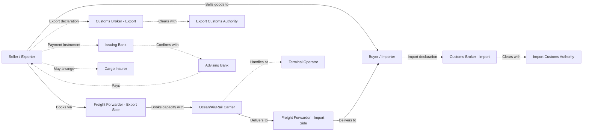

## Key Stakeholders in International Trade

### Overview

International trade transactions involve a network of parties beyond the buyer and seller, each with distinct roles, responsibilities, and legal/commercial interests. Understanding this stakeholder ecosystem is essential to interpreting Incoterms, trade documentation, and risk allocation, since most international trade rules (including Incoterms) exist specifically to define which stakeholder bears which cost, risk, and responsibility at each stage of a shipment.

### Primary Transaction Parties

**Key Points**

- **Seller / Exporter (Shipper/Consignor)**: the party selling and dispatching the goods; responsible for aspects of export compliance, packaging, and (depending on the agreed trade term) transportation and insurance up to a defined point.
- **Buyer / Importer (Consignee)**: the party purchasing and receiving the goods; responsible for aspects of import compliance and, depending on the trade term, transportation and insurance from a defined point onward.
- **Notify Party**: an entity (often the buyer's agent or freight forwarder) designated on the bill of lading to be notified of shipment arrival, distinct from the consignee itself in some transactions.

### Transportation & Logistics Intermediaries

- **Carriers**: the operators that physically transport goods — ocean carriers (shipping lines), airlines, rail operators, and trucking companies. Carriers issue transport documents (bill of lading, air waybill) that serve as both a receipt for goods and, in the case of an ocean bill of lading, a document of title.
- **Freight Forwarders**: intermediaries who arrange transportation on behalf of shippers, consolidating shipments, booking carrier capacity, and managing multimodal routing. Forwarders typically do not own transport assets but coordinate across carriers.
- **Customs Brokers**: licensed agents who prepare and submit customs documentation, classify goods under tariff codes (e.g., Harmonized System codes), calculate duties, and facilitate customs clearance on behalf of importers/exporters.
- **Non-Vessel Operating Common Carriers (NVOCCs)**: entities that consolidate cargo from multiple shippers into container loads and issue their own bills of lading, while contracting with actual vessel-operating carriers for the underlying transport.
- **Third-Party Logistics Providers (3PLs)**: firms offering outsourced logistics services (warehousing, transportation management, fulfillment) on behalf of shippers.
- **Terminal Operators**: entities managing port or airport cargo terminals, responsible for loading/unloading, storage, and handling within terminal boundaries.

### Financial & Risk-Management Stakeholders

- **Banks (Issuing and Advising)**: facilitate trade finance instruments such as letters of credit, documentary collections, and trade guarantees, reducing payment risk between buyer and seller who may not have an established trust relationship.
- **Insurance Underwriters**: provide marine cargo insurance and other risk coverage; the party responsible for arranging insurance depends on the applicable Incoterm (e.g., under CIF/CIP, the seller must procure insurance for the buyer's benefit).
- **Export Credit Agencies (ECAs)**: government or quasi-government bodies that provide financing, guarantees, or insurance to support a country's exporters, particularly for higher-risk markets.

### Regulatory & Government Stakeholders

- **Customs Authorities**: government agencies at both export and import borders that enforce tariff classification, valuation, duty collection, and compliance with trade regulations.
- **Regulatory/Standards Bodies**: agencies enforcing product-specific import requirements (e.g., health, safety, phytosanitary, or technical standards) that goods must satisfy before entering a market.
- **Port and Airport Authorities**: government or quasi-government bodies overseeing infrastructure, safety, and operational regulation of a given port or airport.
- **Trade Policy Bodies**: entities such as the World Trade Organization (WTO) that establish multilateral trade rules, alongside regional/bilateral trade agreement administrators that govern preferential tariff treatment.

### Diagram: Stakeholder Map Across a Trade Transaction

### Stakeholder Responsibility Reference Table

| Stakeholder | Primary Responsibility | Typically Engaged By |
| --- | --- | --- |
| Freight Forwarder | Booking, routing, documentation coordination | Seller or Buyer, per Incoterm |
| Customs Broker | Tariff classification, duty calculation, clearance | Importer (usually) |
| Carrier | Physical transport, issuing transport document | Whichever party is responsible for that transport leg |
| Bank (Issuing/Advising) | Trade finance, payment security | Buyer (issuing), Seller's bank (advising) |
| Insurer | Cargo risk coverage | Seller or Buyer, per Incoterm |
| Customs Authority | Duty/tax collection, regulatory enforcement | N/A (government function) |
| Terminal Operator | Cargo handling within port/airport | Carrier (contracted) |

### Example: Stakeholder Sequence in a Typical Ocean Shipment

A manufacturer in Vietnam (seller) sells electronics components to a buyer in Germany under a CIF (Cost, Insurance, Freight) term:

1. **Seller** books space with a **freight forwarder**, who arranges the export haulage and books capacity with an **ocean carrier**.
2. **Seller's customs broker** files the export declaration with **Vietnamese customs authorities**.
3. **Seller** arranges cargo **insurance** (obligatory under CIF) and pays **freight** to the carrier.
4. **Seller's bank** (advising bank) processes documents under a **letter of credit** issued by the **buyer's bank** (issuing bank) in Germany.
5. The **carrier** transports the goods to the German port, where a **terminal operator** handles unloading.
6. **Buyer's customs broker** files the import declaration with **German customs authorities**, calculating applicable duties/VAT.
7. A **freight forwarder** on the import side arranges final inland delivery to the **buyer**.

Each stakeholder's specific point of responsibility is governed by the CIF Incoterm — for example, insurance obligation transferring to the seller and risk of loss transferring to the buyer at a defined point during ocean transit, even though the seller pays for freight and insurance to the destination port.

### Conclusion

International trade transactions rely on a coordinated ecosystem of commercial, logistical, financial, and regulatory stakeholders, each governed by contractual and regulatory frameworks that define their specific obligations. This stakeholder structure is the practical foundation for Incoterms: the entire purpose of an Incoterm is to specify precisely which stakeholder (seller or buyer) bears the cost and risk for insurance, freight, and customs clearance at each transition point in this network.

**Related Topics**

- Introduction to Incoterms 2020
- Bills of Lading and Trade Documentation
- Letters of Credit and Trade Finance Instruments
- Customs Clearance and Harmonized System (HS) Classification
- Freight Forwarders vs. NVOCCs vs. 3PLs
- Marine Cargo Insurance Fundamentals