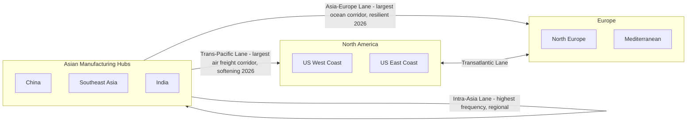

## Overview of Global Trade Flows and Trade Lanes

### Overview

Global trade moves along a relatively small number of high-density corridors — "trade lanes" — that concentrate the overwhelming majority of world container, air, and bulk cargo volume. Understanding these lanes is essential for logistics planning because carrier capacity, freight rates, transit times, and infrastructure investment are all organized around them rather than around trade between any two arbitrary countries.

### Core Concept: What Defines a Trade Lane

**Key Points**

- A trade lane is a defined, high-volume shipping corridor between two major economic regions (e.g., Asia–Europe, Trans-Pacific), typically served by dedicated liner shipping services, scheduled vessel rotations, and standardized transit time benchmarks.
- Trade lanes are inherently **directional and imbalanced**: the "headhaul" (higher-volume, often higher-value direction) and "backhaul" (lower-volume return direction) differ substantially, which affects freight pricing — carriers often price headhaul freight to subsidize repositioning empty or lightly loaded containers on the backhaul.
- Lane balance is typically expressed as an import:export ratio. On the Far East–Europe lane, this imbalance widened to 3.3:1 (imports:exports) by end-2025, from 2.9:1 in 2024, reflecting the sustained dominance of Chinese manufacturing exports to European consumer markets. [iContainers](https://www.icontainers.com/blog/global-supply-chain-statistics-2026/)

### The Three Dominant Ocean Container Lanes

The three dominant ocean trade lanes by container volume are Asia-Europe (Far East to North Europe and Mediterranean), Trans-Pacific (Asia to US West Coast and East Coast), and the intra-Asia corridor. [iContainers](https://www.icontainers.com/blog/global-supply-chain-statistics-2026/)

**1. Asia–Europe Lane**

The world's largest single corridor by share of global container movement — approximately 19.6 million TEUs moved from Asia to Europe in 2025, representing 10.3% of all global container movements. This lane has shown notable resilience through 2026: container volumes from Asia to Europe rose 1.7% year-on-year in March 2026 to 1.64 million TEU, with first-quarter volumes up 15% to 5.18 million TEU, and China representing over 75% of Asia-Europe exports. [SEKO Logistics](https://www.sekologistics.com/en/resource-hub/knowledge-hub/asia-europe-trade-lane-guide-mastering-the-worlds-largest-shipping-corridor-in-2025/)[IndexBox](https://www.indexbox.io/blog/container-shipping-mixed-in-early-2026-us-demand-softens-asia-europe-holds-strong/)

**2. Trans-Pacific Lane**

Connects Asian manufacturing to North American consumer markets, historically the second-largest lane, but it has weakened notably through 2026 amid tariff policy shifts: the Trans-Pacific lane was affected by US tariff policy, with North America the only major region to record an overall decline in imports in 2025, down approximately 2% year on year. This softening continued into 2026 — total exports from 18 Asian economies to the US fell 8.8% year-on-year in April 2026, with cumulative four-month volumes down 6.3%; Chinese exports to the US declined 17.5% year-on-year while India fell 22.9% and Taiwan fell 11%. Sourcing is meanwhile diversifying: ASEAN exports to the US increased 6.9%, with Thailand up 23.3% and Cambodia surging 48.5%. [Global Supply Chain Statistics 2026 +2](https://www.icontainers.com/blog/global-supply-chain-statistics-2026/)

**3. Intra-Asia Lane**

The intra-regional corridor connecting manufacturing and consumption hubs within Asia itself — lower per-shipment volumes but extremely high frequency and density, reflecting regional supply chains (e.g., component flows between China, Southeast Asia, Japan, and Korea) [Inference — precise intra-Asia volume rankings vary by source methodology and reporting period].

### Other Major Corridors

- **Transatlantic Lane**: connects North America and Europe; generally lower volume than the Asia-facing lanes but carries higher-value, time-sensitive cargo.
- **Air Freight Corridors**: the transpacific corridor is the largest by air freight volume, linking East Asian manufacturing centers (China, Japan, Korea, Taiwan, Vietnam) to North American consumer markets, alongside major Asia-Europe and transatlantic air lanes. Air freight corridors collectively move over 60 million tonnes of goods annually, concentrated on high-value, time-sensitive, or perishable goods relative to ocean freight's bulk volume advantage. [Private Jets Connect](https://private-jets-connect.com/en/cargo/guide/corridors-fret-aerien-mondiaux/)[Private Jets Connect](https://private-jets-connect.com/en/cargo/guide/corridors-fret-aerien-mondiaux/)

### Diagram: Major Global Trade Lanes

### Structural Disruptions Reshaping Trade Lanes (2026)

- **Red Sea rerouting**: since late 2023, security concerns have forced major carriers to reroute vessels via the Cape of Good Hope instead of the traditional Suez Canal passage, adding approximately 7–14 days to transit times. As of 2026, most carriers are still routing around the Cape of Good Hope, adding 10–14 days and $800–$1,500 per container in extra costs on Asia-Europe and Asia-US East Coast lanes. [SEKO Logistics](https://www.sekologistics.com/en/resource-hub/knowledge-hub/asia-europe-trade-lane-guide-mastering-the-worlds-largest-shipping-corridor-in-2025/)[Maritime Gateway](https://www.maritimegateway.com/container-shipping-forecast-2026/)
- **Regulatory cost layers on Asia-Europe**: EU Emissions Trading System surcharges nearly doubled in 2025 as coverage increased from 40% to 70%, reaching full 100% implementation by 2026, and combined with FuelEU Maritime regulations, per-TEU environmental compliance costs could reach €105 depending on vessel efficiency and routing. [SEKO Logistics](https://www.sekologistics.com/en/resource-hub/knowledge-hub/asia-europe-trade-lane-guide-mastering-the-worlds-largest-shipping-corridor-in-2025/)
- **Sourcing diversification**: as Chinese exporters redirect volumes to Europe and other Asian markets, Southeast Asian origins including Vietnam, Thailand, and Indonesia are gaining transpacific market share. [Maritime Gateway](https://www.maritimegateway.com/container-shipping-forecast-2026/)
- **Overcapacity and capacity management**: structural overcapacity remains a major concern for container shipping lines throughout 2026, with large numbers of newbuild vessels entering service; carriers are managing capacity through blank sailings, service suspensions, and network adjustments to stabilize pricing. [UFL Group](https://ufreight.com/container-trades-show-diverging-trends-so-far-in-2026/)

### Freight Rate Snapshot (April 2026)

| Route | Rate (per container) | Notes |
| --- | --- | --- |
| Shanghai–Los Angeles | USD 2,476 per FEU, marginally above 2025 levels | Trans-Pacific West Coast |
| Shanghai–New York | USD 4,002 per FEU | Trans-Pacific East Coast (Suez/Cape-dependent) |
| Yokohama–New York | USD 6,224, up 33.5% year-on-year | Japan-origin East Coast lane |

*Note: freight rates are highly volatile and route/carrier-dependent; figures above are a single-month snapshot, not a stable benchmark [Unverified for any period beyond the cited month].*

### Example: Routing Decision Impact

An electronics exporter shipping from India to Northern Europe in 2026 faces a routing decision directly shaped by lane conditions: Colombo and Singapore transshipment hubs offer strong connectivity for both Asia-Europe and trans-Pacific routes, while for US-bound cargo, direct transpacific services from JNPT (Nhava Sheva) offer an alternative to Suez-dependent East Coast routings. This illustrates how trade lane infrastructure and routing choices directly affect transit time, cost, and reliability — the same origin can face very different logistics economics depending on destination lane and chosen transshipment strategy. [Maritime Gateway](https://www.maritimegateway.com/container-shipping-forecast-2026/)

### Diagram: Trade Lane Volume Imbalance Concept

<svg xmlns="http://www.w3.org/2000/svg" viewBox="0 0 600 260" font-family="sans-serif">
<text x="300" y="25" text-anchor="middle" font-size="16" font-weight="bold">Headhaul vs. Backhaul Imbalance (svg_diagram)</text>

<text x="150" y="60" text-anchor="middle" font-size="12" font-weight="bold">Asia → Europe (Headhaul)</text>

<rect x="60" y="75" width="180" height="60" fill="`#0066cc`" opacity="0.8" />

<text x="150" y="110" text-anchor="middle" font-size="11" fill="white">~3.3 units</text>

<text x="450" y="60" text-anchor="middle" font-size="12" font-weight="bold">Europe → Asia (Backhaul)</text>

<rect x="410" y="105" width="80" height="30" fill="`#cc6600`" opacity="0.8" />

<text x="450" y="125" text-anchor="middle" font-size="11" fill="white">~1 unit</text>

<text x="300" y="180" text-anchor="middle" font-size="11">Ratio ≈ 3.3 : 1 (imports:exports, end-2025)</text>

<text x="300" y="200" text-anchor="middle" font-size="10" fill="#555">Backhaul underutilization drives empty container</text>

<text x="300" y="215" text-anchor="middle" font-size="10" fill="#555">repositioning costs, factored into headhaul pricing</text>

</svg>

### Conclusion

Global trade concentrates disproportionately into a small number of major lanes — Asia-Europe, Trans-Pacific, and intra-Asia dominating ocean container volume, with parallel air freight and transatlantic corridors serving time-sensitive and regional trade. These lanes are not static: 2026 data shows a marked divergence, with Asia-Europe demonstrating resilience and growth while the Trans-Pacific lane softens under tariff pressure and sourcing diversification toward Southeast Asia. Structural disruptions — Red Sea rerouting, emissions regulations, and carrier overcapacity — are actively reshaping cost and transit-time economics on these lanes, which is critical context before studying specific transportation modes and Incoterms, since lane conditions directly influence which mode and trade term structure is economically optimal for a given shipment.

**Related Topics**

- The Seven Modes of Transportation
- History of Global Trade and the Rise of Containerization
- Port Operations and Container Terminal Management
- Freight Rate Determination and Market Volatility
- Suez Canal and Red Sea Routing Disruptions
- Introduction to Incoterms 2020