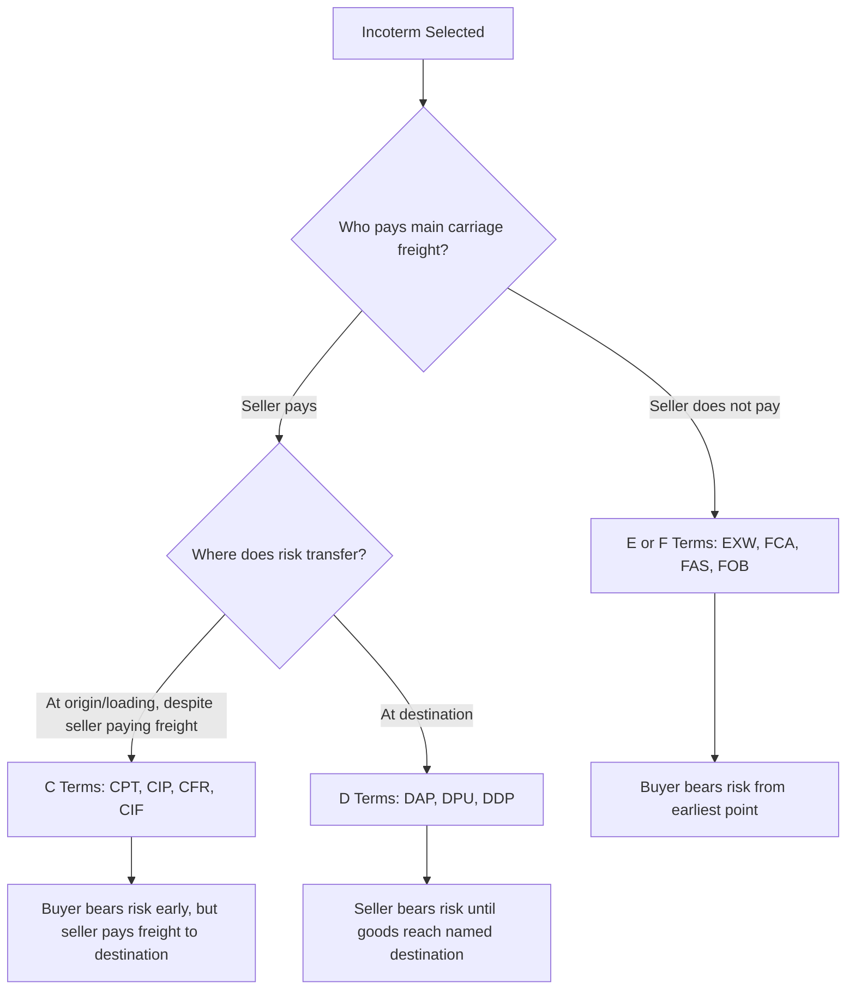

## Core Logistics and Incoterms Terminology

### Overview

This reference consolidates the essential terminology that underpins both general logistics practice and the Incoterms 2020 rules framework. These terms recur across shipping documentation, contracts, and freight negotiations, and precise usage is critical since ambiguity in terminology is a common source of commercial disputes in international trade.

### Foundational Logistics Terms

**Key Points**

- **Consignor / Shipper**: the party sending the goods (typically the seller/exporter).
- **Consignee**: the party receiving the goods (typically the buyer/importer), as named on the transport document.
- **Notify Party**: the entity to be notified of shipment arrival, which may differ from the consignee.
- **Freight**: the cost charged for transporting goods; also used generically to refer to the cargo itself.
- **Carrier**: the entity that physically performs or contracts to perform transport (ocean line, airline, rail operator, trucking company).
- **Bill of Lading (B/L)**: a transport document issued by an ocean carrier serving three functions simultaneously — a receipt for goods, evidence of the contract of carriage, and (if issued as a negotiable/"order" B/L) a document of title.
- **Air Waybill (AWB)**: the air freight equivalent of a bill of lading; unlike an ocean B/L, an AWB is **not** a document of title.
- **Demurrage**: charges incurred when a container is not removed from the port/terminal within the free time allowed.
- **Detention**: charges incurred when a container is kept outside the port (at the consignee's premises) beyond the allotted free time before being returned to the carrier.
- **Free Time**: the number of days a container may be held (at port or by the consignee) without incurring demurrage/detention charges.
- **Less-than-Container-Load (LCL)**: cargo that does not fill a full container and is consolidated with other shippers' goods.
- **Full Container Load (FCL)**: a shipment that occupies an entire container, exclusive to one shipper.
- **Freight Forwarder**: an intermediary that arranges transportation and documentation on a shipper's behalf without necessarily owning transport assets.
- **Customs Broker**: a licensed agent who manages customs declarations, tariff classification, and duty payment on behalf of an importer/exporter.
- **Harmonized System (HS) Code**: the standardized international product classification system used to determine tariffs and trade statistics.
- **Duty / Tariff**: a tax imposed by a government on imported (or occasionally exported) goods, typically calculated as a percentage of declared customs value.
- **Landed Cost**: the total cost of a product once it has arrived at the buyer's location, including unit price, freight, insurance, duties, and handling fees.

$$\text{Landed Cost} = \text{Unit Price} + \text{Freight} + \text{Insurance} + \text{Duties} + \text{Handling Fees}$$

### Incoterms-Specific Terminology

- **Incoterms**: a set of standardized three-letter trade terms published by the International Chamber of Commerce (ICC) that define the allocation of cost, risk, and responsibility between buyer and seller at defined points in a transaction. Not a legal statute — Incoterms apply only when the parties explicitly incorporate them into a sales contract.
- **Risk Transfer Point**: the specific point in the shipment process at which risk of loss or damage passes from seller to buyer, as defined by the chosen Incoterm.
- **Named Place**: the specific location (port, terminal, or address) referenced by an Incoterm, which must be explicitly stated in the contract (e.g., "FOB Shanghai," "DAP Berlin Warehouse").
- **Delivery**: under Incoterms, "delivery" refers to the risk transfer point, not necessarily the point of physical arrival at the buyer's final destination — a critical distinction often misunderstood.
- **Export/Import Clearance**: the customs procedures required to legally send goods out of the origin country and bring them into the destination country; Incoterms specify which party is responsible for each.
- **Carriage**: a term used broadly in Incoterms to refer to the transportation of goods (e.g., "Carriage Paid To").
- **On Board**: the point at which goods are physically loaded onto a vessel — a specific risk transfer reference used in terms like FOB, CFR, and CIF.

### The Four Incoterms Categories

Incoterms 2020 rules are grouped by the mode of transport they apply to and the structure of obligations:

| Category | Terms | Mode Applicability |
| --- | --- | --- |
| **E-Term** (Departure) | EXW | Any mode |
| **F-Terms** (Main Carriage Unpaid by Seller) | FCA, FAS, FOB | FAS/FOB: sea/inland waterway only; FCA: any mode |
| **C-Terms** (Main Carriage Paid by Seller) | CPT, CIP, CFR, CIF | CFR/CIF: sea/inland waterway only; CPT/CIP: any mode |
| **D-Terms** (Arrival) | DAP, DPU, DDP | Any mode |

**Key distinction**: F- and C-terms differ in who pays freight, but risk transfer point is similar (typically at origin/loading); D-terms are the only category where risk transfers at destination, making the seller responsible for the goods until arrival.

### Diagram: Risk vs. Cost Allocation Logic

### Diagram: Terminology Relationship Map

<svg xmlns="http://www.w3.org/2000/svg" viewBox="0 0 640 320" font-family="sans-serif">
<text x="320" y="25" text-anchor="middle" font-size="16" font-weight="bold">Core Terminology Relationships (svg_diagram)</text>
<rect x="30" y="50" width="160" height="60" fill="none" stroke="#0066cc" stroke-width="2" rx="6" />
<text x="110" y="75" text-anchor="middle" font-size="11" font-weight="bold">Consignor/Shipper</text>
<text x="110" y="92" text-anchor="middle" font-size="10">(Seller/Exporter)</text>
<rect x="450" y="50" width="160" height="60" fill="none" stroke="#0066cc" stroke-width="2" rx="6" />
<text x="530" y="75" text-anchor="middle" font-size="11" font-weight="bold">Consignee</text>
<text x="530" y="92" text-anchor="middle" font-size="10">(Buyer/Importer)</text>
<line x1="190" y1="80" x2="450" y2="80" stroke="#333" stroke-width="1.5" marker-end="url(#arrow)" />
<text x="320" y="70" text-anchor="middle" font-size="10">Incoterm defines risk transfer point</text>
<rect x="240" y="130" width="160" height="50" fill="none" stroke="#cc6600" stroke-width="2" rx="6" />
<text x="320" y="150" text-anchor="middle" font-size="11" font-weight="bold">Carrier</text>
<text x="320" y="167" text-anchor="middle" font-size="10">Issues B/L or AWB</text>
<rect x="60" y="220" width="150" height="55" fill="none" stroke="#333" stroke-width="1.5" rx="6" />
<text x="135" y="242" text-anchor="middle" font-size="10" font-weight="bold">Customs Broker</text>
<text x="135" y="258" text-anchor="middle" font-size="9">HS Code / Duty Calc</text>
<rect x="430" y="220" width="150" height="55" fill="none" stroke="#333" stroke-width="1.5" rx="6" />
<text x="505" y="242" text-anchor="middle" font-size="10" font-weight="bold">Freight Forwarder</text>
<text x="505" y="258" text-anchor="middle" font-size="9">Books &amp; Coordinates Carriage</text>
</svg>

### Worked Example: Terminology in Context

A U.S. buyer purchases goods from a Chinese seller under **FOB Shanghai** terms:

- The **consignor** (seller) delivers the goods to the **carrier** at Shanghai port; risk transfers to the **consignee** (buyer) once goods pass the ship's rail ("on board" the vessel).
- The **carrier** issues a **bill of lading**, which the seller may use as a negotiable document of title if payment is structured via **letter of credit**.
- The buyer's **customs broker** uses the shipment's **HS code** to calculate applicable **duty** upon import clearance in the U.S.
- If the buyer's designated **freight forwarder** fails to collect the container from the terminal within the **free time** window, **demurrage** charges accrue.
- The buyer's total **landed cost** includes the unit price, ocean freight (paid by buyer under FOB), insurance (if separately arranged), duties, and destination handling fees.

### Common Terminology Pitfalls

- **FOB misuse**: "FOB" is frequently misapplied to air or trucked shipments in casual commercial usage, but under Incoterms 2020, FOB is strictly limited to sea/inland waterway transport — using it for containerized or air cargo is technically incorrect and can create ambiguity about the actual risk transfer point.
- **"Delivery" ≠ "Arrival"**: under Incoterms, "delivered" refers to the contractual risk-transfer point, which may occur far earlier than physical arrival at the buyer's door (e.g., under EXW, delivery occurs the moment goods are made available at the seller's premises).
- **CIF/CFR confusion**: both require the seller to pay freight to the destination port, but only CIF additionally requires the seller to procure insurance — a frequently conflated distinction.

### Conclusion

Precise terminology is the operational language through which cost, risk, and responsibility are allocated in international trade. Logistics-general terms (consignor, carrier, bill of lading, demurrage) describe the mechanics of physical movement and documentation, while Incoterms-specific terms (named place, risk transfer point, delivery) describe the legal-commercial allocation layered on top of that movement. Fluency in both vocabularies is a prerequisite for correctly interpreting and applying the eleven Incoterms 2020 rules covered in subsequent chapters.

**Related Topics**

- Introduction to Incoterms 2020: The Eleven Rules
- Bills of Lading and Trade Documentation
- Risk Transfer Points Across Incoterms Categories
- Harmonized System (HS) Classification and Duty Calculation
- Demurrage, Detention, and Free Time Management
- Letters of Credit and Trade Finance Instruments