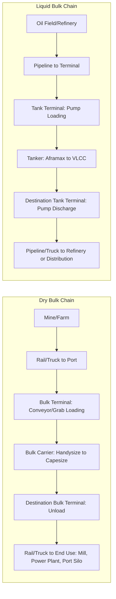

## Bulk Shipping: Dry Bulk and Liquid Bulk Carriers

### Overview

Bulk shipping moves unpackaged, homogeneous cargo in large quantities, using vessels specifically designed for the physical characteristics of the commodity carried. Unlike containerized shipping, bulk cargo is loaded directly into a vessel's holds or tanks without unitization, making bulk carriers structurally and operationally distinct from container ships. Bulk shipping is broadly divided into **dry bulk** (solid commodities) and **liquid bulk** (liquids, primarily petroleum and chemicals).

### Dry Bulk Shipping

**Key Points**

- **Definition**: dry bulk cargo consists of unpackaged solid commodities loaded loose into a vessel's cargo holds — typically raw materials and agricultural products.
- **Common commodities**: iron ore, coal, grain (wheat, corn, soybeans), bauxite, phosphate rock, cement, and other minerals.
- **Vessel type**: bulk carriers (bulkers) — single-deck vessels with large box-shaped holds designed for gravity-fed loading and unloading via conveyor, grab crane, or pneumatic systems.
- **Loading/unloading**: typically performed by shore-based cranes, grabs, or conveyor systems at specialized bulk terminals; some bulkers are "geared" (self-loading/unloading with onboard cranes) for ports lacking bulk-handling infrastructure.

### Dry Bulk Carrier Size Classifications

| Class | Approximate DWT (Deadweight Tonnage) | Typical Cargo/Use |
| --- | --- | --- |
| Handysize | 15,000–35,000 DWT | Grain, minor bulk, smaller ports |
| Handymax/Supramax | 35,000–60,000 DWT | Grain, coal, minor bulk, geared for flexible port access |
| Panamax | 60,000–80,000 DWT | Coal, grain; sized to transit (pre-expansion) Panama Canal locks |
| Capesize | 150,000–400,000 DWT | Iron ore, coal; too large for Panama/Suez in older configurations, historically routed via Cape of Good Hope/Cape Horn |

*Note: exact DWT boundaries vary by source and have shifted somewhat since the Panama Canal expansion (Neopanamax) [Inference — classification boundaries are industry convention rather than a fixed regulatory standard].*

### Liquid Bulk Shipping

- **Definition**: liquid bulk cargo consists of unpackaged liquids loaded into a vessel's segregated tanks — primarily crude oil, refined petroleum products, and bulk liquid chemicals.
- **Common commodities**: crude oil, gasoline, diesel, liquefied natural gas (LNG), liquefied petroleum gas (LPG), vegetable oils, and bulk liquid chemicals.
- **Vessel type**: tankers — vessels with internal tanks (segregated by cargo type, grade, or safety requirement) rather than open holds, using pumps and pipeline systems for loading/discharge rather than cranes.
- **Specialized subtypes**:
  - **Crude oil tankers**: carry unrefined petroleum; range from smaller Aframax vessels to Very Large Crude Carriers (VLCCs) and Ultra Large Crude Carriers (ULCCs).
  - **Product tankers**: carry refined petroleum products (gasoline, diesel, jet fuel), generally smaller and with more sophisticated tank-cleaning systems to prevent cross-contamination between cargo grades.
  - **Chemical tankers**: carry bulk liquid chemicals, requiring specialized tank coatings (stainless steel, epoxy) resistant to the specific chemical cargo.
  - **LNG/LPG carriers**: highly specialized vessels with cryogenic (LNG) or pressurized (LPG) containment systems to keep gas cargo in liquid form during transit.

### Diagram: Dry Bulk vs. Liquid Bulk Vessel Structure

<svg viewBox="0 0 640 300" xmlns="http://www.w3.org/2000/svg" font-family="sans-serif">
<text x="320" y="25" text-anchor="middle" font-size="16" font-weight="bold">Dry Bulk Carrier vs. Tanker Structure (svg_diagram)</text>

<text x="160" y="55" text-anchor="middle" font-size="13" font-weight="bold">Dry Bulk Carrier</text>

<rect x="40" y="70" width="240" height="80" fill="none" stroke="`#0066cc`" stroke-width="2"/>

<line x1="90" y1="70" x2="90" y2="150" stroke="`#0066cc`"/>

<line x1="140" y1="70" x2="140" y2="150" stroke="`#0066cc`"/>

<line x1="190" y1="70" x2="190" y2="150" stroke="`#0066cc`"/>

<line x1="230" y1="70" x2="230" y2="150" stroke="`#0066cc`"/>

<text x="160" y="170" text-anchor="middle" font-size="10">Open box-shaped holds</text>

<text x="160" y="184" text-anchor="middle" font-size="10">Gravity-fed loading via crane/grab</text>

<text x="480" y="55" text-anchor="middle" font-size="13" font-weight="bold">Tanker</text>

<rect x="360" y="70" width="240" height="80" fill="none" stroke="`#cc6600`" stroke-width="2"/>

<rect x="375" y="80" width="50" height="60" fill="none" stroke="`#cc6600`"/>

<rect x="430" y="80" width="50" height="60" fill="none" stroke="`#cc6600`"/>

<rect x="485" y="80" width="50" height="60" fill="none" stroke="`#cc6600`"/>

<rect x="540" y="80" width="45" height="60" fill="none" stroke="`#cc6600`"/>

<text x="480" y="170" text-anchor="middle" font-size="10">Segregated tanks</text>

<text x="480" y="184" text-anchor="middle" font-size="10">Pump/pipeline loading & discharge</text>

</svg>

### Diagram: Bulk Commodity Flow

### Key Operational Differences from Containerized Shipping

| Factor | Bulk Shipping | Containerized Shipping |
| --- | --- | --- |
| Cargo unit | Homogeneous, unpackaged commodity | Discrete, mixed/packaged goods |
| Loading method | Conveyor, grab crane, or pump | Container crane (ship-to-shore gantry) |
| Vessel design | Open holds (dry) or segregated tanks (liquid) | Cellular guides for stacking containers |
| Chartering model | Predominantly voyage or time charter (spot/contract freight market) | Predominantly scheduled liner service |
| Port infrastructure | Specialized bulk terminals, conveyor systems, tank farms | Container terminals with gantry cranes |
| Typical commodities | Raw materials, energy, agricultural bulk | Manufactured/finished/semi-finished goods |

### Chartering Fundamentals

Bulk shipping (both dry and liquid) is predominantly transacted through the **charter market** rather than scheduled liner service:

- **Voyage Charter**: the shipowner is paid a freight rate for a single specified voyage carrying a specified cargo; the shipowner bears operating costs and voyage risk.
- **Time Charter**: the charterer hires the vessel (and crew) for a defined period, paying a daily/monthly hire rate and covering voyage-specific costs (fuel, port charges) directly.
- **Bareboat/Demise Charter**: the charterer takes on full operational control of the vessel, including crewing, for an extended period — essentially a lease of the vessel itself.

This charter-based freight market, governed by supply/demand for specific vessel classes and prevailing freight indices (e.g., Baltic Dry Index for dry bulk), causes bulk freight rates to be considerably more volatile than containerized liner rates, which are typically published on fixed schedules.

### Example: Iron Ore Shipment

An iron ore exporter in Western Australia ships 180,000 tonnes to a steel mill in China:

1. Ore is transported by rail from the mine to a dedicated bulk export terminal (e.g., Port Hedland).
2. A **Capesize bulk carrier** is chartered (typically via a voyage charter) to carry the full cargo.
3. Ship-loaders (conveyor-fed) load the ore directly into the vessel's holds — no packaging or unitization.
4. The vessel transits to a Chinese port equipped with bulk unloading infrastructure (grab cranes or continuous ship unloaders).
5. Ore is discharged directly onto conveyor systems feeding stockpiles or rail cars for onward transport to the steel mill.

At no point in this chain is the cargo packaged, palletized, or containerized — the entire economic logic of bulk shipping depends on economies of scale achieved by moving vast homogeneous quantities with minimal per-unit handling.

### Conclusion

Bulk shipping — dry and liquid — serves a fundamentally different commercial purpose than containerized freight: moving vast quantities of homogeneous raw materials and energy commodities at the lowest possible per-tonne cost, rather than moving diverse manufactured goods with tracking and handling precision. The vessel design (open holds vs. segregated tanks), loading method (mechanical vs. pumped), and commercial model (charter market vs. scheduled liner service) all follow directly from the physical nature of the cargo. Understanding bulk shipping's charter-based economics and specialized vessel classes is essential context before examining containerized liner shipping's fixed-schedule, unitized alternative in depth.

**Related Topics**

- Containerized Shipping: FCL and LCL
- Voyage vs. Time vs. Bareboat Chartering
- Baltic Dry Index and Bulk Freight Rate Volatility
- Port Operations and Specialized Bulk Terminals
- Tanker Vessel Classes and Cargo Segregation
- LNG/LPG Shipping and Cryogenic Containment Systems