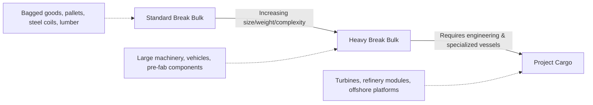

## Break Bulk and Project Cargo

### Overview

Break bulk and project cargo represent specialized ocean freight categories for goods that cannot be efficiently containerized or handled as bulk commodity — typically due to irregular dimensions, excessive weight, fragility, or the need for individual handling. While often discussed together, break bulk and project cargo are distinct categories with different typical commodities and handling logistics.

### Break Bulk Cargo

**Key Points**

- **Definition**: cargo shipped as individual units (crates, bags, barrels, bales, pallets, or unpackaged pieces) rather than in shipping containers or bulk commodity form — the historical default shipping method before containerization.
- **Common commodities**: bagged goods (rice, cement, coffee), palletized goods, steel coils, lumber, machinery too large for standard containers, vehicles, and heavy equipment.
- **Handling**: loaded and unloaded piece by piece using shipboard or shore cranes, often requiring specialized lifting gear (slings, spreader bars) matched to the specific cargo shape.
- **Vessel type**: multipurpose vessels (MPVs) or dedicated break bulk carriers, frequently "geared" (equipped with onboard cranes) to allow loading/unloading at ports lacking specialized container-handling infrastructure.

### Project Cargo

- **Definition**: a subcategory of break bulk involving exceptionally large, heavy, high-value, or complex cargo — typically components for major industrial, energy, or infrastructure projects — that require specialized engineering, planning, and handling beyond standard break bulk practice.
- **Common commodities**: power plant turbines and generators, refinery modules, wind turbine blades and towers, industrial reactors, transformers, mining equipment, offshore platform components, rail cars, and pre-fabricated industrial modules.
- **Vessel type**: heavy-lift vessels (equipped with high-capacity cranes, sometimes 500+ tonnes lift capacity), semi-submersible heavy-lift ships (which can partially submerge to float cargo on/off), and specialized roll-on/roll-off (RoRo) heavy-lift vessels.
- **Engineering requirement**: project cargo shipments typically require dedicated logistics engineering — route surveys, load calculations, lashing/securing plans, and sometimes custom-built cradles or supports — before shipment, distinguishing it from routine break bulk handling.

### Diagram: Break Bulk vs. Project Cargo Spectrum

### Break Bulk Handling and Documentation

- **Cargo securing**: individual pieces must be lashed, chocked, or otherwise secured within the vessel's hold to prevent shifting during transit — a labor-intensive process compared to container stacking.
- **Documentation**: typically requires detailed cargo manifests specifying each individual piece's dimensions and weight, since break bulk lacks the standardized "one container, one B/L line item" simplicity of containerized freight.
- **Port requirements**: break bulk cargo often requires ports with open storage/laydown areas and heavy-lift shore cranes, rather than the automated gantry systems built for containers.
- **Damage/theft exposure**: individually handled cargo faces higher exposure to damage and theft than sealed containers, since goods are visible and separately handled at multiple points.

### Project Cargo Planning Process

Project cargo shipments follow a more rigorous planning sequence than standard break bulk due to the scale, value, and engineering complexity involved:

1. **Route survey**: physical assessment of the entire transport route (port, road, rail corridors) to identify clearance constraints — bridge heights, road widths, weight limits on infrastructure.
2. **Engineering study**: calculation of load distribution, center of gravity, and structural stress for lifting and transport, often requiring custom lifting frames or spreader bars.
3. **Vessel/equipment selection**: matching cargo dimensions and weight to an appropriately specified heavy-lift vessel, and selecting specialized inland transport (modular trailers, self-propelled modular transporters/SPMTs).
4. **Permitting**: securing oversize/overweight transport permits from relevant road/rail authorities, which can involve substantial lead time.
5. **Execution and monitoring**: coordinated lifting, loading, securing, and transit, often with cargo surveyors present at each handling point to document condition.

### Diagram: Project Cargo Movement Chain

<svg xmlns="http://www.w3.org/2000/svg" viewBox="0 0 660 260" font-family="sans-serif">
<text x="330" y="25" text-anchor="middle" font-size="16" font-weight="bold">Project Cargo Movement Chain (svg_diagram)</text>
<rect x="20" y="60" width="120" height="60" fill="none" stroke="#0066cc" stroke-width="2" rx="6" />
<text x="80" y="85" text-anchor="middle" font-size="10">Manufacturing Site</text>
<text x="80" y="100" text-anchor="middle" font-size="9">e.g. Turbine Factory</text>
<rect x="180" y="60" width="120" height="60" fill="none" stroke="#0066cc" stroke-width="2" rx="6" />
<text x="240" y="85" text-anchor="middle" font-size="10">SPMT / Modular</text>
<text x="240" y="100" text-anchor="middle" font-size="9">Trailer Transport</text>
<rect x="340" y="60" width="120" height="60" fill="none" stroke="#cc6600" stroke-width="2" rx="6" />
<text x="400" y="85" text-anchor="middle" font-size="10">Heavy-Lift Port</text>
<text x="400" y="100" text-anchor="middle" font-size="9">Crane/RoRo Loading</text>
<rect x="500" y="60" width="140" height="60" fill="none" stroke="#cc6600" stroke-width="2" rx="6" />
<text x="570" y="85" text-anchor="middle" font-size="10">Heavy-Lift Vessel</text>
<text x="570" y="100" text-anchor="middle" font-size="9">or Semi-Submersible</text>
<line x1="140" y1="90" x2="180" y2="90" stroke="#333" stroke-width="1.5" marker-end="url(#arrow2)" />
<line x1="300" y1="90" x2="340" y2="90" stroke="#333" stroke-width="1.5" marker-end="url(#arrow2)" />
<line x1="460" y1="90" x2="500" y2="90" stroke="#333" stroke-width="1.5" marker-end="url(#arrow2)" />

<text x="330" y="160" text-anchor="middle" font-size="11" font-weight="bold">↓ Ocean Transit ↓</text>

<rect x="180" y="190" width="120" height="50" fill="none" stroke="#333" stroke-width="1.5" rx="6" />
<text x="240" y="219" text-anchor="middle" font-size="10">Destination Port</text>
<rect x="360" y="190" width="120" height="50" fill="none" stroke="#333" stroke-width="1.5" rx="6" />
<text x="420" y="219" text-anchor="middle" font-size="10">Project Site</text>
<line x1="300" y1="215" x2="360" y2="215" stroke="#333" stroke-width="1.5" marker-end="url(#arrow2)" />
</svg>

### Comparative Reference Table

| Factor | Standard Break Bulk | Project Cargo |
| --- | --- | --- |
| Typical unit weight | Up to a few tonnes per piece | Tens to hundreds of tonnes per piece |
| Vessel type | Multipurpose vessel (MPV), geared break bulk carrier | Heavy-lift vessel, semi-submersible |
| Planning intensity | Standard stowage/lashing planning | Full engineering study, route survey, custom rigging |
| Lead time | Days to weeks | Weeks to months |
| Inland transport | Standard trucks/flatbeds | SPMTs, modular trailers, escorted oversize convoys |
| Typical shipper | General trading, manufacturing | EPC contractors, energy/infrastructure developers |

### Example: Wind Turbine Component Shipment

A wind farm developer needs to ship turbine blades (each ~60–80 meters long), tower sections, and a nacelle (housing the generator, often 60+ tonnes) from a manufacturing facility in Denmark to a wind farm site in Brazil:

1. Blades and tower sections are too long and heavy for standard containers or even most break bulk handling — they require custom cradles and specialized flatbed trailers for inland transport to the port.
2. A route survey confirms road clearances (bridge heights, turning radii) between the factory and port.
3. A heavy-lift vessel with sufficient deck space and crane capacity is chartered; blades may be stowed on deck given their length, while the nacelle is lifted into a hold or secured on deck with custom lashing.
4. At the destination port, the same challenge repeats in reverse — SPMTs or specialized trailers move components from the port to the wind farm site, often requiring temporary road modifications or escort vehicles for oversize loads.

This illustrates why project cargo logistics extends well beyond ocean transport itself into coordinated inland engineering and permitting — the ocean voyage is often the most straightforward segment of the total movement.

### Conclusion

Break bulk and project cargo serve the segment of international trade that containerization and bulk shipping cannot accommodate: irregularly shaped, oversized, or exceptionally heavy goods requiring individual handling. Break bulk represents the historical default shipping method still used for goods incompatible with container dimensions, while project cargo represents its most demanding subset — large-scale industrial components requiring dedicated engineering, specialized heavy-lift vessels, and coordinated multimodal planning. Both categories illustrate that mode and vessel selection in ocean freight is fundamentally driven by cargo physical characteristics, a theme that recurs across transportation mode selection more broadly.

**Related Topics**

- Containerized Shipping: FCL and LCL
- Bulk Shipping: Dry Bulk and Liquid Bulk Carriers
- Oversize/Overweight Inland Transport and Permitting
- Multipurpose and Heavy-Lift Vessel Chartering
- Cargo Securing, Lashing, and Stowage Planning
- EPC Project Logistics and Route Engineering Surveys