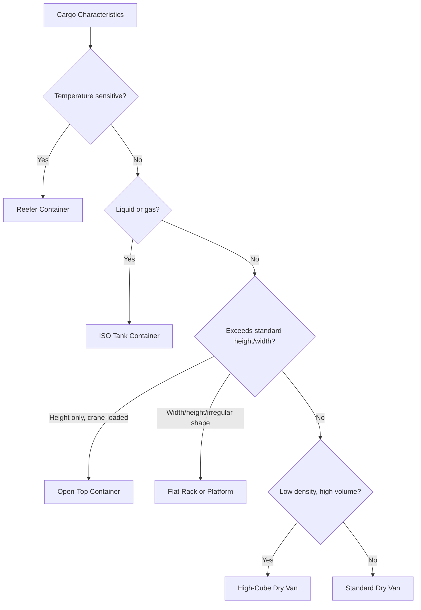

## Container Types and Specifications

### Overview

Shipping containers are standardized under ISO 668 dimensional specifications, but within that standardization, multiple container types exist to accommodate different cargo characteristics — dry general cargo, temperature-sensitive goods, liquids, oversized cargo, and open-top loading requirements. Selecting the correct container type is a core logistics decision that directly affects cargo protection, loading method, and cost.

### Standard Dimensional Classes

**Key Points**

- Containers are measured in **TEU (Twenty-foot Equivalent Unit)** and **FEU (Forty-foot Equivalent Unit)** as the standard industry capacity metrics.
- **20-ft standard**: ~33 cubic meters capacity, ~24,000–28,000 kg maximum payload (varies by container specification and carrier).
- **40-ft standard**: ~67 cubic meters capacity, generally similar or slightly higher payload limit than 20-ft depending on structural rating.
- **40-ft high-cube (HC)**: same footprint as standard 40-ft but approximately 30 cm (1 ft) taller, offering ~76 cubic meters capacity — commonly used for lower-density, high-volume cargo.

$$\text{Effective Capacity Utilization} = \frac{\text{Cargo Volume or Weight}}{\text{Container Capacity (CBM or kg)}}$$

Container selection often hinges on which constraint binds first — volume or weight — since low-density cargo (e.g., furniture, textiles) typically fills volume before reaching weight limits, while high-density cargo (e.g., machinery parts, canned goods) often reaches weight limits well before filling available volume.

### Container Types by Cargo Function

| Type | Description | Typical Cargo |
| --- | --- | --- |
| **Dry Van (General Purpose)** | Fully enclosed, standard container with door at one end | General manufactured/packaged goods |
| **High-Cube** | Extra-tall dry van variant | Bulky, low-density cargo |
| **Reefer (Refrigerated)** | Insulated container with integrated refrigeration unit, temperature-controlled | Perishables: produce, meat, pharmaceuticals, dairy |
| **Open-Top** | Removable tarpaulin/roof cover instead of solid roof | Tall cargo loaded from above by crane (machinery, timber) |
| **Flat Rack** | No sides or roof; only a base and end walls (sometimes collapsible) | Oversized/heavy cargo exceeding standard width or height (vehicles, industrial equipment) |
| **Platform / Flatbed** | Base only, no walls at all | Extremely oversized or irregularly shaped cargo |
| **Tank Container (ISO Tank)** | Cylindrical tank within a rectangular frame | Bulk liquids and gases (chemicals, food-grade liquids, fuel) |
| **Ventilated Container** | Dry van with ventilation openings | Cargo requiring airflow but not refrigeration (coffee, cocoa, certain produce) |
| **Double-Door / Side-Door Container** | Additional access doors beyond the standard rear doors | Cargo requiring loading/unloading from multiple angles |
| **Bulk Container** | Dry van fitted with hatches for gravity loading of dry bulk | Grains, powders, granular bulk in smaller quantities than full bulk vessels |

### Diagram: Container Type Selection Logic

### Diagram: Container Type Cross-Section Comparison

<svg xmlns="http://www.w3.org/2000/svg" viewBox="0 0 680 320" font-family="sans-serif">
<text x="340" y="25" text-anchor="middle" font-size="16" font-weight="bold">Container Type Cross-Sections (svg_diagram)</text>

<text x="100" y="55" text-anchor="middle" font-size="11" font-weight="bold">Dry Van</text>

<rect x="40" y="65" width="120" height="90" fill="none" stroke="`#0066cc`" stroke-width="2" />

<line x1="40" y1="65" x2="160" y2="65" stroke="`#0066cc`" stroke-width="3" />

<text x="100" y="172" text-anchor="middle" font-size="9">Fully enclosed</text>

<text x="260" y="55" text-anchor="middle" font-size="11" font-weight="bold">Reefer</text>

<rect x="200" y="65" width="120" height="90" fill="none" stroke="`#0099cc`" stroke-width="2" />

<rect x="200" y="65" width="120" height="18" fill="`#0099cc`" opacity="0.3" />

<text x="260" y="78" text-anchor="middle" font-size="8">Refrig. Unit</text>

<text x="260" y="172" text-anchor="middle" font-size="9">Insulated + cooling</text>

<text x="420" y="55" text-anchor="middle" font-size="11" font-weight="bold">Open-Top</text>

<rect x="360" y="65" width="120" height="90" fill="none" stroke="`#cc6600`" stroke-width="2" />

<line x1="360" y1="65" x2="480" y2="65" stroke="`#cc6600`" stroke-width="2" stroke-dasharray="6,4" />

<text x="420" y="172" text-anchor="middle" font-size="9">Removable tarp roof</text>

<text x="580" y="55" text-anchor="middle" font-size="11" font-weight="bold">Flat Rack</text>

<rect x="520" y="140" width="120" height="15" fill="none" stroke="#333" stroke-width="2" />

<rect x="520" y="65" width="10" height="75" fill="none" stroke="#333" stroke-width="2" />

<rect x="630" y="65" width="10" height="75" fill="none" stroke="#333" stroke-width="2" />

<text x="580" y="172" text-anchor="middle" font-size="9">Base + end walls only</text>

<line x1="40" y1="155" x2="160" y2="155" stroke="#333" stroke-width="3" />
<line x1="200" y1="155" x2="320" y2="155" stroke="#333" stroke-width="3" />
<line x1="360" y1="155" x2="480" y2="155" stroke="#333" stroke-width="3" />
</svg>

### Weight and Structural Considerations

- **Maximum Gross Weight**: the combined weight of container tare plus cargo, limited both by the container's structural rating and by applicable road/rail transport weight limits in the destination country — these limits do not always align, meaning a container legally loaded at origin may require weight redistribution or partial unloading before it can be legally trucked at destination.
- **Verified Gross Mass (VGM)**: under SOLAS (International Convention for the Safety of Life at Sea) requirements, shippers must provide a verified gross mass for every packed container before it can be loaded onto a vessel, to prevent vessel stability and stack-collapse risks from misdeclared weights.
- **Tare Weight**: the container's own empty weight, which must be subtracted from gross weight to determine actual cargo payload capacity.

### Reefer Container Technical Considerations

- **Temperature range**: typically capable of maintaining cargo between approximately -30°C and +30°C, depending on unit specification.
- **Power requirement**: reefer containers require continuous electrical power (from vessel, terminal, or a generator/genset during trucking) to maintain temperature — a "reefer plug" — making power availability a critical link in the cold chain.
- **Controlled Atmosphere (CA)**: advanced reefer units can also regulate oxygen, carbon dioxide, and humidity levels, extending shelf life for certain produce (e.g., bananas, avocados) beyond what temperature control alone achieves.
- **Cold chain integrity**: any gap in power or temperature control (e.g., during port transfer delays) can compromise cargo, making reefer logistics more time- and monitoring-sensitive than dry van shipping.

### Example: Container Selection Scenario

A shipper needs to move three different cargo types from Rotterdam to New York:

1. **Frozen seafood** → **Reefer container**, set to maintain sub-zero temperature throughout transit, with continuous power monitoring required at every handoff point.
2. **A single large industrial generator (4.2m tall, exceeding standard container height)** → **Flat rack container**, allowing the generator to be loaded from above by crane and secured with lashing, since it cannot fit within an enclosed dry van's height clearance.
3. **Palletized packaged electronics (dense, moderate volume)** → **Standard 20-ft dry van**, since the cargo's weight-to-volume ratio would reach the weight limit before filling a 40-ft container's volume, making the smaller container more cost-efficient.

### Conclusion

Container type selection is driven by cargo's physical and handling characteristics — temperature sensitivity, liquid/gas state, dimensional constraints, and density — layered on top of the ISO-standardized dimensional classes (20-ft, 40-ft, high-cube) that define base capacity. Choosing the wrong container type risks cargo damage, inefficient space utilization, or regulatory non-compliance (as with VGM requirements), making this a foundational operational decision that precedes booking, documentation, and Incoterm application in any containerized shipment.

**Related Topics**

- Containerized Shipping: FCL and LCL
- Cold Chain Logistics and Reefer Monitoring Systems
- Verified Gross Mass (VGM) and SOLAS Container Weight Rules
- Cargo Securing, Lashing, and Stowage Planning
- Break Bulk and Project Cargo
- Port Operations and Container Terminal Management