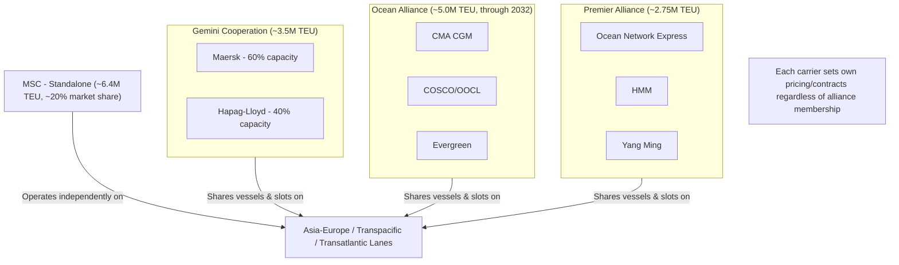

## Shipping Lines, Alliances, and Vessel Sharing Agreements

### Overview

Container shipping lines rarely operate deep-sea services entirely alone. Because deploying and filling a modern container vessel is extraordinarily capital-intensive, most major carriers cooperate through formal alliances — vessel sharing agreements that pool ships, slot capacity, and port rotations on shared trade lanes, while each carrier continues to set its own pricing and contracts independently.

### Why Alliances Exist

**Key Points**

- Deep-sea container shipping is brutally capital intensive: a single 24,000 TEU ultra large container vessel costs roughly $250 million and burns about $30,000 per day in fuel and crew.
- No single carrier can profitably fill that scale of vessel on every weekly sailing across every major trade lane alone, so alliances let members combine cargo and ships to maintain weekly frequency, achieve economies of scale, and spread capital risk.
- **Critical distinction**: alliances share vessels and port calls, not commercial pricing — each carrier sets its own rates and signs its own contracts with shippers. An alliance is an operational cooperation agreement, not a pricing cartel or merger.

### What an Alliance Actually Does

An ocean carrier alliance is a vessel sharing agreement between two or more container shipping lines. Members pool ships and slot capacity on agreed trade lanes, coordinate port rotations and sailing schedules, and offer each other space on each other's vessels, while each carrier keeps its own commercial team, contracts, and pricing.

- **Slot chartering/swapping**: members purchase or exchange guaranteed capacity ("slots") on each other's vessels, allowing each line to offer sailings and port coverage far beyond what its own fleet could support alone.
- **Coordinated port rotation**: alliance members jointly design vessel rotations and port call sequences to maximize efficiency and coverage across the shared network.
- **Independent commercial operation**: booking, pricing, customer contracts, and service differentiation remain entirely separate between alliance members — a shipper booking with two different alliance-member carriers may pay different rates for space on the very same physical vessel.

### The Current Alliance Landscape (2026)

Following the major January 2025 reshuffle, three alliances now dominate east-west container traffic, alongside one carrier operating fully independently.

| Alliance | Members | Fleet Deployed | Combined Capacity |
| --- | --- | --- | --- |
| **Gemini Cooperation** | Maersk, Hapag-Lloyd | ~275 ships | ~3.5 million TEU |
| **Ocean Alliance** | CMA CGM, COSCO Shipping/OOCL, Evergreen | ~350 ships | ~5.0 million TEU |
| **Premier Alliance** | ONE, HMM, Yang Ming | ~220 ships | ~2.75 million TEU |
| **MSC** (standalone) | Not in an alliance | 887 owned/chartered ships | ~6.4 million TEU (~20% global market share) |

The old 2M Alliance (Maersk plus MSC) dissolved on 31 January 2025, and THE Alliance was rebranded Premier Alliance after Hapag-Lloyd departed to form Gemini Cooperation with Maersk. Ocean Alliance is the only pre-2025 pact still intact, having extended its agreement to run through 2032.

Notably, the Gemini, Premier, and MSC's independent capacity together control roughly 80% of worldwide container capacity, underscoring how concentrated liner shipping has become around a small number of major groupings.

### Gemini Cooperation: A Structurally Different Model

Gemini represents more than a routine alliance reshuffle: Maersk and Hapag-Lloyd expanded the traditional alliance model by making relay and feeder services an integral part of the network, whereas previously those services mainly supported deep-sea operations. Gemini's mainline network covers the Europe–Far East, Transpacific, Transatlantic, Europe–Middle East/Indian Subcontinent, and Far East–Middle East/Indian Subcontinent trades, centered on selected hub ports linked to terminals affiliated with at least one of the two partners — described as a unique level of integration among today's major alliances. Maersk contributes 60% and Hapag-Lloyd 40% of the alliance's deployed capacity.

### Diagram: Alliance Structure and Slot Sharing

### Diagram: Alliance Reshuffle Timeline

<svg xmlns="http://www.w3.org/2000/svg" viewBox="0 0 680 260" font-family="sans-serif">
<text x="340" y="25" text-anchor="middle" font-size="16" font-weight="bold">2023-2025 Alliance Reshuffle Timeline (svg_diagram)</text>
<line x1="50" y1="130" x2="630" y2="130" stroke="#333" stroke-width="2" />
<circle cx="90" cy="130" r="6" fill="#0066cc" />
<text x="90" y="115" text-anchor="middle" font-size="10">Jan 2023</text>
<text x="90" y="150" text-anchor="middle" font-size="9">2M/Ocean Alliance/</text>
<text x="90" y="163" text-anchor="middle" font-size="9">THE Alliance active</text>
<circle cx="250" cy="130" r="6" fill="#cc6600" />
<text x="250" y="115" text-anchor="middle" font-size="10">Late Jan 2023</text>
<text x="250" y="150" text-anchor="middle" font-size="9">2M dissolution</text>
<text x="250" y="163" text-anchor="middle" font-size="9">announced</text>
<circle cx="400" cy="130" r="6" fill="#cc6600" />
<text x="400" y="115" text-anchor="middle" font-size="10">Jan 2024</text>
<text x="400" y="150" text-anchor="middle" font-size="9">Hapag-Lloyd exits</text>
<text x="400" y="163" text-anchor="middle" font-size="9">THE Alliance</text>
<circle cx="530" cy="130" r="8" fill="#cc0000" />
<text x="530" y="112" text-anchor="middle" font-size="11" font-weight="bold">Feb 2025</text>
<text x="530" y="150" text-anchor="middle" font-size="9">Gemini + Premier</text>
<text x="530" y="163" text-anchor="middle" font-size="9">launch; MSC standalone</text>
<circle cx="610" cy="130" r="6" fill="#0066cc" />
<text x="610" y="115" text-anchor="middle" font-size="10">2026</text>
<text x="610" y="150" text-anchor="middle" font-size="9">3-alliance</text>
<text x="610" y="163" text-anchor="middle" font-size="9">structure stable</text>
</svg>

### Impact on Shippers and Schedule Reliability

**Key Points**

- Alliance restructuring directly affects transit times, port rotations, and on-time reliability scores that forwarders and shippers rely on for planning.
- Schedule reliability had lingered in the low-to-mid 50% range industry-wide through 2024, but shortly after the February 2025 relaunch, Gemini Cooperation reached 94.0% schedule reliability in origin ports, with MSC recording 79.6% and Premier Alliance 60.4%, compared to the outgoing Ocean Alliance/THE Alliance/2M figures of 54.1%/45.3%/44.2% respectively [Unverified for later 2026 performance — these are early post-launch figures, and reliability metrics fluctuate with network maturity, capacity conditions, and disruptions].
- Because alliance membership is now more differentiated than the older uniform three-way split, shippers and forwarders must evaluate each alliance's specific port coverage and reliability track record rather than assuming interchangeability between carriers.

### Practical Implications for Booking and Routing

- **Vessel identity vs. carrier booking**: a shipper may book with Carrier A but have cargo physically loaded on a vessel owned and operated by Carrier A's alliance partner, Carrier B — this is normal and expected under slot-sharing arrangements.
- **Rate variability within the same vessel**: because pricing remains independent per carrier, the same physical sailing can carry cargo booked at different rates by different alliance members, and by non-alliance customers via space-charter arrangements.
- **Route and capacity resilience**: alliance-coordinated networks provide more consistent weekly frequency and broader port coverage than most single carriers could sustain alone, but a disruption affecting one alliance member's vessel can still ripple across shared sailings used by partner carriers.
- **Regulatory oversight**: alliance vessel-sharing agreements are subject to competition/antitrust review in relevant jurisdictions (e.g., historically under the EU's Consortia Block Exemption Regulation and U.S. Federal Maritime Commission oversight), since even non-pricing cooperation among major carriers can raise competition concerns if capacity coordination affects market access.

### Example: Booking Under an Alliance Structure

A shipper based in Vietnam books a 40-ft container from Ho Chi Minh City to Rotterdam with Hapag-Lloyd. Under the Gemini Cooperation's integrated hub-and-spoke model, the cargo may actually move via a Maersk-operated mainline vessel for the deep-sea leg, having first been consolidated through a regional feeder service at a Gemini-affiliated hub port. The shipper's contract, invoice, and customer service relationship remain entirely with Hapag-Lloyd throughout, even though physical possession of the cargo passes through Maersk-operated vessels and potentially Maersk-affiliated terminal infrastructure — illustrating the operational-cooperation-without-commercial-merger nature of alliance agreements.

### Conclusion

Shipping alliances are a structural response to the capital intensity of deep-sea container operations, allowing carriers to share vessel capacity and port networks while preserving independent commercial relationships with shippers. The 2025 reshuffle — dissolving the long-standing 2M alliance and creating Gemini Cooperation and Premier Alliance alongside the extended Ocean Alliance and standalone MSC — has materially reshaped port rotations, transit reliability, and network design across major east-west trade lanes. Understanding alliance structure is essential for interpreting carrier schedules, booking options, and reliability data, and connects directly to broader questions of trade lane capacity and liner shipping economics covered elsewhere in this curriculum.

**Related Topics**

- Overview of Global Trade Flows and Trade Lanes
- Port Operations and Container Terminal Management
- Liner Shipping Schedules and Service Reliability Metrics
- Containerized Shipping: FCL and LCL
- Bulk Shipping: Dry Bulk and Liquid Bulk Carriers (Voyage/Time Chartering)
- Competition Regulation of Carrier Alliances (EU CBER, U.S. FMC)