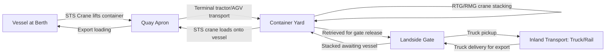

## Ports, Terminals, and Port Operations

### Overview

Ports are the physical interface between ocean transport and inland logistics networks, and their operational efficiency is a primary determinant of total supply chain reliability. A port encompasses multiple specialized terminal types, each handling different cargo categories with distinct equipment, layout, and process requirements. Port performance directly affects vessel schedules, container availability, demurrage exposure, and inland transport connectivity.

### Port vs. Terminal: Definitional Distinction

**Key Points**

- A **port** is the broader geographic and administrative entity — a maritime gateway that may contain multiple terminals operated by different companies, along with navigational channels, anchorages, pilotage services, and regulatory authority.
- A **terminal** is a specific operational facility within a port dedicated to handling a particular cargo type (container, bulk, liquid, break bulk, RoRo) — often independently operated, sometimes by global terminal operating companies rather than the port authority itself.
- A single major port (e.g., Rotterdam, Singapore, Shanghai) may contain a dozen or more distinct terminals, each with separate management, equipment, and even separate customer relationships.

### Terminal Types by Cargo Category

| Terminal Type | Primary Cargo | Key Equipment |
| --- | --- | --- |
| Container Terminal | Containerized cargo | Ship-to-shore (STS) gantry cranes, rubber-tired gantry (RTG)/rail-mounted gantry (RMG) yard cranes, terminal tractors |
| Bulk Terminal (Dry) | Iron ore, coal, grain | Conveyor systems, grab cranes, ship loaders/unloaders, storage silos/stockpiles |
| Liquid Bulk Terminal | Crude oil, refined products, chemicals | Pipeline systems, pumps, storage tank farms |
| Break Bulk/Multipurpose Terminal | Non-containerized general cargo | Mobile harbor cranes, forklifts, open storage/laydown areas |
| RoRo Terminal | Vehicles, wheeled cargo | Ramps, marshalling yards (no cranes required — cargo is driven on/off) |
| Cruise Terminal | Passengers (not cargo) | Passenger processing facilities, gangways |

### Container Terminal Operations in Detail

Container terminals are the most operationally complex terminal type due to high throughput volume and the need for precise container tracking:

- **Berth**: the designated vessel mooring location where ship-to-shore cranes load/discharge containers directly between vessel and quay.
- **Ship-to-Shore (STS) Cranes**: large gantry cranes that move along rail tracks on the quay, lifting containers directly from vessel holds/deck to the terminal yard (and vice versa).
- **Container Yard (CY)**: the storage area where containers are stacked awaiting further movement — typically organized in blocks by destination, carrier, or status (import/export/empty).
- **Yard Cranes**: Rubber-Tired Gantry (RTG) or Rail-Mounted Gantry (RMG) cranes that stack and retrieve containers within the yard, distinct from the larger STS quay cranes.
- **Gate Operations**: the landside entry/exit point where trucks deliver or collect containers, involving documentation checks, container inspection, and increasingly automated gate processing (OCR camera systems, RFID).
- **Terminal Operating System (TOS)**: the software platform coordinating vessel planning, yard stacking strategy, crane scheduling, and gate operations — critical for managing throughput at high-volume terminals.

### Diagram: Container Terminal Layout and Flow

### Diagram: Multi-Terminal Port Structure

<svg xmlns="http://www.w3.org/2000/svg" viewBox="0 0 660 300" font-family="sans-serif">
<text x="330" y="25" text-anchor="middle" font-size="16" font-weight="bold">Port with Multiple Terminal Types (svg_diagram)</text>
<rect x="30" y="50" width="600" height="220" fill="none" stroke="#333" stroke-width="2" stroke-dasharray="8,4" />
<text x="330" y="70" text-anchor="middle" font-size="12" font-style="italic">Port Authority Jurisdiction</text>
<rect x="60" y="90" width="140" height="70" fill="none" stroke="#0066cc" stroke-width="2" rx="6" />
<text x="130" y="120" text-anchor="middle" font-size="11" font-weight="bold">Container</text>
<text x="130" y="135" text-anchor="middle" font-size="11" font-weight="bold">Terminal</text>
<text x="130" y="150" text-anchor="middle" font-size="9">Operator A</text>
<rect x="220" y="90" width="140" height="70" fill="none" stroke="#cc6600" stroke-width="2" rx="6" />
<text x="290" y="120" text-anchor="middle" font-size="11" font-weight="bold">Dry Bulk</text>
<text x="290" y="135" text-anchor="middle" font-size="11" font-weight="bold">Terminal</text>
<text x="290" y="150" text-anchor="middle" font-size="9">Operator B</text>
<rect x="380" y="90" width="140" height="70" fill="none" stroke="#009966" stroke-width="2" rx="6" />
<text x="450" y="120" text-anchor="middle" font-size="11" font-weight="bold">Liquid Bulk</text>
<text x="450" y="135" text-anchor="middle" font-size="11" font-weight="bold">Terminal</text>
<text x="450" y="150" text-anchor="middle" font-size="9">Operator C</text>
<rect x="150" y="190" width="140" height="60" fill="none" stroke="#333" stroke-width="1.5" rx="6" />
<text x="220" y="215" text-anchor="middle" font-size="11" font-weight="bold">Break Bulk</text>
<text x="220" y="230" text-anchor="middle" font-size="9">Terminal</text>
<rect x="330" y="190" width="140" height="60" fill="none" stroke="#333" stroke-width="1.5" rx="6" />
<text x="400" y="215" text-anchor="middle" font-size="11" font-weight="bold">RoRo Terminal</text>
</svg>

### Terminal Automation

- **Automated Stacking Cranes (ASC)**: automated yard cranes that stack/retrieve containers without human operators in the yard, increasingly deployed at high-volume terminals to improve consistency and reduce labor cost.
- **Automated Guided Vehicles (AGVs)**: driverless vehicles transporting containers between quay and yard within automated terminals.
- **Remote-controlled STS cranes**: quay cranes operated remotely from a control room rather than an onboard operator cab, common at newer automated terminal builds.
- **Terminal Operating System (TOS) integration**: modern automated terminals rely heavily on TOS software to coordinate crane movements, vehicle routing, and yard planning algorithmically, since manual coordination cannot match the speed and precision automated equipment enables.

### Key Performance Metrics

$$\text{Berth Productivity (moves/hour)} = \frac{\text{Total Container Moves}}{\text{Vessel Time at Berth (hours)}}$$

- **Berth productivity**: containers moved per hour per crane (or per vessel call), a primary efficiency benchmark directly affecting vessel turnaround time and, by extension, carrier schedule reliability.
- **Dwell time**: the duration a container remains in the terminal yard before being picked up (import) or loaded (export) — extended dwell time increases yard congestion and demurrage exposure for the cargo owner.
- **Yard utilization**: the percentage of yard storage capacity occupied at a given time; excessive utilization slows retrieval operations and can cause cascading delays.
- **Gate turnaround time**: the time a truck spends within the terminal gate process, a key metric for trucking companies and shippers managing inland transport scheduling.

### Port Selection Considerations for Shippers

- **Draft/depth capacity**: the maximum vessel draft a port can accommodate determines which vessel sizes (and thus which carrier services) can call there — a critical constraint for ultra-large container vessels.
- **Hinterland connectivity**: rail and road connections linking the port to inland distribution networks significantly affect total door-to-door transit time beyond the ocean leg itself.
- **Congestion history**: ports with chronic congestion (often driven by landside infrastructure limits, labor availability, or surging volume) introduce schedule unpredictability that shippers must factor into safety stock and lead-time planning.
- **Transshipment role**: some ports function primarily as transshipment hubs (e.g., Singapore, Colombo) where cargo is transferred between vessels rather than having significant local import/export volume, affecting routing strategy for shippers targeting nearby smaller ports.

### Example: Port Operations in Practice

A container arrives at a major European port aboard an alliance-operated vessel. The ship-to-shore crane discharges it directly from the vessel to a waiting terminal tractor, which transports it to an assigned yard block based on the terminal operating system's stacking plan (organized by destination trucking route and pickup priority). An RTG crane stacks the container in the yard. When the consignee's trucking company arrives at the gate with the correct release documentation, the TOS directs a yard crane to retrieve the specific container, which is then loaded onto the truck chassis and exits through an automated OCR gate that logs the container's departure — all within the terminal's allotted free time to avoid demurrage charges.

### Conclusion

Ports function as multi-terminal ecosystems where cargo-specific facilities — container, bulk, liquid, break bulk, and RoRo terminals — operate with distinct equipment and processes under a shared port authority framework. Container terminal operations in particular rely on tightly coordinated crane, yard, and gate processes managed through terminal operating systems, with automation increasingly displacing manual operation at high-volume facilities. Port performance metrics like berth productivity and dwell time directly cascade into carrier schedule reliability and shipper cost exposure (demurrage/detention), making port operations a critical link connecting ocean carriage to the broader logistics chain covered in adjacent chapters on carrier alliances and inland transport modes.

**Related Topics**

- Shipping Lines, Alliances, and Vessel Sharing Agreements
- Containerized Shipping: FCL and LCL
- Demurrage, Detention, and Free Time Management
- Intermodal and Multimodal Transport Systems
- Bulk Shipping: Dry Bulk and Liquid Bulk Carriers
- Terminal Automation and Digital Port Technologies