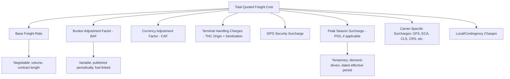

## Ocean Freight Rate Structures and Surcharges

### Overview

Ocean freight pricing is rarely a single flat number — the headline "freight rate" quoted by a carrier typically represents only the base transportation charge, with numerous surcharges layered on top to recover fuel costs, currency exposure, security compliance, demand fluctuations, and terminal handling. Understanding this structure is essential for accurately estimating total shipping cost and for identifying which charges are negotiable versus fixed.

### Base Freight Rate

**Key Points**

- The **base freight rate** (also called the "ocean freight" or "all-in base rate" depending on carrier terminology) is the core charge for transporting a container from port to port — the headline rate carriers quote, and is negotiable based on volume, contract length, and market conditions.
- Base rates are typically quoted per container type (20-ft, 40-ft, 40-ft HC) and vary substantially by trade lane, driven by lane-specific supply/demand balance, vessel capacity deployment, and seasonal patterns.
- Rate types include **spot rates** (short-term, market-driven pricing for individual bookings) and **contract rates** (negotiated rates over a fixed period, typically annual, offering price stability in exchange for volume commitments).
- **FAK (Freight All Kinds)**: a rate structure that charges a flat rate per container regardless of the specific commodity inside, simplifying pricing versus commodity-specific tariffs.
- **GRI (General Rate Increase)**: a broad, carrier-announced increase to base freight rates across a trade lane, typically implemented at a specific effective date and applied industry-wide rather than negotiated per shipper.

### Illustrative Base Rate Ranges (2026)

| Route | 20-ft Container | 40-ft Container | 40-ft HC |
| --- | --- | --- | --- |
| China → US West Coast | $1,800–$3,500 | $2,500–$5,000 | $2,700–$5,200 |

*Note: these figures are illustrative market ranges from a single source and fluctuate significantly with capacity conditions, season, and carrier — actual quoted rates should always be verified directly with carriers or forwarders at time of booking [Unverified beyond the cited reporting period].*

### Major Surcharge Categories

Freight surcharges exist because the base ocean or air rate cannot fully capture the real and variable costs of international shipping; rather than constantly repricing their tariffs, carriers use surcharges to recover specific cost increases — particularly fuel costs, currency fluctuations, and demand peaks.

**1. Bunker Adjustment Factor (BAF)** — also called Fuel Adjustment Factor: a surcharge covering fuel costs, published periodically (often monthly) based on bunker oil prices, since marine fuel prices fluctuate independently of the base freight market. In 2026, BAF typically adds $200–$600 per container depending on route length and fuel prices, though it can range $100–$800 on major trade lanes depending on route and market conditions.

**2. Currency Adjustment Factor (CAF)**: applied when the currency of the freight rate differs from the carrier's operating currency, compensating for exchange rate fluctuations between quotation and payment.

**3. Terminal Handling Charges (THC)**: fees charged by port terminals for loading and unloading containers, varying significantly by port — Shanghai charges differ from Long Beach, which differs from Rotterdam — typically running $100–$350 per container at each end (origin and destination).

**4. ISPS Security Surcharge**: mandated by International Maritime Organization security measures, covering port and vessel security compliance costs, typically $10–$30 per container.

**5. Peak Season Surcharge (PSS)**: a temporary fee added to base freight rates that carriers apply when global shipping demand heavily outweighs available vessel space, as retailers rush to build inventory ahead of peak seasons, creating equipment shortages and port congestion.

**6. General Rate Increase (GRI)**: a flat, carrier-wide increase to base rates on a given lane, distinct from a surcharge in that it adjusts the base rate itself rather than adding a separate line item.

### Diagram: Total Ocean Freight Cost Composition

### Carrier-Specific Surcharge Complexity

Beyond the widely recognized categories above, individual carriers publish additional named surcharges that vary by lane and are not standardized across the industry. For example, one major carrier's FAK rates for Far East–Europe routes have included several distinct line items layered onto the base freight rate: GFS (a per-TEU charge), ECA (Emission Control Area surcharge, varying by destination region), CLS, and CRS (with different rates for different European sub-regions) [Unverified — specific surcharge names, amounts, and applicability are carrier- and period-specific, and should be confirmed against current carrier tariffs rather than treated as universal].

**Key Points**

- This proliferation of carrier-specific acronyms means shippers frequently encounter invoices significantly higher than the originally quoted base rate — industry commentary notes shippers agreeing on a freight rate, only to receive an invoice that can run 40% higher once accumulated surcharges are added.
- Because surcharge structures differ by carrier and are not standardized, comparing "rates" between carriers requires comparing total landed freight cost (base + all applicable surcharges), not headline base rates alone.

### Why Rates and Surcharges Fluctuate: 2026 Market Drivers

Three structural factors were identified as driving the March 2026 round of rate increases across major carriers:

1. **Shipping volume**: carriers push for higher rates to capitalize on manufacturing ramp-up following the Chinese New Year period.
2. **Capacity constraints**: persistent equipment (container) shortages in certain regions and vessel rerouting have tightened available supply.
3. **Geopolitical risk**: regional instability has forced further route diversions, such as bypassing the Red Sea, leading to higher operational costs and increased risk premiums that carriers pass through via surcharges and GRIs.

### Example: Peak Season Surcharge Application

A carrier announced a Peak Season Surcharge from Oceania to North Europe and the Mediterranean, applicable to all container types (20-ft and 40-ft Dry, Reefer, and Special equipment, including High Cube) for all sailings commencing from a specified tariffing date until further notice, at a rate of USD 500 per 20-ft container and USD 1,000 per 40-ft container. This surcharge applied on top of existing Bunker-related surcharges, Security-related surcharges, and Terminal Handling Charges, illustrating how a single shipment's total cost accumulates across multiple independently-timed and independently-published charge categories.

### Cost Estimation Framework

$$\text{Total Ocean Freight Cost} = \text{Base Rate} + \text{BAF} + \text{CAF} + \text{THC}_{origin} + \text{THC}_{dest} + \text{ISPS} + \text{PSS (if applicable)} + \text{Carrier-specific surcharges} + \text{Local charges}$$

Shippers negotiating contracts should request an **all-in rate quote** or a detailed surcharge schedule rather than relying on the base rate alone, since surcharge accumulation — particularly BAF and PSS, which are the most volatile and least predictable components — can materially change total landed freight cost between quotation and invoice.

### Conclusion

Ocean freight pricing is a layered structure in which the negotiable base rate represents only one component of total cost, with fuel, currency, security, terminal handling, and demand-driven surcharges added on top — many of which are carrier-specific, non-standardized, and subject to change on short notice via published tariff updates or GRI announcements. In 2026, this structure has been further complicated by geopolitical routing disruptions and capacity constraints, making accurate landed cost estimation dependent on tracking multiple independently-moving charge categories rather than a single headline rate. This rate complexity directly feeds into the landed cost calculations and Incoterm cost-allocation decisions covered elsewhere in this curriculum.

**Related Topics**

- Core Logistics and Incoterms Terminology (Landed Cost)
- Shipping Lines, Alliances, and Vessel Sharing Agreements
- Ports, Terminals, and Port Operations
- Demurrage, Detention, and Free Time Management
- Suez Canal and Red Sea Routing Disruptions
- Overview of Global Trade Flows and Trade Lanes