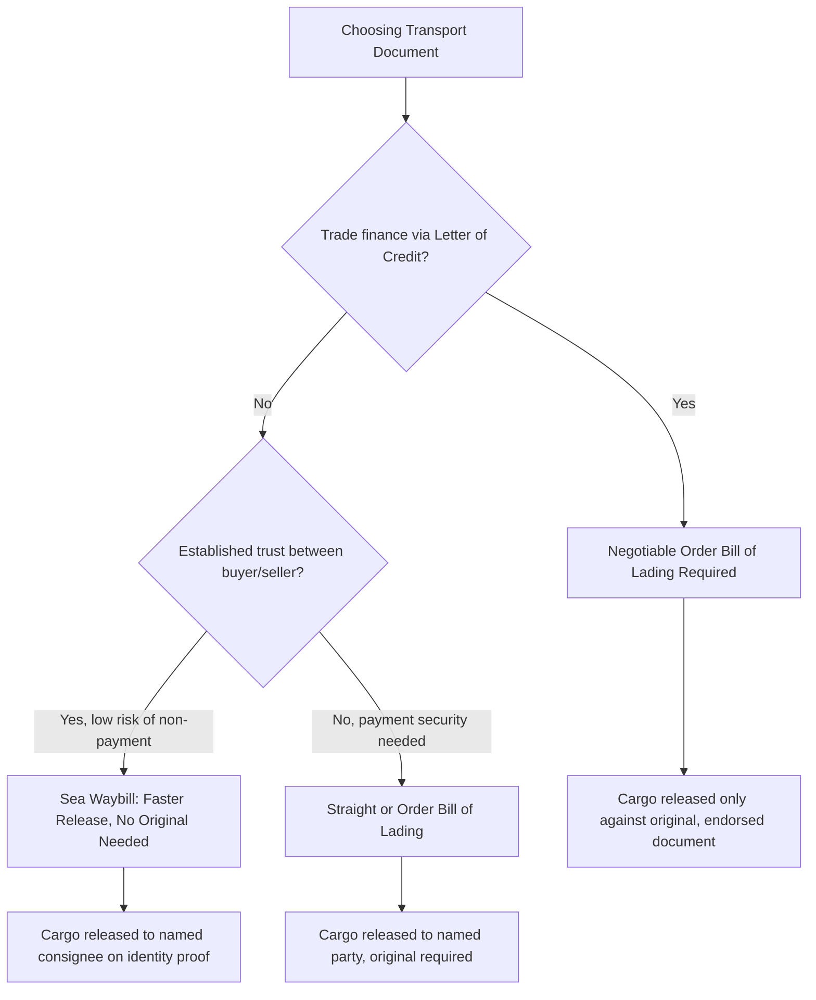

## Bills of Lading and Sea Waybills

### Overview

The bill of lading (B/L) and sea waybill are the two primary transport documents used in ocean freight, both issued by carriers to evidence a shipment. Despite superficial similarity, they serve fundamentally different legal functions — most critically, whether the document is a negotiable document of title or merely a non-negotiable receipt — which has major implications for cargo release, payment security, and trade finance eligibility.

### The Three Functions of a Bill of Lading

**Key Points**

A traditional (negotiable) ocean bill of lading simultaneously performs three distinct legal functions:

1. **Receipt for goods**: evidence that the carrier has received the cargo described, in the apparent condition stated (giving rise to the "clean" vs. "claused" B/L distinction — see below).
2. **Evidence of the contract of carriage**: reflects (though does not necessarily constitute in full) the terms agreed between shipper and carrier for the transport.
3. **Document of title**: when issued in negotiable ("to order") form, the B/L represents ownership of the goods themselves — possession of the original document is legally required to claim the cargo at destination, and the document can be transferred (endorsed) to third parties, enabling the goods to be bought and sold while still in transit.

This third function is what fundamentally distinguishes a negotiable bill of lading from a sea waybill.

### Bill of Lading Types

- **Order Bill of Lading (Negotiable)**: consigned "to order" (of the shipper, or of a named bank), transferable by endorsement; the carrier will release cargo only to whoever presents an original, properly endorsed document. This is the form required for trade finance instruments like letters of credit.
- **Straight Bill of Lading**: names a specific consignee and is non-negotiable — the carrier releases cargo only to the named party, though an original document is still typically required for release.
- **Master Bill of Lading (MBL)**: issued by the actual ocean carrier to a freight forwarder or NVOCC for a full container (particularly relevant to LCL consolidation).
- **House Bill of Lading (HBL)**: issued by a freight forwarder/NVOCC to the individual shipper, nested contractually under the MBL — the shipper's direct evidence of shipment even though the underlying carrier contract is between the carrier and the forwarder.
- **Clean vs. Claused (Dirty) Bill of Lading**: a clean B/L states that cargo was received in apparent good order and condition; a claused B/L notes visible damage, shortage, or irregularity at the time of receipt — a distinction with major significance for cargo insurance claims and letter of credit compliance, since most L/Cs require a clean B/L for payment to be released.

### The Sea Waybill: A Non-Negotiable Alternative

- **Definition**: a sea waybill (SWB) is a transport document that serves as a receipt for goods and evidence of the contract of carriage — but is **not** a document of title.
- **Key distinction**: cargo consigned under a sea waybill is released to the named consignee upon proof of identity, without requiring presentation of an original physical document — the consignee does not need to produce anything to claim the goods beyond establishing their identity as the named party.
- **Use case**: sea waybills are commonly used when the buyer and seller have an established trust relationship (e.g., shipments between related company entities, or long-standing trading partners) and when trade finance instruments requiring a negotiable document (like most letters of credit) are not involved.
- **Speed advantage**: because no original document needs to be physically couriered and presented, sea waybills can eliminate delays caused by document transit time — particularly valuable on short transit routes (e.g., intra-Asia, intra-Europe) where the physical B/L might otherwise arrive after the vessel itself.

### Diagram: Bill of Lading vs. Sea Waybill Decision Logic

### Diagram: Document Flow Comparison

<svg xmlns="http://www.w3.org/2000/svg" viewBox="0 0 680 300" font-family="sans-serif">
<text x="340" y="25" text-anchor="middle" font-size="16" font-weight="bold">B/L vs. Sea Waybill Release Process (svg_diagram)</text>

<text x="170" y="55" text-anchor="middle" font-size="12" font-weight="bold">Negotiable Bill of Lading</text>

<rect x="40" y="70" width="120" height="50" fill="none" stroke="`#0066cc`" stroke-width="2" rx="6" />

<text x="100" y="99" text-anchor="middle" font-size="10">Carrier issues</text>

<text x="100" y="112" text-anchor="middle" font-size="9">original B/L</text>

<rect x="200" y="70" width="120" height="50" fill="none" stroke="#0066cc" stroke-width="2" rx="6" />
<text x="260" y="99" text-anchor="middle" font-size="10">Courier delivers</text>
<text x="260" y="112" text-anchor="middle" font-size="9">original to buyer/bank</text>
<line x1="160" y1="95" x2="200" y2="95" stroke="#333" stroke-width="1.5" marker-end="url(#a3)" />
<rect x="40" y="140" width="280" height="40" fill="none" stroke="#cc0000" stroke-width="1.5" rx="6" stroke-dasharray="4,3" />
<text x="180" y="164" text-anchor="middle" font-size="9" fill="#cc0000">Risk: vessel may arrive before document does</text>

<text x="510" y="55" text-anchor="middle" font-size="12" font-weight="bold">Sea Waybill</text>

<rect x="400" y="70" width="120" height="50" fill="none" stroke="`#009966`" stroke-width="2" rx="6" />

<text x="460" y="99" text-anchor="middle" font-size="10">Carrier issues</text>

<text x="460" y="112" text-anchor="middle" font-size="9">SWB (data only)</text>

<rect x="540" y="70" width="120" height="50" fill="none" stroke="#009966" stroke-width="2" rx="6" />
<text x="600" y="99" text-anchor="middle" font-size="10">Cargo released on</text>
<text x="600" y="112" text-anchor="middle" font-size="9">identity proof only</text>
<line x1="520" y1="95" x2="540" y2="95" stroke="#333" stroke-width="1.5" marker-end="url(#a3)" />
<rect x="400" y="140" width="260" height="40" fill="none" stroke="#009966" stroke-width="1.5" rx="6" stroke-dasharray="4,3" />
<text x="530" y="164" text-anchor="middle" font-size="9" fill="#009966">No document transit delay risk</text>
</svg>

### Comparative Reference Table

| Factor | Negotiable Bill of Lading | Sea Waybill |
| --- | --- | --- |
| Document of title | Yes | No |
| Negotiable/transferable | Yes (order B/L) | No |
| Cargo release requirement | Original document (endorsed if order B/L) | Proof of consignee identity |
| Trade finance (L/C) compatibility | Required for most letters of credit | Generally not accepted |
| Risk of transit delay from document courier | Yes | No |
| Best suited for | Arms-length trade, unfamiliar counterparties, financed transactions | Trusted/related parties, intra-company shipments, fast/short routes |

### Electronic Bills of Lading (eB/L)

- **Emerging practice**: electronic bills of lading digitize the negotiable B/L function using blockchain or centralized registry platforms, aiming to preserve document-of-title functionality while eliminating physical courier delay and loss risk.
- **Legal recognition**: adoption has been supported by legal frameworks such as the UNCITRAL Model Law on Electronic Transferable Records, and industry initiatives (e.g., the Digital Container Shipping Association's standards) have pushed for interoperability across carrier eB/L platforms [Inference — the pace and extent of eB/L legal recognition varies significantly by jurisdiction and is an evolving area, so specific adoption figures should be verified against current sources rather than assumed static].
- **Adoption barriers**: fragmentation across competing platforms, inconsistent legal recognition across jurisdictions, and bank/trade finance system integration requirements have historically slowed full industry-wide adoption relative to the technology's theoretical readiness.

### Example: Choosing the Right Document

A US electronics distributor buys components from its own manufacturing subsidiary in Malaysia (an intra-company transaction, no third-party financing involved) for a short Southeast Asia–to–US West Coast route. Because the transacting parties are related entities with no payment security concern, and speed of cargo release matters more than negotiability, a **sea waybill** is the appropriate document — the US entity's logistics team simply presents identification to claim the cargo, with no risk of delay from awaiting a courier original.

By contrast, an independent US importer purchasing furniture from an unfamiliar Vietnamese manufacturer under a letter of credit arrangement requires a **negotiable order bill of lading**, since the importer's bank will only release payment against presentation of the proper shipping documents, and the negotiable B/L is what allows the bank to hold security interest in the goods until payment terms are satisfied.

### Conclusion

The choice between a negotiable bill of lading and a sea waybill hinges on whether the transaction requires document-of-title functionality — for trade finance security, negotiability, or dealing with unfamiliar counterparties — or whether speed and simplicity are prioritized in a trusted relationship. Understanding this distinction is essential not only for smooth cargo release but for structuring payment security correctly in international trade, directly connecting to the letters of credit and trade finance topics that govern how international transactions are financed and secured.

**Related Topics**

- Core Logistics and Incoterms Terminology
- Letters of Credit and Trade Finance Instruments
- Containerized Shipping: FCL and LCL (Master vs. House B/L)
- Key Stakeholders in International Trade
- Electronic Bills of Lading and Blockchain in Trade Documentation
- Air Waybills: Comparison to Ocean Bills of Lading