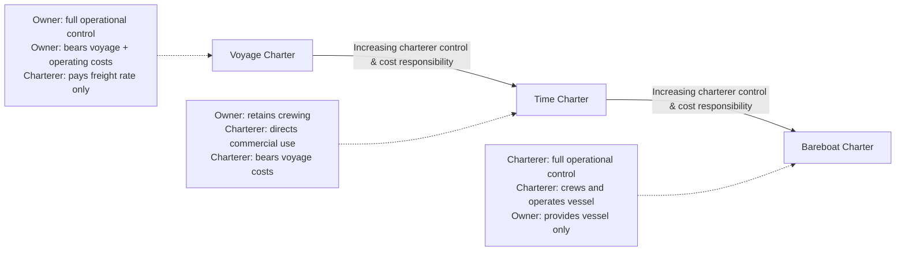

## Charter Parties: Voyage, Time, and Bareboat

### Overview

A charter party is the contract between a vessel owner and a charterer governing the use of a ship, forming the legal and commercial foundation of the bulk and specialized shipping markets. Unlike containerized liner shipping's fixed-schedule service, chartering allows a charterer to secure vessel capacity flexibly, with three principal charter types — voyage, time, and bareboat — allocating operational control, costs, and risk very differently between owner and charterer.

### The Three Charter Party Types

**Key Points**

- **Voyage Charter**: the shipowner is paid a freight rate for a single specified voyage carrying a specified cargo; the shipowner bears operating costs and voyage risk. The charterer pays for the use of cargo space on a specific route, but the owner retains full operational control of the vessel and crew.
- **Time Charter**: the charterer hires the vessel (and crew) for a defined period, paying a daily/monthly hire rate and covering voyage-specific costs (fuel, port charges) directly. The owner remains responsible for crewing and maintaining the vessel, while the charterer directs its commercial employment during the hire period.
- **Bareboat/Demise Charter**: the charterer takes on full operational control of the vessel, including crewing, for an extended period — essentially a lease of the vessel itself. The owner provides only the physical ship; the charterer assumes nearly all operator responsibilities and risks, akin to temporarily "owning" the vessel's operations.

### Cost and Responsibility Allocation

$$\text{Total Voyage Cost}_{owner} = \text{Capital Cost} + \text{Operating Cost} + \text{Voyage Cost}$$

| Cost/Responsibility Category | Voyage Charter | Time Charter | Bareboat Charter |
| --- | --- | --- | --- |
| Capital costs (vessel ownership, financing) | Owner | Owner | Owner |
| Operating costs (crew, maintenance, insurance) | Owner | Owner | **Charterer** |
| Voyage costs (fuel, port charges, canal tolls) | Owner | **Charterer** | Charterer |
| Commercial control (routing, cargo decisions) | Owner | **Charterer** | Charterer |
| Crewing responsibility | Owner | Owner | **Charterer** |
| Typical duration | Single voyage | Months to years | Years (often long-term) |

### Diagram: Control and Cost Spectrum Across Charter Types

### Diagram: Responsibility Split Visualization

<svg xmlns="http://www.w3.org/2000/svg" viewBox="0 0 660 300" font-family="sans-serif">
<text x="330" y="25" text-anchor="middle" font-size="16" font-weight="bold">Charter Type Responsibility Split (svg_diagram)</text>

<text x="110" y="55" text-anchor="middle" font-size="12" font-weight="bold">Voyage Charter</text>

<rect x="30" y="70" width="160" height="140" fill="none" stroke="`#0066cc`" stroke-width="2" />

<rect x="30" y="70" width="160" height="130" fill="`#0066cc`" opacity="0.25" />

<text x="110" y="140" text-anchor="middle" font-size="10">Owner controls</text>

<text x="110" y="155" text-anchor="middle" font-size="10">~95% of cost/ops</text>

<text x="330" y="55" text-anchor="middle" font-size="12" font-weight="bold">Time Charter</text>

<rect x="250" y="70" width="160" height="140" fill="none" stroke="`#cc6600`" stroke-width="2" />

<rect x="250" y="70" width="160" height="70" fill="`#0066cc`" opacity="0.25" />

<rect x="250" y="140" width="160" height="60" fill="`#cc6600`" opacity="0.25" />

<text x="330" y="105" text-anchor="middle" font-size="9">Owner: crew/vessel</text>

<text x="330" y="170" text-anchor="middle" font-size="9">Charterer: voyage costs/routing</text>

<text x="550" y="55" text-anchor="middle" font-size="12" font-weight="bold">Bareboat Charter</text>

<rect x="470" y="70" width="160" height="140" fill="none" stroke="`#009966`" stroke-width="2" />

<rect x="470" y="70" width="160" height="130" fill="`#009966`" opacity="0.25" />

<text x="550" y="140" text-anchor="middle" font-size="10">Charterer controls</text>

<text x="550" y="155" text-anchor="middle" font-size="10">~95% of cost/ops</text>

</svg>

### Voyage Charter: Detailed Mechanics

- **Freight basis**: typically quoted per tonne of cargo carried, or as a lump-sum for the voyage, negotiated via the charter market based on prevailing freight indices (e.g., Baltic Dry Index for dry bulk).
- **Laytime**: the contractually allowed time for loading and discharging cargo at port, specified in the charter party; if the charterer exceeds laytime, they owe **demurrage** to the owner; if loading/discharge finishes early, the charterer may earn **despatch** (a rebate).
- **Charter party forms**: standardized industry forms (e.g., GENCON for general dry cargo, various tanker-specific forms) provide widely recognized baseline terms that parties then customize through negotiated riders/clauses.
- **Risk profile**: the charterer's risk is largely limited to the specific voyage and cargo; they have no exposure to vessel operating costs or off-hire periods, making voyage charters attractive for occasional or one-off shipment needs.

### Time Charter: Detailed Mechanics

- **Hire basis**: paid as a daily or monthly rate (charter "hire") for the vessel's availability, regardless of whether the vessel is fully utilized during that period — distinct from voyage charter's cargo-based freight.
- **Off-hire clause**: if the vessel is unavailable for the charterer's use due to owner-side issues (breakdown, crew problems, drydocking), the charterer is typically not required to pay hire during that "off-hire" period — a key risk-allocation mechanism.
- **Charterer's commercial control**: the charterer decides which cargoes to carry, which routes to sail, and effectively operates the vessel commercially as if it were their own, while the owner's crew executes the actual navigation and vessel operation.
- **Typical duration**: ranges from a few months (short-term/spot time charters) to multi-year period charters, often used by charterers seeking to secure guaranteed capacity across a sustained trading program rather than negotiating a new voyage charter for each shipment.

### Bareboat Charter: Detailed Mechanics

- **Nature of the arrangement**: functionally closer to a lease of the physical vessel than a shipping service contract — the charterer supplies its own crew, insures and maintains the vessel to agreed standards, and bears full operational and commercial responsibility.
- **Common use cases**: often used for long-term strategic vessel control (e.g., a shipping company bareboat-chartering vessels it does not wish to purchase outright, to manage balance sheet or financing structure), or in structures where ship financing/ownership is separated from operational deployment.
- **Owner's residual role**: limited to providing the vessel in seaworthy condition at delivery and retaining underlying title/ownership; the owner has essentially no involvement in day-to-day operations during the charter period.

### Example: Choosing a Charter Type

A mining company needs to ship 150,000 tonnes of iron ore from Australia to China on a one-off basis for a new customer contract. Since this is a single shipment with no ongoing need for vessel capacity, the company would use a **voyage charter** — chartering a Capesize bulk carrier for this specific voyage, paying a freight rate per tonne, and having no interest in or responsibility for the vessel once discharge is complete.

By contrast, a trading company that regularly ships grain across multiple routes over an 18-month trading program would more likely use a **time charter** — securing a vessel's dedicated availability for that period, allowing flexible routing and cargo decisions across multiple voyages without renegotiating a new contract each time, while the owner continues to crew and maintain the vessel.

A shipping line seeking to expand its own operated fleet without the capital outlay of purchasing new vessels might use a **bareboat charter**, effectively operating the chartered vessel as part of its own fleet under its own flag and crew, often as part of a broader fleet financing strategy.

### Conclusion

Voyage, time, and bareboat charters represent a spectrum of increasing charterer control and cost responsibility, allowing shipping markets to flexibly match vessel capacity to widely varying commercial needs — from one-off cargo movements to long-term strategic fleet deployment. This chartering framework underpins the bulk shipping market's fundamentally different commercial structure from container liner shipping's fixed-schedule service model, and understanding it is essential context for interpreting freight rate volatility, laytime/demurrage exposure, and vessel availability dynamics in bulk and specialized ocean freight.

**Related Topics**

- Bulk Shipping: Dry Bulk and Liquid Bulk Carriers
- Baltic Dry Index and Bulk Freight Rate Volatility
- Laytime, Demurrage, and Despatch in Charter Parties
- Break Bulk and Project Cargo
- Ocean Freight Rate Structures and Surcharges
- Shipping Lines, Alliances, and Vessel Sharing Agreements