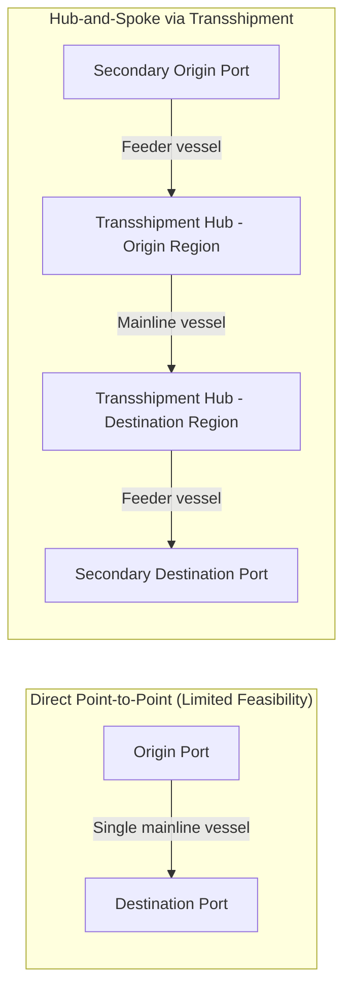
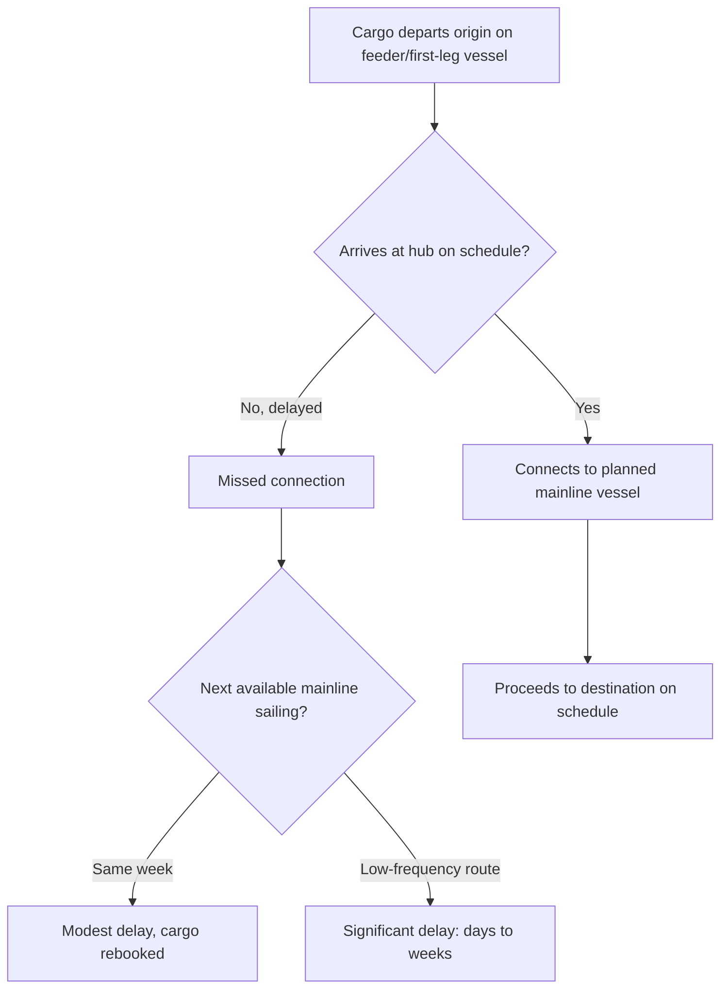

## Transshipment and Feeder Services

### Overview

Transshipment is the practice of transferring cargo between two vessels at an intermediate port rather than shipping it directly from origin to final destination on a single vessel. Feeder services are the smaller, regional vessels that connect secondary ports to major transshipment hubs. Together, these mechanisms allow global liner networks to serve thousands of port pairs efficiently without requiring every mainline vessel to call at every port.

### Why Transshipment Exists

**Key Points**

- **Economic reality of liner networks**: mainline ocean vessels (especially ultra-large container ships) can only profitably call at a limited number of major deepwater ports per voyage; calling at every possible destination port directly would be prohibitively slow and costly.
- **Hub-and-spoke model**: rather than direct point-to-point service between every origin and destination, carriers route cargo through major hub ports where it is transferred ("transshipped") onto a different vessel — either another mainline vessel serving a different route, or a smaller feeder vessel serving a regional network.
- **Feeder vessel**: a smaller container ship, typically ranging from a few hundred to a few thousand TEU capacity, that connects secondary/regional ports to a major transshipment hub, unable or uneconomical to be served directly by mainline ultra-large vessels.

### Diagram: Direct Service vs. Hub-and-Spoke Transshipment

### Major Global Transshipment Hubs

- **Singapore**: one of the world's largest transshipment hubs, serving as a critical connection point between Asia-Europe, intra-Asia, and Asia-Oceania routes.
- **Colombo (Sri Lanka)**: a key transshipment hub for South Asian and Indian Ocean cargo, connecting Indian subcontinent ports to major east-west mainline services.
- **Rotterdam and Antwerp**: serve significant transshipment roles for North European regional distribution alongside their role as major direct-call ports.
- **Jebel Ali (Dubai)**: a major Middle East transshipment hub connecting Asia-Europe traffic with regional Gulf and East African ports.
- **Panama and various Caribbean hubs**: serve transshipment functions connecting Asian and European mainline services to Caribbean and Central/South American secondary ports.

Some ports function primarily as transshipment hubs (e.g., Singapore, Colombo) where cargo is transferred between vessels rather than having significant local import/export volume, affecting routing strategy for shippers targeting nearby smaller ports.

### Diagram: Transshipment Hub Network Concept

<svg xmlns="http://www.w3.org/2000/svg" viewBox="0 0 660 320" font-family="sans-serif">
<text x="330" y="25" text-anchor="middle" font-size="16" font-weight="bold">Transshipment Hub Network (svg_diagram)</text>
<circle cx="330" cy="170" r="45" fill="#0066cc" opacity="0.2" stroke="#0066cc" stroke-width="2" />
<text x="330" y="165" text-anchor="middle" font-size="11" font-weight="bold">Transshipment</text>
<text x="330" y="180" text-anchor="middle" font-size="11" font-weight="bold">Hub</text>
<circle cx="120" cy="80" r="28" fill="none" stroke="#333" stroke-width="1.5" />
<text x="120" y="84" text-anchor="middle" font-size="9">Secondary Port A</text>
<circle cx="120" cy="260" r="28" fill="none" stroke="#333" stroke-width="1.5" />
<text x="120" y="264" text-anchor="middle" font-size="9">Secondary Port B</text>
<circle cx="540" cy="80" r="28" fill="none" stroke="#cc6600" stroke-width="1.5" />
<text x="540" y="84" text-anchor="middle" font-size="9">Mainline Route 1</text>
<circle cx="540" cy="260" r="28" fill="none" stroke="#cc6600" stroke-width="1.5" />
<text x="540" y="264" text-anchor="middle" font-size="9">Mainline Route 2</text>
<line x1="148" y1="90" x2="288" y2="150" stroke="#333" stroke-width="1.5" stroke-dasharray="3,2" />
<line x1="148" y1="250" x2="288" y2="190" stroke="#333" stroke-width="1.5" stroke-dasharray="3,2" />
<line x1="372" y1="150" x2="512" y2="90" stroke="#cc6600" stroke-width="2" />
<line x1="372" y1="190" x2="512" y2="250" stroke="#cc6600" stroke-width="2" />

<text x="230" y="110" text-anchor="middle" font-size="8" fill="#555">feeder</text>

<text x="230" y="240" text-anchor="middle" font-size="8" fill="#555">feeder</text>

<text x="440" y="110" text-anchor="middle" font-size="8" fill="#555">mainline</text>

<text x="440" y="240" text-anchor="middle" font-size="8" fill="#555">mainline</text>

</svg>

### Operational Considerations

- **Additional transit time**: transshipment adds handling and waiting time at the hub port compared to a hypothetical direct service, since cargo must be unloaded from the first vessel, stored temporarily, and reloaded onto the connecting vessel/feeder.
- **Connection risk**: transshipment introduces schedule dependency — if the first-leg vessel is delayed, the cargo may miss its scheduled connecting vessel at the hub, resulting in cascading delay until the next available connection (sometimes days or weeks later on lower-frequency routes).
- **Cost implications**: transshipment involves additional terminal handling charges at the hub port, though this is typically incorporated into the carrier's quoted through rate rather than billed separately to the shipper.
- **Routing transparency**: shippers booking a single through bill of lading from origin to final destination may not always know in advance which hub(s) their cargo will transship through, as carriers optimize routing based on vessel schedules and capacity.

### Diagram: Transshipment Connection Risk

### Feeder Services in Regional Networks

- **Intra-regional connectivity**: feeder networks are especially dense in regions with many smaller ports relative to hub capacity, such as Southeast Asia, the Mediterranean, and the Caribbean, where feeder vessels shuttle cargo between numerous secondary ports and a smaller number of regional hubs.
- **Vessel size flexibility**: because feeder vessels are smaller and more maneuverable than mainline ships, they can call at ports with shallower drafts, shorter berths, or less sophisticated crane infrastructure — extending liner network reach to ports mainline vessels physically cannot serve.
- **Integration with alliance networks**: some modern carrier alliance structures have begun integrating feeder and relay operations more tightly into their core network design (rather than treating them as separate ancillary services), reflecting the growing strategic importance of transshipment connectivity to overall network reliability.

### Example: Transshipment in Practice

A shipper in Ho Chi Minh City books a shipment to Le Havre, France. Vietnam's ports may not have sufficient direct mainline service volume to justify a dedicated Europe-bound vessel call, so the carrier routes the cargo via a feeder vessel to Singapore (a major transshipment hub), where it is transferred to a mainline Asia-Europe vessel operated under an alliance vessel-sharing agreement. The through bill of lading covers the entire Ho Chi Minh City–to–Le Havre movement as a single contract, even though the cargo physically changes vessels at Singapore — the shipper generally interacts with a single carrier relationship despite the multi-vessel physical routing.

### Conclusion

Transshipment and feeder services are the structural mechanism that allows global liner shipping networks to achieve broad port coverage without requiring every mainline vessel to call at every port — trading some additional transit time and connection risk for dramatically improved network efficiency and reach. Major transshipment hubs like Singapore and Colombo function as critical nodes connecting mainline and feeder networks, and understanding this hub-and-spoke structure is essential for interpreting transit time estimates, routing options, and schedule reliability across the carrier alliance and port operations topics covered elsewhere in this chapter.

**Related Topics**

- Shipping Lines, Alliances, and Vessel Sharing Agreements
- Ports, Terminals, and Port Operations
- Overview of Global Trade Flows and Trade Lanes
- Containerized Shipping: FCL and LCL
- Bills of Lading and Sea Waybills
- Charter Parties: Voyage, Time, and Bareboat