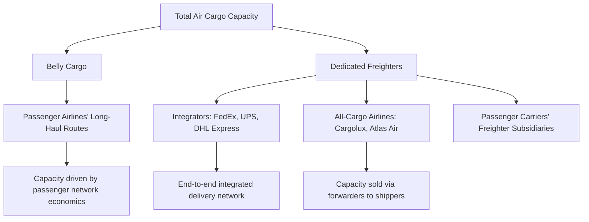

## Air Cargo Market Structure

### Overview

Air cargo occupies a distinct segment of global logistics, characterized by high speed, high cost per unit weight, and a market structure split between dedicated freighter operations and belly cargo capacity carried within passenger aircraft. Understanding this market structure is essential to interpreting air freight pricing, capacity constraints, and the strategic decisions airlines and forwarders make about fleet and network design.

### The Two Capacity Sources

**Key Points**

- **Belly cargo**: cargo carried in the lower deck (belly hold) of passenger aircraft, alongside checked passenger baggage. This represents a significant share of total global air cargo capacity, particularly on long-haul international passenger routes.
- **Dedicated freighters**: aircraft configured exclusively for cargo, with no passenger seating, operated by all-cargo carriers (integrators and traditional freight airlines) or by passenger airlines' dedicated freighter divisions.
- **Capacity interdependence**: because a substantial portion of global air cargo capacity rides on passenger aircraft, air cargo availability and pricing are partly driven by passenger network economics (route frequency, aircraft size) rather than purely by cargo demand — a dynamic that became especially visible when passenger flight disruptions (e.g., during major global travel shocks) simultaneously constrained available belly cargo capacity.

### Market Participants

- **Integrators**: carriers that operate an end-to-end express delivery network combining their own aircraft, ground transportation, and sorting/hub infrastructure under a single company (e.g., FedEx, UPS, DHL Express) — controlling the entire logistics chain from pickup to final delivery.
- **All-cargo/freighter airlines**: carriers operating dedicated freighter aircraft without an integrated door-to-door delivery network, selling capacity to forwarders and shippers (e.g., Cargolux, Atlas Air, Cathay Cargo).
- **Combination (passenger) carriers**: passenger airlines that also sell belly cargo capacity as a secondary revenue stream on their passenger routes, and in some cases operate dedicated freighter subsidiaries alongside passenger operations.
- **Freight forwarders**: intermediaries who consolidate shipments from multiple shippers, book capacity with airlines, and handle documentation — playing a similar consolidation role in air freight as NVOCCs do in ocean freight.
- **Ground handling agents**: companies managing cargo warehousing, screening, and aircraft loading/unloading at airports, often operating independently of the airlines themselves.

### Diagram: Air Cargo Capacity Sources

### Diagram: Market Participant Relationships

<svg xmlns="http://www.w3.org/2000/svg" viewBox="0 0 660 300" font-family="sans-serif">
<text x="330" y="25" text-anchor="middle" font-size="16" font-weight="bold">Air Cargo Market Structure (svg_diagram)</text>
<rect x="30" y="60" width="150" height="55" fill="none" stroke="#0066cc" stroke-width="2" rx="6" />
<text x="105" y="85" text-anchor="middle" font-size="10" font-weight="bold">Shipper</text>
<text x="105" y="100" text-anchor="middle" font-size="9">(Exporter)</text>
<rect x="230" y="60" width="150" height="55" fill="none" stroke="#cc6600" stroke-width="2" rx="6" />
<text x="305" y="85" text-anchor="middle" font-size="10" font-weight="bold">Freight Forwarder</text>
<text x="305" y="100" text-anchor="middle" font-size="9">Consolidates &amp; books</text>
<rect x="430" y="30" width="200" height="45" fill="none" stroke="#009966" stroke-width="2" rx="6" />
<text x="530" y="57" text-anchor="middle" font-size="10" font-weight="bold">Combination Carrier (Belly Cargo)</text>
<rect x="430" y="100" width="200" height="45" fill="none" stroke="#009966" stroke-width="2" rx="6" />
<text x="530" y="127" text-anchor="middle" font-size="10" font-weight="bold">Freighter Airline / Integrator</text>
<line x1="180" y1="87" x2="230" y2="87" stroke="#333" stroke-width="1.5" marker-end="url(#a4)" />
<line x1="380" y1="80" x2="430" y2="55" stroke="#333" stroke-width="1.5" marker-end="url(#a4)" />
<line x1="380" y1="95" x2="430" y2="120" stroke="#333" stroke-width="1.5" marker-end="url(#a4)" />
<rect x="230" y="180" width="200" height="55" fill="none" stroke="#333" stroke-width="1.5" rx="6" />
<text x="330" y="205" text-anchor="middle" font-size="10" font-weight="bold">Ground Handling Agent</text>
<text x="330" y="220" text-anchor="middle" font-size="9">Warehousing, screening, loading</text>
<line x1="530" y1="145" x2="430" y2="200" stroke="#333" stroke-width="1.5" stroke-dasharray="4,3" marker-end="url(#a4)" />
</svg>

### Cost and Speed Positioning Relative to Ocean Freight

| Factor | Air Freight | Ocean Freight |
| --- | --- | --- |
| Cost per kg | Substantially higher | Substantially lower |
| Transit time | Hours to a few days | Weeks |
| Typical cargo | High-value, time-sensitive, perishable, urgent | Bulk, high-volume, lower unit value |
| Inventory carrying cost impact | Lower (faster transit reduces in-transit inventory holding) | Higher (longer transit ties up working capital) |
| Capacity flexibility | Constrained by passenger network + limited freighter fleet | More elastic via chartering and vessel deployment |

$$\text{Total Logistics Cost} = \text{Freight Cost} + \text{Inventory Carrying Cost} + \text{Stockout Risk Cost}$$

The mode selection decision between air and ocean often hinges on this total cost framework rather than freight cost alone — for high-value or time-sensitive goods, the higher air freight cost can be offset by significantly lower inventory carrying costs and reduced stockout risk, a trade-off examined further in later chapters on transportation mode selection.

### Airport Hub Structure

- **Major cargo hub airports**: certain airports handle disproportionate cargo volume due to integrator sorting hub locations, favorable geography for transshipment, or strong regional manufacturing/export bases (e.g., Hong Kong, Memphis, Louisville, Anchorage, Incheon).
- **Integrator hub-and-spoke networks**: integrators typically operate centralized sorting hubs (often overnight) where packages from multiple origin flights are sorted and redirected onto destination flights, enabling next-day or two-day delivery commitments across large geographic networks.
- **Trucking substitution**: for shorter distances where air transit time savings are marginal relative to trucking, integrators and forwarders increasingly substitute road transport for portions of the network, blending air and ground modes within a single "air freight" service commitment.

### Commodity Composition of Air Cargo

- **High-value electronics**: semiconductors, consumer electronics, and components where value density justifies air freight's cost premium.
- **Pharmaceuticals and healthcare products**: particularly temperature-sensitive biologics and vaccines requiring speed and cold chain integrity.
- **Perishables**: fresh flowers, seafood, and certain fruits/vegetables where shelf life makes ocean transit impractical.
- **E-commerce and express parcels**: a rapidly growing category driven by international online retail, heavily reliant on integrator networks for door-to-door speed.
- **Emergency and urgent shipments**: spare parts, medical supplies, and other time-critical goods where cost is secondary to speed.

### Example: Market Structure in Practice

A semiconductor manufacturer needs to ship urgently required chips from Taiwan to a European electronics assembly plant. The shipment is time-critical enough that ocean freight's multi-week transit is unacceptable, so the manufacturer's freight forwarder books capacity with a combination carrier's belly cargo hold on a passenger route with frequent European service, rather than a dedicated freighter — since the passenger network's high frequency between Taiwan and Europe offers more convenient scheduling than freighter-only options serving the same city pair. The forwarder consolidates this shipment with other cargo destined for the same region to optimize the booking, illustrating how belly cargo capacity, forwarder consolidation, and passenger network scheduling interact in practice.

### Conclusion

Air cargo market structure is fundamentally shaped by the split between belly cargo (dependent on passenger network economics) and dedicated freighter capacity (operated by integrators and all-cargo airlines), with freight forwarders playing a central consolidation role analogous to their function in ocean freight. This structure, combined with air freight's cost-speed positioning relative to ocean transport, drives which commodities move by air and underlies the mode selection decisions that connect this chapter to the broader transportation mode comparison covered later in the curriculum.

**Related Topics**

- Choosing Between Ocean, Air, and Multimodal Transport
- Air Waybills and Air Cargo Documentation
- Cold Chain Logistics for Pharmaceutical and Perishable Air Freight
- Integrator Networks and Express Parcel Delivery
- Key Stakeholders in International Trade
- Ocean Freight Rate Structures and Surcharges